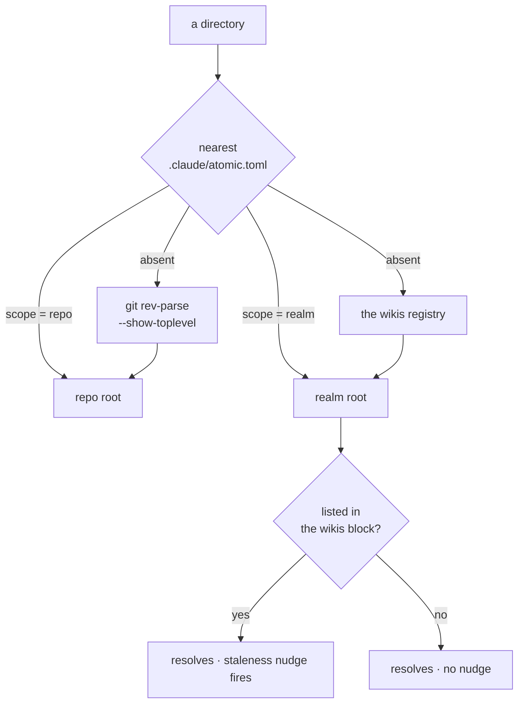
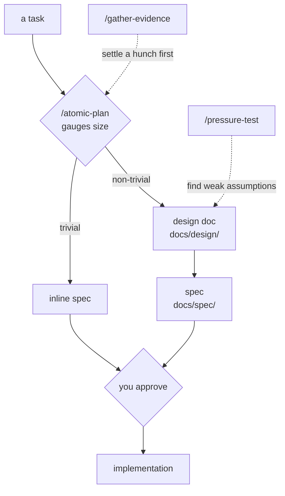
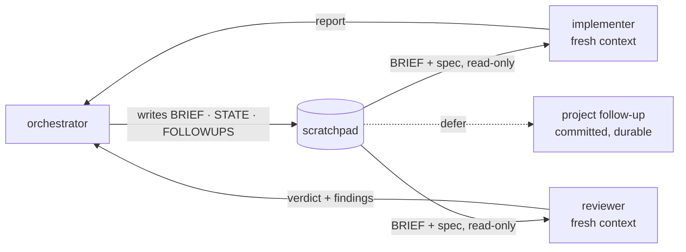
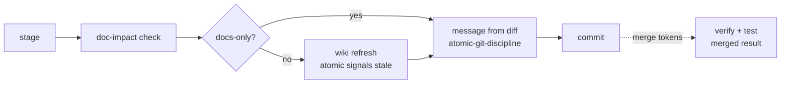

# Concepts

The ideas behind Atomic Claude and why each exists. Usage detail lives on the reference pages linked from each section.

The broader idea is *loop engineering*: build the system that finds work, hands it to the agent, checks the result, and records state, instead of prompting by hand. Each concept below is one part of that loop.

## How it flows

A real session, adding a Stripe webhook endpoint to a NestJS app. Play it, or jump between steps:

<SessionPlayer :session="FLOW" />

Each tab is one concept below.

## The atomic binary

`atomic` is a standalone Go binary and the deterministic layer under everything else. The model is good at judgment and bad at reproducibly scanning a tree, computing a checksum, or managing a scheduled job, so code does those and hands Claude facts it can trust.

| Verb family | What it does |
|-------------|--------------|
| `atomic signals scan` | Walks the filesystem (tree, manifests, languages, lockfiles) into a reproducible facts file that grounds every inference about the repo |
| `atomic code` | Builds and queries the symbol graph |
| `atomic wiki` | Scaffolds, scans, and staleness-checks repo and realm wikis |
| `atomic repo init`, `atomic template <name>` | Creates the harness layout once, idempotently; emits the fill-in skeleton for each workflow document so structure is copied, never reconstructed from memory |
| `atomic update`, `doctor`, `validate` | Swaps the binary against a verified checksum; checks the install |
| `atomic config`, `followups`, `profile` | User config, per-agent model and effort overrides, follow-up entries, the user profile |

Everything below is produced by this binary or grounded by what it produces. `atomic --help` lists the full surface.

## Harness detection and state paths

::: warning Experimental
Running atomic under a coding agent other than Claude Code is a work in progress. Detection works; the non-Claude experience is not yet complete or stable.
:::

Per-user state (config, profile, backups) lives at `~/.atomic/`. Repo-local state (scratchpad, project files, code index, worktrees) lives under one dot-directory per repo, chosen by asking which coding agent launched the binary. First match wins:

| Signal | Set by | Resolves to |
|--------|--------|-------------|
| `ATOMIC_HARNESS=<name>` | you, in an agent's launcher | `.<name>/` |
| `PI_CODING_AGENT=true` | the pi agent, for its shell commands | `.pi/` |
| `CLAUDECODE=1` | Claude Code | `.claude/` |
| `harness.dir` | `atomic config set harness.dir .pi` | that value |
| nothing | — | `.claude/` |

`ATOMIC_HARNESS` sits on top because it is the durable contract and the tiebreak when one agent launches another. A machine running both Claude Code and a pi agent needs no configuration: each agent's sessions use their own layout and neither creates the other's directory.

## Code intelligence

`atomic code index` parses source with tree-sitter into a symbol graph at `.claude/.atomic-index/atomic.db`: what calls what, what imports what, where each symbol is defined, across 31 languages with no compiler or language server. Claude queries the graph instead of grepping for structure, and the implementation agents check blast radius before editing. The index is optional; every consumer falls back to `sg` and `grep` without it.

| Verb | Answers |
|------|---------|
| `atomic code explore "<question>"` | Start here: a one-shot digest of the relevant symbols, files, and how they relate |
| `atomic code callers <symbol>` / `callees <symbol>` | What calls it, what it calls |
| `atomic code impact <symbol>` | The blast radius of changing it |
| `atomic code sync` | Refresh the index (ship verbs and `/refresh-wiki` run it when the index is warm) |
| `atomic code mcp` | Expose the graph to an interactive session as MCP tools |

Full verb list and lifecycle: [code-intel reference](/reference/code-intel), [MCP guide](/guides/code-intel-mcp).

## Wikis

A wiki is a generated knowledge graph for a tree of code: context curated once and kept as an artifact, instead of re-derived every session. Two scopes, one system: the same command, inferrer, and page shape, with a `<wiki-type>` marker telling `/refresh-wiki` which it is looking at.

| Scope | Root | Maps | Steered by |
|-------|------|------|------------|
| **repo** | `docs/wiki/` inside the repository | one project: framework, commands, domain map | `docs/wiki/CLAUDE.md` |
| **realm** | `<root>/wiki/`, its own git repo | a folder of repositories: what each is, what cuts across them | `<root>/CLAUDE.md` |

They compose. A realm summarizes the repos under it without writing into them, and a member repo with its own wiki is linked rather than re-summarized.

### Repo scope

A hand-written `CLAUDE.md` drifts: you swap Jest for Vitest and forget. A repo wiki is regenerated instead, by `/refresh-wiki` and by ship verbs on every real-code commit, grounded in the code-intel graph and the actual diff. It ends invented `npm run` scripts, wrong guesses about the stack, and re-explaining the layout every session.

| File | Content | Loaded |
|------|---------|--------|
| `docs/wiki/scan.md` | deterministic facts: tree, manifests, languages (written by `atomic signals scan`, a name kept from before the two scopes were unified) | on demand by the inferrer, never `@`-ref'd |
| `docs/wiki/index.md` | inferred meaning: framework, commands, domain map, links to per-domain pages | every session, before Claude reads your code |

On a monorepo or unconventional layout inference guesses wrong. `docs/wiki/CLAUDE.md` is the correction: Claude Code loads a directory's `CLAUDE.md` whenever it reads a file there, which is exactly when the inferrer is working. Write "treat `src/billing/` and `src/payments/` as one domain" and it wins over the scan. See [repo wiki](/reference/repo-wiki).

### Realm scope

A realm wiki maps how a folder of repos relate: shared libraries, contracts one repo owns and another consumes, patterns duplicated across services. It is a git-initialized knowledge base at `<root>/wiki/`, registered in a `<wikis>` block in `~/.claude/CLAUDE.md` so every session in any repo knows it exists.

| Verb | Does |
|------|------|
| `/refresh-wiki` | Scan the realm; refresh repo summaries and cross-cutting concerns with cited evidence |
| `atomic wiki bucket add <name>` | Register a folder of loose material (research, raw dumps, ticket exports); refresh synthesizes it into `wiki/knowledge/` |
| `atomic wiki stale` | Report membership drift and stale content |
| `atomic serve` | Browse the realm as a navigable graph in the browser |

A `CLAUDE.md` at the realm root steers all of it, again through the harness: Claude Code walks up the directory tree loading every `CLAUDE.md` it finds, and the walk crosses repo boundaries. Rules that span repos go there once and reach every session inside the realm.

### Scope resolution

A directory declares itself with `scope = "repo"` or `scope = "realm"` at the top of `.claude/atomic.toml` (`atomic repo init` writes the former, `atomic wiki init --scope <s>` either). A marker answers discovery on its own, but only a realm the `<wikis>` block also lists gets the session-start staleness nudge:

The registry keeps two jobs a marker does not touch: the nudge, and locating a realm's `wiki/index.md` for member data. `atomic where` reports which mechanism answered each axis.

See the [knowledge base guide](/guides/knowledge-base) and [realm wiki](/reference/realm-wiki).

## Output style

Claude's default voice opens with "Sure! I'd be happy to help," hedges, and narrates what it is about to do; across a session that filler buries the answer. Atomic's output style strips it and uses tables, trees, and ASCII flows where structure carries meaning. Security warnings and irreversible-action confirmations revert to full prose. The most optional part of Atomic Claude; see [output style](/reference/output-style).

## Planning

`/atomic-plan` gauges a task's size. Only non-trivial work gets a design doc, and nothing reaches implementation without your approval:

| Piece | Job |
|-------|-----|
| `/gather-evidence` | Chase a hunch ("does this library support that") against primary sources and return a verdict before a session is designed around it |
| `/pressure-test` | Attack a design's assumptions to find the weak ones before they reach a spec |
| design doc, `docs/design/` | The thinking space: concepts, rules, approaches weighed, the why. Trivial tasks skip it |
| spec, `docs/spec/` | The contract subagents build from: checkpoints, success criteria, the plan |

A spec body states what is true now; a subagent reads it as ground truth. Its change log records how it got there: when a decision changes, rewrite the affected body and add a dated entry saying what changed and why. History survives without the body going stale.

## Implementation

`/subagent-implementation` runs the implement-then-review loop against a spec, committing each green checkpoint. Every subagent starts with no memory of the last run, so the orchestrator alone writes the scratchpad and subagents only read it and report back:

The scratchpad is the only thing that crosses from one subagent run to the next; everything else the loop produces lands in a commit or is thrown away.

### Scratchpad

`.claude/.scratchpad/<slug>/` is the loop's working memory: gitignored, written for the next subagent, one bundle per slug. `atomic scratchpad` owns it (`new`/`path`/`list`/`archive`). Three files, three write disciplines:

| File | Written | Holds | Why that discipline |
|------|---------|-------|---------------------|
| `BRIEF.md` | overwritten every iteration | what to build now | a stale brief is worse than none; the subagent treats it as current instructions |
| `STATE.md` | append-only | one entry per iteration, plus the loop's base SHA | the audit trail, and the SHA scopes the finalize wiki refresh to this task's commits |
| `FOLLOWUPS.md` | appended after any reviewer pass with findings | risks, nits, questions, numbered `F-1`, `F-2`, … | closed entries stay, marked with the iteration and commit that closed them |

There is no `GOAL.md` or `PLAN.md`; the spec already is those. At the end you triage the ledger, and a deferred finding becomes `.claude/project/followups/<id>.md`, committed and auto-loaded into later sessions. Full layout: [conventions](/reference/conventions).

### Worktrees

A worktree is a second checkout on its own branch in a different directory. `.claude/worktrees/<branch>/` is Claude Code's own worktree home, and its `EnterWorktree` tool moves the session there, so edits and shell commands land inside it with no `cd` discipline. `/subagent-implementation` offers one before significant work, `/autopilot` creates one without asking, and on merge or squash `/commit` offers to clean it up. Atomic runs `git worktree add -b <branch>` itself so the branch is based on the current `HEAD` and a spec you just committed follows it; if a sandbox blocks that, the loop says so and works in place.

### Subagents

Atomic defines a roster of fresh-context agents, each scoped to one job, built on the [evaluator-optimizer pattern](https://www.anthropic.com/engineering/building-effective-agents): one agent writes, a separate one critiques and re-runs the tests. Scope is constrained too; the implementer's surgical mode refuses more than two files, and the strategist is read-only. Roster: [agents](/reference/agents).

### Ship verbs

One `/commit` verb, escalated by token: bare `/commit` stages, commits, then asks how far to go; `/commit push`, `pr`, `merge`, `squash`, `squash merge` skip the prompt. It exists instead of a plain "commit and push" because of what runs around the git operation:

Docs are checked before the wiki refresh so a newly staged doc file lands in the scan. Full token set: [commands](/reference/commands).

### Session reports

Long or scattered work loses its why: you come back tomorrow, or three terminals share one branch, and no session has the whole picture. `/session-report` writes a branch-scoped snapshot of what changed and why; the next commit on that branch folds it into the message, then deletes it. It is for Claude to read when it writes your commit, not for you.

## Parking things for later

| | Trigger | Example | Lives until |
|---|---------|---------|-------------|
| **Reminder** | time | `/remind-me check the deploy in 30 minutes` | it fires, in this session or at the start of the next |
| **Follow-up** | decision | reviewer flags a non-blocking risk; you defer it at triage | you close it with `/follow-up review` |

## Skills vs commands

| | Fires on | Role | Example |
|---|----------|------|---------|
| **Skill** | matching language, automatically | the how: always-on discipline | "let's implement the auth module" activates `atomic-tdd` |
| **Command** | the slash you type | the when: workflows you start on purpose | `/atomic-plan`, `/commit` |

A command can invoke a skill (every ship verb uses `atomic-git-discipline`); a skill never invokes a command. See [skills](/reference/skills) and [commands](/reference/commands).

## Documentation

Code changes break docs silently: an endpoint renamed, a config field gone, a diagram showing a component that no longer exists. `/documentation` treats docs the way the wiki treats project context: scan, track, and prompt on drift.

| Mode | When | Does |
|------|------|------|
| Bootstrap | first run | Scans for markdown; you pick which surfaces to track into a `## Documentation surfaces` table in `CLAUDE.md` |
| Authoring | `/documentation` | Compares recent changes against tracked surfaces and walks the stale ones with you |
| Maintenance | every ship verb | Same check on the staged diff, silent unless something is stale |

## Your work profile

Claude reads `~/.atomic/profile.md` every session: facts that hold across repos, such as name, role, active projects, and the people you work with. Install seeds the `## Environment` section from your machine; the rest fills in as facts surface in conversation. Volatility tags (`<stable>`, `<volatile>`, `<deterministic>`) tell Claude how eagerly to flag a contradiction, and `/retrospective-learning` resolves drift with your sign-off.

Routing rule: anything still true in a different repo belongs in the profile; repo-specific conventions go to that project's wiki.
