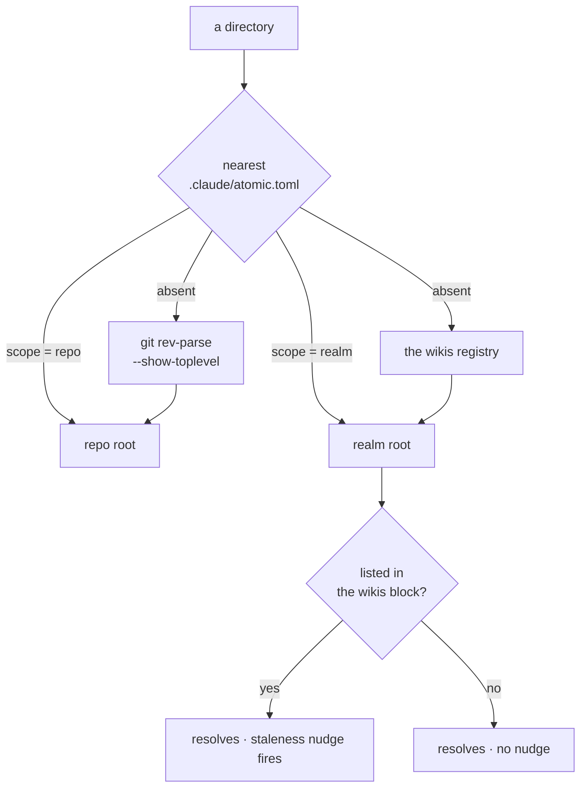
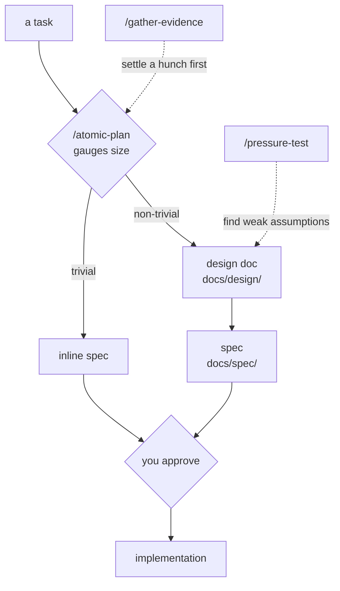
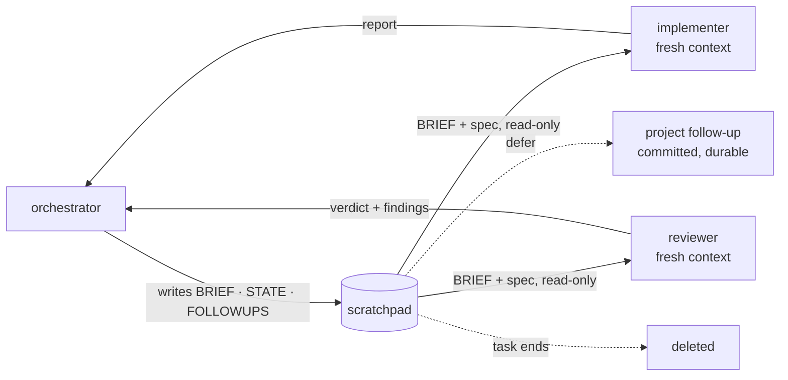

# Concepts

Key ideas behind Atomic Claude, explained plainly. This page covers the *why* — for detailed usage, follow the links to the reference pages.

You may know the broader idea as *loop engineering*: designing the system that finds work, hands it to the agent, checks the result, and records state, rather than prompting by hand. The concepts below are the parts of that loop.

## How it flows

Here is what a real session looks like — adding a Stripe webhook endpoint to a NestJS app. Play it, or jump between the steps:

<SessionPlayer :session="FLOW" />

Every concept below plays a role in that flow. The repo wiki gave Claude the project map. Evidence-gathering settled an assumption before planning around it. The spec kept implementation on track. TDD fired during each implementer checkpoint. Session reports preserved the why. Ship commands handled the wiki, the docs, and the commit message. Follow-ups caught what was deferred.

## The atomic binary

`atomic` is a standalone Go binary, the deterministic layer beneath everything else. The model is good at judgment and bad at reproducibly scanning a tree, computing a checksum, or managing a scheduled job — so those are code's job. The binary does them and hands Claude facts it can trust.

- **Deterministic scan** — walks the filesystem (tree, manifests, languages, lockfiles) into a reproducible facts file that grounds everything Claude infers about your repo.
- **Code intelligence** — builds and queries the symbol graph (below).
- **Repo scaffolding** — `atomic repo init` creates the harness layout once, idempotently: the scratchpad and project directories plus the ignore rules that keep them out of git. Commands call it instead of hand-editing `.gitignore`. The directory name follows harness detection (below).
- **Document templates** — `atomic template <name>` emits the fill-in skeleton for each document the workflow coordinates (design doc, spec, scratchpad brief/state/followups, session report, and more). Commands seed those files from it so structure is copied, never reconstructed from memory.
- **Self-update and health** — `atomic update` swaps the binary against a verified checksum; `atomic doctor` and `atomic validate` check the install.
- **Config and state** — `~/.atomic/config.toml`, follow-ups, install/uninstall, per-agent model/effort overrides (`atomic config agents`, applied to installed agents immediately), and the user profile.

Everything below is either produced by this binary or grounded by what it produces. Run `atomic --help` for the full surface.

## Harness detection and state paths

::: warning Experimental
Running atomic under a coding agent other than Claude Code is a work in progress. The detection below ships and works, but the non-Claude experience is not yet complete or stable. Expect changes.
:::

The binary is not tied to Claude Code. Per-user state (config, profile, backups) lives at `~/.atomic/`, a harness-neutral location. Repo-local state (scratchpad, project files, code index, worktrees) lives under one dot-directory per repo, and the binary picks that directory by asking which coding agent launched it. First match wins:

| Signal | Set by | Resolves to |
|--------|--------|-------------|
| `ATOMIC_HARNESS=<name>` | you, in an agent's launcher | `.<name>/` |
| `PI_CODING_AGENT=true` | the pi agent, for its shell commands | `.pi/` |
| `CLAUDECODE=1` | Claude Code | `.claude/` |
| `harness.dir` | `atomic config set harness.dir .pi` | that value |
| nothing | — | `.claude/` |

`ATOMIC_HARNESS` sits at the top because it is the durable contract, and the tiebreak when one agent launches another. Everything below it is detection, which is why a machine running both Claude Code and a pi agent needs no configuration: each agent's sessions read and write their own layout, and neither creates the other's directory. An unknown harness name resolves to its own dot-directory as long as it is a single safe path segment.

## Code intelligence

`atomic code index` parses every source file with tree-sitter into a symbol graph at `.claude/.atomic-index/atomic.db` — what calls what, what imports what, and where every symbol is defined, across 31 languages, with no compiler or language server. Claude queries that graph instead of grepping for structure, and the implementation agents check it for blast radius before they edit. It is optional: every consumer falls back to `sg` and `grep` when no index is present.

- `atomic code explore "<question>"` — reach for this first: a bundled digest of the relevant symbols, files, and how they relate, in one shot.
- `atomic code callers <symbol>` / `callees <symbol>` — what calls it, what it calls.
- `atomic code impact <symbol>` — the blast radius of changing it.
- `atomic code sync` — keep the index current (ship verbs and `/refresh-wiki` do this when it is warm).
- `atomic code mcp` — expose the graph to your interactive session as MCP tools.

See the [code-intel reference](/reference/code-intel) for the full verb list and lifecycle, and the [MCP guide](/guides/code-intel-mcp).

## Wikis

A wiki is a generated knowledge graph for a tree of code: context curated once and kept as an artifact, instead of re-derived from scratch every session. It comes at two scopes, and they are one concept rather than two systems — the same command, the same inferrer, the same page shape. A `<wiki-type>` marker tells `/refresh-wiki` which one it is looking at.

| Scope | Root | Maps |
|-------|------|------|
| **repo** | `docs/wiki/` inside the repository | one project: its framework, commands, and domain map |
| **realm** | `<root>/wiki/`, its own git repo | a folder of repositories: what each is, and what cuts across them |

They compose. A realm summarizes the repos under it without writing into them, and a member repo that keeps its own wiki is linked rather than re-summarized. Claude loads whichever scope the session sits in.

### Repo scope

You could hand-maintain a `CLAUDE.md`, but the odds you keep it current are slim: you add a service, rename a package, swap Jest for Vitest, and forget. A repo wiki is baked into the workflow instead. `/refresh-wiki` scans the repo, the ship verbs refresh it on every commit, and the inference is grounded by the code-intel graph and the actual file diff, not guesswork. You front-load compressed context once — and again only when the repo changes — instead of paying for it on every request.

It fixes:

- Hallucinated build and test commands — invented `npm run` scripts, fake `make` targets.
- Wrong guesses about your framework, stack, and architecture.
- Re-explaining your project layout at the start of every session.
- A hand-written `CLAUDE.md` that silently drifts out of date.

A scan writes two files: a **deterministic** one (filesystem facts — tree, manifests, languages — reproducible) and an **inferred** one (the meaning on top — framework, commands, a domain map). Claude loads the inferred file before it reads your code; the deterministic file stays out of context and is read on demand. The CLI verb that produces the deterministic half is still spelled `atomic signals scan`, a name left over from before the two scopes were unified; it writes into `docs/wiki/` like everything else.

Inference guesses, and on a monorepo or an unconventional layout it guesses wrong. `docs/wiki/CLAUDE.md` is where you correct it, and it works through a Claude Code feature rather than anything atomic invented: a `CLAUDE.md` in a directory is nested memory, loaded whenever Claude reads a file in that directory. Since that is exactly when the inferrer is working, the steering is in context at the moment it matters and costs nothing the rest of the time — which is why it is deliberately not `@`-referenced the way the router is. Write "this is a NestJS monorepo" or "treat `src/billing/` and `src/payments/` as one domain" there and it wins over what the scan implies. See [repo wiki](/reference/repo-wiki).

### Realm scope

One level up, a realm wiki maps how a folder of repos relate — the shared libraries, the contracts one repo owns and another consumes, the patterns duplicated across a folder of services. It is a portable, git-initialized knowledge base at `<root>/wiki/` (most people keep three to five, one per realm). `/refresh-wiki` scans the root, points at member repos that already have their own wiki, summarizes the ones that should not carry one — open-source dependencies — without writing into them, and synthesizes the realm's cross-cutting concerns with cited evidence. Registered wikis live in a `<wikis>` block in your user-level `~/.claude/CLAUDE.md`, so every Claude session, in any repo, knows they exist.

- `/refresh-wiki` — scan the realm; refresh repo summaries and shared concerns.
- `atomic wiki bucket add <name>` — register a folder at the realm root holding loose material (research, raw dumps, ticket exports) as a capture bucket; refresh synthesizes it into `wiki/knowledge/` pages.
- `atomic wiki stale` — report membership drift and stale content.
- `atomic serve` — browse the realm as a typed, navigable graph in the browser.

A `CLAUDE.md` at the realm root is how you steer all of that, and again the mechanism is the harness's own: Claude Code walks up the directory tree loading every `CLAUDE.md` it finds, and that walk crosses repo boundaries. A realm-root file therefore stays in context from anywhere inside the realm, including a session you started inside a member repo. Put the rules that span repos there — where each capture folder lives, what convention it follows, how the members relate — and every session in the realm inherits them without an `@`-ref or a per-repo copy.

A directory declares its own identity by writing `scope = "repo"` or `scope = "realm"` at the top of `.claude/atomic.toml`. `atomic repo init` writes the former; `atomic wiki init --scope <s>` writes whichever value you pass. The nearest marker above your current directory outranks the older fallback on both axes.

A `scope` marker answers discovery on its own, but only a realm the `<wikis>` block also lists gets the session-start staleness nudge.

That split is why the registry survives the marker. `<wikis>` keeps two jobs a marker does not touch: driving the nudge, and locating a realm's `wiki/index.md` for member data. `atomic where` reports which mechanism answered each axis.

See the [knowledge base guide](/guides/knowledge-base) and [wiki workflow](/reference/realm-wiki).

## Output style

Claude is verbose by default: "Sure! I'd be happy to help," hedging with "perhaps," narrating what it is about to do and then what it just did. Fine for one question; across a working session the filler costs tokens, slows you down, and buries the answer.

Atomic's output style strips the scaffolding — same information, easier to follow. A bug explanation that was a paragraph becomes two sentences and a code block; multi-part answers use tables, trees, and ASCII flows so structure carries the meaning. Security warnings and irreversible-action confirmations always revert to full prose.

This is the most optional part of Atomic Claude — everything else works without it. See [output style](/reference/output-style) for details and examples.

## Planning

Turning an idea into a spec the build loop can follow.

Only non-trivial work gets a design doc; the triviality gate is what decides that, and nothing reaches implementation without your approval.

### Plan

`/atomic-plan` gauges how big a task is. Trivial work gets an inline spec and goes straight to building. Non-trivial work gets a design doc and a spec, written through a subagent loop, with your approval before any code. The two gates below feed it.

### Gather evidence and pressure-test

Two optional gates before a plan hardens. `/gather-evidence` chases a hunch — "does this library support that," "is approach A faster than B" — against primary sources and returns a verdict, so you do not design a whole session around an assumption that falls apart on contact. `/pressure-test` does the opposite job: it attacks a design's assumptions to find the weak ones before they reach a spec.

### Specs and design docs

Planning produces two kinds of durable document. **Design docs** (`docs/design/`) are the thinking space — concepts, rules, approaches weighed, the *why*; trivial tasks skip them. **Specs** (`docs/spec/`) are the contract the subagents build from: checkpoints, success criteria, the plan.

A spec has two parts. The body states what is true *now* — a subagent reads it as ground truth, so it must always reflect the current decision, never superseded scope. The change log records how the contract got there: when a decision changes the spec, you rewrite the affected body and add a dated entry saying what changed, why, and what it used to say. History is preserved without ever leaving the body stale.

## Implementation

`/subagent-implementation` runs the implement-then-review loop against a spec, committing each green checkpoint. The pieces below make that loop safe and resumable.

Every subagent starts with no memory of the last run, which is the constraint the rest of this section exists to work around:

The write side is deliberately one-sided: the orchestrator owns all three files — `BRIEF.md` at the start, `STATE.md` and the `FOLLOWUPS.md` ledger after each round — while the subagents read the brief and hand their reports back. The scratchpad is the only thing that crosses from one subagent run to the next; everything else the loop produces either lands in a commit or is thrown away.

### Worktrees

A worktree is a second checkout of the same repo, on its own branch, in a different directory. Git supports it natively, and so does Claude Code: `.claude/worktrees/<branch>/` is the harness's own worktree home, the same place `claude --worktree` uses, and the `EnterWorktree` tool moves the session into one. Atomic leans on both rather than reimplementing them, so once the loop enters a worktree your file edits and shell commands land inside it with no `cd` discipline to remember.

The one place atomic does not defer to the harness is creating the worktree. It runs `git worktree add -b <branch>` itself first, because `EnterWorktree`'s own creation mode names the branch and bases it per the `worktree.baseRef` setting, while the loop needs the branch pinned and based on the current `HEAD` — otherwise a spec you just committed does not follow the worktree, and the implementer subagent opens a file that is not there. If the tool is unavailable or a sandbox blocks worktree creation, the loop says so and works in place instead.

`/subagent-implementation` offers a worktree before significant work and `/autopilot` creates one without asking. Either way the loop runs a baseline test and builds there, so your main checkout stays clean with no stashing or branch juggling. On merge or squash, `/commit` notices the branch came from a worktree and offers to clean it up.

### Scratchpad

`.claude/.scratchpad/<slug>/` is the loop's working memory — gitignored, written for the next subagent rather than for you, one bundle per slug rather than one per phase per date. `atomic scratchpad` owns it (`new`/`path`/`list`/`archive`); session reports, reminders, and archived bundles live outside the repo, under `~/.atomic/<project-key>/`, resolved via `atomic where --json`. See [conventions](/reference/conventions) for the full layout. Inside a bundle, three files carry a different write discipline, because they answer different questions:

| File | Written | Holds |
|------|---------|-------|
| `BRIEF.md` | overwritten every iteration | what to build *now* — the orchestrator's curated handoff |
| `STATE.md` | append-only, never rewritten | one entry per iteration, plus the loop's base SHA |
| `FOLLOWUPS.md` | appended after any reviewer pass with findings | non-blocking risks, nits, and questions, numbered `F-1`, `F-2`, … |

`BRIEF.md` is overwritten because a stale brief is worse than no brief: the subagent treats it as current instructions. `STATE.md` is append-only for the opposite reason — it is the audit trail, and it records the base SHA the finalize step needs to scope its wiki refresh to this task's commits. `FOLLOWUPS.md` keeps closed entries, marked with the iteration and commit that closed them, so the ledger shows what was decided rather than only what is left.

What is deliberately absent matters as much. There is no `GOAL.md`, `CONTEXT.md`, or `PLAN.md`, because the spec at `docs/spec/<topic>.md` already is those, and a second copy is a second thing to drift. Each file is seeded from `atomic template <name>` so its structure is copied rather than reconstructed from memory.

At the end you triage the ledger. Deferring a finding promotes it to `.claude/project/followups/<id>.md`, which is committed and auto-loaded into later sessions. The bundle itself is not deleted when the task completes — it stays, as the audit trail for that slug, until its worktree is reaped or you archive it by hand.

### Subagents

Claude Code can spawn agents that run in a fresh context with their own prompts; Atomic defines a roster, each scoped to one job. The core split is the [evaluator-optimizer pattern](https://www.anthropic.com/engineering/building-effective-agents): one agent writes, a separate one critiques. A single agent grading its own work is too generous; a reviewer with fresh eyes that re-runs the tests catches what the author talked itself into. Scope is constrained too — the implementer's surgical mode refuses to touch more than two files, and the strategist is read-only. See [agents](/reference/agents) for the roster.

### Ship verbs

Atomic ships through one `/commit` verb: run it bare and it stages, commits, then asks how far to go; pass a token to skip the prompt — `/commit push`, `/commit pr`, `/commit merge`, `/commit squash`, `/commit squash merge`. One verb, escalated by intent. The reason it exists instead of a plain "commit and push" is what happens around the git operation:

- A run that produces a commit refreshes the wiki and checks for stale docs automatically.
- A run that does not produce a commit checks staleness and asks before proceeding.
- The merge tokens run verification and tests on the merged result first.
- Every run writes the commit message from the diff via the `atomic-git-discipline` skill.

See [commands](/reference/commands) for the full token set.

### Session reports

Long or scattered work loses its *why*. You come back tomorrow and Claude has no memory of yesterday's choices; or you are running three terminals on one branch toward a big PR (not recommended, but it happens) and no single session has the whole picture. `/session-report` writes a timestamped, branch-scoped snapshot of what changed and why. The next commit on that branch folds those reports into the message, then deletes them. They are not for you to read — they are for Claude to read when it writes your commit.

## Follow-ups and reminders

Two ways to park something for later. **Reminders** are time-based: `/remind-me check the deploy in 30 minutes` schedules a job that surfaces in your session when it fires, or at the start of your next one. **Follow-ups** are decision-based: non-blocking things the reviewer flags during implementation collect in a ledger, and at the end you fix, defer, or drop each. Deferred ones persist until you close them with `/follow-up review`.

## Skills vs commands

Both shape Claude's behavior; they trigger differently. **Skills** fire automatically on matching language — say "let's implement the auth module" and `atomic-tdd` activates without you asking. They are the *how*: always-on discipline. **Commands** fire only when you type the slash — `/atomic-plan`, `/subagent-implementation`, `/commit`. They are the *when*: workflows you start on purpose. A command can invoke a skill (every ship verb uses `atomic-git-discipline`); a skill never invokes a command. See [skills](/reference/skills) and [commands](/reference/commands).

## Documentation

Code changes break docs silently — an endpoint renamed, a config field gone, a diagram showing a component that no longer exists. Nothing fails; months later someone acts on something wrong. `/documentation` treats docs the way the wiki treats project context: scan, track, and prompt on drift.

- **Bootstrap** — the first run scans for markdown and lets you pick which surfaces to track into a `## Documentation surfaces` table in your CLAUDE.md.
- **Authoring** — run `/documentation` to compare recent changes against tracked surfaces and walk the stale ones with you, one at a time.
- **Maintenance** — ship verbs run the same check on the staged diff automatically, silent unless something is stale.

## Your work profile

Claude reads `~/.atomic/profile.md` at the start of every session — personal facts that hold across repos: name, role, employer, active projects, interests, and people you work with. Install seeds the `## Environment` section from your machine (git identity, OS, tooling versions); the rest fills in as facts surface in conversation. Volatility tags (`<stable>`, `<volatile>`, `<deterministic>`) tell Claude how eagerly to flag a contradiction, and `/retrospective-learning` resolves drift with your sign-off.

The routing rule: anything still true in a different repo belongs in the profile; repo-specific conventions go to that project's wiki instead.
