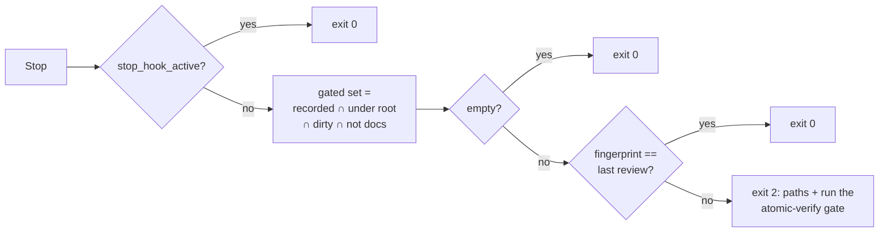

# Claude Code hooks

`atomic hooks install` registers three hooks in `~/.claude/settings.json`: a session-start hook and a review-gate pair. `atomic claude install` and `atomic claude update` run it for you.

## The three hooks

| Hook event | Command | What it does |
|---|---|---|
| `SessionStart` | `atomic hooks session-start` | Refreshes your profile, injects pending reminders, nudges you when a wiki falls stale, re-seeds the output style if the key is ever missing |
| `PostToolUse` (matcher `Edit\|Write\|MultiEdit\|NotebookEdit\|Agent`) | `atomic hooks post-tool-use` | Records the files the main agent edits and the review dispatches it runs |
| `Stop` | `atomic hooks stop` | Blocks the turn while a recorded edit is still uncommitted and unreviewed |

## The review gate

What each stop decides, from the session's recorded events:

`PostToolUse` and `Stop` share one recorded set, keyed by session:

- An `Edit`, `Write`, `MultiEdit`, or `NotebookEdit` call records its `file_path`. A subagent's tool calls carry `agent_type` and are skipped, so `/subagent-implementation`, `/autopilot`, and the other loop commands generate no recordings for the work their subagents do.
- An `Agent` call dispatching `atomic-reviewer` or `atomic-auditor` records a fingerprint of the gated set at that moment.

The gated set is every recorded path that is under the repository root, dirty against `HEAD`, and not documentation (under a `docs/` directory at any depth, or a top-level `README*`, `CHANGELOG*`, `CONTRIBUTING*`, `CODE_OF_CONDUCT*`, `SECURITY*`, or `LICENSE*`).

`Stop` recomputes the fingerprint and exits 2 when at least one gated path is unreviewed: stderr names the paths and tells Claude to run the `atomic-verify` review gate. `stop_hook_active` caps this at one block per turn, so a second stop in the same turn always exits 0. The gate closes when a review dispatch runs after the last edit, or when a commit leaves nothing dirty.

State lives at `<os temp dir>/atomic-hooks/<session_id>.jsonl`, one append-only file per session. Every internal failure, missing state, or non-repository `cwd` exits 0 silently: the hook fails open rather than blocking a turn it cannot reason about.

## Blind spots

Edits made through `Bash` (`sed -i`, redirection, a heredoc) never reach the `PostToolUse` matcher, since it only sees the edit tools. The hook backs the `atomic-verify` review gate; it does not replace it.

## Opt-out and doctor

`atomic claude install --no-hooks` skips registration. `atomic hooks uninstall` removes all three; there is no per-hook flag, so keeping a subset means editing `settings.json` by hand. `atomic doctor` warns when any of the three is missing, and `--fix` re-runs `atomic hooks install`.
