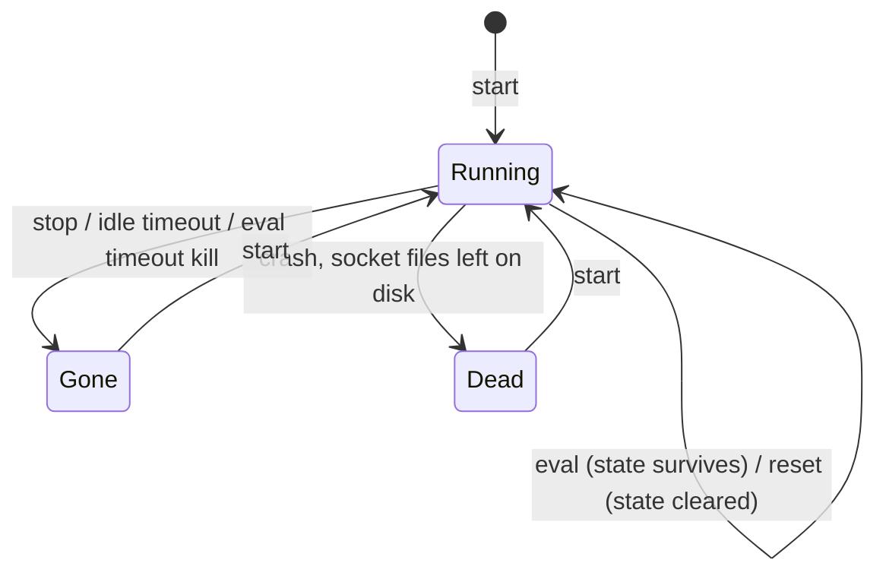

# atomic repl

`atomic repl` gives an agent a named, persistent Python or Node interpreter session it drives across separate Bash calls. `start` spawns it, `eval` runs code against it with state surviving between calls, and `stop` or an idle timeout ends it.

Localhost and Unix-only (macOS, Linux). There is no MCP exposure in v1: the CLI over Bash is the agent surface.

## Why a session instead of a one-shot script

A one-shot `python3 -c '...'` re-imports every module and rebuilds every variable on each call. `atomic repl` keeps the interpreter alive between calls, so a variable set in one `eval` is readable in the next, run as a separate process, minutes later:

    atomic repl start --name analysis --lang py
    atomic repl eval --name analysis 'import pandas as pd; df = pd.read_csv("data.csv")'
    atomic repl eval --name analysis 'df.describe()'
    atomic repl stop --name analysis

The second `eval` sees `df` because the interpreter never restarted.

## The session lifecycle

Each session is a detached interpreter child running an embedded harness script that serves its own unix socket. The `atomic` binary is a stateless spawner and client with no process of its own, so killing `atomic` never kills the session.

A session leaves Running three ways, and a verb that arrives after it left gets an exit code naming what it found:

A verb against Gone exits 2 (not found), against Dead exits 5 (socket unreachable), and against a live harness whose wire version is older than the client exits 7; the remedy for 2 and 5 is `start`, and for 7 it is `stop` then `start`. The full code table is under Exit codes below.

## Scope: which sessions a call can see

A session keys to the scope root where `start` ran: a repo root, or a realm root when `start` ran directly at one. `eval`, `list`, `status`, `reset`, and `stop` resolve the union of the calling repo's own sessions and its enclosing realm's. A session started at a realm root is reachable from any member repo, but a session started inside one member repo stays invisible from a sibling member.

`list` and `status` also accept `--all`, which drops the scope union entirely and enumerates every session on the machine, across every scope, printing each one's origin root path so a session can be found and its pid identified without knowing which repo or realm produced it.

Sockets and meta files live under `~/.atomic/repl/<scope-key>/`, where `<scope-key>` is a short, fixed-length hash of the resolved scope root, not the path itself, so an arbitrarily deep repo still produces a bounded socket path. Session directories are created `0o700`; socket and meta files `0o600`.

## Verbs

### start

    atomic repl start --name <s> --lang py|js [--env <file>] [--bin <path>] [--json]

Spawns a detached harness and returns once its socket is live:

    atomic repl start --name scratch --lang js
    atomic repl start --name db-check --lang python --env .env --bin /usr/local/bin/python3.12

`--lang` accepts `python`/`js`/`node`/`javascript` as aliases for the canonical `py`/`js`. `--env <file>` merges a `KEY=VALUE` env file into the spawned session's environment; its values never appear in `list` or `status` output, in either human or `--json` form.

| Condition | Behavior |
|---|---|
| same `--name` already alive | reports already-running; no duplicate spawn |
| interpreter not on `PATH`, no `--bin` given | exit 6 before any spawn, naming the missing binary |
| explicit `--bin` does not resolve | exit 6 before any spawn |

### eval

    atomic repl eval --name <s> [--timeout <duration>] [--json] [--] [<code>]

Evaluates a code argument; with no argument, code is read from stdin when stdin is not a tty. Neither an argument nor piped stdin present exits with the usage-error code. Embedded newlines in the argument, or a multiline stdin pipe, evaluate as a single unit.

A `--` separator before the code positional disambiguates code that itself starts with a dash:

    atomic repl eval --name s -- '-1 + 2'

Code that starts with a dash and omits `--` is safest passed via stdin instead.

`eval` returns structured `{stdout, stderr, value}`. `value` is the repr/inspect of the final expression (REPL semantics), empty for a bare statement. Every field is always present on the wire; `value` and `error` are empty strings when not applicable, never null or absent. On an eval exception, `error` carries the full traceback including the failing line, and any stdout/stderr the code produced before the failure is still delivered. stdout and stderr are each truncated at 64 KiB, with `truncated: true` (`--json`) or a `[truncated]` marker (human output) when the cap is hit.

`--timeout` (default `30s`) bounds the client-side wait. On expiry the client sends `SIGINT`, escalates to `SIGKILL` after a short grace if still unresponsive, and removes the session's socket and meta. A later call against that name exits session-not-found until `start` runs again.

    atomic repl eval --name analysis 'df.head()'
    echo 'const x = 1 + 1; x' | atomic repl eval --name scratch --json

### list

    atomic repl list [--all] [--json]

Enumerates sessions in the current repo-plus-realm scope, or every scope on the machine with `--all`: name, origin root, lang, pid, liveness. `list` always exits 0, since it enumerates rather than targets a single session, so a dead entry is reported inline rather than surfaced as a command failure.

### status

    atomic repl status --name <s> [--all] [--json]

Reports one session's liveness, pid, and origin root. Unlike `list`, `status` targets a session by name and exits non-zero (dead: 5, not found: 2) when that session cannot be reached.

### reset

    atomic repl reset --name <s> [--json]

Clears the interpreter's namespace without ending the harness process. The session keeps running, empty.

### stop

    atomic repl stop --name <s> [--json]

Ends the session and removes its socket and meta files.

## Exit codes

| Code | Meaning |
|---|---|
| 0 | ok |
| 1 | usage error |
| 2 | session not found |
| 3 | eval exception (the evaluated code raised or threw) |
| 4 | timeout (SIGINT-then-SIGKILL escalation exhausted) |
| 5 | session dead (socket unreachable) |
| 6 | interpreter or environment unavailable (`--lang`'s interpreter not on PATH, or `--bin` does not resolve) |
| 7 | protocol version mismatch. A live harness speaks a different wire version than the client; the remedy is `repl stop` then `start`, distinct from 5 whose remedy is `start` alone. |

`list` is the one exception to this table: it always exits 0, since it enumerates rather than targets a single session.

A reaped session (idle timeout) and a name that was never `start`ed produce the identical not-found message and exit code. No marker distinguishes "used to exist" from "never existed," so an agent always gets the same `atomic repl start` remedy.

## Idle timeout

A session with no `eval` activity for longer than its idle window self-terminates: the harness removes its own socket and meta files and exits 0, with no daemon or reaper process involved.

The window resolves repo-first: `[repl] idle_timeout` in `.claude/atomic.toml`, else `[repl] idle_timeout` in `~/.atomic/config.toml`, else `1h`.

    [repl]
    idle_timeout = "2h"

An invalid duration at either scope is skipped in favor of the next tier rather than blocking `start`. `start` prints one stderr line per bad value naming the config file and the value it ignored; the other verbs stay silent about it. `atomic doctor` also surfaces the bad value.
