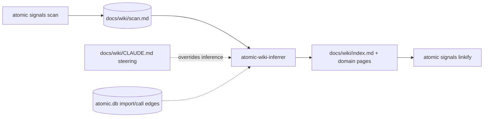

# Repo wiki

A wiki is a generated knowledge graph for a tree of code, and it comes at two scopes. This page is the **repo** scope: one repository, mapped into `docs/wiki/` inside it. The [realm wiki](/reference/realm-wiki) is the other scope, one level up, mapping how a folder of repositories relates. Same command, same inferrer, same page shape; `/refresh-wiki` reads a `<wiki-type>` marker to tell which one it is looking at.

A repo wiki is [context engineering](https://www.anthropic.com/engineering/effective-context-engineering-for-ai-agents) for one project: its working knowledge, kept as files the agent reads rather than facts you re-type each session. Instead of hallucinating build commands or inventing framework conventions, Claude reads two files that describe what is actually in the repo.

Run `/refresh-wiki` to generate or update them:

- **`docs/wiki/scan.md`** — machine-generated facts: directory tree, manifests, languages, lockfile presence.
- **`docs/wiki/index.md`** — inferred meaning: framework, build/test/lint commands, architectural style, domain index. Written by the `atomic-wiki-inferrer` agent.

Both are committed, but only `index.md` auto-loads into sessions via an `@`-ref. `scan.md` can run to thousands of lines on a large repo, so the inferrer reads it on demand instead.


## The pipeline

Deterministic code writes the facts, the model writes the meaning, and code links the result. Steering overrides the model's inference, never the scan:



The dotted inputs are optional: steering exists only where you wrote it, and the code-intel edges only where `atomic code index` has run, corroborating domain boundaries by who calls whom rather than by directory layout.

Three things trigger a refresh: `/refresh-wiki` on demand; the implementation loop (`/subagent-implementation`, `/autopilot`) at finalize, scoped to the task's SHA range, which is the primary path; and ship commands as an ad-hoc fallback for real-code commits. Docs-only commits are skipped, and a freshness check prevents a double refresh after the loop already ran.

::: tip The CLI verb is still called `signals`
`atomic signals scan|show|stale|diff|linkify` is the deterministic half of this pipeline, and it writes `docs/wiki/scan.md`. The verb keeps its original name from before repo-scope context and the cross-repo wiki were unified into one concept. `/refresh-wiki` calls it for you; you rarely invoke it directly.
:::

Requires the `atomic` binary. Without it, `/refresh-wiki` stops and prints install instructions, and the ship-verb refresh skips silently.

The result is a navigable markdown graph. The inferrer writes each path citation as a plain backtick path, then runs `atomic signals linkify` to render every one that resolves on disk into a relative link to the file it names. Open `docs/wiki/` in Obsidian, any markdown server, or `atomic serve` and click through the router into its domain files and out to the source. The linkifier is deterministic and idempotent, and a rendered `[text](path)` link is a plain markdown link, not an `@`-reference, so it stays inert until something reads it.


## Steering the inferrer

The inferrer makes its best guess from the scan, but it can get things wrong — especially with monorepos, polyglot projects, or unconventional naming.

Create `docs/wiki/CLAUDE.md` to provide explicit hints. The inferrer reads it before writing `docs/wiki/index.md` and treats its content as ground truth, so when steering contradicts the scan, steering wins.

The delivery mechanism is Claude Code's own, not something atomic added on top. A `CLAUDE.md` inside a directory is nested memory: the harness loads it whenever Claude reads a file in that directory. Reading files under `docs/wiki/` is precisely what the inferrer does, so the steering is present exactly when it applies and absent the rest of the time. That is why this file is deliberately **not** `@`-referenced the way `docs/wiki/index.md` is — an `@`-ref would pay for it on every turn of every session to serve one agent that already gets it for free.


### When to use steering

- The inferrer detected the wrong framework
- You have git submodules and want the inferrer to treat the repo as one project
- Two directories are one logical domain but got split
- A directory looks like a domain but is generated code or vendored
- The inferrer guessed the wrong build or test command
- You want to exclude paths from domain classification


### Format

Plain markdown. No required structure — the inferrer reads it as natural language. Headings help organize:

```markdown
# Signals steering

## Framework
This is a NestJS monorepo managed by Turborepo.

## Project structure
This repo uses git submodules. Treat the root as one project.
Do not recurse into submodules or create domains for them.

## Domains
- src/billing/ and src/payments/ are one domain ("payments")
- src/internal-tools/ is scratch code, not a real domain
- packages/ contains shared libraries — one domain, not one per package

## Build
- Build: pnpm turbo build
- Test: pnpm test:ci (not pnpm test — that starts watch mode)
- Lint: pnpm lint

## Ignore for domains
- vendor/
- .git/modules/
```


### How it works

The steering file is the dotted input in the pipeline above. Two rules govern it: steering beats inference — if steering says "this is NestJS", the inferrer writes NestJS regardless of what `package.json` implies — and changes take effect on the next `/refresh-wiki`, with no registration step.


### Bootstrap

`/setup-wiki` creates `docs/wiki/CLAUDE.md` if it does not exist. Uncomment and edit the sections you need. Delete sections you do not.

The file is committed along with the rest of `docs/wiki/`.


## Excluding files from the scan

A separate mechanism from steering. The `[scan]` table in `.claude/atomic.toml` controls which files the deterministic scan sees.

The scan already starts from tracked files plus untracked files not covered by `.gitignore`, so anything gitignored is excluded before this runs. `[scan]` is for *committed* paths you still want dropped or flagged. Two lists, because there are two different outcomes:

| Key | What happens | Use for |
|-----|--------------|---------|
| `ignore` | fully excluded — the path never appears in the tree | vendored deps, checked-in fixtures, large data files |
| `generated` | stays in the tree, marked, and the inferrer skips its content | build output, protobuf output, lockfiles |

```toml
[scan]
ignore = ["fixtures/large-dataset.json", "third_party/**"]
generated = ["*.pb.go", "generated/**"]
```

A pattern containing a slash matches the full repo-relative path; one without matches the basename at any depth, so a bare `gen.go` matches wherever it sits. `**` crosses directories, which is why `third_party/**` covers the whole subtree. Same rules as `[code] ignore` — see [`.claude/atomic.toml`](/reference/atomic-toml).

::: tip Replaces `.signalsignore`
This used to be a repo-root `.signalsignore` file, one glob per line, with `+` marking a generated path. `atomic update` converts an existing file into `[scan]` and deletes it, and `atomic migrate --repo <path>` does the same on demand. A repo that has not migrated still reads the old file, so nothing breaks in the meantime. Being TOML rather than a bespoke format also means `**` now works, where the old parser needed one pattern per directory level.
:::

**Use `[scan]`** when a committed path should be excluded from the scan or flagged as generated.

**Use `docs/wiki/CLAUDE.md`** when you want to tell the inferrer something it cannot derive from the scan.
