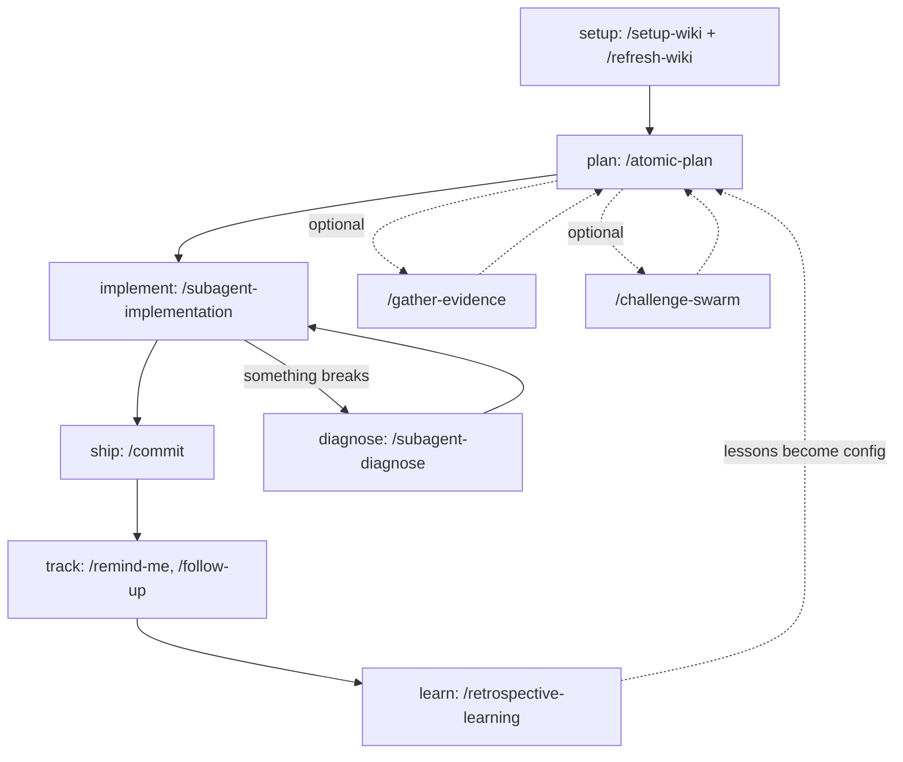
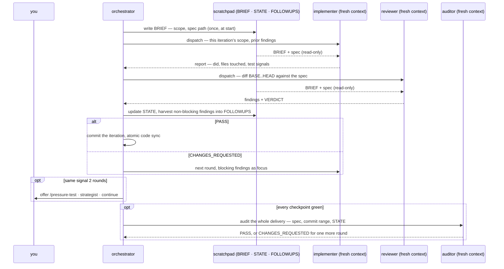

# Workflow

Atomic Claude follows a lifecycle: set up the repo, plan the work, implement it, fix what breaks, ship it, and learn from the session.

That lifecycle is a loop in the loop-engineering sense. Every stage ends at an objective gate, and `/autopilot` runs the whole circuit unattended.

The lifecycle, with the optional gates and the failure path:



`/autopilot` runs the same circuit start to finish without stopping at your approval gates.


## 0. Set up your repo

Before your first session in a new project, two commands teach Claude what it is looking at:

```
/setup-wiki
/refresh-wiki
```

`/setup-wiki` audits the repo for missing conventions and proposes only what is absent; `/refresh-wiki` generates the [repo wiki](/reference/repo-wiki), the standing map Claude reads before your code. Run them once per repo; ship commands keep the wiki fresh after that.

Two optional layers deepen the map. `atomic code index` builds a symbol graph the agents query for callers and blast radius ([code-intel](/reference/code-intel)), and a [realm wiki](/reference/realm-wiki) maps how a folder of repos relates, one level up. The [getting-started guide](/guides/getting-started) walks this setup step by step.


## 1. Plan

```
/atomic-plan
```

You and Claude produce a spec together. For small tasks, this is an inline checkpoint table in `docs/spec/`. For larger work, Claude writes a design doc first (`docs/design/`) and then derives the spec from it. Nothing gets implemented until you approve the plan.

Every spec also carries three sections that make the work inspectable before you approve it:

| Section | What it shows |
|---------|---------------|
| `## Change tree` | every file the work creates, modifies, or removes |
| `## Outline` | the named pieces inside those files, one line each |
| `## Flows` | the behaviors being implemented, as actor and step sequences |

Together they expose blast radius, shape, and behavior without reverse-engineering prose. The reviewer later walks the delivered work against the outline.

If the plan rests on an unverified hunch, `/atomic-plan` will suggest `/gather-evidence` before continuing. You decide whether to gather first or proceed at risk.


### Verify hunches (optional)

```
/gather-evidence "<hypothesis>"
```

When the work ahead rests on a factual hunch ("library X supports Y", "our codebase already has a Z pattern", "approach A is faster than B"), `/gather-evidence` chases the claim through primary sources before any spec is written. It pulls from context7, official docs, source code, ast-grep, and run-it experiments, citing every piece of evidence with its source tier. Hearsay from blogs or forums cannot produce a `SUPPORTED` verdict.

Returns one of `SUPPORTED`, `UNSUPPORTED`, `MIXED`, or `INCONCLUSIVE` with a clear recommendation: proceed to `/atomic-plan`, abandon, refine the hypothesis, or dig deeper. Skip this step when the work is grounded in code you have already read, and reach for it the moment you catch yourself assuming.


### Challenge the written design (optional)

```
/challenge-swarm @docs/spec/<topic>.md
```

Once a design or spec exists, `/challenge-swarm` subjects it to independent expert scrutiny before any code gets written. It profiles the artifact first (who can reach it, whose data flows through it, what being wrong costs), then seats 3-6 lenses from a catalog spanning engineering, data/ML, business, finance, communication, and delivery — each seated only with a cited stake, so a loopback-only tool never draws a security lens — and dispatches each as an isolated subagent that cannot see the others' findings. The results merge into a contradiction map: where the lenses pull in opposite directions, where they independently agree, and what they all assumed without checking. The disagreements are the point, because they name the trade-off decisions the design still has to make explicit.

The report lives in the conversation; fold accepted findings back through `/atomic-plan` or file them as follow-ups. Where `/pressure-test` is a dialogue in which you defend your thinking, `/challenge-swarm` is a parallel attack on the written artifact. Run either or both.


## 2. Implement

Three verbs run implementation. Pick by what you already have:

| You have | Verb | What it skips |
|----------|------|---------------|
| An approved spec and multi-checkpoint work | `/subagent-implementation` | nothing |
| A known cause and one obvious approach | `/quick-fix` | the spec, the worktree, the finalize ceremony (audit kept) |
| Enough trust to let it drive end to end | `/autopilot` | your approval gates |

```
/subagent-implementation
```

Claude reads the approved spec and runs an autonomous implement-then-review loop, Anthropic's evaluator-optimizer pattern applied per checkpoint. A builder agent writes code (failing test first), a reviewer agent checks it against an objective gate (the tests), and each passing checkpoint gets committed automatically.

One iteration, plus the once-per-task audit at the end. The implementer and the reviewer never talk to each other, and only the orchestrator writes the scratchpad — the agents read the brief and report back, which is why each can run fresh-context:



The scratchpad in that diagram is a slug-keyed work bundle — `atomic scratchpad new <slug> --purpose implement` creates or extends it, and a later phase on the same task joins it rather than opening a new one. Artifacts resolve its path, and where session reports and reminders for this project live, via `atomic where --json` rather than constructing them. → [conventions](/reference/conventions)

The audit runs exactly once per task, after the docs update and before the signals refresh. A `CHANGES_REQUESTED` verdict buys one more implementer-reviewer round against its findings, never a second audit, so finalize cannot loop. It gates what per-checkpoint review cannot see: success criteria no single checkpoint owned, iterations that each passed and do not compose, and commit types that misstate user-visible impact.

Non-blocking findings (risks, nits, questions) accumulate in a ledger that you review at the end, so nothing gets silently dropped. When the loop gets stuck, either the same failure surviving two rounds of fixes or the reviewer flagging error-swallowing patches that dodge the bug instead of fixing it, it stops grinding and surfaces a root-cause path: a pressure-test prompt or a read-only strategist analysis you can run, rather than piling on more suppression.

If the project is indexed, the loop uses the code-intel graph throughout. It indexes the project at the start of the task, the investigator leads with `atomic code explore` to scope each surface, the reviewer checks blast radius with `atomic code impact`, and the orchestrator runs `atomic code sync` after each committed checkpoint so the graph reflects the latest code. When no index is present the agents fall back to plain search, so the loop runs either way.


### Skip planning: /quick-fix

```
/quick-fix <task description>
```

For a fix with a known cause and one obvious approach, `/quick-fix` skips the plan entirely. It runs the same implement-then-review loop as `/subagent-implementation`, minus the spec, the worktree, and the finalize ceremony (the once-per-task audit stays), so a straightforward change lands faster. The moment the fix turns out less obvious than it looked, it stops and hands off to `/subagent-implementation` or `/atomic-plan` instead of grinding on a wrong assumption.


### Hands-off: /autopilot

```
/autopilot <task | issue#> [merge-verb]
```

When you trust the system to drive, `/autopilot` runs the whole lifecycle (plan, the implement-then-review loop, and ship) from a task description or a GitHub issue number, with one decision left to you: how to merge. It always uses the same subagent loop, but with three autonomous defaults. Every reviewer finding is fixed as it goes rather than deferred. When the loop gets stuck, it dispatches the read-only strategist for root-cause analysis on its own instead of waiting for you. And it keeps the spec current the whole way, so a fresh subagent never reads stale scope.

The only decision is the merge method at the end. Pass a merge verb (`/autopilot 29 commit squash merge`) to skip even that. It also keeps experiments in a gitignored scratch folder rather than deleting them mid-run, so it never stops to ask permission for a stray `rm`; it clears that folder once when the run finishes. Reach for the interactive verbs above when you want approval gates; reach for this when you do not.


### What the loop costs

The loop trades tokens for verification: every checkpoint is implemented by one agent and re-checked by another, and that second pass is not free. Implementation and review run on Sonnet subagents; log reading and CI watching run on Haiku, the cheapest tier. The overhead has not been measured precisely. As one anecdote, heavy daily use on the Claude Max 20x plan, often four or five instances at once, never hits the five-hour window limit and lands around half the weekly limit; the smaller Max plan may hit the window cap under the same load. If you are rate-limit sensitive, run the gated verbs stage by stage instead of `/autopilot`, and skip the loop entirely for small edits: a one-file fix does not need a builder and a reviewer.


## 3. Diagnose

```
/subagent-diagnose ci
/subagent-diagnose bug "description of what's broken"
```

When something breaks, this command runs the same loop as implementation but seeded from a failed CI run or a bug description. It investigates, proposes a fix, reviews its own fix, and commits when green.


## 4. Ship

One verb covers all ship paths:

```
/commit                   — stage + commit, then ask how far to ship
/commit push              — commit + push
/commit pr                — commit + push + PR
/commit merge             — commit + merge to base
/commit squash            — commit + squash branch
/commit squash merge      — commit + squash + merge to base
```

With no pending changes and commits already ahead of base, `/commit` skips straight to the ship step, so `/commit merge` on a clean branch just merges. The merge and squash-merge paths run tests on the merged result and prompt to clean up the worktree if you used one; squash alone rewrites the branch without re-running tests.


## 5. Track what's deferred

```
/remind-me 2h check the deploy
/follow-up review
```

Not everything gets resolved in the same session. Reminders are time-based nudges that surface at the specified moment, or at the start of your next session if you are away. Follow-ups are non-blocking findings from implementation (risks, nits, open questions) that you parked for later. `/follow-up review` walks you through stale entries and lets you close, extend, or promote each one.

Both mechanisms exist because shipping is not the end. The things you deferred during implementation should not silently rot.


## 6. Retrospective

```
/retrospective-learning
```

After a long session or a run of friction, `/retrospective-learning` looks back. It mines your session history and the current conversation for corrections, repeated requests, and places where Claude misbehaved, then cross-references those signals against your installed artifacts (commands, skills, agents, CLAUDE.md). It walks proposed improvements one at a time; you accept, modify, or skip each. A run log persists to `~/.atomic/retro-runs/`, so a later run can tell whether a past accept actually landed or quietly drifted back.

This is the stage that closes the loop. Shipping a feature teaches you something about how you and Claude work together, and `/retrospective-learning` is where that lesson becomes a durable config change instead of a frustration you re-hit next week.


## Lost? Start with the router

```
/atomic-help
/atomic-help tour
```

`/atomic-help` reads your git state, works out where you are in the lifecycle, and recommends one next command. It routes; it never executes. `/atomic-help tour` runs a four-stage guided walkthrough of the whole system (surfaces, lifecycle, state files, maintenance), and a bare `/atomic-help` offers the tour automatically the first time you run it in a fresh repo.


## Why custom ship commands?

Claude Code already knows how to commit and push. The reason atomic-claude wraps those operations into its own commands is everything that happens around them:

- **Wiki refresh** — when source files changed, the command re-scans the project so Claude's map stays current
- **Doc-impact check** — checks whether your change affects documentation and prompts you to update the relevant surfaces
- **Commit message discipline** — messages are generated by the `atomic-git-discipline` skill in Conventional Commits format, drawn from the diff and any session reports
- **Verification gate** — merge commands run `atomic-verify` before touching the base branch, re-running tests on the merged tip

Documentation is almost always an afterthought. These commands make it part of the flow rather than something you remember to do later.


### What runs automatically

Every `/commit` invocation runs the wiki staleness check and doc-impact checks as part of the commit flow. Documentation surfaces are presented for review, and the commit message is synthesized from the diff. The wiki is regenerated only when the check reports stale and the staged set is not docs-only; a fresh index (say, because the implement loop already refreshed it) makes the step a no-op. Escalation paths that touch the base branch (`merge`, `squash merge`) also run `atomic-verify` on the merged tip before finalizing.

| Path | Wiki | Doc-impact | Commit msg | Verify |
|------|:-------:|:----------:|:----------:|:------:|
| commit (all paths) | ✓* | ✓ | ✓ | |
| merge / squash merge | ✓* | ✓ | ✓ | ✓ |

✓ = runs automatically. ✓* = staleness-gated; skipped for docs-only commits.
