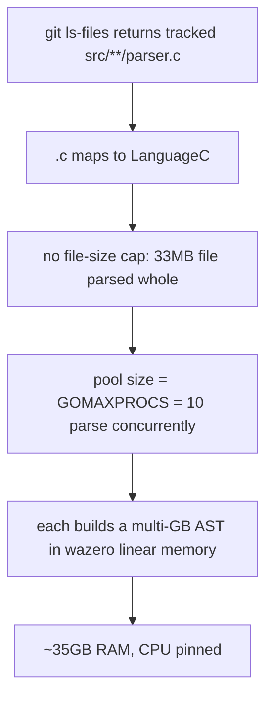

# tsbinding: vendor-on-demand for grammar sources

Status: **RESOLVED 2026-06-18** — the plan below was implemented. `tsbinding/src/` is gitignored and
vendored on demand (`grammars.json` + `fetch-grammars.sh`); only `lib/ts.wasm` is committed. The indexer
also respects `.gitignore` (`scanFiles` → `git ls-files --cached --others --exclude-standard`), so even a
worktree that has run `make fetch` is safe to index — the generated `parser.c` files are skipped.
`atomic code index` no longer OOMs. (Latent edge: the non-git `walkDirFallback` does not skip `src/`, so
the OOM could only recur if git were unavailable in a post-`make-fetch` tree.) Originally researched
2026-06-13; the problem statement below is the point-in-time record of what was true before the fix.

Captures why `atomic code index` blew up on this repo, the experiment that proved the fix,
and the agreed plan to vendor the tree-sitter grammar sources on demand instead of committing them.

## Problem

`atomic code index` against this repo consumes ~35GB RAM, pins the CPU, and runs for a long time —
even though the repo is small by hand-written line count.

Root cause: the tree-sitter grammar sources under `atomic/internal/codeintel/tsbinding/src/**/parser.c`
are git-tracked. There are 21 such `.c` files totalling ~6.5M lines of machine-generated C
(`csharp/parser.c` alone is 33MB / 976K lines). The chain:

- `scanFiles` runs `git ls-files --cached --others --exclude-standard`, so every tracked `parser.c` is returned.
- `.c` maps to `LanguageC` (`orchestrator.go:75`), so each is fed to the C tree-sitter extractor.
- There is no file-size cap anywhere in the indexer.
- The parser pool size is `GOMAXPROCS` (10 on this machine), so up to 10 files parse concurrently,
  each in its own wazero WASM linear-memory instance.

Generated `parser.c` files are pathological input: a 33MB file produces a multi-GB syntax tree in
WASM linear memory, and ten of those in parallel reach ~35GB. The CPU is pinned parsing millions of
lines of generated C. None of it has query value — these are generated parser tables, not human code.

## Facts established

- `lib/ts.wasm` (35MB) is the only runtime dependency: `//go:embed lib/ts.wasm` (`treesitter.go:16`).
  It must stay committed — CGO is disabled and neither CI nor goreleaser compiles wasm, so the
  committed blob is the dependency.
- `src/**/*.c` (208MB tracked) is build-time input only. The sole consumer is `tsbinding/Makefile`
  (`make build`, needs `zig`). Nothing in `go build`, CI, or goreleaser reads it.
- `.wasm` is not an indexed extension; only `src/**/*.c` triggers the blowup.

## Decision

Move the grammar sources to vendor-on-demand. Stop committing `src/`; fetch it from upstream only
when rebuilding the wasm. Keep `lib/ts.wasm` committed as the runtime artifact. This removes 208MB
from the repo, makes regeneration reproducible from pins, and eliminates the index blowup for this
repo as a side effect — a gitignored `src/` is excluded by `git ls-files`, so the indexer never sees it.

A generic indexer file-size cap was considered and dropped. In practice only compiled or generated
artifacts ever reach pathological sizes, and vendor-on-demand removes those at the source for this
repo. (If a general defense is ever wanted for arbitrary user repos, the cap can be revisited
independently — it is a separate concern with a wider scope.)

## Experiment — vendor-on-demand proven viable

Run on 2026-06-13 with zig 0.15.2. All work in gitignored `tmp/`; the committed wasm was backed up
and restored, leaving the repo clean.

| Gate | Result |
|------|--------|
| zig 0.15.2 runs the Makefile's 0.13-era flags | pass |
| rebuild from current committed `src/` passes parse tests | pass |
| shared `src/` (runtime + 16 grammars) vs malivvan HEAD `46b39a7` | 0 files differ — single pin |
| 4 external grammar pins still resolve from upstream | all 4 resolve |
| build from a fully-fetched tree | 35M wasm produced |
| fetched wasm passes extraction suite (force-uncached) | pass (30s + 86s + 6s, all ok) |

The extraction packages exercised are `internal/codeintel/extraction`, `.../extraction/languages`
(the multi-grammar parse test), and `.../extraction/standalone`.

## Sourcing and pins recovered

atomic's `src/` is the union of a malivvan subset and four externally-sourced grammars.

- `malivvan/tree-sitter` @ `46b39a7` (HEAD / `master`) — provides the tree-sitter runtime C and 16
  grammars: c, cpp, csharp, java, javascript, golang, kotlin, lua, php, python, ruby, rust, scala,
  swift, typescript (+ tsx). Pin the commit, not the tag — `v0.0.1` is an older commit (`5aa45b3`).
  malivvan also ships its own `src/_gen/grammars.json` pinning each grammar to its `tree-sitter/*`
  upstream at tag + revision, if deeper provenance is ever needed.
- Four grammars sourced directly (Makefile-pinned, all confirmed resolvable):

| Grammar | Repo | Commit | Files |
|---------|------|--------|-------|
| dart | UserNobody14/tree-sitter-dart | `311a0093c6a70b8579ed8b1d3f69ffa78ab53bf5` | parser.c, scanner.c |
| luau | amaanq/tree-sitter-luau | `a8914d6c1fc5131f8e1c13f769fa704c9f5eb02f` | parser.c, scanner.c |
| objc | amaanq/tree-sitter-objc | `181a81b8f23a2d593e7ab4259981f50122909fda` | parser.c |
| pascal | Isopod/tree-sitter-pascal | `042119eca2e18a60e56317fb06ee3ba5c32cb447` | parser.c |

Note on dart: the Makefile pins `311a009` (ABI 14); a later commit (`a9bdfa3`) bumped to ABI 15.
Stay on the pinned commit unless the binding is upgraded to match.

## Plan (no spec)

1. Stop tracking the sources: `git rm -r --cached atomic/internal/codeintel/tsbinding/src`
   (files stay on disk).
2. Gitignore the fetched tree: add `atomic/internal/codeintel/tsbinding/src/` to `.gitignore`.
3. Write atomic's own pin manifest (`grammars.json`) — the malivvan commit plus the four external
   pins above. This is distinct from malivvan's internal `_gen/grammars.json`. The Makefile already
   cites `src/_gen/grammars.json`, but that file does not currently exist in this repo; provenance
   lives only in Makefile comments today.
4. Add a `make fetch` target to `tsbinding/Makefile` that, driven by the manifest:
   - clones malivvan at the pinned commit and copies the runtime `*.c`/`*.h` plus the 16 grammar dirs into `src/`;
   - clones each external grammar at its pin and copies the listed files into `src/<lang>/`;
   - copies one grammar-facing `tree_sitter/parser.h` into `src/tree_sitter/` (every external grammar repo ships it).
5. Guard `make build`: if `src/` is absent, run `make fetch` first. `make build` stays otherwise unchanged.
6. Keep `lib/ts.wasm` committed and the `//go:embed` unchanged.

No source patching is required. The committed repo applied per-grammar include rewrites (dart added
`tree_sitter/`, objc/pascal/luau stripped it), but the experiment showed upstream-as-is compiles and
passes as long as `src/tree_sitter/parser.h` is present. Byte-identity to the old committed files is
not the goal; a buildable tree that passes the extraction tests is.

## Caveats

- Equivalence is proven by tests, not byte-identity — compiler output is not deterministic across
  versions, so the gate is the extraction suite, not `cmp` against the old wasm.
- The Makefile says `zig >= 0.13.0`; 0.15.2 works. Consider pinning a zig version for reproducible regen.
- CI is unaffected (it never builds wasm). Optionally add a manual or scheduled job that runs
  `make fetch && make build` plus tests to guard the pins against upstream bit-rot.
- Rebuilding the wasm is a cold maintainer path — only needed when adding a language, upgrading a
  grammar, upgrading the tree-sitter runtime, or exporting a new `ts_*` symbol. Normal contributors
  never run it and do not need `zig`.
