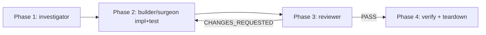

# Diagnose engine (shared loop)

> Engine file for orchestrator commands that follow the scratchpad + investigator + builder + reviewer + FOLLOWUPS pattern. **Not a spec** — no `## Goal`, no `## Checkpoints`, no command of its own. Specs that use this engine reference it by link (single source, no inlining, no sync gates). Current consumers: `docs/spec/diagnose-ci.md`. Future consumers add themselves at the bottom of this file.
>
> **Engine evolution rule.** Edits here are read by every consumer spec on every read. Treat changes the same as a spec amendment: append a `## Change log` entry at the bottom with what changed and why. Consumer specs do not need to be touched.
>
> **When to fork instead of extend.** If a new consumer needs a different loop shape (different agent sequence, different teardown policy), fork into a new engine file — don't accumulate conditionals here. The engine pattern only earns its keep when N≥2 consumers share the loop verbatim.

---

## Scratchpad layout

| Path | Contents |
|------|----------|
| `.claude/.scratchpad/<topic>/BRIEF.md` | Pointer to source, current iteration scope, reviewer feedback rollup |
| `.claude/.scratchpad/<topic>/STATE.md` | Append-only iteration log (one entry per Phase 2→3 cycle) |
| `.claude/.scratchpad/<topic>/FOLLOWUPS.md` | Non-blocking findings carried across iterations; dispositioned at finalize |
| `.claude/.scratchpad/<topic>/CONTEXT.md` | Phase 0 capture (per-command — logs for CI, repro + symptom map for bug) |

`<topic>` format: `<YYYY-MM-DD>-<command-suffix>`. Suffix derivation is per-command (see each spec's Phase 0).

## Phases 1-4 (shared)

Caption: shared phase pipeline. Phase 0 is per-command. Phase 4 verification body is per-command; teardown is shared.

### Phase 1 — investigator pass

- Agent: `atomic-investigator` (haiku, read-only).
- Input: `BRIEF.md` + `CONTEXT.md`.
- Output: `file:line — what` table of the suspect surface, appended to `BRIEF.md` as `## Phase 1 — surface map`.
- **Cohesion classification is done by the orchestrator**, not the agent. After reading the investigator's table, the orchestrator classifies the work as `tight` (single logical change, ≤2 files would suffice) or `loose` (multi-file, multi-concern). No agent contract amendment required — the orchestrator uses the table to decide.

### Phase 2 — implementation

- Agent selection: orchestrator branches on its own cohesion classification.
    - `tight` → `atomic-surgeon`. (Surgeon self-refuses if the actual diff exceeds its 1–2 file cap; orchestrator falls back to builder on refusal.)
    - `loose` → `atomic-builder`.
- TDD discipline: failing test first, then implementation. Reports the atomic quality signal block per skill `atomic-tdd`.
- **Commit ownership: orchestrator commits**, not the agent. Builder and surgeon contracts explicitly forbid commits (see `agents/atomic-builder.md` and `agents/atomic-surgeon.md`). Matches `/subagent-implementation` Step D.

### Phase 3 — reviewer pass

- Agent: `atomic-reviewer`.
- Emits `## Spec compliance` + `## Code quality` + the signals block + exactly one of `VERDICT: PASS` / `VERDICT: CHANGES_REQUESTED`.
- On `CHANGES_REQUESTED`: orchestrator updates `BRIEF.md` reviewer-feedback section, increments iteration counter in `STATE.md`, loops to Phase 2.
- On `PASS`: proceed to Phase 4.

### Phase 4 — teardown (shared half)

- Verification body is per-command (see each spec's Phase 4).
- On verified success: archive scratchpad to `.claude/.scratchpad/.archive/<topic>/` (gitignored). Do **not** delete.
- On bail-out (hard stop hit, same-failure early-bail, user abort): retain scratchpad in place. Do not archive.
- FOLLOWUPS disposition: present `FOLLOWUPS.md` ledger to user per-item; user picks per row from `close` / `defer` (promote to `.claude/project/followups.md`) / `convert-to-spec`. Same flow as `/subagent-implementation` Phase 3.

## Brief verbosity discipline

The orchestrator writes `BRIEF.md` **exhaustively** before every subagent dispatch. Every fact the next agent needs lives in the brief — log excerpts, file:line refs, base SHA, what's been tried, suspected hypotheses, reviewer feedback from prior iterations.

Rationale: each dispatch is a fresh context. Tokens spent on a verbose brief are tokens saved on re-discovery. A short brief that forces the agent to re-grep is a false economy.

## Iteration cap + bail-out

- **Default hard stop:** N = 5 iterations of Phase 2→3.
- **User override (axiom 2 — memory over config):** orchestrator reads user memory key `diagnose iteration cap` at Phase 1. Falls back to 5 if absent. User says "remember diagnose cap is 3" → orchestrator saves a `feedback`-type memory; future runs honor it.
- **Same-failure early bail:** if three consecutive iterations report the same *normalized* top-level error, bail before N. The loop is stuck on one symptom.
- **Bail behavior:** retain scratchpad in place (not archived), print summary of iterations tried + the final reviewer verdict, recommend user-driven next steps. Do **not** auto-open a PR comment or post anywhere.

### Same-failure normalization

Before comparing top-level error strings across iterations, apply in order:

1. Strip `:\d+(:\d+)?` line/column suffixes.
2. Replace absolute paths with basename (`/a/b/foo.go` → `foo.go`).
3. Strip ISO timestamps and `\d{2}:\d{2}:\d{2}` clock times.
4. Strip hex addresses (`0x[0-9a-fA-F]+`).
5. Strip test-runner durations (`\d+(\.\d+)?(ms|s|µs|ns)\b`).
6. Collapse runs of whitespace to single space; trim.

Two normalized strings equal → "same failure". Hash for compactness; store hash + first 200 chars of raw error in `STATE.md`.

## FOLLOWUPS handling

- During Phase 3, reviewer findings tagged non-blocking (severity 🔵 / 🟡 without blocker disposition) are appended to `FOLLOWUPS.md` by the orchestrator.
- Carried across iterations. Reviewer may re-affirm or close prior entries.
- At Phase 4, present per-item to user. Same dispositions as `/subagent-implementation`:
    - `close` — drop the entry.
    - `defer` — promote to `.claude/project/followups.md` with `Origin:` line.
    - `convert-to-spec` — open `/atomic-plan` with the entry as the brief; user finishes the spec.

## Concurrent runs

Topic dir includes a per-command unique suffix (the per-consumer-spec Phase 0 defines its format). If the topic dir already exists when the orchestrator goes to create it:

- Refuse. Print: `scratchpad <path> already exists; rm -rf it or pick a different topic suffix.`
- Per axiom 3, no silent overwrite. `--resume` flag is YAGNI until a real second-hit forces the case.

## Cross-references

- Agent contracts: `agents/atomic-investigator.md`, `agents/atomic-builder.md`, `agents/atomic-surgeon.md`, `agents/atomic-reviewer.md`, `agents/atomic-haiku.md`.
- Sibling orchestrator: `commands/subagent-implementation.md` — template for this pattern; cohesion-bundle parent that this engine deliberately stays parallel to (not subordinate to).
- Consumers: `docs/spec/diagnose-ci.md`.

## Change log

<!-- Append entries here when this engine changes. Every consumer spec inherits the change automatically. -->

