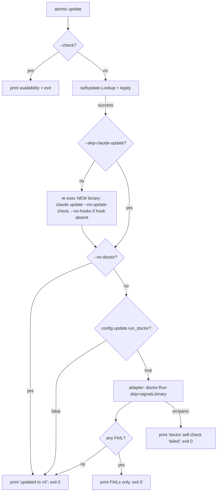

# `atomic update` post-apply doctor

## Goal

After a successful binary swap by `atomic update`: first, refresh the `~/.claude` artifact bundle (default behavior; `--skip-claude-update` opts out); then automatically run `atomic doctor` (scoped to checks unaffected by the swap), surface FAILs only, and never block the update success path. One command updates everything; doctor verifies the refreshed state instead of flagging drift the user must fix by hand.

## Non-goals

- Running doctor on every `atomic update --check` invocation (check-only must stay cheap and side-effect-free).
- Auto-applying repairs (`--fix` semantics stay opt-in and explicit).
- Running signals or project-scoped checks (`atomic update` may execute outside any project's cwd).
- Replacing or wrapping the existing `atomic doctor` command surface — this is post-update auto-fire, not a new check pipeline.

## Success criteria

- [ ] After `atomic update` successfully replaces the binary, `doctor` runs with `--skip binary,signals` automatically.
- [ ] WARN and SKIP results are suppressed in default mode; only FAIL is printed.
- [ ] All-PASS post-update is silent (no extra output beyond the existing "updated to vX.Y.Z" line).
- [ ] `atomic update --no-doctor` flag fully disables the post-update doctor run.
- [ ] `update.run_doctor = false` in `~/.claude/.atomic/config.toml` disables the post-update doctor run.
- [ ] CLI flag overrides config (`--no-doctor` wins even if config says `true`).
- [ ] Doctor failures (FAIL findings or doctor-itself errors) never change the update's exit code — update success is preserved.
- [ ] Doctor's own internal error (exit 2 / panic) prints a single line "doctor self-check failed: <err>" and the update still exits 0.
- [ ] `--no-doctor` and `update.run_doctor` plus the auto-fire behavior all have unit-test coverage with the doctor invocation stubbed.
- [ ] Post-update README + install guide reflect the new behavior so users encountering FAIL lines after `atomic update` understand where they come from.

## Checkpoints

| # | Checkpoint | Files/areas | Verifies |
|---|------------|-------------|----------|
| 1 | Add `update.run_doctor` to config schema; explicit-presence detection via raw map | `atomic/internal/config/config.go` + `config_test.go` | Define new `updateSection` struct with `RunDoctor bool \`toml:"run_doctor"\``; add `Update updateSection \`toml:"update"\`` field to `Config`; register `update.run_doctor` in `knownKeys` (so `update` auto-derives into `knownSections`); `Default()` returns `Config{..., Update: updateSection{RunDoctor: true}}`. **Raw map check at decode time distinguishes "absent → use default true" from "explicitly false"** (do not rely on bool zero-value); reuse existing rawMap pattern at `config.go:79`. Unknown-key warning still fires for any `update.<unknown>` |
| 2 | Render `update.run_doctor` in resolved config snapshot | `atomic/internal/config/render.go` + test | `config.resolved.md` includes new `## update` section with key + source (default/file); reference existing section ordering convention; do not introduce new ordering |
| 3 | Doctor adapter at orchestration layer | `atomic/cmd/atomic/main.go` (or thin helper in `atomic/internal/updatedoctor/`) | Adapter calls `doctor.Run(doctor.Opts{Skip: []int{3, 8}})` — signals=3, binary=8 indices per `atomic/internal/doctor/doctor.go:47` registry; partitions `[]doctor.Result` by severity caller-side; no import of `doctor` from `selfupdate` package (no cycle defense needed — they don't import each other today) |
| 4 | Wire post-`Update` invocation at main.go level (NOT inside selfupdate package) | `atomic/cmd/atomic/main.go runUpdate` | `runUpdate` orchestrates: `Lookup → Apply → adapter`; flag/config read at this layer; `selfupdate.Client` stays doctor-free; adapter return value discarded for exit-code purposes — update success preserved unconditionally |
| 5 | Filter doctor output: FAIL always, WARN unconditionally suppressed | adapter file from CP3 | Golden tests: mixed-result fixture → only FAIL lines printed; WARN/SKIP silent |
| 6 | Add `--no-doctor` flag to `atomic update` | `atomic/cmd/atomic/main.go runUpdate` | Flag parsed alongside existing `--check`, `--channel`; on `--check` flag is silently no-op (no apply happened); precedence rule: flag > config > default |
| 7 | Doctor error + panic handling | adapter file from CP3 | `doctor.Run` returning non-nil error → print one line "doctor self-check failed: <err>". Panic recovery requires wrapping the `doctor.Run` call in an **inner helper function with a deferred recover()** (Go's `recover` only catches panics in its own goroutine, inside a deferred function — recover at `runUpdate` top level would also unwind unrelated post-`Apply` cleanup). Helper shape: `func safeRunDoctor(run runDoctorFn) (results []doctor.Result, err error) { defer func() { if r := recover(); r != nil { err = fmt.Errorf("panic: %v", r) } }(); return run(doctor.Opts{Skip: []int{3, 8}}) }`. Both error and panic paths exit 0 |
| 8 | Document new behavior in install guide | `docs/guides/install.md` | Add a "Self-update" subsection documenting `atomic update [--check] [--channel] [--no-doctor]` and the `update.run_doctor` config key; explain that silent post-update output means healthy (no FAILs); explain when users might see FAIL lines. README is not edited — it has no existing CLI table; install guide is the canonical reference surface for binary flags |
| 9 | Append change-log entries to both affected specs | `docs/spec/atomic-doctor.md`, `docs/spec/atomic-state-and-config.md` | atomic-doctor: notes new auto-fire surface from update path; atomic-state-and-config: schema entry for `update.run_doctor` per the append-mostly rule |
| 10 | Signals refresh; confirm no bundle regen needed | `/refresh-wiki` | Signals reflect new flag + config key; spec does not touch `agents/`, `commands/`, `skills/`, `output-styles/`, `rules/`, or root `CLAUDE.md` — bundle parity unchanged |

## Architecture



Caption: doctor invocation is at the `runUpdate` orchestration layer, not inside the `selfupdate` package. Update success exit is unconditional once `Apply` succeeds.

## Artifact auto-refresh contract

Runs between the binary swap and the post-update doctor, in `runUpdate` (`atomic/cmd/atomic/main.go`).

- **Default-on, no detection gate.** Anyone running `atomic update` is assumed to want the whole product current, so the refresh always runs unless `--skip-claude-update` is given. There is no managed-install detection: `claude update` is idempotent and its CLAUDE.md handling is safe on every input (block-aware replacement for tagged files, proposed-file for tagless — see [`atomic-binary.md`](./atomic-binary.md)).
- **Mechanism**: re-exec the freshly swapped binary — `<exe> claude update --no-update-check` (args built by `artifactRefreshArgs`), streaming output. Re-exec is load-bearing: the running process still embeds the OLD bundle after the swap; an in-process `claudeinstall.Update` would install stale artifacts.
- **Hook preservation**: when `hooks.IsInstalled($HOME)` reports no session-start hook, `--no-hooks` is appended to the re-exec. The refresh renews an existing registration but is never the thing that first registers hooks or overrides an explicit `--no-hooks` install choice.
- **Opt-out**: `--skip-claude-update` skips the re-exec entirely (no nudge — the skip was explicit). No config key (add one if a real need appears).
- **Failure**: re-exec error warns on stderr with `run 'atomic claude update' manually`; never changes the update exit code. Doctor still runs afterwards and surfaces real breakage.
- **Ordering**: refresh strictly before doctor, so check 1 (install integrity) validates the refreshed state. The in-process doctor compares against the old binary's embedded manifest; any resulting skew is drift-shaped (WARN) and suppressed by the FAIL-only output rule below.

## Config schema addition

```toml
[update]
run_doctor = true     # default; set false to disable post-update doctor auto-fire
```

| Key | Type | Default | Valid values |
|-----|------|---------|--------------|
| `update.run_doctor` | bool | `true` | `true` \| `false` |

Resolved snapshot (`config.resolved.md`) gains:

```markdown
## update

- `run_doctor`: `true`  *(default)*
```

## Doctor invocation contract

Library call, not CLI. Adapter invokes:

```go
results, err := doctor.Run(doctor.Opts{Skip: []int{3, 8}})
// indices: signals=3, binary=8 — stable per atomic/internal/doctor/doctor.go:47 registry
```

- Skip `binary` (index 8): just replaced the binary; checking it via `os.Stat` + version-compare against ourselves is meaningless.
- Skip `signals` (index 3): `atomic update` may run from any cwd, including outside a git repo; signals needs project context.
- No `--json`, no exit-code translation: this is a library call returning `([]doctor.Result, error)` directly. The adapter partitions results by severity.
- Indices are used instead of names because `doctor.resolveCategories` (the name→index resolver) is unexported. If category indices ever shift, the adapter's compile-time assumption breaks loud — add a sanity test asserting `doctor.Categories()[3].Name == "signals"` and `[8].Name == "binary"`.

## Output rules

| Doctor result | `atomic update` output |
|---------------|------------------------|
| All PASS / SKIP | silent (only "updated to vX") |
| Any WARN (no FAIL) | silent — WARN suppressed unconditionally at post-update surface |
| Any FAIL | FAIL lines printed |
| Doctor error or panic | "doctor self-check failed: <err>" (single line) |

FAIL lines use the same format `atomic doctor` already emits (no reformatting), to keep the user's mental model consistent. WARN suppression is deliberate: post-`atomic update` is a noise-sensitive surface; users who want full output run `atomic doctor` directly.

## CLI surface change

`atomic update` flags table:

| Flag | Existing | Behavior |
|------|----------|----------|
| `--check` | yes | Unchanged; never triggers post-update doctor (no apply happened) |
| `--channel <name>` | yes | Unchanged |
| `--no-doctor` | yes | Disable post-update doctor for this invocation; overrides config |
| `--skip-claude-update` | yes | Skip the post-swap `~/.claude` artifact refresh; binary swap only |

No `--verbose` flag is added by this spec. Today's `atomic update` does not have one, and post-update doctor output is deliberately FAIL-only.

Precedence (highest first): `--no-doctor` flag > config `update.run_doctor = false` > default `true`.

## Failure-mode contract

Update exit code is determined only by the binary swap. Doctor's outcome cannot change it.

| Scenario | Update exit | Stdout |
|----------|-------------|--------|
| Apply OK, doctor PASS | 0 | "updated to vX.Y.Z" |
| Apply OK, doctor FAIL | 0 | "updated to vX.Y.Z" + FAIL lines |
| Apply OK, doctor returns non-nil error | 0 | "updated to vX.Y.Z" + "doctor self-check failed: \<err\>" |
| Apply OK, doctor panics | 0 | "updated to vX.Y.Z" + "doctor self-check failed: panic: \<msg\>" (recovered via defer) |
| Apply OK, `--no-doctor` | 0 | "updated to vX.Y.Z" |
| Apply OK, config disabled | 0 | "updated to vX.Y.Z" |
| Apply failed | non-zero | existing error path |
| `--check` only | existing | existing; doctor never invoked |

## Adapter design

Adapter lives at the orchestration layer (`atomic/cmd/atomic/main.go`, or a thin helper package `atomic/internal/updatedoctor/` if main.go grows unwieldy). It calls `doctor.Run` directly using the real types:

```go
// in runUpdate, after selfupdate.Apply succeeds:
if shouldRunPostUpdateDoctor(flags, cfg) {
    results, err := doctor.Run(doctor.Opts{Skip: []int{3, 8}})
    printPostUpdateDoctor(results, err)  // partitions by severity; FAIL-only
}
```

For testability, `runUpdate` accepts a function-typed dependency `runDoctor func(doctor.Opts) ([]doctor.Result, error)` defaulting to `doctor.Run`; tests inject a stub. No interface, no extra package — function value is enough.

`selfupdate` package does **not** import `doctor`. No import cycle exists today; the adapter sits one layer above both packages. This keeps `selfupdate` focused on binary fetch/swap and `doctor` free of update-flow assumptions.

## Risks

| Risk | Likelihood | Mitigation |
|------|-----------|-----------|
| Doctor adds latency to `atomic update` user-perceived time | medium | Measure post-`Apply` time under representative `~/.claude`; document the number in the implementation commit. No specced ceiling — if measured > 750ms, file a follow-up. **Do NOT default-skip `manifest`** — that's the highest-signal check post-update (catches stale `~/.claude` after binary swap); skipping it defeats the primary motivation |
| Doctor self-error spam masks the update success message | low | Single-line warning, not full trace. No verbose mode added |
| Config key name `update.run_doctor` clashes with future `update.*` keys | low | Reserve `update` namespace in spec change-log; document intent |
| Flag `--no-doctor` collides with potential global doctor-disable flag | low | Document as `atomic update`-specific; never a top-level flag |
| Users mistake silent PASS for "doctor didn't run" | low | Behavior documented in install guide so users know silent = healthy |
| Stubbed runner in tests drifts from real `doctor.Run` signature | low | Function-typed dependency uses `doctor.Run`'s real signature; signature change forces compile error in `runUpdate` immediately |
| Skip indices `[3, 8]` drift if doctor registry reorders | medium | Sanity test in adapter asserts `doctor.Categories()[3].Name == "signals"` and `[8].Name == "binary"`; registry reorder fails the test |
| `update.run_doctor` bool zero-value (false) indistinguishable from "absent" | medium | Use raw-map presence check at decode time (existing pattern at `config.go:79`) — explicit-false vs absent both have different semantics; `Default()` sets `RunDoctor: true` |

## Change log

### 2026-06-10 — Auto-refresh ~/.claude artifacts before doctor

**What changed:** after a successful binary swap, `atomic update` re-execs the new binary as `claude update --no-update-check` (appending `--no-hooks` when no session-start hook is registered, so the refresh never adds hooks the user didn't opt into) before firing the post-update doctor. New `--skip-claude-update` flag opts out. The out-of-sync nudge is gone — the refresh is the default. Goal, architecture diagram, and CLI flags table updated; new `## Artifact auto-refresh contract` section added. (Same-day consolidation: an intermediate `--binary-only` flag plus managed-install detection gate — CLAUDE.md/hook evidence — was built and replaced by this assume-update design before release; detection was dropped because `claude update` is idempotent and safe on every input.)

**Why:** the post-update doctor flagged `~/.claude` drift the user then had to clear by running `atomic claude update` manually on every release. With deterministic `<atomic>` block replacement landed (install-workflow spec, 2026-06-10), the artifact refresh is safe to run unattended — so update does everything and doctor verifies the end state.

**Superseded:** prior contract: `atomic update` swapped the binary only; artifact refresh was always a manual follow-up step, nudged via the out-of-sync note.

## Implementation log

### shipped — 2026-05-22

Built across 4 iterations of /subagent-implementation on branch `update-doctor`. Commits (chronological):

- `dd33c70` — CP-1 + CP-2: `feat(config): add update.run_doctor key`
- `59620d2` — CP-3 + CP-4 + CP-5 + CP-6 + CP-7 + iter-1 cleanup: `feat(update): post-update doctor auto-fire`
- `6d5539b` — CP-8 + CP-9: `docs(update): self-update guide + spec change-logs`
- `257c997` — CP-10: `chore(signals): refresh after update-doctor`
- `3035318` — finalize: `docs(followups): promote update-doctor F-1 + add implementation log`
- `bdfe72c` — finalize: `docs(claude): document atomic update --no-doctor + run_doctor`

**Out-of-scope work performed during this build:**

- Exported `doctor.FormatResultLine(r Result) string` so the adapter and `FormatHuman` share one format. Driven by spec § "Output rules" requiring identical formatting between `atomic doctor` and post-update FAIL output.
- Dropped the `UpdateRunDoctorExplicit` field originally added in iter 1. User mid-iter clarification ("don't worry about backwards compatibility") + reviewer signal that `Default()` seeding before TOML decode already gives correct "absent → true, explicit-false → false" semantics → field was dead surface.

**Unforeseens — surprises that emerged during implementation:**

- Iter 1's `UpdateRunDoctorExplicit` field was over-engineered per spec hint, but the downstream adapter (CP-3) only needed `cfg.Update.RunDoctor`. The spec's raw-map presence-check guidance was correct but addressed a requirement that never materialized in CP-3..CP-7. Folded the cleanup into iter 2.
- Iter 2's first reviewer pass caught a FAIL format divergence (`%s` vs `%-25s`) between the adapter and `atomic doctor`. Spec § "Output rules" required identity; fix required a shared formatter helper. Surgeon pass resolved.

**Deferred items still open:**

- ~~`atomic-update-doctor-F-1` — `render.go` bool default heuristic piggybacks on `cfg.Output.Intensity == ""` sentinel.~~ **Resolved 2026-06-07** when `output.intensity` was removed: the sentinel now keys off `cfg.Output.Signals.MaxDepth <= 0`. See `docs/spec/atomic-state-and-config.md` change log (2026-06-07).

**Squashed onto `main` as `bf543099ed86fce523740c483e10f786227242c0` — 2026-05-22.** Per-iteration SHAs above are historical (unreachable post-squash).
