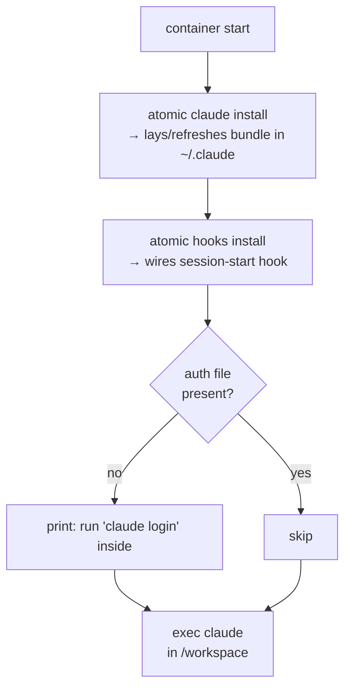

# Docker eval environment


## Goal


Dual-purpose containerized Claude Code + atomic eval setup:

1. **Contributor mode** — `Dockerfile` + `docker-compose.yml` committed at repo root. Anyone cloning this repo can `docker compose up` and exercise their WIP atomic build + bundle in isolation, with no host-side Go or Node toolchain required.
2. **End-user mode** — `atomic docker init` subcommand writes the same setup (template variant) into any project, letting users evaluate atomic-claude on their own codebase without polluting their host environment.


Both modes share the volume convention: everything host-persistent lives under `./tmp/`, owned and curated by the user.


## Non-goals


- Production deployment of Claude Code or atomic.
- Automated authentication. Interactive `claude login` on first run, persisted via the bind-mounted `~/.claude` dir.
- Auto-scanning project signals when `/workspace/.git` exists. The user explicitly evaluates `/initialize-signals` themselves — that's part of the eval.
- A `docker compose exec` shortcut for end users. Contributor-only convenience (Makefile target).
- Multi-arch CI publishing of the eval image. Local-build only; targets host arch.
- Pre-populating `tmp/` with a sample project. User drops whatever they want.


## Success criteria


### Contributor mode

- [ ] `docker compose build` succeeds on darwin/arm64 and linux/amd64 from a fresh clone.
- [ ] `docker compose run --rm atomic-eval atomic --version` reports the version built from local `atomic/` source (not a release tag).
- [ ] Editing a bundle artifact (e.g. `commands/commit-only.md`), running `docker compose build`, then `docker compose run --rm atomic-eval` surfaces the edit inside `~/.claude/commands/commit-only.md` (or as `.atomic-proposed` if it would overwrite a user-modified file).
- [ ] `make docker-shell` (new Makefile target) opens a bash shell in a running container next to the Claude TUI.

### End-user mode

- [ ] In an unrelated project, `atomic docker init` writes `Dockerfile`, `docker-compose.yml`, `.dockerignore`, and `docker-entrypoint.sh` into the target dir (default `./atomic-docker/`) and a `tmp/` scaffold inside it. Refuses to overwrite without `--force`.
- [ ] The emitted Dockerfile installs `atomic` via `install.sh` pinned to `ATOMIC_VERSION={{.AtomicVersion}}` (the version that emitted the template), so `docker compose run --rm atomic-eval atomic --version` matches the host's `atomic --version`.
- [ ] `atomic docker init --help` documents the layout (`tmp/workspace/`, `tmp/claude-home/`), the auth flow, and how to drop a project in.
- [ ] `atomic docker init --target some/path` writes to a custom dir.

### Shared

- [ ] After `claude login` completes once, subsequent runs do not re-prompt (persisted to `./tmp/claude-home/`).
- [ ] Files created inside `/workspace` show up on the host at `./tmp/workspace/` and survive container removal.
- [ ] On Linux, the container user's UID matches the host user via `--build-arg HOST_UID=$(id -u)` so bind-mounted files aren't root-owned.


## Architecture


### Two Dockerfiles, by design

| File | Mode | Atomic source | Why |
|------|------|---------------|-----|
| `Dockerfile` (repo root) | Contributor | Local `go build` in builder stage | Contributors test their WIP, including unreleased changes to the embedded bundle. |
| `atomic/internal/dockerinit/templates/Dockerfile.tmpl` | End-user | `install.sh` pinned to `{{.AtomicVersion}}` | End users get the same atomic they have on host; no Go toolchain needed in their image. |

Both share the same **runtime base** (`node:22-bookworm-slim`), the same **entrypoint script**, the same **volume layout**, and the same `docker-compose.yml` shape. Only the build stage diverges.


### Volume layout (both modes)


```
./tmp/                          (host, gitignored)
├── workspace/                  → /workspace            (eval area; user drops project here)
└── claude-home/                → /home/atomic/.claude  (config, memory, auth — persists login)
```


No named Docker volumes. Bind mounts only, all under `./tmp/`, so the user can inspect, back up, blow away, or migrate state with normal filesystem tools. Trade-off: UID handling on Linux (mitigated by `HOST_UID` build arg).


### Entrypoint (shared, idempotent)





Caption: install + hooks run every start; both are SHA-/content-idempotent so the cost is a stat-walk. Auth is not auto-triggered — the entrypoint just notes whether it's needed.


### `atomic docker init` subcommand


New verb under `atomic`. Lives in `atomic/internal/dockerinit/`, mirrors the structure of `atomic/internal/claudeinstall/`:

- `dockerinit.go` — `Init(targetDir, force bool, version string) ([]FileAction, error)`
- `templates/` — `Dockerfile.tmpl`, `docker-compose.yml.tmpl`, `dockerignore.tmpl`, `entrypoint.sh.tmpl`, embedded via `//go:embed templates/*`.
- Template vars: `{{.AtomicVersion}}` (from `internal/version`), `{{.HostUID}}` (default 1000, overridable).
- Refuses to overwrite existing files without `--force`. Uses the same `FileAction`-style report as `claudeinstall` so output is consistent.

Templates are **kept in sync with the repo-root contributor files** by convention — when the contributor `docker-compose.yml` changes shape, the `.tmpl` updates in the same commit. Tests verify both render and that the compose shape matches byte-for-byte on the non-divergent parts (volume layout, entrypoint, service name).


## Checkpoints


### Phase 1 — Contributor mode (repo root)

| # | Checkpoint | Files/areas | Verifies |
|---|------------|-------------|----------|
| 1 | Write `docker-entrypoint.sh` (shared between modes) | `docker-entrypoint.sh` | Re-run is a no-op; missing `~/.claude` is populated; prints clear login hint when auth absent |
| 2 | Write multi-stage `Dockerfile` (contributor): `golang:1.23-bookworm` builder runs `go generate ./...` + `go build` from local source; `node:22-bookworm-slim` runtime installs `@anthropic-ai/claude-code` and ships the built binary | `Dockerfile`, `.dockerignore` | `docker build .` succeeds; `docker run --rm  atomic --version` matches `cd atomic && go run ./cmd/atomic --version` |
| 3 | Write `docker-compose.yml` with bind mounts `./tmp/workspace:/workspace` and `./tmp/claude-home:/home/atomic/.claude`, `HOST_UID` build arg, `tty: true`, `stdin_open: true`, default command `claude` | `docker-compose.yml`, `tmp/workspace/.gitkeep`, `tmp/claude-home/.gitkeep` | `docker compose run --rm atomic-eval` lands in Claude TUI in `/workspace`; files persist host-side |
| 4 | Add root-level `Makefile` with targets `docker-build`, `docker-up`, `docker-shell` (the contributor-only exec shortcut). Keeps `atomic/Makefile` purely Go-focused; the root Makefile is for repo-level operations | `Makefile` (new, at repo root) | `make docker-shell` from repo root opens bash in a running container; `make` with no target prints help |
| 5 | Update `.gitignore` to include `tmp/workspace/`, `tmp/claude-home/` (keep the `.gitkeep` files) | `.gitignore` | A test file dropped under `tmp/workspace/` does not show in `git status` |
| 6 | Update `README.md` with "Try in Docker" section: `docker compose run --rm atomic-eval`, login flow, where to drop project files, Linux UID note | `README.md` | Section under 30 lines; cross-links to `atomic docker init` for end-user variant |

### Phase 2 — End-user mode (`atomic docker init`)

| # | Checkpoint | Files/areas | Verifies |
|---|------------|-------------|----------|
| 7 | Create `atomic/internal/dockerinit/templates/` with `Dockerfile.tmpl`, `docker-compose.yml.tmpl`, `entrypoint.sh.tmpl`, `dockerignore.tmpl`. Dockerfile uses `install.sh` pinned to `{{.AtomicVersion}}` | `atomic/internal/dockerinit/templates/*.tmpl` | Templates render with sample vars; output is valid Docker syntax (`docker build --dry-run`-equivalent: `hadolint` if available, otherwise visual diff in test) |
| 8 | Implement `atomic/internal/dockerinit/dockerinit.go` with `Init(target string, force bool, version string) ([]FileAction, error)`; embed templates via `//go:embed` | `atomic/internal/dockerinit/dockerinit.go`, `atomic/internal/dockerinit/dockerinit_test.go` | Unit tests cover: fresh dir, existing-files-without-force (refuses), existing-files-with-force (overwrites), invalid target |
| 9 | Wire `atomic docker init` verb into `atomic/cmd/atomic/main.go` with flags `--target` (default `./atomic-docker`) and `--force` | `atomic/cmd/atomic/main.go` | `atomic docker init --help` prints usage; integration test runs `atomic docker init --target tmp/eval` in a temp dir and asserts emitted files compile under `docker build --check` if Docker present, else skipped |
| 10 | Add convergence test: rendered end-user `docker-compose.yml` shape matches contributor's on shared keys (services.atomic-eval.volumes, entrypoint, environment); test in `atomic/internal/dockerinit/convergence_test.go` reads repo-root `docker-compose.yml` and compares | `atomic/internal/dockerinit/convergence_test.go` | Drift between the two compose files fails CI |
| 11 | Update `CLAUDE.md` and `README.md` with `atomic docker init` reference | `CLAUDE.md`, `README.md` | Both modes documented in command tables |


## Risks


| Risk | Likelihood | Mitigation |
|------|-----------|-----------|
| Bind-mount UID mismatch on Linux (host uid ≠ container `atomic` uid) makes `tmp/` files root-owned | high | `HOST_UID` build arg defaulting to 1000; document `--build-arg HOST_UID=$(id -u)` in README and emit it from `atomic docker init` based on `os.Getuid()` |
| `claude login` inside a container can't reach a browser | med | Claude Code emits a copy-paste URL/code that works headlessly; verify in checkpoint 3 and document |
| Two Dockerfiles drift (contributor vs template) | med | Convergence test (checkpoint 10) compares the rendered compose against the repo-root one on shared keys; manual review for build-stage divergence is expected |
| `atomic docker init` writes the wrong version (e.g. dev builds with `version=unknown`) | med | Read `internal/version.Version`; if blank/`unknown`, refuse with a clear error pointing at `make build` or release install |
| `go generate` in contributor builder needs root artifact dirs outside `atomic/` | med | Builder stage uses `COPY . /src/` filtered by `.dockerignore`; verify in checkpoint 2 that embedded bundle reflects current root state |
| `atomic hooks install` may need `~/.claude/settings.json` to exist | low | Read `atomic/internal/hooks/hooks.go` before checkpoint 1 to confirm; entrypoint touches the file if hooks.install doesn't create it |
| Persistent `tmp/claude-home/` masks updates across rebuilds | low | This is **correct** per `claudeinstall` design (CLAUDE.md merge guard). Document: `rm -rf tmp/claude-home` to reset; `.atomic-proposed` files surface diffs |
| End-user runs `atomic docker init` inside this repo and shadows the contributor files | low | Default target `./atomic-docker/` (sibling, not repo root); init refuses if it detects a repo-root `Dockerfile` already present unless `--force` |


## Open questions


None at this revision. (Per user: no auto-signals-scan; `docker compose exec` is contributor-only.)


## Implementation log


### shipped — 2026-05-17


Built across 4 iterations (+ 2 surgical follow-ups) of `/subagent-implementation` on branch `docker-eval-environment`. Commits (chronological):


- `16082b0` — CP1-3,5: contributor Dockerfile + compose + entrypoint + tmp scaffold + .gitignore (iter 1 + 1b combined)
- `972badd` — CP4,6: root Makefile (docker-build/up/shell + auto-help) + README "Evaluations" rewrite (iter 2 + 2b combined)
- `a41756a` — CP7-9: `atomic docker init` subcommand — templates, dockerinit package + 6 tests, runDocker verb wiring
- `1430fb8` — CP10-11: TestComposeConvergence + CLAUDE.md + README "End users" subsection


**Out-of-scope work performed during this build:**

- Iter 1 added git-derived version injection in the contributor Dockerfile builder (`git describe --tags --always --dirty` + commit SHA via ldflags). Not in the brief but reasonable; reviewer flagged as unrequested scope; retained because the spec's success criterion required a non-`unknown` version inside the container.


**Unforeseens — surprises that emerged during implementation:**

- Iter 1: `.gitignore` change initially replaced the blanket `tmp/` rule with two scoped rules, breaking the CLAUDE.md "Throwaway (gitignored): `tmp/`" convention. Fixed in iter 1b with the descend-and-keep-gitkeep pattern (`tmp/*` + `!tmp/<dir>/` + `tmp/<dir>/*` + `!tmp/<dir>/.gitkeep`).
- Iter 2: README initially documented `/root/.claude` as the container mount target, but the compose mounts to `/home/atomic/.claude` (non-root user). Caught by iter 2 reviewer; fixed in iter 2b.
- Iter 2: README reset command `rm -rf tmp/claude-home && touch tmp/claude-home/.gitkeep` had an ordering bug — removing the parent dir before touching the placeholder inside it. Rewritten to empty contents instead of removing the dir.
- Iter 2: Makefile initially didn't export `HOST_UID`, so `make docker-build HOST_UID=1234` set a make-only variable that `docker compose` never saw. Fixed with `export HOST_UID ?= 1000` at the top of the Makefile.
- README already had a stale "Evaluations" section referencing a `Dockerfile.atomic-eval` inline recipe from a prior design iteration — CP6 became a *rewrite* rather than an add.


**Deferred items:** none. All 6 follow-ups reviewed with user at finalization and dropped — F-1 (creds path) and F-2 (API key env) are intentional design choices reflecting the spec's interactive-auth stance; F-3, F-4, F-5 are cosmetic; F-6 is a CI-level concern, not a code defect.

**Squashed onto `main` as `2a0dd89` — 2026-05-17.** Per-iteration SHAs above are historical (unreachable post-squash).
