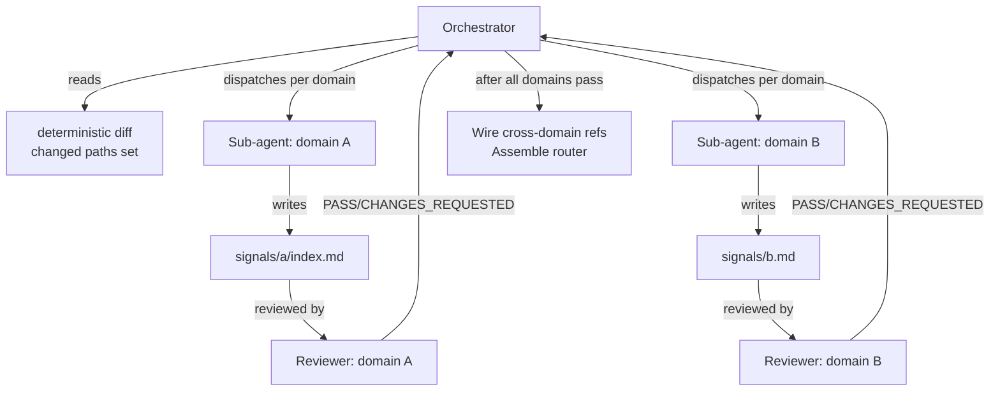

# Signals router


## Goal

Replace the flat eager-loaded `inferred-signals.md` with a router-shaped `signals.md` that auto-loads a complete project orientation (framework, build commands, language breakdown, devops, domain index), leaving per-domain detail files on disk for the LLM to `Read` on demand. Eliminates token overflow on large repos while preserving the "Claude already knows where things live" property.


## Non-goals

- Per-subtree `max_depth` override (deferred to v2).
- Backward compatibility with flat-file consumers. This is a **breaking change**.
- LFS / vendor binary handling beyond standard `.gitignore` elision.


## Success criteria

- [ ] `signals.md` is written to `.claude/project/signals.md`; it is `@-ref`'d from the user's project `CLAUDE.md`; it loads in every session.
- [ ] `signals.md` is always the output shape. No flat vs router mode split — one code path.
- [ ] `signals.md` is a complete orientation document: framework/runtime, build/test/lint commands, language breakdown, devops/CI summary, domain route table, cross-cutting conventions.
- [ ] Domain files (`signals/<domain>.md` or `signals/<domain>/index.md`) are written to `.claude/project/signals/` as vertical slices — one per functional concern, grouping artifacts + CLI code + docs + coupling. They are NOT `@-ref`'d; they are NOT eagerly loaded.
- [ ] `deterministic-signals.md` remains on disk at `.claude/project/deterministic-signals.md`; it is NOT `@-ref`'d; it is NOT auto-loaded.
- [ ] Deterministic tree entries include per-path metadata from a single file read: content SHA (hex, 7-char truncated), line count, character count, byte size.
- [ ] Bounded tree: entries at `≤ max_depth` are fully enumerated; entries at `max_depth + 1` show folder name + `(N files, M dirs)` only; entries `> max_depth + 1` are elided (appear only as a count in the parent summary).
- [ ] `max_depth` defaults to `3`; `output.signals.max_depth` in `~/.claude/.atomic/config.toml` overrides it.
- [ ] Change detection uses content SHA diff between prev and current `deterministic-signals.md`. No git commit SHA. No mtime fallback — content SHA works with or without git.
- [ ] Deterministic scan keeps prev version as `.deterministic-signals.prev.md`. Diff between prev and current surfaces changed paths (entries with different content SHAs).
- [ ] Inference pass uses sub-agents per domain. Orchestrator dispatches one sub-agent per domain that needs writing/updating; each reads source files in its area and writes its domain file. Reviewer validates each domain file against source code. Same implement→review pattern as `/subagent-implementation`.
- [ ] Cross-domain references (e.g. "auth talks to billing via webhooks") are wired by the orchestrator after all domain files land.
- [ ] Domain partitioning is by functional concern (vertical slices). Structural signals inform the LLM; the LLM judges boundaries. Things that break together belong together.
- [ ] No micro-domain consolidation threshold. Size is a secondary trigger, not the primary axis. A 3-file concern still gets a domain file.
- [ ] Inferrer reads existing `signals/*.md` and `signals/*/index.md` as anchor on rescan; keeps filenames when underlying paths still match (naming continuity).
- [ ] First migration from flat `inferred-signals.md`: backs up to `.claude/project/inferred-signals.md.bak`, writes `signals.md` + domain files (if needed), prints "Migrated to router shape. Review with `git diff`." Documented exception to axiom 3 (inferrer is non-interactive inside skill dispatch — no TTY for confirm prompt; backup + `git diff` is the mitigation).
- [ ] `.signalsignore` at repo root: files matching its globs are scanned (appear in tree with metadata) but flagged as generated — inferrer skips them for domain file content. Not full omission. `/atomic-setup` generates a blank `.signalsignore` with commented explanation on repo bootstrap.
- [ ] `doctor signals` check validates: router present + `@-ref`'d; all domain files referenced in router table exist on disk; no orphan domain files under `signals/`; worktrees not cross-compared (check runs per-cwd only).
- [ ] `CLAUDE.md` (bundled global) `@-ref` switches from `inferred-signals.md` to `signals.md`; old ref removed.
- [ ] `atomic-signals-inferrer` agent prompt rewritten for orchestrator role: dispatches sub-agents per domain, runs reviewer per domain file, wires cross-domain refs.
- [ ] `atomic-signals` skill updated to write/update `signals.md` instead of `inferred-signals.md`.
- [ ] `signals-workflow.md` spec gains a change-log entry noting the breaking change and pointing to this spec.


## Approaches

| Option | Pros | Cons |
|--------|------|------|
| **A. Status quo** | Zero work | Breaks on large repos; eager-load wastes tokens on irrelevant domains |
| **B. Bound tree depth, keep eager load** | Small change | Doesn't solve eager-load of irrelevant domains; no fine-grained change detection |
| **C. Router + per-domain files + content-SHA change tracking** | Scales to monorepos; progressive disclosure; bounded auto-load; single code path | More moving parts; breaking change; domain partitioning is heuristic |


## Recommendation

Option C. Evidence from `docs/design/signals-router.md`:

- Flat files today: ~31KB / ~7-8k tokens on this repo. A 50k-file monorepo would exceed context limits.
- Router carries full orientation (~2k tokens frontloaded) + domain route table (~30 tokens/row). Practical ceiling ~7k tokens on extreme repos, ~2-3k on normal ones.
- Content SHA from file reads already happening for LOC counting — no extra I/O.
- Progressive discovery via existing `Read`/`Grep`/`Glob` primitives — no new tool surface.


## Architecture

Deterministic scan feeds content-SHA-based diffs to a multi-agent inference pipeline that produces the router and domain files.

```mermaid
flowchart TD
    A[atomic signals scan] -->|writes| B[deterministic-signals.md\nper-path: SHA + lines + chars + bytes]
    B -->|diff vs .prev| C[changed paths set]
    C -->|input to| D[inferrer orchestrator]
    D -->|dispatches| E[sub-agent: auth domain]
    D -->|dispatches| F[sub-agent: billing domain]
    D -->|dispatches| G[sub-agent: cli domain]
    E -->|writes| H[signals/auth/index.md]
    F -->|writes| I[signals/billing.md]
    G -->|writes| J[signals/cli/index.md]
    D -->|assembles| K[signals.md\nrouter + orientation]
    K -->|@-ref'd from| L[CLAUDE.md]
    H -.->|Read on demand| M[(source tree)]
    I -.->|Read on demand| M
    J -.->|Read on demand| M
```

Only `signals.md` is auto-loaded. Domain files and the deterministic substrate are on disk; the LLM reads them on demand using standard file tools.


## File layout

```
.claude/project/
├── signals.md                    # router + orientation, @-ref'd from CLAUDE.md
├── signals/                      # domain files, NOT @-ref'd (created only when router would exceed budget)
│   ├── auth/                     # large domain: sub-routed
│   │   ├── index.md              # entry-point; router points here
│   │   ├── middleware.md
│   │   └── tokens.md
│   ├── billing.md                # small domain: single file
│   └── cli/                      # large domain: sub-routed
│       ├── index.md              # entry-point
│       ├── commands.md
│       └── doctor.md
├── deterministic-signals.md      # tree + per-path metadata, NOT @-ref'd
└── deterministic-signals.prev.md # prev scan for diffing
```

`@-ref` status:

| File | Auto-loaded | Notes |
|------|-------------|-------|
| `signals.md` | YES — via `@-ref` in project `CLAUDE.md` | Router + full orientation |
| `signals/<domain>.md` or `signals/<domain>/index.md` | NO | Read on demand |
| `deterministic-signals.md` | NO | Substrate; consumed by inference pipeline |


## Router shape

The router is a complete orientation document, not a thin index. Two zones:

**Zone 1 — Frontloaded orientation (~2k tokens).** Fixed cost, does not scale with repo size.

| Section | Content |
|---------|---------|
| `# Project signals` | Header |
| `## Framework & runtime` | Stack, language versions, key dependencies (compressed, not exhaustive) |
| `## Build / test / lint` | Command table: purpose + command + source. CI gate notes. |
| `## Language breakdown` | Counts: language, LOC, file count, percentage |
| `## DevOps & CI` | Release pipeline, deploy mechanism, CI provider. 1-2 lines each. |

**Zone 2 — Domain route table.** Scales with domain count (~30 tokens/row).

| Section | Content |
|---------|---------|
| `## Domains` | Table: Domain / Repo paths / One-liner / Detail link |
| `## Cross-cutting` | Test layout, conventions pointer, deterministic-substrate path |

Domain table format:

```markdown
| Domain  | Repo paths                         | One-liner                     | Detail              |
|---------|------------------------------------|-------------------------------|---------------------|
| auth    | `src/auth/`, `src/middleware/auth.ts`  | JWT + session, 2FA optional   | `.claude/project/signals/auth/index.md` |
| billing | `src/billing/`, `prisma/schema.prisma` | Stripe-backed, webhook-driven | `.claude/project/signals/billing.md`  |
```

- The inferrer writes every path citation — the `Repo paths` and `Detail` columns — as a **repo-root-relative path in backticks** (e.g. `` `.claude/project/signals/auth/index.md` ``, not `signals/auth/index.md`). The code step `atomic signals linkify` (base = repo root) renders each one that resolves on disk into a file-relative markdown link, e.g. `[`.claude/project/signals/auth/index.md`](signals/auth/index.md)`. These are NOT `@-refs` — `@-refs` are eager and transitive; a `[text](path)` link requires explicit `Read`. Doctor extracts the link target from the linkified Detail cell.
- Detail column is empty when no domain files exist (small repo, everything in router).

**Budget model.** Domain files are created per functional concern (vertical slice), not when a token threshold is crossed. The ~1,000 lines / ~5k tokens threshold is a secondary signal — if a single-file router grows past it, that's a hint to look for concern boundaries, not a mechanical split trigger. After domain files exist, the router keeps all frontloaded orientation content even if it exceeds 5k tokens.

**Token estimation.** `~chars.replace(whitespace).length / 4` as approximation.


## Domain file shape

Required sections (vertical slice):

| Section | Content |
|---------|---------|
| `# <domain>` | Domain name |
| `## What it does` | 1-3 line fact description |
| `## Artifacts` | Bullet list: `path — role`. User-facing Claude Code files (commands, agents, skills, templates) for this concern. Omit if none. |
| `## CLI code` | Bullet list: `path — role`. Go packages that implement/manage/validate this concern. Omit if none. |
| `## Docs` | Bullet list: `path — role`. Specs, design docs, reference pages, guides. Omit if none. |
| `## Coupling` | Bullet list: what changes here force changes in other domains. Name the other domain explicitly. Include known bugs or stale cross-references. |
| `## Conventions worth knowing` | Domain-local convention facts |

Path citations are written repo-root-relative in backticks and rendered to file-relative markdown links by `atomic signals linkify` — never `@-refs` (a `[text](path)` link is not an `@-ref`). Fact-shaped, not steering-shaped.

**Sub-routing (large domains only):**

- Inferrer MAY split a domain into `signals/<domain>/index.md` + sibling files.
- `index.md` is the entry-point; router still points here.
- `index.md` routes to sibling files via plain markdown links. Same pattern as the top-level router, scoped to one domain.
- Sub-routing is recursive: same shape applies if a sub-domain grows large.


## Bounded tree

`max_depth` config key: `output.signals.max_depth` (default `3`). Shell-settable per axiom-2 carve-out. No per-subtree override in v1.

| Level | Deterministic tree output |
|-------|--------------------------|
| `≤ max_depth` | Full file enumeration with per-file metadata (content SHA, line count, char count, byte size) |
| `max_depth + 1` | `<folder-name>/ (<N> files, <M> dirs)` — no contents, no per-file metadata |
| `> max_depth + 1` | Elided; contributes to parent's child count only |

Per-path metadata format: content SHA (7-char hex prefix of SHA-256 of file bytes), line count, character count, byte size. Computed from a single file read (same read used for LOC counting).


## Change detection

Content-SHA-based diff between consecutive deterministic scans. Works identically with or without git — no git-specific change detection, no mtime fallback.

1. `atomic signals scan` writes `deterministic-signals.md` with per-path content SHAs. Prev version saved as `.deterministic-signals.prev.md`.
2. `diff` between prev and current surfaces entries with changed SHAs = changed paths.
3. Inferrer orchestrator receives the changed-paths set. Identifies which domain files reference those paths. Dispatches sub-agents only for affected domains.
4. Unaffected domains are left untouched.

**`.signalsignore` handling:**

- Paths matching `.signalsignore` globs are scanned (appear in tree with full metadata) but flagged with a `[generated]` marker.
- Inferrer sub-agents skip `[generated]` entries when writing domain file content — generated files don't drive domain narratives.
- Changed content SHAs on generated files do not trigger domain file refresh.
- `.signalsignore` at repo root, one glob per line. Falls back to empty (no exclusions) if file absent.
- `/atomic-setup` generates a blank `.signalsignore` with commented explanation on repo bootstrap.


## Domain partitioning

**Primary axis: vertical slices by functional concern.** Each domain groups all related artifacts, CLI code, docs, and tests for one cohesive workflow or feature — not by file type or directory structure.

The partitioning question is: "if someone is working on X, what do they need to know?" Everything coupled to X belongs in one domain file, regardless of which directory it lives in.

Heuristic: identify commands, skills, or agents that form a cohesive unit. Find the Go packages that serve them and the docs that describe them. Things that break together belong together.

Structural signals (top-level dirs, manifest workspaces, co-located tests) inform the grouping but do not dictate it. The LLM judges domain boundaries. No mechanical rules override this judgment.

**Size is a secondary trigger.** A domain with 3 files still gets its own domain file if it's a distinct functional concern. A domain file is never created just because a flat file got long — it's created because a concern exists.

Each domain file has sections for Artifacts, CLI code, Docs, and Coupling — the vertical slice. The Coupling section is the primary value: it names what changes in this domain force changes elsewhere.

Inferrer documents the partitioning basis in the router's `## Cross-domain coupling` section.


## Inference pipeline

The inference pass is a multi-agent orchestration, not a single-agent rewrite.



**Pipeline steps:**

1. Orchestrator reads `deterministic-signals.md` (current) and the diff against prev. Identifies domains needing creation or update.
2. Dispatches one sub-agent per affected domain. Each sub-agent reads the actual source files in its area and writes (or updates) the domain file. Sub-agent scope is bounded to its domain.
3. Reviewer validates each domain file against the source code. Same implement→review loop as `/subagent-implementation`: iterate until PASS.
4. After all domain files pass review, orchestrator wires cross-domain references (`## What it talks to` sections) using the full picture across domains.
5. Orchestrator assembles `signals.md` — frontloaded orientation + domain route table.

On first scan (no prior `signals.md` or domain files): full pipeline runs for all inferred domains. On incremental scan: only affected domains dispatch sub-agents.


## Migration

On first run when `inferred-signals.md` exists and `signals.md` does not:

1. Backs up `inferred-signals.md` to `inferred-signals.md.bak` (same directory).
2. Runs full inference pipeline: writes `signals.md` + domain files (if content exceeds budget).
3. Removes `inferred-signals.md`.
4. Prints: `Migrated to router shape. Review with \`git diff\`.`
5. Updates project `CLAUDE.md` `@-ref` from `inferred-signals.md` to `signals.md`.

No per-item confirm prompt. The design doc (step 8) recommended interactive partition confirm per axiom 4; dropped because the inferrer runs non-interactively inside the `atomic-signals` skill dispatch — no TTY for a confirm prompt. Mitigation: backup file preserves the old output; `git diff` is the review surface. This is a documented exception to axiom 3.


## Naming continuity

On rescan when domain files already exist:

1. Orchestrator reads existing `signals/*.md` and `signals/*/index.md` filenames.
2. For each existing domain file, checks whether the underlying repo paths in the router table still match.
3. If paths match: keep filename. If paths no longer match: rename (old file removed, new file written under updated name).
4. Router table updated to reflect any renames.

Prevents `signals/auth.md` → `signals/identity.md` churn on reruns where code is unchanged.


## Affected artifacts

| Contract change | Artifact | Notes |
|----------------|----------|-------|
| Bounded tree + per-path metadata (content SHA, lines, chars, bytes) | `atomic/internal/signals/` | CLI scan package; writes `deterministic-signals.md` with per-path metadata from single file read |
| `max_depth` config key read | `atomic/internal/config/` | New key `output.signals.max_depth`; rendered in `config.resolved.md` |
| Multi-agent inference pipeline: orchestrator + per-domain sub-agents + reviewers | `agents/atomic-signals-inferrer.md` | Agent prompt rewritten for orchestrator role |
| `.signalsignore` read + `[generated]` flagging | `atomic/internal/signals/` | Read exclusion list; flag matching paths in tree output |
| `@-ref` wiring target switch | `skills/atomic-signals/SKILL.md` | Writes `@signals.md` not `@inferred-signals.md` |
| `@-ref` in bundled global | `CLAUDE.md` (root, bundled) | Replace `@.claude/project/inferred-signals.md` with `@.claude/project/signals.md` |
| `@-ref` in project-local config | `claude.local.md` (repo root, gitignored, not bundled) | Replace `@.claude/project/inferred-signals.md` with `@.claude/project/signals.md` |
| Doctor signals check | `atomic/internal/doctor/checks_signals.go` | Validate router + domain file integrity |
| Blank `.signalsignore` generation | `/atomic-setup` command | Generate commented blank file on repo bootstrap |
| Spec breaking-change note | `docs/spec/signals-workflow.md` | Append change-log entry pointing to this spec |


## Checkpoints

| # | Checkpoint | Files/areas | Verifies |
|---|------------|-------------|---------|
| 1 | Bounded tree + per-path metadata (content SHA, line count, char count, byte size) in deterministic scan | `atomic/internal/signals/tree.go`, `signals.go`, `signals_test.go` (atomic-builder) | `go test ./internal/signals/...` passes; tree output at depth 3 shows full enum with all 4 metadata fields; depth 4 shows summary; depth 5 elided; content SHA is 7-char hex of SHA-256; metadata derived from single file read |
| 2 | `.signalsignore` read + `[generated]` flagging in scan output | `atomic/internal/signals/signals.go`, `signals_test.go` (atomic-surgeon) | Matching paths appear in tree with `[generated]` marker; content SHA still computed; `.signalsignore` absent = no exclusions; `go test ./internal/signals/...` passes |
| 3 | `output.signals.max_depth` config key | `atomic/internal/config/config.go`, `config_test.go`, `render.go`, `render_test.go` (atomic-surgeon) | Config loads default `3`; explicit value overrides; rendered in `config.resolved.md`; `go test ./internal/config/...` passes |
| 4 | Content-SHA diff: prev vs current deterministic scan, changed-paths extraction | `atomic/internal/signals/signals.go`, `signals_test.go` (atomic-surgeon) | Prev saved as `.prev.md`; diff output lists entries with changed SHAs; `[generated]` paths excluded from changed set; works without git; `go test ./internal/signals/...` passes |
| 5 | Inferrer agent prompt: orchestrator role, sub-agent dispatch, reviewer loop, cross-domain refs, router assembly, migration, naming continuity | `agents/atomic-signals-inferrer.md` (atomic-surgeon) | Prompt describes: sub-agent dispatch per domain, reviewer validation loop, cross-domain ref wiring, router orientation sections (framework, build, language, devops, domain table), domain file sections, naming-continuity rule, migration instructions, `.signalsignore`/`[generated]` skip rule; `grep -c` confirms key phrases |
| 6 | `atomic-signals` skill + bundled `CLAUDE.md` + `claude.local.md` `@-ref` switch | `skills/atomic-signals/SKILL.md`, `CLAUDE.md` (root), `claude.local.md` (atomic-surgeon) | Skill references `signals.md` not `inferred-signals.md`; `CLAUDE.md` and `claude.local.md` `@-ref`s updated; bundle regen (`make -C atomic bundle`) exits 0 |
| 7 | `/atomic-setup` blank `.signalsignore` generation | `commands/atomic-setup.md` (atomic-surgeon) | Command generates `.signalsignore` with commented explanation when absent; does not overwrite existing |
| 8 | Doctor `signals` check update | `atomic/internal/doctor/checks_signals.go`, `checks_signals_test.go` (atomic-surgeon) | Validates: router present + `@-ref`'d; domain files in router table exist on disk; no orphan files in `signals/`; check runs per-cwd only (no worktree cross-compare); `go test ./internal/doctor/...` passes |
| 9 | Spec cross-references + signals-workflow change-log | `docs/spec/signals-workflow.md`, `docs/spec/signals-router.md` (atomic-surgeon) | `signals-workflow.md` change-log entry appended noting breaking change + pointer to this spec; no body sections deleted; `atomic validate spec` exits 0 on both files |


## Risks

| Risk | Likelihood | Mitigation |
|------|-----------|------------|
| Migration axiom-3 tension: auto-migrate removes `inferred-signals.md` without per-item confirm | medium | Documented exception to axiom 3. Inferrer backs up to `.bak` before removal; `git diff` is the review surface; inferrer prints review hint. Inferrer is non-interactive inside skill dispatch (no TTY). |
| Worktree cross-compare in doctor | low | Doctor `signals` check anchored to cwd via `repoctx.Toplevel()`. Each `.worktrees/<branch>/` carries independent `.claude/project/`. Check must not traverse sibling worktrees. |
| Generated-file churn thrashing domain files | medium | `.signalsignore` flags matching paths as `[generated]`; inferrer skips them for domain content; changed SHAs on generated files do not trigger domain refresh. |
| Sub-agent quality on unfamiliar codebases | medium | Each sub-agent reads actual source files in its domain (not just the tree). Reviewer validates against source code. Iterate until PASS. Low-quality output is caught by the review loop. |
| Naming continuity failure on large structural refactors | low | When paths no longer match, orchestrator writes new filename and removes old. Removes old file only after new file is fully written. |
| Scan performance on very large repos (50k+ files) | medium | Deterministic scan reads every file once (for content SHA + LOC). This is the cost of accurate metadata. No incremental scan in v1 — content SHA diff handles incremental inference. |


## Change log

### 2026-06-06 — Path citations are linkified to relative markdown links

**What changed:** The inferrer now writes every path citation (router `Repo paths` + `Detail` columns, and each domain file's path bullets) as a **repo-root-relative path in backticks** (e.g. `` `.claude/project/signals/auth/index.md` ``). After all signals files are written, the agent runs `atomic signals linkify` (base = repo root) as its final default-mode action; the code step renders each backtick path that resolves on disk into a file-relative markdown link (`[`.claude/project/signals/auth/index.md`](signals/auth/index.md)`). Idempotent; fenced code blocks untouched. Doctor's router parser extracts the link target from the linkified Detail cell. Full contract: `docs/spec/signals-wiki-linkify.md`.

**Why:** Plain backtick paths are inert text in Obsidian, a markdown server, or GitHub — not clickable. Linkifying makes signals navigable as a graph. Relative-prefix computation is a deterministic transform, so it is code's job, not the model's; the model keeps writing the same facts (paths), only their rendering changes. A `[text](path)` link is not an `@-ref` — the no-`@-ref` rule is unchanged (relative links are inert until explicitly `Read`).

**Superseded:** Detail and path citations were described as "plain markdown paths, NOT @-refs" with the example `signals/auth/index.md`. The new contract is repo-root-relative backtick paths rendered to file-relative links by `atomic signals linkify`; still not `@-refs`.

**What changed:** Domain partitioning axis changed from size-based (~1k lines / ~5k tokens threshold) to functional-concern-based (vertical slices). Each domain file now groups artifacts + CLI code + docs + coupling for one feature, not one layer. Domain file schema gains `## Artifacts`, `## CLI code`, `## Docs`, `## Coupling` sections replacing the old `## Where it lives` / `## What it talks to`. The `## Coupling` section — naming what changes here force changes elsewhere — is the primary value of the split. Size remains a secondary trigger but no longer drives the partitioning decision.

**Why:** Dogfooding revealed the problem. Renaming `inferred-signals.md` → `signals.md` broke 26 cross-references across code, docs, specs, doctor checks, and @-refs. The size-based split produced horizontal layers (all artifacts / all Go code / all docs) that forced cross-referencing three files to understand one concern. The user had to manually specify vertical boundaries. Signals should answer "I'm working on X — what do I need to know?" which requires grouping by concern, not by file type.

**Superseded:** Domain files created only when router-only content exceeds ~1k lines / ~5k tokens. Domain file sections: `What it does`, `Where it lives`, `What it talks to`, `Conventions worth knowing`. Partitioning driven by structural signals (top-level dirs, workspaces) as the primary axis.

### 2026-05-23 — Pressure-test amendments

**What changed:**

16 decisions from pressure-test session amended the spec:

1. Router is always `signals.md` — dropped flat vs router two-mode split.
2. Router is a complete orientation document (framework, build commands, language breakdown, devops, domain table) — not a thin 10-line index.
3. Budget model changed: ~1,000 lines / ~5k tokens is a split trigger, not a ceiling. Router can grow with frontloaded content.
4. Domain files created only when router-only exceeds budget. No separate activation threshold.
5. Domain partitioning is LLM-inferred — dropped "structural > LLM cluster" precedence.
6. Large domains sub-route recursively via `signals/<domain>/index.md` (not `<domain>.md`).
7. Change detection uses content SHA (from file reads already happening for LOC) — dropped git commit SHA and mtime fallback.
8. Per-path metadata expanded: content SHA + line count + character count + byte size.
9. Deterministic-to-deterministic diff drives incremental refresh — dropped `git diff --name-only` step.
10. `.signalsignore` = scan but flag as `[generated]`, not full omission. Inferrer skips for domain content.
11. `.signalsignore` is user-created; `/atomic-setup` generates blank with comments.
12. Inference pass uses sub-agents per domain with reviewer validation — not single-agent rewrite.
13. Cross-domain references wired by orchestrator after all domain files pass.
14. Micro-domain consolidation threshold dropped — LLM judges.
15. Activation oscillation: no anti-thrash mechanism needed — LLM recognizes no change.
16. Added `/atomic-setup` blank `.signalsignore` to checkpoints and affected artifacts.

**Why:** Pressure-test session (`/pressure-test @docs/spec/signals-router.md`) surfaced contradictions in the original spec: router budget too small for orientation content, content SHA available for free from existing file reads making git SHA redundant, single-agent inference insufficient for quality on large repos.

**Superseded:** Original spec used ~2,048 token budget, git commit SHA for change detection, mtime fallback outside git, `git diff --name-only` for incremental refresh, LLM-judged ~500-line flat-vs-router activation, structural > LLM partitioning precedence, < 3 files micro-domain consolidation threshold, single-agent inferrer, `signals/<domain>/<domain>.md` entry-point naming.


## Implementation log

### v1 — 2026-05-23

Built across 9 checkpoints + 1 fix iteration + 1 polish pass of /subagent-implementation. Commits (chronological):

- `8bdb5c2` — CP-1: bounded tree depth + per-path metadata (SHA, lines, chars, bytes)
- `a729726` — CP-2: .signalsignore read + [generated] flagging
- `3f8f72b` — CP-3: output.signals.max_depth config key
- `a5eeaa2` — CP-4: content-SHA diff + changed-paths extraction (fix: repo-relative path parsing)
- `ee874ee` — CP-5: inferrer agent prompt rewrite (multi-agent orchestrator)
- `307b426` — CP-6: skill + CLAUDE.md + claude.local.md @-ref switch
- `886e315` — CP-7 + CP-8: atomic-setup .signalsignore + doctor router check
- `501df30` — CP-9: signals-workflow change-log entry + spec lint fix
- `6aa2ca8` — Polish: truth-in-codebase fixes (7 items)
- `47f22b9` — Deferred follow-ups (F-2, F-4)

**Out-of-scope work performed during this build:**
- Checkpoints table reformatted from 6-column to 4-column to pass `atomic validate spec` S5 rule (CP-9)
- `.claude/project/signals.md` created in worktree as copy of `inferred-signals.md` so `@-ref` resolves for validate tests

**Unforeseens — surprises that emerged during implementation:**
- CP-4 first pass extracted leaf filenames instead of repo-relative paths (ParseTreeSHAs) — caught by reviewer, fixed in follow-up iteration
- `atomic validate config` test failed after @-ref switch because `signals.md` didn't exist on disk yet — fixed by creating placeholder

**Deferred items still open:**
- `signals-router-f-2` — Double file reads across assembleBody (perf optimization)
- `signals-router-f-4` — ScanWithOptions mutates caller-passed opts pointer (latent risk)

**Squashed onto `main` as `f15c325` — 2026-05-23.** Per-iteration SHAs above are historical (unreachable post-squash).
