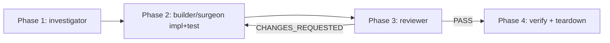

# /subagent-diagnose


## Goal


Multi-agent failure-investigation orchestrator. Parallel to `/subagent-implementation` — same scratchpad + investigator + builder/surgeon + reviewer + FOLLOWUPS pattern — but starts from a *failure*, not from a spec. Two input modes share one loop:


- `ci` — failed CI run is the brief seed.
- `bug` — freeform symptom paragraph is the brief seed.


Naming aligned with `/subagent-implementation` to signal the orchestrator pattern: scratchpad brief → fresh-context agent dispatch → review loop → Phase 3 finalize.


## Non-goals


- Replacing `/subagent-implementation`. That one starts from an approved spec; this one starts from a failure. Different entry, same machinery.
- Replacing the `atomic-debug` skill. Skill stays for fast in-context hypothesis loops; `/subagent-diagnose bug` is the orchestrated escalation when a bug spans sessions or needs investigator + builder + reviewer.
- Auto-firing on CI failure or error pastes. User-invoked slash command only (axiom 5).
- Replacing `/watch-ci`. The `ci`-mode Phase 0 log pull and Phase 4 re-watch reuse `atomic-haiku` directly; this command does not delegate to `/watch-ci`.
- A `--resume` flag for interrupted runs (YAGNI until a real second-hit forces the case).
- Multi-mode in one invocation. One invocation = one mode.


## Success criteria


- [ ] `/subagent-diagnose ci [<run-id>|<branch>|<pr#>|<workflow.yml>]` defaults to the latest failed run on the current branch when no arg given; refuses cleanly if no failed run exists.
- [ ] `/subagent-diagnose bug "<symptom>"` slugifies the brief and captures the four context fields (repro, expected vs actual, environment, what's been tried) via `AskUserQuestion` into `CONTEXT.md`.
- [ ] Both modes converge into the shared engine loop with no per-mode branching after Phase 0. Verifiable: Phase 1–3 code path is identical regardless of mode flag.
- [ ] Orchestrator classifies cohesion as `tight` or `loose` from the investigator's surface map, then dispatches `atomic-surgeon` (tight) or `atomic-builder` (loose). On surgeon-refusal (>2 files), falls back to builder.
- [ ] Loop bails at min(memory-override-cap, 5) iterations or on three consecutive normalized-same failures; `STATE.md` records the bail reason.
- [ ] On reviewer PASS, orchestrator commits fix + test, then `mv`s scratchpad into `.claude/.scratchpad/.archive/<topic>/`. Archive dir exists; original dir does not.
- [ ] `ci`-mode Phase 4 dispatches `atomic-haiku` with `run_in_background: true` and surfaces watcher completion as a notification.
- [ ] `bug`-mode Phase 4 runs the repro from `CONTEXT.md ## Repro` synchronously; on repro-still-fails, refuses to archive and prompts the user.
- [ ] On bail, scratchpad retained in place; user gets iteration summary + final reviewer verdict.


## Invocation


```
/subagent-diagnose <mode> [args]
```


| Mode | Args | Default behavior |
|------|------|------------------|
| `ci` | `[<run-id>\|<branch>\|<pr#>\|<workflow.yml>]` | Latest failed run on current branch |
| `bug` | `"<freeform symptom>"` | Required; refuses if empty |


First positional arg is the mode. Anything else is mode-specific. Refuse with usage line if mode is missing or not in `{ci, bug}`.


## Phase 0 — context capture (mode-specific)


### `ci` mode


| Step | Action |
|------|--------|
| 0.1 | Resolve argument to a failed run ID via provider CLI (e.g. `gh run list --status failure --limit 1` if no arg). Refuse if no failed run found. |
| 0.2 | Capture branch, head SHA, base SHA, workflow name, failed step name, failure timestamp into `BRIEF.md` source-pointer section. |
| 0.3 | Topic suffix: `diagnose-ci-<run-id>` (e.g. `2026-05-18-diagnose-ci-9821334512`). Per engine "Concurrent runs", refuse if dir exists. |
| 0.4 | Dispatch `atomic-haiku` (read-only) with brief: "fetch full logs for run `<id>`, step `<name>`. Write to `CONTEXT.md`, truncated at 64KB with `[truncated, full log at <provider-url>]` footer if exceeded. Extract failing assertion / panic / error line as `top_level_error:` trailing key." |
| 0.5 | Orchestrator reads `CONTEXT.md`, copies `top_level_error` into `STATE.md` as iteration-0 baseline. |


### `bug` mode


| Step | Action |
|------|--------|
| 0.1 | Slug derivation: kebab-case from first ~6 words of the brief. Topic suffix: `diagnose-bug-<slug>`. Refuse if dir exists. |
| 0.2 | Single `AskUserQuestion` block prompts for the four context fields missing from the freeform brief: **repro steps**, **expected vs actual behavior**, **environment fingerprint** (OS, runtime versions, branch, dirty/clean working tree), **what's been tried**. Skip any field the brief already answers. |
| 0.3 | Capture into `CONTEXT.md` under stable headings (`## Repro`, `## Expected vs actual`, `## Environment`, `## Already tried`). Plus a `top_level_error:` trailing key if the brief or one of the answers contains a paste-able error string; else `top_level_error: <none — behavioral bug>`. |
| 0.4 | Auto-capture: `git log --oneline -20 -- <suspected paths from brief>` appended as `## Recent commits` (if suspected paths inferable). Skip silently if no paths inferable. |
| 0.5 | Write `BRIEF.md` source-pointer section pointing at `CONTEXT.md`. No external source — the brief is canonical. |


## Scratchpad layout


| Path | Contents |
|------|----------|
| `.claude/.scratchpad/<topic>/BRIEF.md` | Pointer to source, current iteration scope, reviewer feedback rollup |
| `.claude/.scratchpad/<topic>/STATE.md` | Append-only iteration log (one entry per Phase 2→3 cycle) |
| `.claude/.scratchpad/<topic>/FOLLOWUPS.md` | Non-blocking findings carried across iterations; dispositioned at finalize |
| `.claude/.scratchpad/<topic>/CONTEXT.md` | Phase 0 capture (logs for `ci`, repro + symptom map for `bug`) |


`<topic>` format: `<YYYY-MM-DD>-<mode-suffix>`. Suffix derivation is per-mode (see § Phase 0).


## Phases 1–4 (mode-agnostic)





Phase 0 and the Phase 4 verification body are mode-specific (above and below). Phase 1–3 plus the Phase 4 teardown half are identical regardless of mode.


### Phase 1 — investigator pass


- Agent: `atomic-investigator` (haiku, read-only).
- Input: `BRIEF.md` + `CONTEXT.md`.
- Output: `file:line — what` table of the suspect surface, appended to `BRIEF.md` as `## Phase 1 — surface map`.
- **Cohesion classification is done by the orchestrator**, not the agent. After reading the investigator's table, the orchestrator classifies the work as `tight` (single logical change, ≤2 files would suffice) or `loose` (multi-file, multi-concern). No agent contract amendment required — the orchestrator uses the table to decide.


### Phase 2 — implementation


- Agent selection: orchestrator branches on its own cohesion classification.
    - `tight` → `atomic-surgeon`. (Surgeon self-refuses if the actual diff exceeds its 1–2 file cap; orchestrator falls back to builder on refusal.)
    - `loose` → `atomic-builder`.
- TDD discipline: failing test first, then implementation. Reports the atomic quality signal block per skill `atomic-tdd`.
- **Commit ownership: orchestrator commits**, not the agent. Builder and surgeon contracts explicitly forbid commits (see `agents/atomic-builder.md` and `agents/atomic-surgeon.md`). Matches `/subagent-implementation` Step D.


### Phase 3 — reviewer pass


- Agent: `atomic-reviewer`.
- Emits `## Spec compliance` + `## Code quality` + the signals block + exactly one of `VERDICT: PASS` / `VERDICT: CHANGES_REQUESTED`.
- On `CHANGES_REQUESTED`: orchestrator updates `BRIEF.md` reviewer-feedback section, increments iteration counter in `STATE.md`, loops to Phase 2.
- On `PASS`: proceed to Phase 4.


### Phase 4 — teardown (mode-agnostic half)


- Verification body is per-mode (see below).
- On verified success: archive scratchpad to `.claude/.scratchpad/.archive/<topic>/` (gitignored). Do **not** delete.
- On bail-out (hard stop hit, same-failure early-bail, user abort): retain scratchpad in place. Do not archive.
- FOLLOWUPS disposition: present `FOLLOWUPS.md` ledger to user per-item; user picks per row from `close` / `defer` (promote to `.claude/project/followups.md`) / `convert-to-spec`. Same flow as `/subagent-implementation` Phase 3.


## Brief verbosity discipline


The orchestrator writes `BRIEF.md` **exhaustively** before every subagent dispatch. Every fact the next agent needs lives in the brief — log excerpts, file:line refs, base SHA, what's been tried, suspected hypotheses, reviewer feedback from prior iterations.


Rationale: each dispatch is a fresh context. Tokens spent on a verbose brief are tokens saved on re-discovery. A short brief that forces the agent to re-grep is a false economy.


## Iteration cap + bail-out


- **Default hard stop:** N = 5 iterations of Phase 2→3.
- **User override (axiom 2 — memory over config):** orchestrator reads user memory key `diagnose iteration cap` at Phase 1. Falls back to 5 if absent. User says "remember diagnose cap is 3" → orchestrator saves a `feedback`-type memory; future runs honor it.
- **Same-failure early bail:** if three consecutive iterations report the same *normalized* top-level error, bail before N. The loop is stuck on one symptom.
- **Bail behavior:** retain scratchpad in place (not archived), print summary of iterations tried + the final reviewer verdict, recommend user-driven next steps. Do **not** auto-open a PR comment or post anywhere.


### Same-failure normalization


Before comparing top-level error strings across iterations, apply in order:


1. Strip `:\d+(:\d+)?` line/column suffixes.
2. Replace absolute paths with basename (`/a/b/foo.go` → `foo.go`).
3. Strip ISO timestamps and `\d{2}:\d{2}:\d{2}` clock times.
4. Strip hex addresses (`0x[0-9a-fA-F]+`).
5. Strip test-runner durations (`\d+(\.\d+)?(ms|s|µs|ns)\b`).
6. Collapse runs of whitespace to single space; trim.


Two normalized strings equal → "same failure". Hash for compactness; store hash + first 200 chars of raw error in `STATE.md`.


## FOLLOWUPS handling


- During Phase 3, reviewer findings tagged non-blocking (severity 🔵 / 🟡 without blocker disposition) are appended to `FOLLOWUPS.md` by the orchestrator.
- Carried across iterations. Reviewer may re-affirm or close prior entries.
- At Phase 4, present per-item to user. Dispositions: `close` / `defer` (promote to `.claude/project/followups.md` with `Origin:` line) / `convert-to-spec` (open `/atomic-plan` with the entry as the brief).


## Concurrent runs


Topic dir includes the mode + a per-mode unique suffix (run-id for `ci`, slug for `bug`). If the topic dir already exists when the orchestrator goes to create it:


- Refuse. Print: `scratchpad <path> already exists; rm -rf it or pick a different topic suffix.`
- Per axiom 3, no silent overwrite. `--resume` flag is YAGNI until a real second-hit forces the case.


## Phase 4 verification (mode-specific)


After scratchpad teardown and FOLLOWUPS disposition, **before** archiving:


### `ci` mode


| Step | Action |
|------|--------|
| 4.1 | Push the fix commit if not yet pushed (orchestrator confirms with user per axiom 3 — push is visible to others). |
| 4.2 | Dispatch `atomic-haiku` in background (`run_in_background: true`) with brief: "watch CI for branch `<branch>` until terminal. Report run ID + conclusion when done." |
| 4.3 | Orchestrator returns control to user with: scratchpad archive path, fix commit SHA, background watcher ID. Notifies on watcher completion. |
| 4.4 | If watcher reports failure: do **not** auto-relaunch. Surface the new failure ID and let the user re-invoke. Prevents infinite loops on infrastructurally flaky tests. |


### `bug` mode


| Step | Action |
|------|--------|
| 4.1 | Foreground orchestrator runs the repro steps from `CONTEXT.md ## Repro` one final time against the committed fix. Shell-executable repros run via Bash. Manual repros (UI, third-party service) prompt the user to run and report. |
| 4.2 | If repro passes (bug no longer reproduces): proceed to archive scratchpad. |
| 4.3 | If repro still fails: do **not** archive. Print: "fix landed in commit `<sha>` but repro still fails. Scratchpad retained at `<path>`. Reviewer signed PASS based on the regression test; the test may not match the real repro." Ask user: continue iterating (Phase 2), accept and archive, or abort. |
| 4.4 | No background dispatch (unlike `ci` mode). Bug verification is synchronous. |


## Checkpoints


| # | Checkpoint | Files/areas | Verifies |
|---|------------|-------------|----------|
| 1 | Mode parsing + dispatch | `commands/subagent-diagnose.md` (new) | `ci` / `bug` route correctly; bad mode refuses with usage line |
| 2 | `ci`-mode Phase 0 — run-ID resolution + log capture via `atomic-haiku` | `commands/subagent-diagnose.md § ci Phase 0` | `CONTEXT.md` written with truncated logs + `top_level_error:` trailing key; refuses cleanly on no failure |
| 3 | `bug`-mode Phase 0 — slug + `AskUserQuestion` + auto `git log` | `commands/subagent-diagnose.md § bug Phase 0` | `CONTEXT.md` populated with four stable headings; auto `git log` capture when paths inferable |
| 4 | Phase 1–3 loop integration via engine link | `commands/subagent-diagnose.md` — link to engine | Orchestrator classifies cohesion from investigator surface map; surgeon-vs-builder dispatched; surgeon-refusal falls back to builder; loop honors memory-override cap + normalized-same-failure bail |
| 5 | `ci`-mode Phase 4 background re-watch | `commands/subagent-diagnose.md § ci Phase 4` | `atomic-haiku` runs `run_in_background: true`; command returns before terminal state; no auto-relaunch on failure |
| 6 | `bug`-mode Phase 4 synchronous repro re-run | `commands/subagent-diagnose.md § bug Phase 4` | Shell repro auto-runs; manual repro prompts user; repro-still-fails branch refuses archive |
| 7 | Scratchpad archive + bail-retention | engine-defined; verified by checkpoint 4 | `.claude/.scratchpad/.archive/<topic>/` exists on PASS; in-place retention on bail |
| 8 | Wiring: `CLAUDE.md`, `README.md`, `commands/subagent-diagnose.md` | per `claude.local.md` invisible-feature checklist | grep finds `/subagent-diagnose` in all three surfaces |


## Risks


| Risk | Likelihood | Mitigation |
|------|-----------|-----------|
| `ci` provider detection wrong → log fetch fails | medium | Reuse `/watch-ci` provider-detection logic; refuse with clear message if no provider matched in signals |
| `ci` Phase 4 watcher hangs (CI cancelled, infra down, run >10m) | medium | `atomic-haiku` has its own ~10-min cap; on cap-hit the watcher reports `terminal: unknown` and exits. Orchestrator does not block on it. |
| `bug` manual-repro prompt blocks long-running session | medium | Phase 4 is synchronous by design; user can abort. Document expected wait in command description. |
| `bug` regression test passes but repro still fails (false PASS) | medium | Phase 4.3 explicitly handles this case — do not archive, prompt user. The test was the wrong abstraction. |
| Auto-relaunch loop on flaky CI tests | medium | Hard rule in `ci` Phase 4.4: never auto-relaunch on watcher-reported failure |
| Skill / command boundary blurs vs `atomic-debug` (F-1 in followups) | low | Non-goals section enumerates the boundary; `atomic-debug` cross-link lands separately when F-1 resolves |
| Engine evolves under this consumer | low | Engine file has its own `## Change log`; this spec is invalidated only on a breaking engine change, which would warrant amending this spec's body too |
| Mode subcommand drift (third mode added later — `perf`? `flake`?) | low | Spec adds modes by appending a Phase 0 + Phase 4 pair, leaving Phase 1–3 untouched. If a future mode needs a different loop, fork the engine file per the engine's "When to fork instead of extend" rule. |


## Implementation log


### v1 — shipped 2026-05-18


Built across 3 iterations of `/subagent-implementation`. Commits (chronological, base `6814df8`):


- `2967ee6` — feat(commands): add /subagent-diagnose orchestrator command — initial command file covering CP 1–7 (mode parsing + per-mode Phase 0 + shared Phase 1–3 loop + per-mode Phase 4 + iteration cap + same-failure normalization + FOLLOWUPS triage + archive teardown).
- `a855f36` — feat(commands): wire /subagent-diagnose + iter-1 polish — CP 8 wiring (`CLAUDE.md` "Other commands" + `README.md` commands table) plus four 🟡 fixes from iter-1 reviewer (investigator-dispatch wording, surgeon-refusal semantics, ❓ in FOLLOWUPS harvest, `mkdir -p .archive/` before `mv`).
- `e4d1a81` — refactor(commands): polish /subagent-diagnose per FOLLOWUPS — four user-dispositioned fix-now items from Phase 3 FOLLOWUPS ledger (same-failure source, orchestrator-marks-closed, lazy concurrent-run guard, BRIEF.md overwrite semantics).


**Out-of-scope work performed during this build:**


- None. All iterations stayed within stated scope.


**Unforeseens — surprises that emerged during implementation:**


- Iter-1 reviewer flagged that `atomic-investigator` has no Write tool (verified against `agents/atomic-investigator.md` `tools: [Read, Grep, Glob, Bash]`), so the dispatch prompt originally written by the builder would have misled the agent. Fixed in iter 2 — orchestrator (not the agent) appends investigator output to `BRIEF.md`.
- Iter-1 reviewer flagged that `atomic-surgeon` refuses on stated scope (mechanical file count, `OUT OF SCOPE: needs N files. Split: ...` signal) before any edit, not by examining the actual diff after. Fixed in iter 2.
- Iter-1 reviewer flagged that the concurrent-run guard fires at mode-parse time but for `ci` mode the topic path isn't known until step 0.3. Fixed in iter 3 by moving the guard into each mode's path-construction step (lazy evaluation at mkdir time).


**Deferred items still open:**


- F-2 (🔵) — Phase 4 teardown step order diverges from spec (FOLLOWUPS-then-archive vs spec's archive-then-FOLLOWUPS). **Dropped** by user — pure ordering pedantry; both happen on PASS path, reflowing prose for spec-vs-command order isn't worth an iter.
- F-4 (🔵) — push/PR constraint lives in shared teardown rather than the dedicated Rules section. **Dropped** by user — constraint is stated correctly; placement is organizational pedantry only.


No open follow-ups remain in the durable project ledger from this build.


## Change log


<!-- Populated on first amendment after this spec is approved. Initial draft + v1 implementation log (2026-05-18) are not amendments. -->
