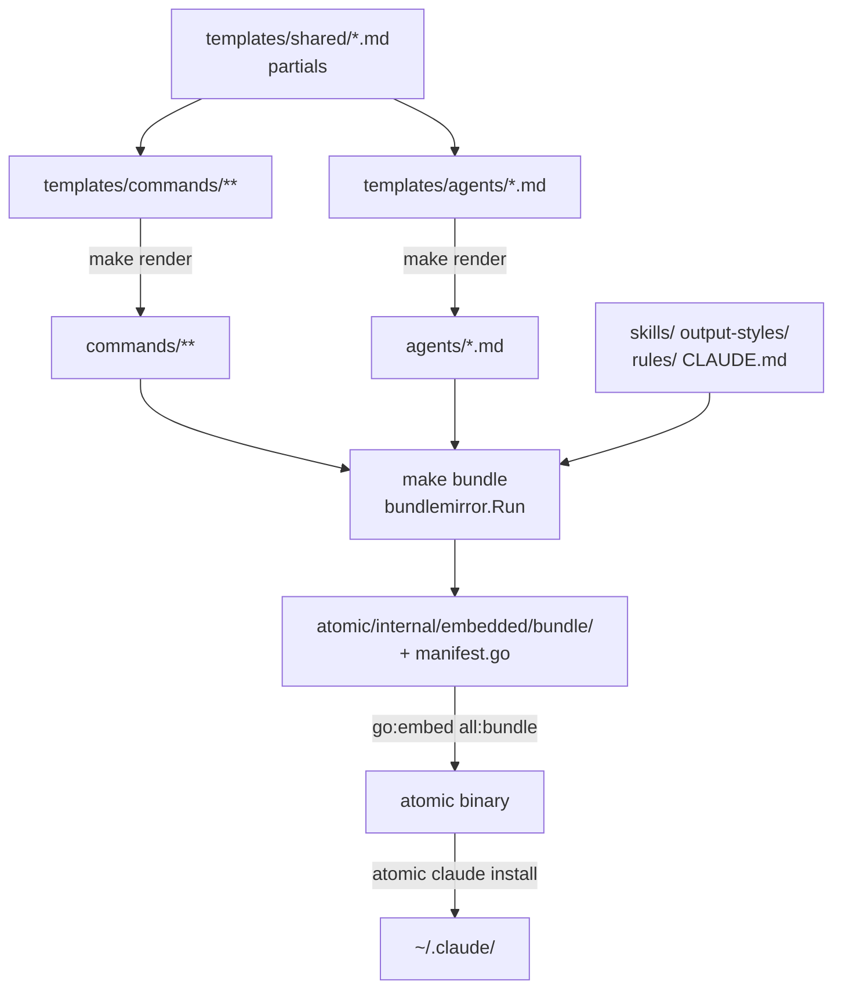
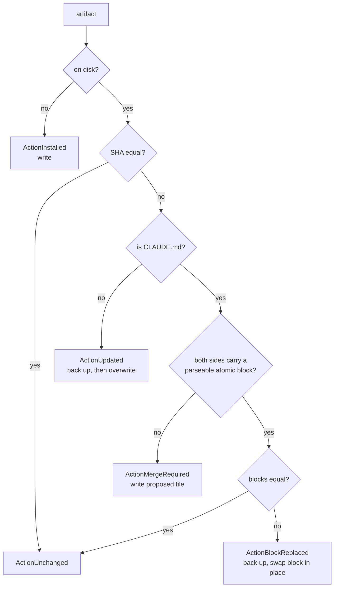

# bundle


## What it does


The markdown artifacts are the product, and a user gets them by running one binary. This domain is the path an artifact travels from a human-edited template to a file in the user's `~/.claude/`, and the reason that path is reproducible rather than a copy step someone has to remember.

Three stages run in a fixed order: `make render` expands templates into [`commands/`](../../commands) and [`agents/`](../../agents), `make bundle` mirrors every bundled artifact into [`atomic/internal/embedded/bundle/`](../../atomic/internal/embedded/bundle) and regenerates `manifest.go`, and `go:embed` compiles that tree into the binary. `atomic claude install` writes the embedded copies to disk.


## How it works


Each stage reads what the previous one wrote, so running them out of order embeds stale output into the binary.



[`commands/`](../../commands), [`agents/`](../../agents), and the embedded mirror are all committed. CI guards them with two drift gates in order: `make render` then `git diff --exit-code`, then `go generate ./...` then `git diff --exit-code`.

### What the bundle includes

Inclusion is decided by pure predicates in [`atomic/internal/bundlespec/bundlespec.go`](../../atomic/internal/bundlespec/bundlespec.go). A new file matching an existing rule is picked up with no Go change. A new artifact *kind* needs a new predicate plus a new walk in `bundlemirror`.

| Kind | Rule |
|------|------|
| agent | `agents/atomic-*.md` |
| skill | `skills/atomic-*/**`, whole subtree, and the directory must contain `SKILL.md` |
| output-style | `output-styles/atomic*.md`, no dash required after [`atomic`](../../atomic) |
| command | `commands/**/*.md`, any `.md`, no allowlist, recursive |
| rule | `rules/**/*.md` |
| claude-md | [`CLAUDE.md`](../../CLAUDE.md), exact name |

### Partial composition

Editing a partial reaches further than its own consumers, because partials nest:

```
commit-flow  ──> doc-impact, signals-gate
merge-flow   ──> base-resolution, signals-gate, worktree-cleanup-prompt,
                 merge-flow-preflight, merge-flow-steps
squash-flow  ──> base-resolution, doc-impact, signals-gate,
                 squash-flow-preflight, squash-flow-steps
agent-implementer-workflow ──> agent-search-tooling, agent-tdd-signals,
                               agent-code-intel, agent-where
```

| Agent template | Partials composed |
|----------------|-------------------|
| `atomic-implementer.md` | `agent-atomic-voice`, `agent-yagni`, `agent-implementer-workflow`, `agent-signals-output`, `agent-shared-rules`, `agent-comment-discipline` |
| `atomic-reviewer.md` | `agent-atomic-voice`, `agent-yagni`, `agent-code-intel`, `agent-where` |
| `atomic-investigator.md` | `agent-atomic-voice`, `agent-code-intel`, `agent-where`, `agent-search-tooling` |
| `atomic-wiki-inferrer.md` | `agent-atomic-voice`, `agent-code-intel`, `agent-where` |
| `atomic-wiki-writer.md` | `agent-atomic-voice`, `agent-code-intel` |
| `atomic-auditor.md` | `agent-atomic-voice`, `agent-code-intel` |
| `atomic-strategist.md` | `agent-atomic-voice`, `agent-yagni` |

| Command template | Partials composed |
|------------------|-------------------|
| `commit.md` | `commit-flow`, `push-flow`, `pr-flow`, `merge-flow`, `squash-flow`, `git-safety` |
| `autopilot.md`, `subagent-implementation.md` | `worktree-setup` |
| `report-issue.md`, `report-issue-with-atomic.md` | `report-issue-privacy` |

Every other command template is self-contained.

### Install verbs

| Verb | Flags |
|------|-------|
| `atomic claude install` | `--dry-run`, `--target`, `--no-hooks` |
| `atomic claude update` | `--dry-run`, `--target`, `--no-hooks` |
| `atomic claude diff` | `--target` |
| `atomic claude list` | none |
| `atomic claude uninstall` | `--target` |

`install` and `update` are the same code path (`installOrUpdate`). Both take a write-once pre-install snapshot, plan, apply, create `~/.atomic/profile.md` if absent, offer to prune stale artifacts, then record what was installed in `[install.artifacts]`.

### The per-artifact install decision

[`CLAUDE.md`](../../CLAUDE.md) is the one artifact never overwritten wholesale, because a user's own content lives in the same file.



Backups land in `~/.atomic/backups/<timestamp>/<target>`, one timestamp directory per run. The proposed file lands at `~/.atomic/proposed/CLAUDE.md`, and the install output tells the user to run `atomic prompt claude-merge` in a Claude Code session. If the `<atomic>` block vanishes between plan and apply, `applyAction` fails loud with `"<path> lost its parseable <atomic> block between plan and apply"` rather than guessing the boundary.

`Plan`, `Apply`, and `Diff` all load the `[claude.agents]` overrides and patch `model:` and `effort:` frontmatter before hashing, so all three agree on the expected on-disk bytes. Skipping the patch in any one of them makes a correctly installed agent report as drifted. `patchAgentContent` sets the two keys independently and preserves the source order of every other key; a file with no parseable frontmatter is left unchanged.

`ReapplyAgents(targetDir, home)` re-patches only agent files already present on disk. An absent agent is never installed by it.

### Stale-artifact pruning

Install reads the previous `[install.artifacts]` list from `~/.atomic/config.toml` *before* planning, so it compares against the old manifest rather than the one about to be written. `PruneDiff` returns the targets that left the bundle, and a batched confirm offers to remove them. A non-interactive terminal, or Ctrl+C at the prompt, skips the removal silently. `claude-md` is never tracked in `[install.artifacts]`. Dev builds (`version.Version == "dev"`) leave `Install.Version` untouched, because `dev` is not parseable semver and `config.Validate` would then fail every contributor's `atomic doctor`.


## Where it lives


### Edit here

| Path | Role |
|------|------|
| `templates/commands/*.md` | Source for each slash command. |
| `templates/commands/_templates/*.md` | Runtime prompt partials (`implementer-prompt.md`, `reviewer-prompt.md`) that orchestrator commands hand to subagents. Rendered like any other command file. |
| `templates/agents/*.md` | Source for each subagent definition. |
| `templates/shared/*.md` | Partials composed by both kinds via `{{ template "<name>" . }}`. One pool: a partial defined once is callable from any command or agent template. |
| `skills/atomic-*/` | Skill directories. Bundled straight from the repo root, no render step. |
| `output-styles/atomic*.md` | Output style definitions. Bundled directly. |
| `rules/**/*.md` | Path-scoped topic rules. Bundled directly. |
| [`CLAUDE.md`](../../CLAUDE.md) | The global contract installed as `~/.claude/CLAUDE.md`. Bundled directly. |

### Generated, never edit

| Path | Written by |
|------|-----------|
| `commands/**/*.md` | `make render` |
| `agents/*.md` | `make render` |
| `atomic/internal/embedded/bundle/**` | `make bundle` |
| [`atomic/internal/embedded/manifest.go`](../../atomic/internal/embedded/manifest.go) | `make bundle` |

### Go packages

| Path | Role |
|------|------|
| [`atomic/internal/bundlespec/bundlespec.go`](../../atomic/internal/bundlespec/bundlespec.go) | Pure inclusion predicates. Single source of truth, imported by `bundlemirror` at build time and `manifestcheck` at runtime. |
| [`atomic/internal/templaterender/templaterender.go`](../../atomic/internal/templaterender/templaterender.go) | `text/template` renderer. `renderedKinds = ["commands", "agents"]` sets both the kind list and the render order. Loads [`templates/shared/`](../../templates/shared) once and clones it per file. Walks recursively, so `_templates/` subdirs render. |
| [`atomic/internal/bundlemirror/mirror.go`](../../atomic/internal/bundlemirror/mirror.go) | Build-time walker. `Enumerate` reads each matching file once and keeps the bytes; `Run` reuses them for the copy. Output sorts by kind then target, so the manifest is deterministic. |
| [`atomic/internal/embedded/bundle.go`](../../atomic/internal/embedded/bundle.go) | Holds `//go:embed all:bundle` and the `go:generate` directive. |
| [`atomic/internal/embedded/manifest.go`](../../atomic/internal/embedded/manifest.go) | Generated `Manifest() []Artifact` allowlist: kind, embedded source path, install target, SHA256. |
| [`atomic/cmd/render-templates/main.go`](../../atomic/cmd/render-templates/main.go) | Entrypoint for `make render`. Prints `render-templates: done` on success; errors go to stderr with exit 1. |
| [`atomic/cmd/bundle-mirror/main.go`](../../atomic/cmd/bundle-mirror/main.go) | Entrypoint for `go generate` and `make bundle`. Prints `bundle-mirror: wrote N artifacts to <outDir>`, and writes `manifest.go` from an inline template. |
| [`atomic/internal/claudeinstall/install.go`](../../atomic/internal/claudeinstall/install.go) | `Plan`, `Apply`, `Install`, `Update`, `Diff`, `List`, `ReapplyAgents`. SHA256 idempotency, agent frontmatter patching, backups. |
| [`atomic/internal/claudeinstall/atomicblock.go`](../../atomic/internal/claudeinstall/atomicblock.go) | `<atomic>...</atomic>` parser for [`CLAUDE.md`](../../CLAUDE.md). |
| [`atomic/internal/claudeinstall/manifest.go`](../../atomic/internal/claudeinstall/manifest.go) | Stale-artifact pruning and the `[install]` config manifest. |
| [`atomic/internal/claudeinstall/snapshot.go`](../../atomic/internal/claudeinstall/snapshot.go) | Write-once pre-install snapshot, the input to uninstall. |
| [`atomic/internal/claudeinstall/uninstall.go`](../../atomic/internal/claudeinstall/uninstall.go) | `BuildUninstallPlan`, `GenerateUninstallPrompt`. |

### Docs

| Path | Covers |
|------|--------|
| [`docs/spec/artifact-templates.md`](../spec/artifact-templates.md) | Render contract: engine behavior, orphan rule, partial taxonomy, pipeline order. |
| [`docs/spec/install-workflow.md`](../spec/install-workflow.md) | `atomic claude install/update`, SHA256 idempotency, backups, the [`CLAUDE.md`](../../CLAUDE.md) merge path. |
| [`docs/spec/atomic-binary.md`](../spec/atomic-binary.md) | Master spec for every [`atomic`](../../atomic) CLI verb, including the `claude` family. |
| [`docs/spec/uninstall.md`](../spec/uninstall.md), [`docs/design/uninstall.md`](../design/uninstall.md) | `atomic claude uninstall`: snapshot, restore plan, LLM merge of modified files. |
| [`docs/spec/artifact-consolidation.md`](../spec/artifact-consolidation.md) | Why the artifact surface is shaped as it is: ship-verb family collapse, cold ops moved to binary-emitted prompts. |
| [`docs/design/artifact-templates.md`](../design/artifact-templates.md) | Design rationale for the render system. |
| [`docs/guides/contributing.md`](../guides/contributing.md) | Contributor workflow: render before bundle, pre-commit hook, artifact checklist. |
| [`docs/guides/install.md`](../guides/install.md) | User-facing install walkthrough. |


## Constraints


**Never edit a rendered file.** `commands/**` and `agents/*.md` are overwritten on the next render. `templaterender` also enforces the reverse: a rendered file with no matching template halts the run with `render-templates: orphan output file(s) found`, naming both fixes for each orphan (create the template, or `rm` the output).

**Render before bundle.** `make bundle` declares `render` as a prerequisite, so `make -C atomic bundle` covers both. `go generate ./...` calls `bundle-mirror` directly and does not render, which is why CI runs `make render` and its drift gate ahead of `go generate` and its own. Running only the bundle step after a template edit embeds stale output.

**The `all:` prefix in the embed directive is required.** A plain `//go:embed bundle` pattern skips directories whose names begin with `_` or `.`, which silently drops [`commands/_templates/`](../../commands/_templates). Any future underscore-prefixed directory under `bundle/` depends on the same prefix.

**`make bundle` writes and overwrites, but never deletes.** Removing a source artifact drops its entry from `manifest.go`, so it stops being installed, but the mirrored copy stays under [`atomic/internal/embedded/bundle/`](../../atomic/internal/embedded/bundle) and stays tracked. `git diff --exit-code` sees nothing, so CI will not catch it. Delete the mirrored file by hand in the same commit.

**The `<atomic>` block is the ownership boundary in [`CLAUDE.md`](../../CLAUDE.md).** Content inside the tags is atomic-owned and replaced wholesale; content outside is preserved byte for byte. Detection is line-anchored, so only a line whose trimmed content is exactly `<atomic>` or `</atomic>` counts, and a backticked mention in prose never matches. Two blocks, an unclosed tag, or a close before an open all report not-ok and route to the merge path instead.

**Pre-commit hook stages** (install with `make hooks`, which sets `core.hooksPath=.githooks`; remove with `make hooks-uninstall`):

| Stage | Fires when a staged path matches | Runs | Re-stages |
|-------|----------------------------------|------|-----------|
| 1 | `templates/**` | `make render` | [`commands/`](../../commands), [`agents/`](../../agents) |
| 2 | [`agents/`](../../agents), [`commands/`](../../commands), [`skills/`](../../skills), [`output-styles/`](../../output-styles), [`rules/`](../../rules), [`CLAUDE.md`](../../CLAUDE.md) | `make bundle` | [`atomic/internal/embedded/bundle/`](../../atomic/internal/embedded/bundle), `manifest.go` |
| 3 | `.claude/project/followups/*.md` except `INDEX.md` | `atomic followups render` | `INDEX.md` |
| 4 | `atomic/internal/serve/frontend/**` outside `dist/` | `make frontend` | `frontend/dist/` |

Stage 2 recomputes the staged list first, so it sees whatever stage 1 just added. Stages 3 and 4 warn and continue when [`atomic`](../../atomic) or `bun` is missing. Only stages 1 and 2 belong to this domain; the other two share the hook.


## Coupling


- **config** — install writes into two roots that must not be confused. Artifacts go to `targetDir` (default `~/.claude`, overridable with `--target`); everything atomic owns resolves through [`atomic/internal/config/paths.go`](../../atomic/internal/config/paths.go) under `~/.atomic` (`config.toml`, `backups/`, `proposed/CLAUDE.md`, `profile.md`, `pre-install/`). The config domain owns those helpers; this domain calls them. Spec: [`docs/spec/configurable-state-paths.md`](../spec/configurable-state-paths.md).
- **config** — `atomic config agents` writes `[claude.agents.<name>]` overrides, then calls `ReapplyAgents` through the `ApplyAgentsHook` package variable. `internal/config` cannot import `internal/claudeinstall` without a cycle, so [`atomic/cmd/atomic/main.go`](../../atomic/cmd/atomic/main.go), the only package importing both, wires the hook in `init()`. `ReapplyAgents` resolves its target via `ResolveTarget("~/.claude")`, so an install made with a custom `--target` is invisible to that verb.
- **doctor** — [`atomic/internal/manifestcheck/manifestcheck.go`](../../atomic/internal/manifestcheck/manifestcheck.go) calls `bundlemirror.Enumerate` and compares the result against the committed `embedded.Manifest()`. Doctor's manifest check and `atomic validate` both consume it. The check is repo-dev only and SKIPs outside the atomic-claude repo. Changing a `bundlespec` predicate changes what both report.
- **doctor** — doctor's install check calls `claudeinstall.Diff` to find drift between the embedded bundle and `~/.claude`: an absent artifact is FAIL, a differing one is WARN, and `atomic doctor --fix` repairs it.
- **doctor, config** — install creates `~/.atomic/profile.md` on first run via [`atomic/internal/profile`](../../atomic/internal/profile) and prints `ProfileNudge`. Profile content and its freshness window belong to those domains.
- **workflow** — every ship verb and orchestrator command lives in [`commands/`](../../commands), rendered from [`templates/`](../../templates). Changing a ship-verb flow means editing [`templates/shared/commit-flow.md`](../../templates/shared/commit-flow.md) and its siblings, not the rendered file.
- **docs-meta** — root [`CLAUDE.md`](../../CLAUDE.md) is both the bundle input and this repo's own project instructions. One file, two roles: a change to it reaches every user on their next update.
- **Lockstep contract** — [`templates/shared/agent-yagni.md`](../../templates/shared/agent-yagni.md) and the "Simplicity first (YAGNI)" ladder in [`CLAUDE.md`](../../CLAUDE.md)'s `<principles>` block carry the same seven steps verbatim. [`CLAUDE.md`](../../CLAUDE.md) is not rendered, so nothing enforces the match. Edit both together.
