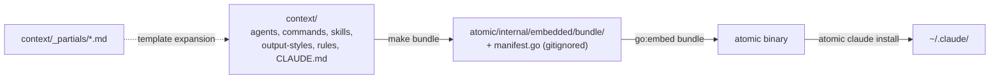
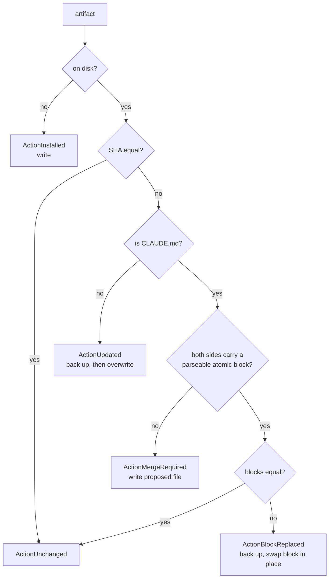

# bundle


## What it does


The markdown artifacts under [`context/`](../../context) — agents, commands, skills, output-styles, rules, [`CLAUDE.md`](../../CLAUDE.md) — are the product; this domain is how a user gets them without a manual copy step. `make bundle` reads [`context/`](../../context), expands any `{{ template "<name>" . }}` directive against [`context/_partials/`](../../context/_partials), and writes the result to [`atomic/internal/embedded/bundle/`](../../atomic/internal/embedded/bundle) plus a generated `manifest.go`. `//go:embed bundle` in [`atomic/internal/embedded/bundle.go`](../../atomic/internal/embedded/bundle.go) compiles that tree into the [`atomic`](../../atomic) binary, and `atomic claude install`/`update` writes the embedded copies to a target directory (`~/.claude` by default).

There is one generation step, not two. [`context/commands/<verb>.md`](../../context/commands) and [`context/agents/<name>.md`](../../context/agents) are committed source, not generated output — no `templates/` directory and no top-level `commands/`/`agents/` directory exist in this repo. Expansion happens on the way into the embedded bundle; nothing is ever written back into [`context/`](../../context), so an artifact exists in exactly one place.

Both [`atomic/internal/embedded/bundle/`](../../atomic/internal/embedded/bundle) and `manifest.go` are gitignored build outputs, confirmed by `git ls-files atomic/internal/embedded/` returning only [`bundle.go`](../../atomic/internal/embedded/bundle.go). CI's comment on the "Generate bundle" step states the reason directly: "The bundle is gitignored, so there is no drift gate here — only the generation step that makes `internal/embedded` compile." What ships to a user is fully determined by [`context/`](../../context) and the two small Go packages that mirror and install it.


## How it works


### The pipeline: source to installed file

Every stage after [`context/`](../../context) is regenerated from the one before, so nothing downstream is ever hand-edited.



`make bundle` runs `go run ./internal/tools/bundle-mirror -repo ../ -outdir ./internal/embedded` from [`atomic/`](../../atomic). `test`, `build`, and `vet` in [`atomic/Makefile`](../../atomic/Makefile) all declare `bundle` as a prerequisite, because [`atomic/internal/embedded`](../../atomic/internal/embedded) does not compile until the mirror exists. CI regenerates it the same way through `go generate ./...`, which fires the `//go:generate go run ../tools/bundle-mirror -repo ../../../ -outdir .` directive in [`bundle.go`](../../atomic/internal/embedded/bundle.go); goreleaser's `before` hook does the same before a release build. There is no committed rendered-artifact tree to diff, so [`.githooks/pre-commit`](../../.githooks/pre-commit) carries no render or bundle stage.

Only `command` and `agent` artifacts pass through the template engine (`readArtifact` in [`mirror.go`](../../atomic/internal/bundlemirror/mirror.go) gates on `expandedKinds`); skills, rules, output-styles, and [`CLAUDE.md`](../../CLAUDE.md) are copied byte-for-byte, so a literal `{{` in their prose is never read as a directive. `bundlemirror.Enumerate` hashes the *expanded* bytes for the SHA256 in `manifest.go`, because that is what actually installs — a parity check has to agree with the file the user ends up with.

### What the bundle includes

Inclusion is decided by pure predicates in [`atomic/internal/bundlespec/bundlespec.go`](../../atomic/internal/bundlespec/bundlespec.go). A new file matching an existing rule is picked up with no Go change; a new artifact *kind* needs a new predicate plus a new walk in `bundlemirror`.

| Kind | Rule |
|------|------|
| agent | `context/agents/atomic-*.md`, files only |
| skill | `context/skills/atomic-*/`, whole subtree, directory must contain `SKILL.md` |
| output-style | `context/output-styles/atomic*.md`, no dash required after [`atomic`](../../atomic) |
| command | `context/commands/**/*.md`, any `.md`, no allowlist, recursive |
| rule | `context/rules/**/*.md` |
| claude-md | [`context/CLAUDE.md`](../../context/CLAUDE.md), exact name |

`context/_partials/*.md` is never itself a bundle target: `templaterender.LoadPartials` reads it as a pool of `{{ define }}` blocks, and `bundlemirror` never walks it as an artifact source. That is also why the plain `//go:embed bundle` pattern in [`bundle.go`](../../atomic/internal/embedded/bundle.go) needs no `all:` prefix today — the underscore-prefixed `_partials/` directory is a template input, not something that lands under `bundle/`.

### Partial composition

Editing a partial reaches further than its own consumers, because partials nest:

```
commit-flow  ──> doc-impact, signals-gate
merge-flow   ──> base-resolution, signals-gate, worktree-cleanup-prompt,
                 merge-flow-preflight, merge-flow-steps
squash-flow  ──> base-resolution, doc-impact, signals-gate,
                 squash-flow-preflight, squash-flow-steps
agent-implementer-workflow ──> agent-search-tooling, agent-tdd-signals,
                               agent-code-intel, agent-where
```

| Agent source | Partials composed |
|---------------|-------------------|
| `atomic-implementer.md` | `agent-atomic-voice`, `agent-comment-discipline`, `agent-implementer-workflow`, `agent-shared-rules`, `agent-signals-output`, `agent-yagni` |
| `atomic-reviewer.md` | `agent-atomic-voice`, `agent-code-intel`, `agent-where`, `agent-yagni` |
| `atomic-investigator.md` | `agent-atomic-voice`, `agent-code-intel`, `agent-search-tooling`, `agent-where` |
| `atomic-wiki-inferrer.md` | `agent-atomic-voice`, `agent-code-intel`, `agent-where` |
| `atomic-wiki-writer.md` | `agent-atomic-voice`, `agent-code-intel` |
| `atomic-auditor.md` | `agent-atomic-voice`, `agent-code-intel` |
| `atomic-strategist.md` | `agent-atomic-voice`, `agent-yagni` |

| Command source | Partials composed |
|-----------------|-------------------|
| `commit.md` | `commit-flow`, `push-flow`, `pr-flow`, `merge-flow`, `squash-flow`, `git-safety` |
| `autopilot.md`, `subagent-implementation.md` | `worktree-setup` |
| `report-issue.md`, `report-issue-with-atomic.md` | `report-issue-privacy` |

Every other command source is self-contained.

### Install verbs

| Verb | Flags |
|------|-------|
| `atomic claude install` | `--dry-run`, `--target`, `--no-hooks` |
| `atomic claude update` | `--dry-run`, `--target`, `--no-hooks` |
| `atomic claude diff` | `--target` |
| `atomic claude list` | none |
| `atomic claude uninstall` | `--target` |

`install` and `update` share one code path, `installOrUpdate` in [`atomic/internal/claudeinstall/install.go`](../../atomic/internal/claudeinstall/install.go). Both take a write-once pre-install snapshot, plan, apply, create `~/.atomic/profile.md` if absent, offer to prune stale artifacts, then record what was installed in `[install.artifacts]`.

### The per-artifact install decision

[`CLAUDE.md`](../../CLAUDE.md) is the one artifact never overwritten wholesale, because a user's own content lives in the same file.



Backups land in `~/.atomic/backups/<timestamp>/<target>`, one timestamp directory per run. The proposed file lands at `~/.atomic/proposed/CLAUDE.md`, and the install output tells the user to run `atomic prompt claude-merge` in a Claude Code session. If the `<atomic>` block vanishes between plan and apply, `applyAction` fails loud with `"<path> lost its parseable <atomic> block between plan and apply"` rather than guessing the boundary.

`Plan`, `Apply`, and `Diff` all load the `[claude.agents]` overrides and patch `model:` and `effort:` frontmatter before hashing, so all three agree on the expected on-disk bytes. `patchAgentContent` sets the two keys independently and preserves the source order of every other key; a file with no parseable frontmatter is left unchanged.

`ReapplyAgents(targetDir, home)` re-patches only agent files already present on disk. An absent agent is never installed by it.

### Stale-artifact pruning

Install reads the previous `[install.artifacts]` list from `~/.atomic/config.toml` *before* planning, so it compares against the old manifest rather than the one about to be written. `PruneDiff` returns the targets that left the bundle, and a batched confirm offers to remove them. A non-interactive terminal, or Ctrl+C at the prompt, skips the removal silently. `claude-md` is never tracked in `[install.artifacts]`. Dev builds (`version.Version == "dev"`) leave `Install.Version` untouched, because `dev` is not parseable semver and `config.Validate` would then fail every contributor's `atomic doctor`.


## Where it lives


### Edit here

| Path | Role |
|------|------|
| `context/commands/*.md` | Source for each slash command. May compose `{{ template "<name>" . }}` directives. |
| `context/agents/*.md` | Source for each subagent definition. Same composition contract as commands. |
| `context/_partials/*.md` | Partials composed by both kinds via `{{ template "<name>" . }}`. One pool: a partial defined once is callable from any command or agent source. |
| `context/skills/atomic-*/` | Skill directories, whole subtree. Bundled byte-for-byte, no expansion. |
| `context/output-styles/atomic*.md` | Output style definitions. Bundled byte-for-byte. |
| `context/rules/**/*.md` | Path-scoped topic rules. Bundled byte-for-byte. |
| [`context/CLAUDE.md`](../../context/CLAUDE.md) | The global contract installed as `~/.claude/CLAUDE.md`. Bundled byte-for-byte. |

### Generated, never edit, never committed

| Path | Written by |
|------|-----------|
| `atomic/internal/embedded/bundle/**` | `make bundle` |
| [`atomic/internal/embedded/manifest.go`](../../atomic/internal/embedded/manifest.go) | `make bundle` |

Both are gitignored; `git ls-files atomic/internal/embedded/` returns only [`bundle.go`](../../atomic/internal/embedded/bundle.go).

### Go packages

| Path | Role |
|------|------|
| [`atomic/internal/bundlespec/bundlespec.go`](../../atomic/internal/bundlespec/bundlespec.go) | Pure inclusion predicates. Single source of truth, imported by `bundlemirror` at build time and `manifestcheck` at runtime. |
| [`atomic/internal/templaterender/templaterender.go`](../../atomic/internal/templaterender/templaterender.go) | `text/template` engine. `LoadPartials` pools every `*.md` under [`context/_partials/`](../../context/_partials) in sorted order; `Expand` clones the pool per file, so a `{{ define }}` in one artifact can never leak into the next. A missing partials dir yields an empty pool rather than an error. |
| [`atomic/internal/bundlemirror/mirror.go`](../../atomic/internal/bundlemirror/mirror.go) | Build-time walker. `enumerate` reads each matching file once, expands `command`/`agent` kinds through `templaterender`, and keeps the bytes; `Run` reuses them for the copy. `Enumerate` is `Run` without the disk write, used by `manifestcheck`. Output sorts by kind then target, so the result is deterministic. |
| [`atomic/internal/embedded/bundle.go`](../../atomic/internal/embedded/bundle.go) | Holds `//go:embed bundle` and the `go:generate` directive that invokes `bundle-mirror`. |
| [`atomic/internal/embedded/manifest.go`](../../atomic/internal/embedded/manifest.go) | Generated `Manifest() []Artifact` allowlist: kind, embedded source path, install target, SHA256. |
| [`atomic/internal/tools/bundle-mirror/main.go`](../../atomic/internal/tools/bundle-mirror/main.go) | Entrypoint for `go generate` and `make bundle`. Prints `bundle-mirror: wrote N artifacts to <outDir>`, and writes `manifest.go` from an inline template. |
| [`atomic/internal/claudeinstall/install.go`](../../atomic/internal/claudeinstall/install.go) | `Plan`, `Apply`, `Install`, `Update`, `Diff`, `List`, `ReapplyAgents`. SHA256 idempotency, agent frontmatter patching, backups. |
| [`atomic/internal/claudeinstall/atomicblock.go`](../../atomic/internal/claudeinstall/atomicblock.go) | `<atomic>...</atomic>` parser for [`CLAUDE.md`](../../CLAUDE.md). Line-anchored: only a line whose trimmed content is exactly the tag counts. |
| [`atomic/internal/claudeinstall/manifest.go`](../../atomic/internal/claudeinstall/manifest.go) | Stale-artifact pruning and the `[install]` config manifest. |
| [`atomic/internal/claudeinstall/snapshot.go`](../../atomic/internal/claudeinstall/snapshot.go) | Write-once pre-install snapshot, the input to uninstall. |
| [`atomic/internal/claudeinstall/uninstall.go`](../../atomic/internal/claudeinstall/uninstall.go) | `BuildUninstallPlan`, `GenerateUninstallPrompt`. |
| [`atomic/internal/manifestcheck/manifestcheck.go`](../../atomic/internal/manifestcheck/manifestcheck.go) | `Compare` re-runs `bundlemirror.Enumerate` against the live [`context/`](../../context) tree and diffs it against the binary's baked-in `embedded.Manifest()` — a staleness check, not a git-commit-drift check, since neither side is committed. |

### Docs

| Path | Covers |
|------|--------|
| [`docs/spec/artifact-templates.md`](../spec/artifact-templates.md) | Render/expansion contract, orphan rule, partial taxonomy. |
| [`docs/spec/install-workflow.md`](../spec/install-workflow.md) | `atomic claude install/update`, SHA256 idempotency, backups, the [`CLAUDE.md`](../../CLAUDE.md) merge path. |
| [`docs/spec/atomic-binary.md`](../spec/atomic-binary.md) | Master spec for every [`atomic`](../../atomic) CLI verb, including the `claude` family. |
| [`docs/spec/uninstall.md`](../spec/uninstall.md), [`docs/design/uninstall.md`](../design/uninstall.md) | `atomic claude uninstall`: snapshot, restore plan, LLM merge of modified files. |
| [`docs/spec/artifact-consolidation.md`](../spec/artifact-consolidation.md) | Why the artifact surface is shaped as it is: ship-verb family collapse, cold ops moved to binary-emitted prompts. |
| [`docs/guides/contributing.md`](../guides/contributing.md) | Contributor workflow, build pipeline, testing. |
| [`docs/guides/install.md`](../guides/install.md) | User-facing install walkthrough. |


## Constraints


**Never edit a mirrored file.** `atomic/internal/embedded/bundle/**` and `manifest.go` are overwritten on every `make bundle` run and are not tracked by git, so a hand edit disappears at the next build with no diff to reveal it happened.

**Nothing verifies bundle freshness against a commit.** Because the mirror is gitignored, CI's "Generate bundle" step is generation only, not a drift gate — there is nothing committed to diff against. Staleness inside a checkout is caught only by `atomic doctor`'s manifest check (`RunCheckManifestWith`, repo-dev only, SKIPs outside this repo), which re-enumerates [`context/`](../../context) and compares it to the binary's already-embedded `Manifest()`.

**`make bundle` writes and overwrites, but the target of a removed artifact is not tracked anywhere to prune.** Since `manifest.go` is regenerated wholesale on every run, deleting a source file under [`context/`](../../context) simply drops it from the next `Manifest()` — there is no stale committed copy to `git rm`, unlike a workflow with a committed rendered tree.

**The `<atomic>` block is the ownership boundary in [`CLAUDE.md`](../../CLAUDE.md).** Content inside the tags is atomic-owned and replaced wholesale; content outside is preserved byte for byte. Detection is line-anchored, so only a line whose trimmed content is exactly `<atomic>` or `</atomic>` counts, and a backticked mention in prose never matches. Two blocks, an unclosed tag, or a close before an open all report not-ok and route to the merge path instead.

**Pre-commit hook stages** (install with `make hooks`, which sets `core.hooksPath=.githooks`):

| Stage | Fires when a staged path matches | Runs | Re-stages |
|-------|----------------------------------|------|-----------|
| 1 | `.claude/project/followups/*.md` except `INDEX.md` | `atomic followups render` | `INDEX.md` |
| 2 | `atomic/internal/serve/frontend/**` outside `dist/` | `make frontend` | `frontend/dist/` |

Neither stage belongs to this domain, and there is no render or bundle stage in the hook at all: [`.githooks/pre-commit`](../../.githooks/pre-commit) states directly that [`context/`](../../context) artifacts "are committed in source form and expanded straight into [`atomic/internal/embedded/`](../../atomic/internal/embedded), which is gitignored and rebuilt by `make -C atomic bundle`." Both stages degrade to a warning and continue when [`atomic`](../../atomic) or `bun` is missing.


## Coupling


- **config** — install writes into two roots that must not be confused. Artifacts go to `targetDir` (default `~/.claude`, overridable with `--target`); everything atomic owns resolves through [`atomic/internal/config/paths.go`](../../atomic/internal/config/paths.go) under `~/.atomic` (`config.toml`, `backups/`, `proposed/CLAUDE.md`, `profile.md`, `pre-install/`). The config domain owns those helpers; this domain calls them. Spec: [`docs/spec/configurable-state-paths.md`](../spec/configurable-state-paths.md).
- **config** — `atomic config agents` writes `[claude.agents.<name>]` overrides, then calls `ReapplyAgents` through the `ApplyAgentsHook` package variable. `internal/config` cannot import `internal/claudeinstall` without a cycle, so [`atomic/cmd/atomic/main.go`](../../atomic/cmd/atomic/main.go), the only package importing both, wires the hook in `init()`. `ReapplyAgents` resolves its target via `ResolveTarget("~/.claude")`, so an install made with a custom `--target` is invisible to that verb.
- **doctor** — [`atomic/internal/manifestcheck/manifestcheck.go`](../../atomic/internal/manifestcheck/manifestcheck.go) calls `bundlemirror.Enumerate` and compares the result against the binary's embedded `Manifest()`. Doctor's manifest check and `atomic validate` both consume it. The check is repo-dev only and SKIPs outside the atomic-claude repo. Changing a `bundlespec` predicate changes what both report.
- **doctor** — doctor's install check calls `claudeinstall.Diff` to find drift between the embedded bundle and `~/.claude`: an absent artifact is FAIL, a differing one is WARN, and `atomic doctor --fix` repairs it.
- **doctor, config** — install creates `~/.atomic/profile.md` on first run via [`atomic/internal/profile`](../../atomic/internal/profile) and prints `ProfileNudge`. Profile content and its freshness window belong to those domains.
- **workflow** — every ship verb and orchestrator command lives in [`context/commands/`](../../context/commands). Changing a ship-verb flow means editing [`context/_partials/commit-flow.md`](../../context/_partials/commit-flow.md) and its siblings, not a single command file, because the partials fan out to every command in the family.
- **docs-meta** — [`context/CLAUDE.md`](../../context/CLAUDE.md) is both the bundle input and, per the root [`CLAUDE.md`](../../CLAUDE.md), a separate file from this repo's own project instructions: [`context/CLAUDE.md`](../../context/CLAUDE.md) installs as every user's `~/.claude/CLAUDE.md`, while the root [`CLAUDE.md`](../../CLAUDE.md) never installs. A change to [`context/CLAUDE.md`](../../context/CLAUDE.md) reaches every user on their next update.
- **Lockstep contract** — [`context/_partials/agent-yagni.md`](../../context/_partials/agent-yagni.md) and the "Simplicity first (YAGNI)" ladder in [`context/CLAUDE.md`](../../context/CLAUDE.md)'s `<principles>` block carry the same seven steps verbatim. [`context/CLAUDE.md`](../../context/CLAUDE.md) is copied byte-for-byte, not expanded, so nothing enforces the match. Edit both together.
