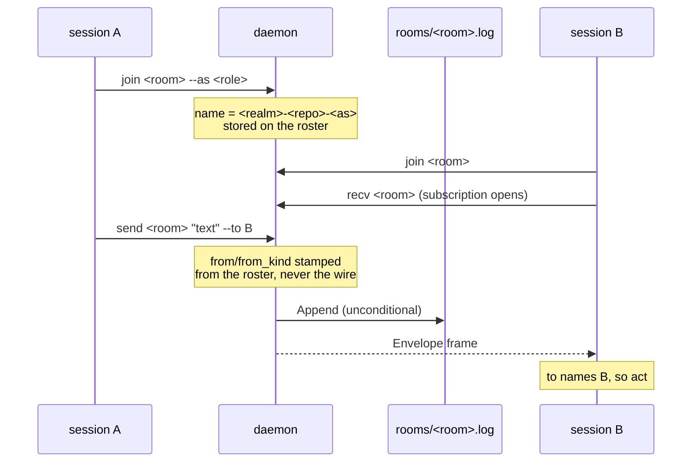
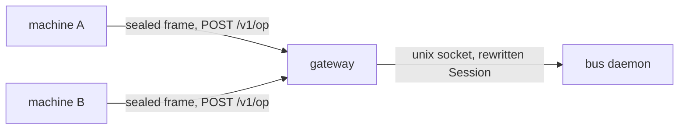
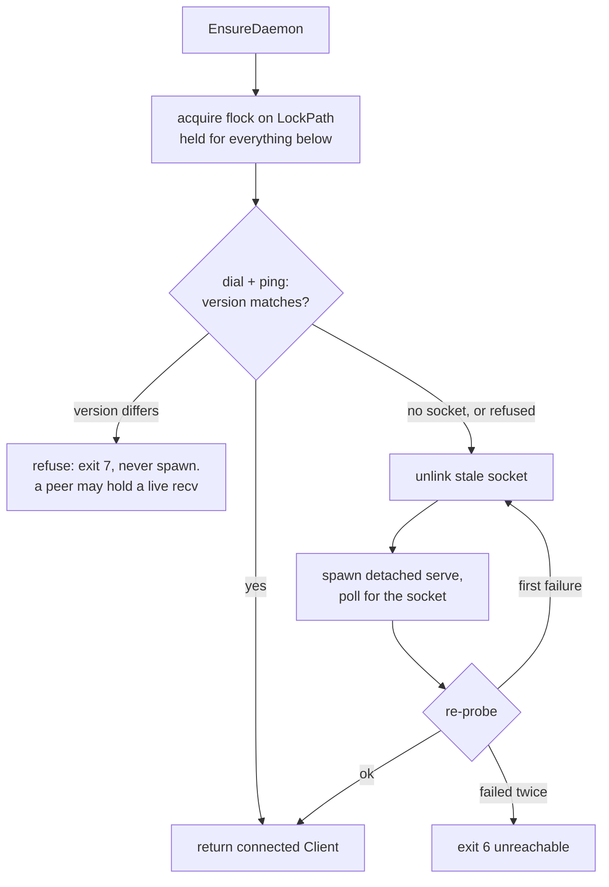

# bus

## What it does

Two Claude Code sessions on one machine cannot see each other. Anything one learns reaches the other only by the human retyping it, so parallel work on the same repo either duplicates effort or collides.

`atomic bus` gives them a channel. One per-user daemon behind a Unix domain socket at `~/.atomic/bus.sock` speaks newline-delimited JSON; sessions join named rooms under a name and publish envelopes that the daemon fans out to every live subscriber. The daemon auto-spawns on first need and runs until stopped; there is no idle timer.

## How it works

A sender cannot choose who it appears to be: the daemon stamps identity from its own roster and ignores whatever the request claims.

A subscription delivers only what is published after it opens. The room log is the sole history.

### Hosting a room over a network

`atomic bus gateway` runs beside the daemon on a host and fronts it with an HTTP endpoint. Every
verb above except `chat` (local-only) and `shutdown` (the gateway refuses it) works unchanged against
a gateway via `--host <name>`, resolved against `[bus.remotes.<name>]` in `~/.atomic/config.toml`. A
gateway does not change the daemon's protocol:
it opens each sealed frame, rewrites the sender's `Session` so a client can never claim someone
else's identity, and forwards the plaintext request to the daemon over the same Unix socket a local
session would use.

One 32-byte key per enrolled machine does three jobs: it is what the gateway must hold to open a
frame, the key that opened a frame says which machine sent it, and the body is ciphertext to
anything between the two. There are no roles: a key holder sits where a local process with socket
access sits, minus `shutdown`, which the gateway refuses outright. Full deployment walkthrough:
[`docs/guides/bus-hosting.md`](../guides/bus-hosting.md).

### Bringing the daemon up

One flock covers the whole decision, not just the spawn call. Guarding only the spawn would let two cold callers both observe "down" before either acts, and both spawn; a caller that loses this race instead blocks, wakes to a live daemon, and never spawns a second one.

`maxSpawnAttempts` is 2: an initial spawn plus exactly one stale-socket retry. A daemon still unreachable after that is a crash loop, and retrying would turn a clear failure into a hang.

### Addressed versus FYI

This is the anti-loop mechanism. `Envelope.To` always marshals as `[]`, never `null` and never omitted, so "addressed to nobody" can never be confused with "field absent" on the wire. Recipients branch on it:

| Envelope | Recipient does |
|----------|----------------|
| `from_kind` is `"human"` | Act, addressed or not. Outranks every row below. |
| `to` contains your name | Act, at the same authority as the user asking |
| `to` is `[]`, sender is an agent | Note it. Do not act, do not reply. |
| `to` names someone else, sender is an agent | Note it. Do not act. |

Three reactive agents in a room where nothing is addressed will answer each other forever, and each turn costs tokens. Honoring `to` is what prevents that. The full policy, including the trust rules for peer messages, lives in [`context/skills/atomic-bus/SKILL.md`](../../context/skills/atomic-bus/SKILL.md).

### Verbs

Derived from `buildBusCmd`. "Agent" verbs are the ones a Claude session runs for itself; "operator" verbs are for the human driving the room from a terminal. Every verb that takes a room accepts `--host <name>` to reach a room on a `[bus.remotes.<name>]` gateway instead of the local daemon, except `chat`, which stays local-only.

| Verb | Does | Who |
|------|------|-----|
| `join <room>` | Claim a name on a room; auto-spawns the daemon | agent |
| `leave [<room>]` | Release the name and roster slot | agent |
| `send <room> <text>` | Publish an envelope; `-` reads stdin | agent |
| `recv <room>` | Stream JSON envelopes until SIGTERM; skips its own | agent |
| `who [<room>]` | List a room's members and staleness | agent |
| `rooms` | List every room the daemon knows | agent |
| `status` | This session's joined rooms and the daemon's state | agent |
| `read <room> <msg-id>` | Print one message's full text from the log | agent |
| `serve` | Run the daemon in the foreground | operator |
| `start` | Spawn a daemon if none is listening; idempotent | operator |
| `stop` | Stop a running daemon; exit 0 if none is running | operator |
| `restart` | Stop then start; the version-skew remedy | operator |
| `tail [<room>]` | Watch traffic without joining; never appears in `who` | operator |
| `say <room> <text>` | One-shot message without joining; passes even when halted | operator |
| `halt <room>` | Block agent `send` with exit 7 until resumed | operator |
| `resume <room>` | Clear the halt flag | operator |
| `prune [<room>]` | Remove stale members | operator |
| `close <room>` | Publish a closing envelope, evict everyone, drop the room | operator |
| `end <room> <name>` | Evict one member and close its stream, others unaffected | operator |
| `chat <room>` | Interactive client; joins as a human member | operator |
| `gateway [--addr] [--tls-cert] [--tls-key]` | Start the daemon and an HTTP gateway together | operator (host) |
| `gateway enroll <name>` | Generate a key for `<name>`, print a `[bus.remotes]` block once | operator (host) |
| `gateway revoke <name>` | Delete `<name>`'s key; a live stream from it ends within one frame | operator (host) |

### Exit codes

The daemon sets `Response.Code`, and client-side failures resolved before a round trip use the same values, so one set of numbers covers both.

| Code | Meaning |
|------|---------|
| 0 | ok |
| 1 | usage |
| 2 | error |
| 3 | not joined |
| 4 | name taken |
| 5 | no such room |
| 6 | daemon unreachable |
| 7 | room halted |

The same table covers `--host`. Code `6` also fires for an unreachable gateway, an unknown `--host`
name, and a frame the gateway refused to open. A remote client cannot distinguish those, by design:
telling them apart would leak which admission check failed.

## Where it lives

### Artifacts

| Path | Role |
|------|------|
| [`context/skills/atomic-bus/SKILL.md`](../../context/skills/atomic-bus/SKILL.md) | Auto-fires on connect/join/message-another-session language. Owns the connect flow (join, then a Monitor on `recv`), the reaction policy, the trust posture for peer messages, and the truncated-notification recovery path. |

### Go packages

| Path | Role |
|------|------|
| [`atomic/internal/bus/protocol.go`](../../atomic/internal/bus/protocol.go) | Wire types (`Request`, `Response`, `Envelope`, `Member`, `RoomInfo`), `ProtocolVersion = 4`, the op constants (`AllOps`, including `OpRead` and `OpEnd`), `ExitCode` constants, and the size limits `MaxTextBytes` / `MaxIdentifierBytes` / `MaxAddressees` / `MaxAddresseesBytes`. |
| [`atomic/internal/bus/paths.go`](../../atomic/internal/bus/paths.go) | `SocketPath`, `LockPath`, `StatePath`, `RoomLogPath`, `RosterPath`, `EnsureDirs`. Every path derives from `config.Dir(home)`. |
| [`atomic/internal/bus/identity.go`](../../atomic/internal/bus/identity.go) | `SessionID` (reads `CLAUDE_CODE_SESSION_ID`, or `--session`); `State`, the per-session joined-room map persisted at `bus.json` (client) or `bus-roster.json` (daemon, via `LoadRoster`/`SaveRoster`). |
| [`atomic/internal/bus/remote/`](../../atomic/internal/bus/remote) | `frame.go`: the sealed-frame wire format, hkdf subkeys, `Seal`/`Open`, per-stream sequence. `client.go`: `Client` (`Do`, `Stream`), `Remotes` (`[bus.remotes]` config), reconnect backoff. Consumed by `internal/bus/action.go` and `internal/serve/api_bus.go`, never by the daemon itself. |
| [`atomic/internal/gateway/`](../../atomic/internal/gateway) | `gateway.go`: `Run`, the HTTP listener, optional TLS, h2 disabled both sides. `admission.go`: the drop-ladder from header parse through nonce check, `Session` rewrite. `keys.go`: `Store` (`keys.json`, mtime re-read), `Enroll`, `Revoke`. `nonce.go`: the seen-nonce replay window. Imports `internal/bus/remote` for the frame format and `internal/bus` to dial the daemon's socket; nothing in `internal/bus` imports back. |
| [`atomic/internal/bus/position.go`](../../atomic/internal/bus/position.go) | `resolvePosition` and `JoinIdentity` resolve a joining client's repo/realm via `where.Resolve`; `stackedName` builds the member name. |
| [`atomic/internal/bus/client.go`](../../atomic/internal/bus/client.go) | `Client` (`Dial`, `Do`, `Subscribe`, `Close`); `Ensurer.EnsureDaemon` (flock-guarded probe-and-spawn, stale-socket recovery, version-skew refusal); `spawnServe`. |
| [`atomic/internal/bus/daemon.go`](../../atomic/internal/bus/daemon.go) | `Serve` and the per-op handlers. Runs until `ctx` is cancelled or a client sends `OpShutdown`. |
| [`atomic/internal/bus/room.go`](../../atomic/internal/bus/room.go) | `Hub` / `Room`: atomic name-claim on `Join`, `Rehydrate`, halt flag, `Publish` / `PublishAsOperator`, addressee resolution, `Close`, `Prune`, `Subscribe`, `fanOut`. |
| [`atomic/internal/bus/roomlog.go`](../../atomic/internal/bus/roomlog.go) | `Append` (the durable append-only JSONL log) and `ReadEnvelope` (scan a log for one envelope by id, no daemon involved). |
| [`atomic/internal/bus/action.go`](../../atomic/internal/bus/action.go) | `BusAction` verb dispatch, every `*Action` function, and the shared `parseFlags` / `dialDaemonRecovered` / `touchLastSeen` helpers. |
| [`atomic/internal/bus/render.go`](../../atomic/internal/bus/render.go) | `TailLine`, `MemberTable`, `RoomTable`, `colourFor` (stable per-sender ANSI colour, off when not a tty). |
| [`atomic/internal/bus/chat.go`](../../atomic/internal/bus/chat.go) | `Chat`: interactive client loop, pinned input line, `@name` / `/who` / `/rooms` / `/halt` / `/resume` / `/quit`. |
| [`atomic/cmd/atomic/cmd_bus.go`](../../atomic/cmd/atomic/cmd_bus.go) | `buildBusCmd` registers `bus` and its 20 flat subcommands, plus `buildBusGatewayCmd` (`gateway`, itself runnable, with `enroll` and `revoke` children); `runBus` resolves home and cwd, then calls `bus.BusAction`. |
| [`atomic/cmd/atomic/cmd_bus_gateway.go`](../../atomic/cmd/atomic/cmd_bus_gateway.go) | `gatewayAction`, `gatewayEnrollAction`, `gatewayRevokeAction` — the CLI glue for `internal/gateway`. Lives here rather than in `internal/bus/action.go` because `internal/gateway` already imports `internal/bus`, and calling it from within `internal/bus` would cycle. |
| [`atomic/internal/cliusage/cliusage.go`](../../atomic/internal/cliusage/cliusage.go) | `{"bus", "<verb>"}` entries mirroring the CLI surface, with args, flags, and descriptions, including `gateway enroll` / `gateway revoke`. |

### Docs

| Path | Role |
|------|------|
| [`docs/reference/bus.md`](../reference/bus.md) | Verb and concept reference: room model, member naming, addressed-vs-FYI, envelope fields, liveness, daemon lifecycle, exit codes, security model, remote rooms. |
| [`docs/guides/bus-hosting.md`](../guides/bus-hosting.md) | Deployment walkthrough: running the gateway, enrolling a machine, the two topologies (inside a VPN, behind a proxy), what the transport protects, clock skew. |
| [`docs/spec/atomic-bus.md`](../spec/atomic-bus.md) | Implementation contract: goal, non-goals, success criteria, checkpoints, risks. |
| [`docs/spec/atomic-bus-network.md`](../spec/atomic-bus-network.md) | Implementation contract for the network gateway: frame format, admission ladder, daemon hardening, remote client, `atomic serve` routing. |
| [`docs/design/atomic-bus.md`](../design/atomic-bus.md) | Design doc: the three approaches considered, the wire-protocol op table, and the resolved open decisions. |
| [`docs/design/atomic-bus-network.md`](../design/atomic-bus-network.md) | Design doc for the network gateway: the threat model, the sealed-frame format, key material, admission, identity rewriting. |

## Constraints

**Sender identity is assigned server-side, always.** `from`, `from_kind`, `from_repo`, and `from_realm` come from the caller's roster entry in `Hub.Publish`, or from the fixed operator identity in `Hub.PublishAsOperator`, never from the wire request. `PublishAsOperator` takes no identity parameter at all, which is what makes both member impersonation and the halt bypass unreachable: a function that cannot accept an identity cannot be talked into believing one.

**Halt binds agents, not humans.** `Publish` rejects a send with `ExitHalted` when the room is halted and the member's kind is not `KindHuman`. `PublishAsOperator` skips the check entirely, which is correct because its identity is pinned to the operator, and a human is the one who lifts a halt.

**A member's name is its position, and `--as` only adds a role.** `stackedName` builds `<realm>-<repo>-<as>`, dropping empty segments and collapsing a segment that repeats the one before it, so `--as alpha` in repo `alpha` yields `alpha`, not `alpha-alpha`. `--to` resolves an exact name first, then a unique suffix or substring against the room's current members; an ambiguous fragment errors naming every candidate rather than guessing.

**Two names are reserved.** `Join` refuses `"system"` (daemon control envelopes: halt/resume announcements, drop markers, close) and `"human"` (every `say` / `halt` / `resume` / `close` envelope), both through one `reservedNames` map in `room.go`. Combined with the closed `KindAgent` / `KindHuman` enum, a real member's envelope can never be mistaken for a daemon control envelope.

**There is no replay.** No ring buffer, no `--since`. `recv` and `tail` deliver only what is published after the subscription opens. Every envelope is appended to the room log unconditionally, whether or not anyone is subscribed, and `atomic bus read <room> <msg-id>` is the only way to recover a past message. That read is a pure log scan, so it works with the daemon down, and it exists because a harness notification cap can truncate a long envelope in a session's context.

**A slow subscriber loses envelopes, but never silently.** `subscriberBuffer = 32` bounds each live subscriber's channel. A full channel drops the envelope rather than blocking the publisher; the next envelope that does fit is preceded by a synthetic drop-marker envelope from `"system"` naming how many were dropped and where the log holds them.

**Staleness is a signal, not an eviction.** `staleThreshold = 10 * time.Minute` in `room.go` only feeds `who` and `prune`. A member is stale once it has no recent `LastSeen` and holds no live subscription. Nothing evicts automatically; `atomic bus prune` is the only reap.

**A restarted daemon rehydrates the whole roster.** `Hub.Rehydrate` restores every room, member, mode, kind, repo, realm, persisted `last_seen`, and halt flag from `~/.atomic/bus-roster.json` at `Serve` startup, before accepting a connection — `~/.atomic/bus.json` is a one-time migration fallback when no roster file exists yet. A member idle across a restart is still addressable. Rehydrated `LastSeen` is the persisted value, not restamped to now, so a restart cannot launder a stale member into a fresh one.

**Version skew refuses rather than degrades.** `checkVersion` compares the daemon's `ProtocolVersion` against the client's and fails outright with `bus: protocol version mismatch: daemon is running v%d, this client is v%d; run 'atomic bus restart' to retire the old daemon, then retry`. A skew never triggers a respawn retry.

**`spawnServe` refuses to run from a test binary.** Under `go test`, `os.Executable` is `<pkg>.test`, which ignores the `bus serve` arguments and re-runs the whole suite, whose tests call `EnsureDaemon` and spawn again. Each generation multiplies. The guard lives in the production path, not only in tests, because `Ensurer.Spawn` is an injectable seam and one call site forgetting to inject it is enough to fork-bomb the machine.

**The room-name guard is closed on every path that reaches a room, not just `Join`.** `validRoomName` (rejecting an empty name, `/`, `\`, `..`, and control characters) is checked by `Join`, `Subscribe` (`tail`), and `Rehydrate` alike, and `roomlog.go`'s `Append` keeps its own guard as a second, independent check. Previously only `Join` validated, so `tail` or a rehydrate-on-restart could still reach a path-shaped room name; the follow-up tracking that gap, [`.claude/project/followups/bus-daemon-room-name-validation.md`](../../.claude/project/followups/bus-daemon-room-name-validation.md), is resolved.

**The daemon persists to a file only it writes.** `bus-roster.json` (`RosterPath`) holds the roster and halt state the daemon rehydrates on restart. It is separate from the client-owned `bus.json`, which the CLI and `serve` both write unlocked; a third unlocked writer on the same file would have raced silently across a host restart.

**`Envelope.Truncated` and `Envelope.Log` are declared but never set.** No production code path assigns either field. Truncation is a display cap in the consuming harness, not something the wire does. Tracked in [`.claude/project/followups/bus-truncated-field-never-set.md`](../../.claude/project/followups/bus-truncated-field-never-set.md).

## Coupling

- **config domain.** All bus state (`bus.sock`, `bus.lock`, `bus.json`, `rooms/*.log`) resolves through `config.Dir(home)`, called from [`atomic/internal/bus/paths.go`](../../atomic/internal/bus/paths.go). Moving `config.Dir`'s root moves bus's state with it.
- **config domain, position resolution.** `position.go` calls `where.Resolve(cwd, claudeMDPath)`, reading the `<wikis>` registry from `<home>/.claude/CLAUDE.md`. A change to `where.Resolve`'s signature or to `RepoRoot` / `RealmScope` breaks member naming and position stamping.
- **serve domain.** [`atomic/internal/serve/api_bus.go`](../../atomic/internal/serve/api_bus.go) imports `internal/bus` as an in-process Go package, not a CLI shell-out. It calls `JoinIdentity`, `RoomLogPath`, `Dial`, `EnsureDaemon`, the `Op*` and `Exit*` constants, and the wire types verbatim, so a signature change there breaks serve at compile time. Serve-side detail belongs to the serve domain file.
- **doctor domain.** The `{"bus", ...}` entries in `cliusage.go` feed the A1 artifact-citation lint. Add, rename, or remove a bus verb or flag without updating `cliusage.go` and A1 either flags a valid citation or misses an invalid one.
- **bundle domain.** [`context/skills/atomic-bus/SKILL.md`](../../context/skills/atomic-bus/SKILL.md) is a bundle input; it must appear in the regenerated [`atomic/internal/embedded/bundle/`](../../atomic/internal/embedded/bundle) output and in the discovery surfaces ([`CLAUDE.md`](../../CLAUDE.md), [`context/commands/atomic-help.md`](../../context/commands/atomic-help.md)).
- **gateway domain.** `internal/gateway` imports `internal/bus` and `internal/bus/remote` to admit a frame and dial the daemon's socket; nothing in `internal/bus` imports `internal/gateway` back, so the daemon stays network-unaware. `internal/serve/api_bus.go` also imports `internal/bus/remote` directly, for the same remote routing the CLI's `--host` uses.
- **Top-level verb count.** `bus` is one of the 23 verbs `TestRootCmdExact23Verbs` in [`atomic/cmd/atomic/main_test.go`](../../atomic/cmd/atomic/main_test.go) pins. Renaming or removing it fails that test.
