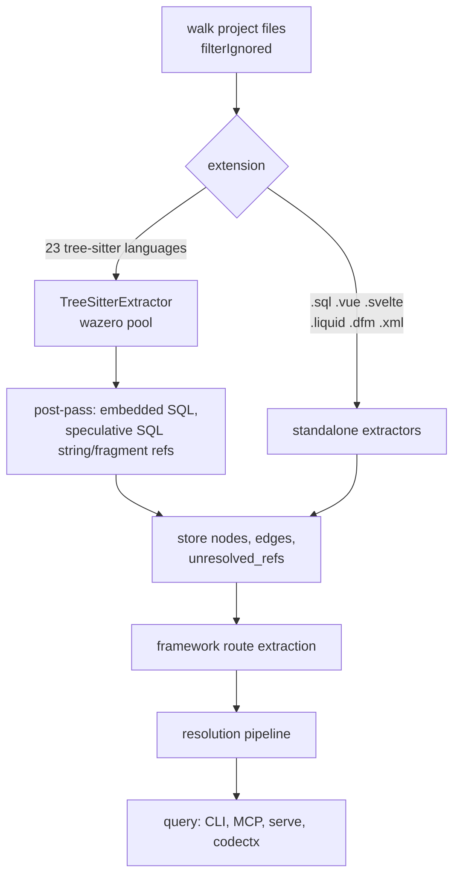
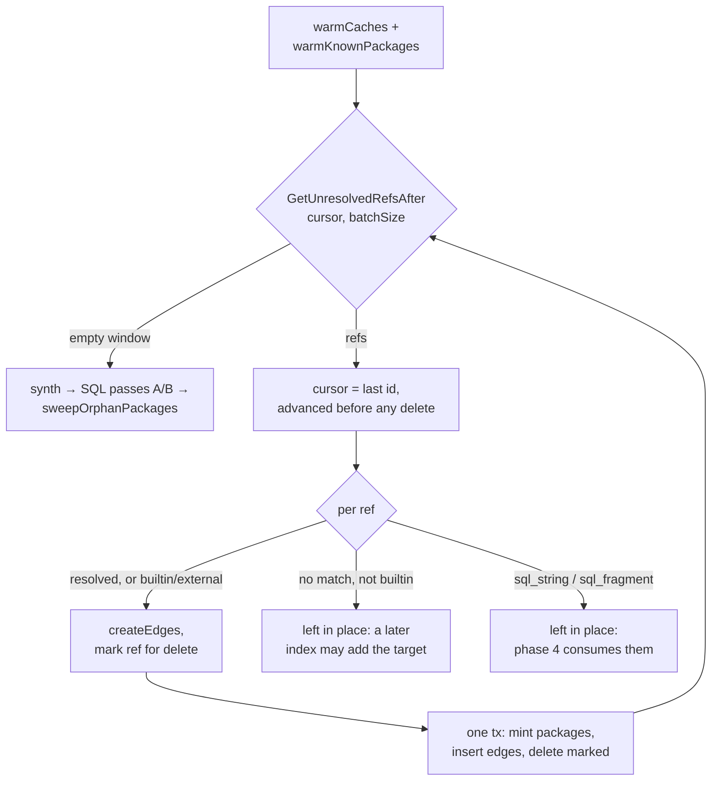

# code-intel

## What it does

Grep finds text. It cannot answer who calls this, what breaks if I change it, or where this route ends up, so an agent asking those questions reads files until it guesses.

This domain answers them from a real graph. It parses a project's source into symbols, stores them in SQLite, resolves cross-file references into edges, and serves structural queries over the result. Consumers are the `atomic code` CLI verbs, an MCP server, agents that compose the `agent-code-intel` partial, and the `serve` domain's code-graph view.

The index lives at `<projectRoot>/<harness.dir>/.atomic-index/atomic.db` (default `.claude/.atomic-index/atomic.db`), derived by `config.IndexDBPath` in [`atomic/internal/config/harness.go`](../../atomic/internal/config/harness.go).

## How it works

Extraction never creates a cross-file edge, which is why the two halves can run at different times and on different file sets.



Extraction emits nodes plus `UnresolvedReference` rows; resolution is what turns a reference into an edge.

### Stored vocabulary

Kind strings persist in SQLite, so these counts are asserted in tests and the slices, not the comments beside them, are the truth:

| Slice | Count | Pinned by |
|-------|-------|-----------|
| `AllNodeKinds` | 39 | `TestNodeKindCount` |
| `AllEdgeKinds` | 13 | `TestEdgeKindCount` |
| `AllLanguages` | 32 (incl. `unknown`) | `TestLanguageCount` |

Seven of the node kinds are SQL-dialect only: `stage`, `stream`, `task`, `model`, `file_format`, `macro`, `script`.

**Two `EdgeKind` constants are not edge kinds.** `ReferenceKindSQLString` (`"sql_string"`) and `ReferenceKindSQLFragment` (`"sql_fragment"`) are valid only in `UnresolvedReference.ReferenceKind`, and are deliberately excluded from `AllEdgeKinds`. Edges built from them always carry `Kind: references`.

**Provenance marks how an edge was derived.** Empty for direct extraction and resolution, `"embedded"` for embedded SQL, `"string-match"` for SQL string-match, `"heuristic"` for synthesis. `mcp/server.go:isSynthesizedProvenance` treats `"heuristic"` and `"string-match"` alike, annotating them as inferred in tool output.

### Extraction

**Local variables are suppressed inside function scopes.** A `VariableTypes` match mints a node only at `scopeDepth == 0` and only when the name is a single identifier, not a destructuring pattern's rendered text (`{ a, b }`). `FunctionScopeTypes` is wired for TypeScript, TSX, and JavaScript only; languages without it are byte-identical to the pre-suppression output. Namespace-scoped consts and Vue/Svelte `<script setup>` top-level state survive, because those are not function scopes. A suppressed initializer is still walked, so calls and JSX inside it are harvested.

**Embedded SQL covers 20 host languages in two grammar shapes.** Go uses a hand-written scanner, Python and TypeScript/TSX use tree-sitter harvesters, and the remaining 16 go through `HarvestEmbeddedLiterals`. Shape 1 grammars expose a content child; Shape 2 grammars require taking the node's own text, splicing `"?"` over interpolation byte ranges, and stripping the delimiter alphabet. The host extension set derives from `extToLanguage` plus the config table rather than a second hand-maintained list. `IsSQLLiteral` recognizes SQL structure only, with no stopword list; concatenated and multi-fragment queries are accepted false negatives.

**dbt and Snowflake parsing rules.** `modPat` in `sql.go` already absorbs `OR REPLACE`, `OR ALTER`, and `IF NOT EXISTS`; do not re-add them to new patterns. In `ref('pkg','model')` the package is the first positional, so a bare second string literal names a model only when two positionals are supplied, and the version is always a keyword argument. Path segment `/macros/` harvests macro definitions with no model node; `/tests/`, `/analyses/`, `/seeds/`, `/snapshots/` produce no model node. References inside a `...` byte span belong to the macro, not the model. Jinja `{# ... #}` comments are stripped before harvest.

### Reference resolution

Of the three things that can happen to a ref, only one deletes it. A ref that matched nothing is kept on purpose, because a later index may add the node it wants.



**The loop ends on an empty window, not on a barren one.** Windows are keyset-paginated by ref id, and the cursor advances to the last id in the window *before* any delete, so every ref is visited exactly once. A window that resolves nothing does `continue`, never `break`: unresolvable refs are not deleted, so an earlier design that broke on a barren window accumulated them as a wall at the front of the id-ordered scan and abandoned every resolvable ref behind it.

Package mints, edge inserts, and ref deletes share one transaction per window, so a crash cannot leave an edge pointing at a package node that was never persisted. `sweepOrphanPackages` runs unconditionally at the end, even when the run minted nothing, because a package's last importer may have disappeared since a prior run.

**Import classification follows Node resolution, not an allowlist.** For JS-family languages, any specifier not starting with `.`, `/`, or `#` is external. A trailing `?query` or `#fragment` is stripped first, unless the `#` is the first character (a [`package.json`](../../package.json) `"imports"` subpath). A `://` substring marks a URL-scheme specifier external ahead of any per-language branch. Import refs never reach generic name matching in `resolveOne` step 6, because an import node is named its own specifier and the fallback would resolve the ref back to its own owner.

**External JS imports converge on one package node.** A JS-family external import with a derivable npm name resolves to a shared `package:npm/<name>` hub via an `imports` edge, so every importer of `@hapi/hapi` points at one node instead of leaving an orphan import. Hubs are minted lazily in the resolution batch loop, never by extraction, and swept when the last importer disappears. They carry no `FilePath`, which is why neither `pruneDeleted` nor `DeleteNodesByFile` can reach them. Scoped to npm; Go, Python, and Rust imports are untouched, and a `://` specifier never mints one.

**SQL string-match never mints nodes.** An identifier-shaped literal that fails `IsSQLLiteral` becomes a speculative `sql_string` ref, matched after standard resolution against already-indexed table, view, procedure, and function names (pass A), then against columns for anchored owners (pass B). More than 3 exact-name candidates produces no edge at all. Confidence lands in `Edge.Metadata`; `high` requires the ref's `CalleeExpr` to be in the 28-name `QueryBuilderCallees` vocabulary, and membership alone never creates an edge. A literal that fails both the gate and the identifier shape gets one more chance at the fragment tier, whose tokens run the same passes and then have their confidence demoted one notch to offset prose-collision risk. Every ref of both kinds is deleted after the passes, so re-indexing is idempotent and no rows accumulate.

### Freshness and lifecycle

**Engine lifecycle.** `New` then `Init` or `Open`, use, `Close`. `Init` is idempotent; `Open` errors when the index is absent. Every facade method calls `requireDB()` first.

**Framework extraction ordering.** `ExtractFrameworkNodes` runs after `IndexAll` or `Sync` and before `ResolveReferences`, so route-to-handler references exist when resolution runs. `cli/code.go:runIndex` and `engine.ExtractFrameworkNodes` both encode this order.

**Watch is stubbed.** `Watch` and `StopWatch` return `ErrWatchNotImplemented`. Freshness comes from `atomic code sync` and the MCP daemon's poller.

### Scope and surfaces

**Tool gating.** Repos under 500 files get only `atomic_code_explore`, `atomic_code_search`, and `atomic_code_node`. `atomic_code_callers`, `callees`, `impact`, `status`, and `files` appear at 500 files and above.

**Repo-scoped ignore is exclude-only.** A committed [`.claude/atomic.toml`](../../.claude/atomic.toml) with `[code] ignore = [...]` filters files out of discovery. There is no negation syntax. A newly ignored file drops out of the list `filterIgnored` produces and is then reclaimed by the ordinary `pruneDeleted` path, so there is no separate ignore-prune step. A malformed TOML, invalid glob, or unknown key degrades to unfiltered indexing with a warning on stderr and never fails the run. This repo dogfoods it: [`.claude/atomic.toml`](../../.claude/atomic.toml) ignores `atomic/internal/serve/assets/vendor/**`.

**Realm mode targets realm-owned databases.** At a realm root, `atomic code` fans out across members and each member's index lives at `<realm>/.atomic/<key>.db`, configured by `<realm>/.atomic/code.toml`. The member's own `.claude/.atomic-index/atomic.db` is not the destination, so an empty member-local db after a realm index is the design, not data loss.

## Where it lives

Package layout under [`atomic/internal/codeintel/`](../../atomic/internal/codeintel):

```
types/          Node, Edge, Subgraph, kind and language enums
tsbinding/      wazero + tree-sitter WASM binding (separate go.mod)
grammars/       manifest README only; ts.wasm lives in tsbinding/lib/
extraction/     TreeSitterExtractor, wazero pool, string-literal harvesters
  languages/    23 per-language LanguageExtractor configs + registry
  standalone/   non-tree-sitter extractors: SQL, Vue, Svelte, Liquid, DFM, MyBatis
indexer/        Orchestrator: walk, dispatch, persist, post-passes, prune
db/             SQLite: schema.sql, CRUD, migrations, FTS search, tx
resolution/     reference -> edge pipeline, import resolver, name matcher
  frameworks/   23 web-route resolvers
  synthesis/    indirect-pattern edges (closures, emitters, interface impls)
graph/          Manager: BFS callers/callees, impact, paths, dead code
search/         3-tier FTS5 -> LIKE -> fuzzy
codectx/        markdown context digest assembled from a subgraph
engine/         facade over everything above; the only type CLI and MCP compile against
cli/            atomic code verbs + realm fan-out
mcp/            MCP server, daemon, proxy
realm/          scope resolution across wiki-realm members
validation/     tests only, no production code
```

### Entry points

| Path | Role |
|------|------|
| [`atomic/internal/codeintel/engine/engine.go`](../../atomic/internal/codeintel/engine/engine.go) | `Engine` facade wrapping db, pool, orchestrator, resolution pipeline, graph manager, searcher, context builder. `New(projectRoot)` uses the default index path; `NewWithDBPath(projectRoot, dbPath)` takes an explicit one. `IndexPath(projectRoot)` is the canonical DB-path deriver and delegates to `config.IndexDBPath`. |
| [`atomic/internal/codeintel/cli/code.go`](../../atomic/internal/codeintel/cli/code.go) | `RunCode` dispatches 11 verbs: `index sync status search callers callees impact node files affected explore`. `mcp` is handled before the engine is built (it is a proxy, not a query). `EnsureGitignore` appends the index dir to [`.gitignore`](../../.gitignore). |
| [`atomic/internal/codeintel/cli/realm.go`](../../atomic/internal/codeintel/cli/realm.go) | `RunCodeWithRealm` resolves scope before `repoctx.Resolve`, because a realm root need not be a git repo. Repo scope and no-index scope forward to `RunCode` byte-for-byte. |
| [`atomic/internal/codeintel/mcp/server.go`](../../atomic/internal/codeintel/mcp/server.go) | MCP server. 8 tools; `explore`, `search`, `node` always registered, the other five gated on `fileCount >= 500`. |
| [`atomic/internal/codeintel/mcp/daemon.go`](../../atomic/internal/codeintel/mcp/daemon.go), `proxy.go` | `RunDaemon(ctx, sourceRoot, dbPath, now, watchInterval)` with a flock-guarded auto-start; `SocketPathFromDB` / `LockPathFromDB` key the socket next to the db file so per-repo daemons never collide. Default sync interval 10s. |
| [`atomic/internal/codeintel/realm/resolver.go`](../../atomic/internal/codeintel/realm/resolver.go) | `Resolve(cwd, claudeMDPath)` returns `ScopeRepo`, `ScopeRealmAll`, `ScopeRealmMember`, or `ScopeNoIndex`. Never calls `os.Exit`. |

### Extraction

| Path | Role |
|------|------|
| [`atomic/internal/codeintel/extraction/extractor.go`](../../atomic/internal/codeintel/extraction/extractor.go) | `TreeSitterExtractor`: one file through the grammar to `ExtractionResult{Nodes, Edges, UnresolvedReferences, Errors}`. `LanguageExtractor.FunctionScopeTypes` drives the local-variable suppression gate. |
| [`atomic/internal/codeintel/extraction/helpers.go`](../../atomic/internal/codeintel/extraction/helpers.go) | `GenerateNodeID`: `kind + ":" + hex(sha256("filePath:kind:name:line"))[:32]`. Two early returns break the formula: file nodes are `"file:" + filePath`, package nodes are `"package:npm/" + name`. |
| [`atomic/internal/codeintel/extraction/languages/registry.go`](../../atomic/internal/codeintel/extraction/languages/registry.go) | Maps 23 `types.Language` values to grammar configs. `JSX` and `TSX` share one grammar. |
| [`atomic/internal/codeintel/extraction/standalone/sql.go`](../../atomic/internal/codeintel/extraction/standalone/sql.go) | The SQL extractor. Regex-based, dialect-agnostic, no tree-sitter. Covers DDL/DML symbols, column-level foreign keys, Snowflake constructs, dbt models and macros, and T-SQL lineage. Reused verbatim for embedded SQL literals. |
| [`atomic/internal/codeintel/extraction/standalone/embedded_sql.go`](../../atomic/internal/codeintel/extraction/standalone/embedded_sql.go) | `IsSQLLiteral` admission gate and `ExtractEmbeddedSQL` entry point. Stamps `Provenance: "embedded"` on everything it produces. |
| [`atomic/internal/codeintel/extraction/standalone/exts.go`](../../atomic/internal/codeintel/extraction/standalone/exts.go) | `SQLExtensions`: `.sql`, `.ddl`, `.pgsql`, `.mysql`, `.sql.jinja`. Single source of truth for SQL routing. |
| [`atomic/internal/codeintel/extraction/standalone/standalone.go`](../../atomic/internal/codeintel/extraction/standalone/standalone.go) | Vue and Svelte SFC extractors delegate `<script>` to the TS/JS grammar, strip its `file:<path>` node, and rewire both edges and unresolved refs onto the component node. Skipping the ref half breaks the `unresolved_refs.from_node_id` foreign key. |
| [`atomic/internal/codeintel/extraction/python_literals.go`](../../atomic/internal/codeintel/extraction/python_literals.go), `typescript_literals.go` | Tree-sitter literal harvesters. Interpolations substitute to `"?"`; Python spans carry `IsDocstring`. Both set `CalleeExpr` to the nearest enclosing call's bare name. |
| [`atomic/internal/codeintel/extraction/embedded_literals.go`](../../atomic/internal/codeintel/extraction/embedded_literals.go) | `HarvestEmbeddedLiterals`: one generic harvester covering the other 16 host languages, driven by an `EmbeddedLiteralConfig`. |
| [`atomic/internal/codeintel/extraction/standalone/go_harvester.go`](../../atomic/internal/codeintel/extraction/standalone/go_harvester.go) | Go literal harvester. Hand-written scanner, not tree-sitter. |

### Indexing and storage

| Path | Role |
|------|------|
| [`atomic/internal/codeintel/indexer/orchestrator.go`](../../atomic/internal/codeintel/indexer/orchestrator.go) | `IndexAll`, `Sync`, `IndexPaths`, `ScanFiles`. Owns the ignore filter, the extractor-version migration, the store-time owner guard, and deleted-file pruning. |
| [`atomic/internal/codeintel/indexer/embedded_sql_postpass.go`](../../atomic/internal/codeintel/indexer/embedded_sql_postpass.go) | Post-pass after host extraction: harvest literals, gate on `IsSQLLiteral`, find the owner node, extract, merge. Literals that fail the gate but look identifier-shaped become speculative `sql_string` refs. |
| [`atomic/internal/codeintel/indexer/sql_fragment_harvest.go`](../../atomic/internal/codeintel/indexer/sql_fragment_harvest.go) | The fragment tier for builder args like `where("title LIKE ?")`. Gate: at most 160 chars, at least one identifier token, at least one discriminator. Tokenizes past a 28-word stoplist into `sql_fragment` refs. |
| [`atomic/internal/codeintel/indexer/embedded_literals_config.go`](../../atomic/internal/codeintel/indexer/embedded_literals_config.go) | Per-language grammar node kinds for the 16 generic host languages. Probed from live grammars. |
| [`atomic/internal/codeintel/db/db.go`](../../atomic/internal/codeintel/db/db.go) | Connection setup: `SetMaxOpenConns(1)`, `SetMaxIdleConns(1)`, and a fixed pragma order with `busy_timeout` first. |
| [`atomic/internal/codeintel/db/schema.sql`](../../atomic/internal/codeintel/db/schema.sql) | Schema source of truth, embedded via `go:embed`. |
| [`atomic/internal/codeintel/db/tx.go`](../../atomic/internal/codeintel/db/tx.go) | Transaction-scoped writes. `Tx.NodeExists` backs the orchestrator's owner guard; `Tx.DeleteNodesByFile` / `DeleteUnresolvedRefsByFile` / `DeleteFile` back pruning. |

### Resolution and query

| Path | Role |
|------|------|
| [`atomic/internal/codeintel/resolution/pipeline.go`](../../atomic/internal/codeintel/resolution/pipeline.go) | `ResolveAndPersistBatched`. `resolveOne` runs 7 steps: external skip, pre-filter, JVM FQN fast path, framework resolve, import resolve, name match, highest-confidence pick. Import refs skip step 6; SQL string and fragment refs skip the loop entirely. |
| [`atomic/internal/codeintel/resolution/resolver.go`](../../atomic/internal/codeintel/resolution/resolver.go) | `ResolveImport` classifies one import as internal, external, or unresolved, and derives `PackageName` for JS-family externals. |
| [`atomic/internal/codeintel/resolution/name_matcher.go`](../../atomic/internal/codeintel/resolution/name_matcher.go) | Name and qualified-name matching, with SQL-scoped routing for single-dot references. |
| [`atomic/internal/codeintel/resolution/sql_string_match.go`](../../atomic/internal/codeintel/resolution/sql_string_match.go) | Passes A and B for `sql_string` and `sql_fragment` refs. Never mints nodes. |
| [`atomic/internal/codeintel/resolution/frameworks/frameworks.go`](../../atomic/internal/codeintel/resolution/frameworks/frameworks.go) | 23 route resolvers across Express, Django, Flask, FastAPI, Gin, Echo, Fiber, Gorilla, Chi, NestJS, Koa, Hapi, Fastify, Sails, Adonis, Actix, Axum, Rocket, Spring, Rails, Laravel, Symfony, Phoenix. Insertion order is resolution priority. |
| [`atomic/internal/codeintel/graph/graph.go`](../../atomic/internal/codeintel/graph/graph.go) | `Manager`: `GetCallers`, `GetCallees`, `GetImpactRadius`, `FindPath`, `GetTypeHierarchy`, `FindDeadCode`, `FindCircularDependencies`. Every method hydrates its own start node into `Subgraph.Nodes`; an unresolvable `startID` is an error, not an empty result. |
| [`atomic/internal/codeintel/search/search.go`](../../atomic/internal/codeintel/search/search.go) | `Searcher.Search` falls FTS5 to LIKE to fuzzy, returning the `Tier` that produced the hit. `TierFilter` covers metadata-only queries with no free-text term. |
| [`atomic/internal/codeintel/codectx/codectx.go`](../../atomic/internal/codeintel/codectx/codectx.go) | `FindRelevantContext` + `BuildContext`: the markdown digest `atomic code explore` returns. |
| [`atomic/internal/codeintel/types/types.go`](../../atomic/internal/codeintel/types/types.go) | The stored vocabulary. Kind strings are persisted in SQLite and must never change once data exists. |

### Artifacts

| Path | Role |
|------|------|
| [`templates/shared/agent-code-intel.md`](../../templates/shared/agent-code-intel.md) | The `agent-code-intel` partial: verb guidance, bounded-query rule, silent-degradation rule, realm fan-out. Composed into [`templates/agents/atomic-investigator.md`](../../templates/agents/atomic-investigator.md), `atomic-reviewer.md`, `atomic-auditor.md`, `atomic-wiki-inferrer.md`, and (via [`templates/shared/agent-implementer-workflow.md`](../../templates/shared/agent-implementer-workflow.md)) `atomic-implementer.md`. `atomic-strategist` carries its own narrower grounding rule instead. |

### Docs

| Path | Covers |
|------|--------|
| [`docs/reference/code-intel.md`](../reference/code-intel.md) | User-facing reference: verbs, index lifecycle, workflow integration. |
| [`docs/guides/code-intel-mcp.md`](../guides/code-intel-mcp.md) | Manual `.mcp.json` setup. MCP registration is opt-in and never written by `atomic claude install`. |
| [`docs/spec/code-intel-engine.md`](../spec/code-intel-engine.md) | Umbrella spec. Appendices A to O carry the schema, extraction contract, resolution order, MCP tools, and pragma order that the part-specs reference by letter. |
| [`docs/spec/code-intel-substrate.md`](../spec/code-intel-substrate.md) | DB, schema, indexer (CP1 to CP5). |
| [`docs/spec/code-intel-extraction.md`](../spec/code-intel-extraction.md) | Extraction (CP0 to CP9). |
| [`docs/spec/code-intel-resolution.md`](../spec/code-intel-resolution.md) | Resolution (CP10 to CP14). |
| [`docs/spec/code-intel-query.md`](../spec/code-intel-query.md) | Query, graph, context (CP15 to CP20). |
| [`docs/spec/code-intel-surfaces.md`](../spec/code-intel-surfaces.md) | CLI and MCP surfaces (CP21 to CP23). |
| [`docs/spec/code-intel-realm.md`](../spec/code-intel-realm.md), [`docs/design/code-intel-realm.md`](../design/code-intel-realm.md) | Realm scope resolution and fan-out across member repos. |
| [`docs/spec/code-mcp-per-repo.md`](../spec/code-mcp-per-repo.md) | Cwd-independent `atomic --repo <path> code mcp`. |
| [`docs/spec/code-intel-integration.md`](../spec/code-intel-integration.md), [`docs/design/code-intel-integration.md`](../design/code-intel-integration.md) | How agents consume the engine: the `agent-code-intel` partial contract, composition matrix, lifecycle index/sync points, degradation contract. |
| [`docs/spec/code-intel-package-nodes.md`](../spec/code-intel-package-nodes.md), [`docs/design/code-intel-package-nodes.md`](../design/code-intel-package-nodes.md) | Synthesized `package:npm/<name>` hubs: identity rule, mint loop, orphan sweep. |
| [`docs/spec/code-intel-local-variable-suppression.md`](../spec/code-intel-local-variable-suppression.md), [`docs/design/code-intel-local-variable-suppression.md`](../design/code-intel-local-variable-suppression.md) | Function-scoped local-variable suppression and the `extractor_version` migration. |
| [`docs/spec/graphignore.md`](../spec/graphignore.md), [`docs/design/graphignore.md`](../design/graphignore.md) | Repo-scoped `[code] ignore` globs. |
| [`docs/spec/sql-language-support.md`](../spec/sql-language-support.md) | The standalone SQL extractor: table, view, procedure, trigger, function nodes. |
| [`docs/spec/sql-dbt-snowflake.md`](../spec/sql-dbt-snowflake.md), [`docs/spec/sql-dbt-snowflake-v2.md`](../spec/sql-dbt-snowflake-v2.md) | Snowflake dialect and dbt extraction, plus their design docs and [`docs/research/sql-dbt-snowflake-coverage.md`](../research/sql-dbt-snowflake-coverage.md). |
| [`docs/spec/tsql-lineage-gaps.md`](../spec/tsql-lineage-gaps.md), [`docs/spec/tsql-lineage-gaps-v2.md`](../spec/tsql-lineage-gaps-v2.md) | T-SQL temp tables, `OUTPUT INTO`, PIVOT, column-level lineage. |
| [`docs/spec/embedded-sql-extraction.md`](../spec/embedded-sql-extraction.md), [`docs/spec/embedded-sql-language-expansion.md`](../spec/embedded-sql-language-expansion.md) | SQL inside host-language string literals. The expansion spec holds the probed grammar node-kind table. |
| [`docs/spec/sql-string-match.md`](../spec/sql-string-match.md), [`docs/design/sql-string-match.md`](../design/sql-string-match.md) | Matching identifier-shaped literals against indexed SQL names (C1 to C8). |
| [`scripts/code-eval/`](../../scripts/code-eval) | Eval harness: `fetch-corpus.sh`, `run-eval.sh`, `embedded-sql-eval.sh`, and fixtures for embedded SQL, T-SQL lineage, and SQL string-match. |
| [`atomic/cmd/embedded-sql-admission/`](../../atomic/cmd/embedded-sql-admission) | Standalone eval binary that reports which literals pass `IsSQLLiteral`. Not part of the [`atomic`](../../atomic) binary. |

## Constraints

**The kind-count comments in the source are wrong.** The section header comments in [`atomic/internal/codeintel/types/types.go`](../../atomic/internal/codeintel/types/types.go) still read "38 node-type strings" and "12 edge-type strings"; the tests assert 39 and 13. Trust the slices and the tests, not the comments.

**One SQLite connection, one pragma order.** `db/db.go` pins `SetMaxOpenConns(1)` and `SetMaxIdleConns(1)`, and applies `busy_timeout` before any other pragma. Reordering breaks the appendix-O contract, and `foreign_keys=ON` is per-connection, so a second connection would silently drop FK enforcement.

**Extraction is best-effort; storage is not.** Extraction records failures in `ExtractionResult.Errors` and never aborts. Storage is stricter: `unresolved_refs.from_node_id` has a foreign key, so a ref whose owner node never made it into `result.Nodes` would fail the whole file's transaction, bubble through `indexFiles` to `IndexAll`, and skip resolution for the entire run. `storeExtractionResult` checks `Tx.NodeExists` first and, when the owner is missing from both the file and the DB, skips the ref and records the skip in the file's `errors` column.

**`IndexPaths` does not prune.** `pruneDeleted` runs after `IndexAll` and `Sync`, deleting rows for files no longer on disk, one transaction per orphan so a crash mid-run leaves the rest intact. `IndexPaths` receives an explicit subset and would wrongly delete everything outside it.

**`extractor_version` is a hand-bumped self-healing migration.** `project_metadata.extractor_version` is currently `"2"`. Bump it in `indexer/orchestrator.go` whenever an `extraction/` change would produce different nodes, edges, or refs for a file whose content has not changed, since the content-hash dedup would otherwise hide the drift forever. A mismatch forces one full re-extraction, stamped only after the run succeeds, so a crashed migration retries instead of recording a false success.

**`.sql.jinja` is a compound extension.** `filepath.Ext("stg.sql.jinja")` returns `.jinja`, which routes nowhere. `compoundExt` in `orchestrator.go` checks the compound suffix first, and `exts.go:SQLExtensions` lists `.sql.jinja` so the admission guard and the extension map agree.

**Branding.** The reference TypeScript engine's product name must never appear in code, comments, identifiers, strings, tool names, or output. The slug is [`atomic`](../../atomic), tools are `atomic_code_*`, the data dir is `.atomic-index/`.

## Coupling

- **config** owns the paths. `engine.go`, `mcp/daemon.go`, `realm/resolver.go`, and `cli/code.go` all resolve the index location through `config.IndexDir` / `config.IndexDBPath` / `config.RepoConfigPath` in [`atomic/internal/config/harness.go`](../../atomic/internal/config/harness.go), so a `harness.dir` change moves the index everywhere at once. Repo-scoped ignore globs come from `config.LoadRepoConfig` + `config.NewIgnoreMatcher`, called by `engine.ensureIndexer`.
- **serve** consumes `engine.GetAllNodes` / `engine.GetAllEdges` for its full-graph export, and `graph.Manager`'s `GetCallers` / `GetCallees` / `GetImpactRadius` through the `CodeEngine` interface. Adding a `NodeKind` here requires a matching entry in serve's code-graph kind-to-group taxonomy, or the kind falls into the `other` bucket. See [`docs/wiki/serve.md`](serve.md).
- **doctor** category 11 ([`atomic/internal/doctor/checks_code_index.go`](../../atomic/internal/doctor/checks_code_index.go)) reports index health: absent is an informational PASS, stale is WARN, fresh is PASS. It imports `engine.IndexPath`, so a path-convention change touches both.
- **workflow** commands drive the index lifecycle, all on the same warm/cold rule: `atomic code sync` when the db exists, `atomic code index` without prompting when it does not, and silent degradation on any error. `/subagent-implementation` and `/autopilot` apply it at task start and re-sync after each green implementer commit; `/refresh-wiki` applies it before synthesis.
- [`atomic/cmd/atomic/main.go`](../../atomic/cmd/atomic/main.go) dispatches `code` into `cli.RunCodeWithRealm`. A new verb or flag also needs an entry in [`atomic/internal/cliusage/cliusage.go`](../../atomic/internal/cliusage/cliusage.go), or `atomic validate artifacts` will misjudge citations of it.
- [`atomic/internal/codeintel/tsbinding/`](../../atomic/internal/codeintel/tsbinding) is its own Go module. Bumping wazero or tree-sitter means running `go mod tidy` inside that directory, separately from the main module.
- MCP tool names are the public contract for IDE and agent integrations. Renaming an `atomic_code_*` tool breaks them.
- Changing extraction output invalidates [`scripts/code-eval/`](../../scripts/code-eval) corpus results.
