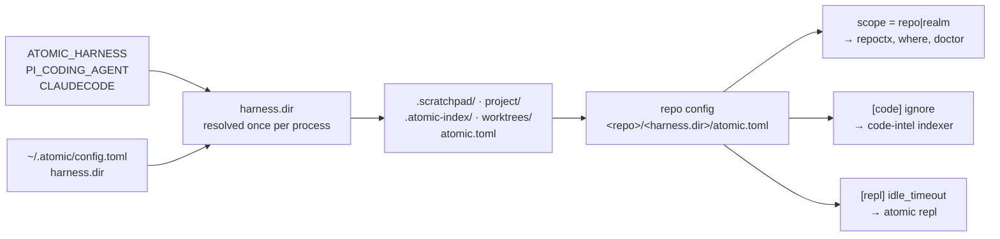
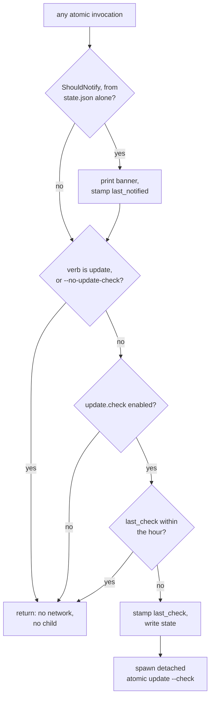

# config


## What it does


A conversation is not a place to keep a value that has to survive it. A preference, an install manifest, a scheduled reminder, and a record of what version is staged all need somewhere durable, and the repo-local directory they live beside cannot be a constant, because the harness that owns it varies ([`.claude`](../../.claude) for Claude Code, `.pi` for Pi).

This domain owns every value that persists between sessions and every path those values resolve to. Two config files carry the schema: `~/.atomic/config.toml` at user scope, and `<repo>/<harness.dir>/atomic.toml` at repo scope. It also owns the repo-local directory layout (`atomic repo init`), the session-start hook, reminders, follow-up entries, self-update state, and the cold-op briefs and document skeletons compiled into the binary.


## How it works


The repo config's own path depends on the user config, because `harness.dir` names the directory it lives in.



### Config schema

`atomic config list` is the only resolved-value surface. There is no rendered config file; `config.toml` is the single source of truth.

| Key | Scope | Type | Default | Controls |
|-----|-------|------|---------|----------|
| `output.signals.max_depth` | user | int | `3` | tree depth in `atomic signals scan` |
| `update.run_doctor` | user | bool | `true` | run doctor after `atomic update` |
| `update.check` | user | bool | `true` | the hourly detached background version lookup |
| `update.stage` | user | bool | `true` | once-per-version background download + checksum |
| `harness.dir` | user | string | [`.claude`](../../.claude) | the repo-local state-directory name |
| `repl.idle_timeout` | user, repo | duration | `1h` | idle window before a REPL session self-terminates |
| `code.ignore` | repo | []string | none | glob patterns excluded from the code-intel index |
| `scope` | repo | `repo`\|`realm` | none | declares this directory's own identity |

Machine-written tables, not user-settable via `atomic config set`: `[install]` (install manifest), `[claude.agents.<name>]` (per-agent model + effort override), `[pi.agents.<name>]` (Pi coding-agent override). `repl.idle_timeout` is the only key present at both scopes; repo wins over user, then a built-in `1h`.

### State-directory layout

```
~/.atomic/
├── config.toml            user config (only source of truth)
├── state.json             machine-managed self-update state
├── profile.md             user profile, @-ref'd from CLAUDE.md
├── backups/<ts>/          pre-write backups from claude install/update
├── pre-install/           write-once snapshot for claude uninstall
└── proposed/CLAUDE.md     merge target when installed CLAUDE.md diverges

~/.cache/atomic/staged/    downloaded release archive awaiting swap

<repo>/<harness.dir>/      default .claude
├── atomic.toml            repo config
├── .scratchpad/           + .scratchpad/reminders/
├── project/followups/     entries + INDEX.md + CLOSED.md
├── .atomic-index/         code-intel SQLite db
└── worktrees/
```

Every path under `~/.atomic/` derives from `config.Dir(home)` in [`atomic/internal/config/paths.go`](../../atomic/internal/config/paths.go). Every repo-local path derives from `harnessDir()` in [`atomic/internal/config/harness.go`](../../atomic/internal/config/harness.go). Neither file calls `os.UserHomeDir` from a helper; the caller injects `home` so tests use a temp dir.

### Resolving `harness.dir`

`harnessDir()` is a `sync.Once` cache over a five-rung ladder, most specific first:

```
ATOMIC_HARNESS env  ->  PI_CODING_AGENT=="true"  ->  CLAUDECODE=="1"  ->  config harness.dir  ->  .claude
(name, leading dot      (.pi)                        (.claude)
 tolerated; invalid
 falls through)
```

Rung 2 precedes rung 3 deliberately: a Pi agent launched inside Claude Code exposes both fingerprints.

### The self-update fast path

No [`atomic`](../../atomic) invocation touches the network itself. The banner renders from `state.json`, and `last_check` is stamped before the child spawns, so a crash between the two costs one skipped check rather than a spawn on every later invocation.



Gate 1 is what stops the child re-spawning a grandchild: the child's own invocation carries the `update` verb, so it returns before reaching the spawn.

### Scope discovery

`FindScopeRoot` walks past `.git` boundaries, because a realm root sits above its member repos, so the walk runs to the filesystem root. It takes the first marker of the *requested* kind and continues past a missing file, a parse error, an invalid value, or a marker naming the other kind. Discovery degrades; it never fails, which is why it returns no error.

`atomic where` reports four independent axes (repo root, repo-scope wiki, realm position, code-index scope), each carrying its own provenance: override, marker, git, registry, or cwd.


## Where it lives


### Artifacts

| Path | Role |
|------|------|
| [`commands/follow-up.md`](../../commands/follow-up.md) | `/follow-up [due <id> \| review]`. Reviews pending reminders; `review` triages stale follow-up entries with per-item `extend\|close\|promote\|skip`. |
| [`commands/git-cleanup.md`](../../commands/git-cleanup.md) | Runs `atomic prompt git-cleanup` through a `general-purpose` subagent (read-only scan), presents an indexed report, confirms before deleting. |
| [`commands/remind-me.md`](../../commands/remind-me.md) | Schedules a reminder file, then cron (under 1h) or Routines (1h and over). Degrades to file-only when neither scheduler is available. |
| [`commands/watch-ci.md`](../../commands/watch-ci.md) | Dispatches `general-purpose` with `model: haiku` as a background subagent to watch CI. Provider auto-detected. |

### Schema and paths

| Path | Role |
|------|------|
| [`atomic/internal/config/config.go`](../../atomic/internal/config/config.go) | User `Config` struct, lenient `Load`, strict `Validate`, `Get`/`Set`/`Unset`, atomic write via `os.Rename`. Levenshtein typo suggestion on unknown keys. |
| [`atomic/internal/config/paths.go`](../../atomic/internal/config/paths.go) | Every `~/.atomic/` path: `Dir`, `TOMLPath`, `StatePath`, `BackupDir`, `PreInstallDir`, `ProposedCLAUDEMD`, `ProfilePath`, `ProfileRelPath`. |
| [`atomic/internal/config/harness.go`](../../atomic/internal/config/harness.go) | `harnessDir()` five-rung resolver plus the eight repo-local path helpers every consumer calls instead of holding a private constant. |
| [`atomic/internal/config/repo.go`](../../atomic/internal/config/repo.go) | `RepoConfig` (`Code`, `Scope`, `Repl`), `LoadRepoConfig`, `IgnoreMatcher`, `ValidateIdleTimeout`. |
| [`atomic/internal/config/cli.go`](../../atomic/internal/config/cli.go) | `atomic config get\|set\|unset\|list\|path\|agents\|resolve` dispatch. Holds the `ApplyAgentsHook` seam. |
| [`atomic/internal/config/render.go`](../../atomic/internal/config/render.go) | `Resolved(cfg)` flat dotted-key map, consumed by `atomic config list` and `atomic config get`. |
| [`atomic/internal/config/statemigrate.go`](../../atomic/internal/config/statemigrate.go) | `MigrateUserState(home)`: legacy `~/.claude/.atomic` to `~/.atomic`, plus the compat symlink. |

### Agent overrides

| Path | Role |
|------|------|
| [`atomic/internal/config/agentoverride.go`](../../atomic/internal/config/agentoverride.go) | `AgentOverride{Model, Effort}`, the strict five-value `validEfforts` enum, the lenient `validModelFormat` check. |
| [`atomic/internal/config/agents.go`](../../atomic/internal/config/agents.go) | The `huh` model-Input + effort-Select form behind `atomic config agents`, `applyAgentOverrides` merge, `AgentTierSelector` test seam. |
| [`atomic/internal/config/pi_agent.go`](../../atomic/internal/config/pi_agent.go) | `ResolvePiAgents(globalPath, repoPath)` merges `[pi.agents.<name>]` from user and repo into a diagnostics envelope. Separate schema from Claude's. |

### Identity resolution

| Path | Role |
|------|------|
| [`atomic/internal/config/scope.go`](../../atomic/internal/config/scope.go) | `ValidScope`, `FindScopeRoot` (upward by-kind walk), `EnsureScopeMarker` (byte-preserving idempotent write), `ScopeSource` provenance enum. |
| [`atomic/internal/repoctx/repoctx.go`](../../atomic/internal/repoctx/repoctx.go) | `ResolveFrom(dir, override)` returns the working root plus its provenance: override, marker, git, cwd. `Resolve` is the provenance-discarding delegate. |
| [`atomic/internal/where/where.go`](../../atomic/internal/where/where.go), `format.go` | `atomic where`: four independent axes, each reporting its own provenance. |
| [`atomic/internal/repoinit/repoinit.go`](../../atomic/internal/repoinit/repoinit.go) | `Init(root)` runs seven idempotent layout guarantees for `atomic repo init`. |

### Hooks, reminders, follow-ups

| Path | Role |
|------|------|
| [`atomic/internal/hooks/hooks.go`](../../atomic/internal/hooks/hooks.go), `hooks_hujson.go` | Session-start payload plus install/uninstall of the settings.json registration. `hujson` parses settings leniently. |
| [`atomic/internal/reminder/reminder.go`](../../atomic/internal/reminder/reminder.go) | File-based reminder CRUD behind `atomic reminder add\|list\|show\|rm`. |
| [`atomic/internal/followups/`](../../atomic/internal/followups) | YAML-frontmatter entry parser, INDEX renderer, append-only `CLOSED.md`. Serves `atomic followups path\|render\|list\|add\|close`. |
| [`atomic/internal/prompt/prompt.go`](../../atomic/internal/prompt/prompt.go) | Shared TTY abstraction over `huh`: `Confirm`, `Select[T]`, and the `ErrNonInteractive`/`ErrAborted` sentinels. |

### Self-update

| Path | Role |
|------|------|
| [`atomic/internal/selfupdate/state.go`](../../atomic/internal/selfupdate/state.go) | The `~/.atomic/state.json` shape and its atomic read/write. |
| [`atomic/internal/selfupdate/selfupdate.go`](../../atomic/internal/selfupdate/selfupdate.go) | `Lookup`, `Apply`, `ApplyStaged`, `Stage`, `StageDir`, the lock primitives, and the pure `IsNewer`/`ShouldNotify` decision helpers. |
| [`atomic/cmd/atomic/main.go`](../../atomic/cmd/atomic/main.go) | `selfupdateFastPath` (banner + stamp-before-spawn), `runUpdateCheck`, `runUpdate`, `runUpdateApply`. |

### Embedded text

| Path | Role |
|------|------|
| [`atomic/internal/coldprompt/coldprompt.go`](../../atomic/internal/coldprompt/coldprompt.go) | `//go:embed` of `briefs/git-cleanup.md` and `briefs/claude-merge.md`, served by `atomic prompt <name>`. |
| [`atomic/internal/doctemplate/doctemplate.go`](../../atomic/internal/doctemplate/doctemplate.go) | `//go:embed templates/*.md` of eight document skeletons, served by `atomic template <name>`. |
| [`atomic/internal/dockerinit/dockerinit.go`](../../atomic/internal/dockerinit/dockerinit.go) | Scaffolds the Docker eval environment for `atomic docker init`. |

### Docs

| Path | Covers |
|------|--------|
| [`docs/spec/atomic-state-and-config.md`](../spec/atomic-state-and-config.md) | Config schema, `~/.atomic/` layout, `state.json` field table, precedence, validation policy. |
| [`docs/spec/configurable-state-paths.md`](../spec/configurable-state-paths.md) | The `harness.dir` key and the consumer sweep that threads it through every repo-local path. |
| [`docs/design/configurable-state-paths.md`](../design/configurable-state-paths.md) | Why `~/.atomic` is fixed (bootstrap cycle), why migration keeps a compat symlink, why `harness.dir` has no per-repo override. |
| [`docs/spec/selfupdate-state.md`](../spec/selfupdate-state.md) | `state.json` schema, the stamp-before-spawn detached child, once-per-version staging, the lock, the staged swap. |
| [`docs/design/selfupdate-state.md`](../design/selfupdate-state.md) | The measured root cause and the three architectures considered. |
| [`docs/spec/scope-marker.md`](../spec/scope-marker.md) | The `scope` marker: schema, by-kind walk, and the six checkpoints across `repoctx`, `where`, both init verbs, and doctor. |
| [`docs/design/scope-marker.md`](../design/scope-marker.md) | Why "first marker wins" alone breaks realm discovery, and the five settled decisions. |
| [`docs/spec/repo-init.md`](../spec/repo-init.md) | The `atomic repo init` guarantees and the git-check-ignore idempotency mechanism. |
| [`docs/design/repo-init.md`](../design/repo-init.md) | Effect-based idempotency over literal-line matching; the deliberately minimal managed rule set. |
| [`docs/spec/agents-effort-config.md`](../spec/agents-effort-config.md) | Current contract for `[claude.agents.<name>]`: `AgentOverride`, strict effort, lenient model, install-time patching. |
| [`docs/design/agents-effort-config.md`](../design/agents-effort-config.md) | Why the flat tier map grew into per-agent model + effort. |
| [`docs/spec/agent-model-overrides.md`](../spec/agent-model-overrides.md) | The original flat tier map. Partially superseded by `agents-effort-config.md`. |
| [`docs/spec/document-templates.md`](../spec/document-templates.md) | The eight `doctemplate` skeletons, the fail-loud rule for authoring commands, the `cliusage` lockstep requirement. |
| [`docs/design/document-templates.md`](../design/document-templates.md) | Why skeletons are embedded rather than shipped as `commands/_templates/*.md` files. |
| [`docs/spec/follow-ups-folder.md`](../spec/follow-ups-folder.md) | Folder layout, frontmatter schema, `INDEX.md` generation, `CLOSED.md` audit trail. |
| [`docs/spec/typed-followups.md`](../spec/typed-followups.md) | The `kind: finding` / `kind: plan` split and its staleness consequence. |
| [`docs/spec/cron-workflow.md`](../spec/cron-workflow.md) | `/remind-me` and `/follow-up`, the scheduling tools, 5-field cron expressions, jitter, 7-day expiry. |
| [`docs/spec/docker-eval-environment.md`](../spec/docker-eval-environment.md) | `atomic docker init`. Companion guide: [`docs/guides/evaluations.md`](../guides/evaluations.md). |
| [`docs/reference/agents.md`](../reference/agents.md) | User-facing `atomic config agents` walkthrough. The agent-roster half of this file belongs to the workflow domain. |


## Constraints


**`harness.dir` resolves once per process and never per call.** Tests must use `SetHarnessDirForTest(dir)`, which bypasses the `Once` and `os.UserHomeDir` entirely and returns a restore func. Rewriting `config.toml` mid-process will not change the resolved value.

**`harness.dir` is validated twice, and the read path is the stricter of the two in effect.** `Set` rejects empty, `.`, `..`, and any value containing `/`. `Load` re-applies the same shape check but falls back to the default instead of erroring, because an unvalidated value would otherwise reach `filepath.Join` unguarded in all eight repo-local helpers.

**`scope` is the only top-level scalar in the repo schema.** Every other top-level key names a table, so `checkUnknownRepoKeys` carries a separate `repoKnownTopLevelLeaves` set for it. Adding another top-level scalar means adding it there, or it warns as unknown.

**`EnsureScopeMarker` inserts above the first table header, never at EOF.** Appending would land the key inside the first table and it would parse as `code.scope`. The insertion point is found by tracking TOML bracket depth outside quoted strings, so an interior line of a multi-line array is not mistaken for a header. Line endings match the file's dominant convention, and every other byte is preserved. A file already declaring a different scope returns `ScopeMarkerConflict` and is never rewritten.

**`atomic where` spawns zero git subprocesses.** Its repo-root axis walks for a `.git` entry with `os.Stat` rather than running `git rev-parse --show-toplevel` the way `repoctx.ResolveFrom` does, so it does not understand submodules or `GIT_DIR` overrides. The divergence disappears wherever a `scope="repo"` marker exists, since the marker wins in both packages.

**Both config loaders are lenient on read and strict on write.** A missing file yields an empty config with no error, an unknown key yields a `Warning`, and malformed TOML yields an error the caller degrades on. `pi` is an opaque top-level table in both schemas: its child keys are structurally arbitrary and never warn, with semantic validation left to `ResolvePiAgents`.

**Two agent-override namespaces, one config file.** `[claude.agents.<name>]` carries `model` + `effort`, is written by `atomic config agents`, and is patched into installed agent frontmatter. `[pi.agents.<name>]` carries `model` + `thinking`, is read-only through `atomic config resolve --repo <root> --json`, and patches nothing. The Pi repo-side file is hardcoded at `<repo>/.pi/atomic.toml`, not `harness.dir`-resolved.

**`[claude.agents.<name>]` accepts nested tables only.** A scalar entry is a config decode error, not a lenient fallback. `effort` is a hard `Validate` failure outside `low|medium|high|xhigh|max`; `model` never blocks loading and only rejects whitespace and control characters, so a bare model id like `claude-opus-4-8` passes. An unknown agent name is a non-fatal `AgentWarnings` entry.

**`atomic config agents` builds its own `huh` form.** It needs a multi-field form that `internal/prompt` does not expose, so it defines parallel sentinels `ErrNonInteractiveAgents` and `ErrAgentsAborted` rather than reusing `prompt.ErrNonInteractive` / `prompt.ErrAborted`. Everything else that prompts routes through `internal/prompt`.

**`LoadState` never returns an error.** A read or unmarshal failure yields a zero-value `State`, because a corrupt state file must not block the verb the user actually invoked.

**The `--__background-check` marker is stripped from argv before any flag parser sees it**, so it never appears in `--help` or `cliusage` and `atomic validate artifacts` cannot flag a citation of it.

**Lock rules differ by caller.** Background staging uses `AcquireLock` / `ReleaseLock`, where release is fenced on the caller's own `ownedSince` token so a newer holder's lock is never clobbered. Foreground `atomic update` uses `AcquireOrTakeoverLock`: a lock younger than `StaleLockAfter` (10 minutes) is refused with its age named, older is taken over, and `--force` bypasses the age check only. `--force` never touches checksum verification. `ApplyStaged` re-derives the expected checksum from a fresh `Lookup` and never trusts the staged record's own recorded hash.

**`atomic repo init` is append-only and never commits.** Six of its seven guarantees answer "is this already ignored" by running `git check-ignore -q` against a nonexistent probe path, falling back to a literal line scan when git is absent or the root is not a work tree. Existing ignore content is never rewritten or reordered. Guarantee 5 (root `tmp/`) is the only rule not nested under `harness.dir`. The seventh, the `scope = "repo"` marker, returns an error rather than an `Action` on a conflicting existing value, so `Init` fails and the caller surfaces it.

**Follow-up plans are exempt from staleness.** `kind` defaults to `finding` when absent. `--severity` is required for findings and optional for plans, `isStale` returns false unconditionally for plans, and `ListEntries --stale` excludes them. `INDEX.md` renders the plans bucket first, then severity buckets. The pre-commit hook re-renders `INDEX.md` when entry files are staged.

**The session-start hook is an inline command, not a script.** `Install` registers the literal string `atomic hooks session-start` in `settings.json`; nothing is written to disk. `IsInstalled(scopeRoot)` returns `(installed, drifted, err)` where `drifted` is true when a legacy wrapper-script registration is still present, alone or alongside the inline one. Three best-effort ride-alongs run inside the hook and are individually silent on failure: profile refresh, wiki staleness (30-day threshold), and an `atomic where` orientation nudge that stays quiet in the plain no-wiki, no-realm case.

**Neither `coldprompt` nor `doctemplate` is an install artifact.** Both are compiled into the binary and never written to `~/.claude`, so Claude Code cannot surface them as invocable commands. Adding a brief means editing `coldprompt.go`, not `bundlemirror/mirror.go`.

**A `TestRootCmdExact<N>Verbs` test in [`atomic/cmd/atomic/main_test.go`](../../atomic/cmd/atomic/main_test.go) pins the exact top-level verb count.** Adding a verb from this domain means updating that test and the matching `cliusage` entry together.

### Known-stale cross-references

- [`docs/spec/atomic-binary.md`](../spec/atomic-binary.md) (bundle domain) still describes self-update as an in-process goroutine writing `~/.cache/atomic/update.json`, checked by the main thread on exit. The current mechanism is the detached child plus `~/.atomic/state.json`. [`docs/spec/selfupdate-state.md`](../spec/selfupdate-state.md) and [`docs/spec/atomic-state-and-config.md`](../spec/atomic-state-and-config.md) are current truth.
- [`docs/spec/agent-model-overrides.md`](../spec/agent-model-overrides.md)'s superseded banner names the override table `[agents.<name>]`. The live key is `[claude.agents.<name>]`.


## Coupling


| Direction | Contract |
|-----------|----------|
| → doctor | `checks_config.go` (category 9) imports both `config` and `selfupdate`: it validates `config.toml` and folds a non-empty `state.json` `last_result` into the same Result as a chronic-failure warning. A schema change to `Config` or to `UpdateState` lands here. |
| → doctor | `checks_repo_config.go` (category 13) imports `LoadRepoConfig`, `RepoConfigPath`, `ValidScope`, `NewIgnoreMatcher`, and `ValidateIdleTimeout`. It also reads `wiki.ReadWikiIndexPaths` to warn when `scope = "repo"` contradicts a `<wikis>`-registered realm root at the same path. |
| → doctor | `checks_followups.go` and `checks_profile.go` resolve their targets through `config.FollowupsDir` / `config.ProfilePath`, so their detail strings stay correct under a non-default `harness.dir`. |
| → doctor | `updatedoctor` reads `update.run_doctor`. |
| → doctor | [`atomic/internal/cliusage/cliusage.go`](../../atomic/internal/cliusage/cliusage.go) is the CLI-surface source of truth that `atomic validate artifacts` rule A1 lints against. This domain adds entries for `config resolve`, `repo init`, `prompt <name>`, and one `template <name>` row per `doctemplate.Names()` entry. Renaming or adding a skeleton requires editing both in lockstep. |
| → bundle | `claudeinstall.loadAgentOverrides` / `readPatchedEmbedded` read `Config.Claude.Agents` and patch `model:` and `effort:` frontmatter independently at install time. New `AgentOverride` fields propagate straight into install-time patching. |
| → bundle | `ApplyAgentsHook` (this domain, `cli.go`) is nil by default and satisfied at runtime by `claudeinstall.ReapplyAgents`. `main.go`'s `init()` closes the wiring, because `config` cannot import `claudeinstall` without a cycle. |
| → doctor | Config-to-installed-agent drift is caught by the existing category-1 install check via `claudeinstall.Diff`, and repaired by `atomic doctor --fix`. There is no dedicated drift check. |
| → code-intel | `LoadRepoConfig` and `NewIgnoreMatcher` are called by `engine.ensureIndexer` to filter indexer discovery. `codeintel/engine`, `mcp/daemon`, `realm/resolver`, and `cli/code` all derive the index path from `config.IndexDBPath` / `config.IndexDir`. |
| → repl | This domain owns the `[repl] idle_timeout` schema at both scopes and the shared `ValidateIdleTimeout`. `internal/repl`'s `resolveIdleTimeout` consumes both and resolves repo, then user, then `1h`. |
| → signals | `signals/tree.go` reads `output.signals.max_depth`, and derives its skip prefixes from `config.ScratchpadDir("")` / `config.ProjectDir("")` so the scan skips the harness dir under any `harness.dir`. |
| → serve | `serve/code_members.go` resolves member db paths via `config.IndexDBPath`. |
| → docs-meta | `docs/docs.go` writes the doc-surfaces cache under `config.ProjectDir(root)`. |
| → wiki | `wikiInitAction` calls `config.EnsureScopeMarker(absRoot, scope)` with its validated `--scope` value; a `ScopeMarkerConflict` exits 1 without touching either file. Outcome-enum changes in `scope.go` land there. |
| → workflow | `/subagent-implementation` Phase 3 shells out to `atomic followups add`. The four document-authoring command templates seed structure via `atomic template <name>` and hard-stop with a fail-loud message when the verb is unavailable. |
| → workflow | [`commands/setup-wiki.md`](../../commands/setup-wiki.md), [`commands/subagent-implementation.md`](../../commands/subagent-implementation.md), [`commands/subagent-diagnose.md`](../../commands/subagent-diagnose.md), and [`templates/shared/worktree-setup.md`](../../templates/shared/worktree-setup.md) call `atomic repo init` best-effort behind a `command -v atomic` guard. The binary-absent fallback is per call site, not per file: `setup-wiki.md` and the worktree-setup partial append to [`.gitignore`](../../.gitignore) manually; `subagent-implementation.md`'s Phase-1 scratchpad call and both of `subagent-diagnose.md`'s calls have no fallback and silently skip the ignore-rule guarantee. |
