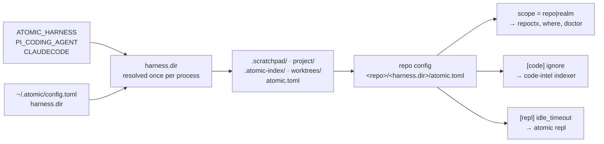
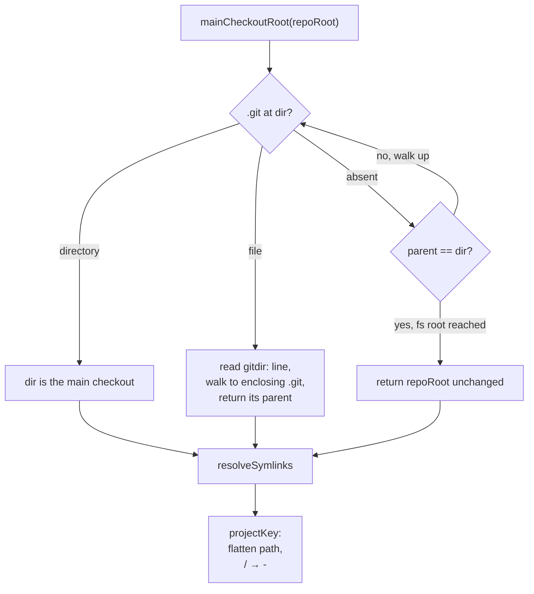
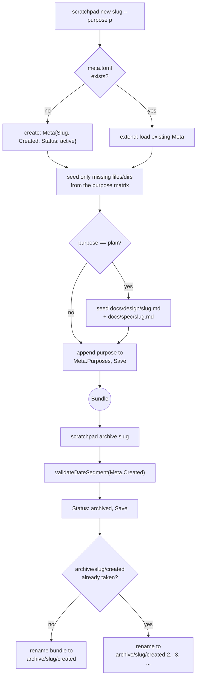
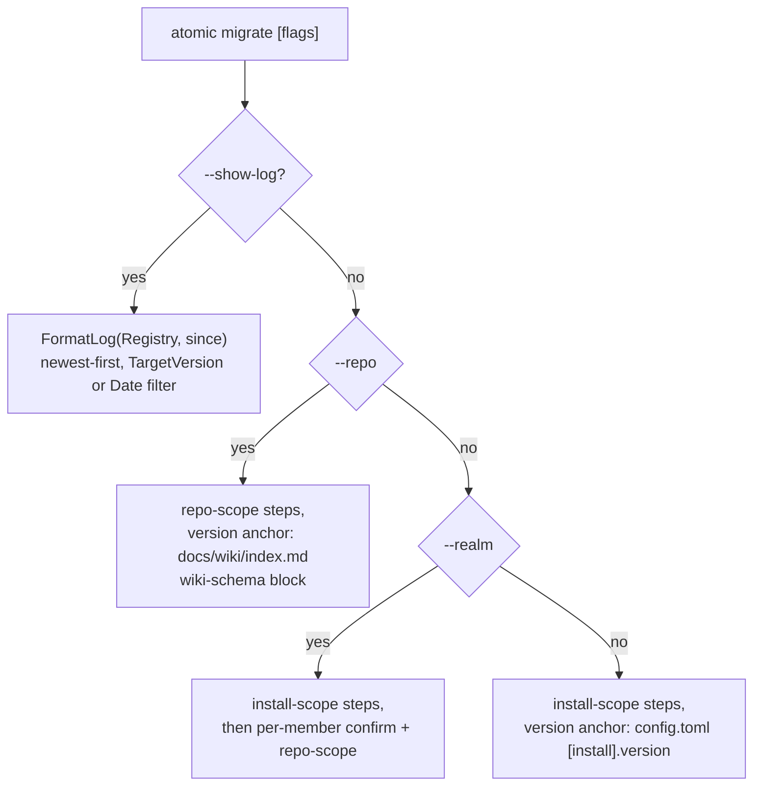
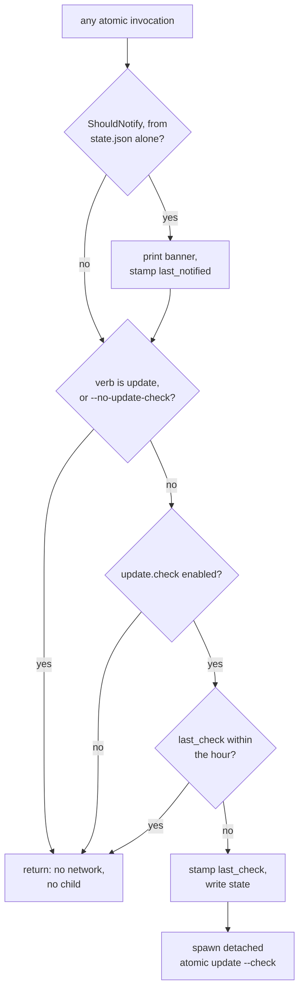
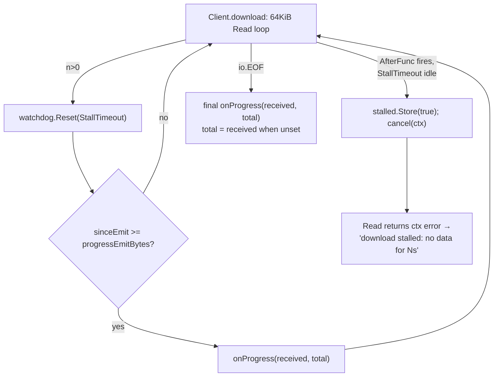

# config


## What it does


A conversation is not a place to keep a value that has to survive it. A preference, an install manifest, a scheduled reminder, a slug-keyed scratchpad bundle, and a record of what version is staged all need somewhere durable, and the repo-local directory they live beside cannot be a constant, because the harness that owns it varies ([`.claude`](../../.claude) for Claude Code, `.pi` for Pi).

This domain owns every value that persists between sessions and every path those values resolve to. Two config files carry the schema: `~/.atomic/config.toml` at user scope, and `<repo>/<harness.dir>/atomic.toml` at repo scope. It also owns the repo-local directory layout (`atomic repo init`), the project-keyed state home outside the repo (`~/.atomic/<project-key>/`), the `atomic scratchpad` bundle lifecycle, the session-start hook, reminders, follow-up entries, versioned migrations, self-update state, and the cold-op briefs and document skeletons compiled into the binary.


## How it works


The repo config's own path depends on the user config, because `harness.dir` names the directory it lives in.



### Config schema

`atomic config list` is the only resolved-value surface. There is no rendered config file; `config.toml` is the single source of truth.

| Key | Scope | Type | Default | Controls |
|-----|-------|------|---------|----------|
| `output.signals.max_depth` | user | int | `3` | tree depth in `atomic signals scan` |
| `update.run_doctor` | user | bool | `true` | run doctor after `atomic update` |
| `update.check` | user | bool | `true` | the hourly detached background version lookup |
| `update.stage` | user | bool | `true` | once-per-version background download + checksum |
| `harness.dir` | user | string | [`.claude`](../../.claude) | the repo-local state-directory name |
| `repl.idle_timeout` | user, repo | duration | `1h` | idle window before a REPL session self-terminates |
| `code.ignore` | repo | []string | none | glob patterns excluded from the code-intel index |
| `scope` | repo | `repo`\|`realm` | none | declares this directory's own identity |

Machine-written tables, not user-settable via `atomic config set`: `[install]` (install manifest and migration version anchor), `[claude.agents.<name>]` (per-agent model + effort override), `[pi.agents.<name>]` (Pi coding-agent override). `repl.idle_timeout` is the only key present at both scopes; repo wins over user, then a built-in `1h`.

### State-directory layout

```
~/.atomic/
├── config.toml            user config (only source of truth)
├── state.json             machine-managed self-update state
├── profile.md             user profile, @-ref'd from CLAUDE.md
├── backups/<ts>/          pre-write backups from claude install/update
├── pre-install/           write-once snapshot for claude uninstall
├── proposed/CLAUDE.md     merge target when installed CLAUDE.md diverges
└── <project-key>/         one entry per clone (main checkout root, flattened)
    ├── reports/<branch>/      /session-report output
    ├── reminders/             reminder files
    └── archive/<slug>/<created>/  retired scratchpad bundles

~/.cache/atomic/staged/    downloaded release archive awaiting swap

<repo>/<harness.dir>/      default .claude
├── atomic.toml            repo config
├── .scratchpad/<slug>/    scratchpad bundle: meta.toml + purpose-seeded files
├── project/followups/     entries + INDEX.md + CLOSED.md
├── .atomic-index/         code-intel SQLite db
└── worktrees/
```

Every path under `~/.atomic/` derives from `config.Dir(home)` in [`atomic/internal/config/paths.go`](../../atomic/internal/config/paths.go). Every repo-local path derives from `harnessDir()` in [`atomic/internal/config/harness.go`](../../atomic/internal/config/harness.go). Neither file calls `os.UserHomeDir` from a helper; the caller injects `home` so tests use a temp dir.

### Resolving `harness.dir`

`harnessDir()` is a `sync.Once` cache over a five-rung ladder, most specific first:

```
ATOMIC_HARNESS env  ->  PI_CODING_AGENT=="true"  ->  CLAUDECODE=="1"  ->  config harness.dir  ->  .claude
(name, leading dot      (.pi)                        (.claude)
 tolerated; invalid
 falls through)
```

Rung 2 precedes rung 3 deliberately: a Pi agent launched inside Claude Code exposes both fingerprints.

### Resolving the project-keyed state home

`ProjectStateDir(repoRoot)` is `~/.atomic/<project-key>/`, shared by every worktree of the same clone. The key is the flattened, symlink-resolved absolute path of the clone's **main checkout root**, found with no git subprocess — `mainCheckoutRoot` walks upward from `repoRoot` and reads `.git` directly.



Every branch resolves through `resolveSymlinks` before it becomes the key, because git itself writes an already-resolved absolute `gitdir:` target when creating a worktree — leaving the main-checkout branch unresolved would make a main checkout and its own worktree disagree on the key whenever the clone sits under a symlinked ancestor (macOS `/tmp` and `/var` both are). `BranchFromHEAD(repoRoot)` reads `<gitdir>/HEAD` the same way, with no upward walk (a worktree's own `HEAD` can differ from the main checkout's), and validates the parsed ref name or SHA prefix against `refNamePattern` before it is trusted as a path segment.

`ReportsDir(repoRoot, branch)` prefers the project-keyed `reports/<branchSegment>/` and falls back to the pre-relocation `ScratchpadDir(repoRoot)/session-reports/<branchSegment>/` only when that legacy directory already holds a report and the new one does not — so a report written before the relocation stays readable until `atomic migrate` moves it. `RemindersDir(root)` (harness.go) is a pure delegate to `ProjectRemindersDir(root)`; the legacy union lives one layer up, in `internal/reminder` (see Coupling).

### The `atomic scratchpad` bundle lifecycle

One slug-keyed bundle — `<scratchpad-root>/<slug>/meta.toml` plus purpose-seeded files — replaces the pre-relocation `<date>-<slug>` naming, so a task worked across several phases accumulates in one directory instead of a new one per phase per date.



The purpose matrix (`purposeFiles`/`purposeDirs` in [`atomic/internal/scratchpad/bundle.go`](../../atomic/internal/scratchpad/bundle.go)) seeds `BRIEF.md`, `STATE.md`, `FOLLOWUPS.md` for `plan`/`implement`/`fix`, adds `CONTEXT.md` for `diagnose`, and seeds `lenses/` + `findings/` directories (no files) for `review`. `scratchpad.List` applies one recursive rule to both the live scratchpad root (one level: `<slug>/meta.toml`) and the archive root (two levels: `<slug>/<created>/meta.toml`): it descends into a directory with no `meta.toml` of its own, and stops and emits at the first directory that does, so a pre-migration `reminders/` or `session-reports/` directory is skipped by the same content-based check rather than a name list. A corrupt `meta.toml` costs only its own entry, reported through a returned warning rather than the stdlib logger.

### Migration routing and the queryable log

`atomic migrate` runs one of four things depending on its flags, each answering a different scope question:



`migrate.Run` sorts the registry ascending by semver and applies every step whose `TargetVersion` exceeds the recorded version, stopping at the first error. The one registered `repo`-scope step, `scratchpadRelocate`, does two things unconditionally: `relocateReportsAndReminders` moves the legacy `session-reports/` and `reminders/` trees file-by-file to the project-keyed home (a same-relative-path collision is left in place under the legacy tree and reported, never overwritten), then `redateScratchpadBundles` renames a `<YYYY-MM-DD>-<slug>` directory to `<slug>` only when both `docs/design/<slug>.md` and `docs/spec/<slug>.md` confirm the stripped name as a real slug — a name only one doc confirms, or that two dated directories both strip to, is reported and left untouched. `FormatLog` walks `migrate.Registry` directly and renders only the entries carrying a non-empty `Summary`, so one list serves both step execution and `--show-log`; there is no parallel log registry.

### The self-update fast path

No [`atomic`](../../atomic) invocation touches the network itself. The banner renders from `state.json`, and `last_check` is stamped before the child spawns, so a crash between the two costs one skipped check rather than a spawn on every later invocation.



Gate 1 is what stops the child re-spawning a grandchild: the child's own invocation carries the `update` verb, so it returns before reaching the spawn.

### Download progress and stall abort

`Client.download` reads the response body in 64KiB chunks and resets a `time.AfterFunc` watchdog on every non-empty read. The watchdog fires only after `StallTimeout` (default `defaultStallTimeout`, 30s) passes with zero bytes, canceling the request's own context, so a slow-but-moving multi-minute transfer never trips it. That watchdog is the reason `downloadClient()` carries no `http.Client.Timeout` at all: the shared `httpClient()` used for `Lookup` keeps the 10s `lookupTimeout`, but that same cap applied to an archive body read used to abort any download slower than 10 seconds outright. Every `progressEmitBytes` (512 KiB) accumulated since the last tick calls `onProgress(received, total)`, and the loop calls it once more after `io.EOF`, substituting `received` for `total` when the server sent no `Content-Length`. Only the archive fetch inside `Client.Apply` and `Client.Stage` forwards `c.OnProgress`; every checksum-file `download` call passes `nil` and never reports.



A download aborts only on sustained silence, never on total elapsed time, and the emitted progress reaches nothing unless a caller wires an observer.

`runUpdate` is the only caller that wires one: `c.OnProgress = downloadProgressRenderer(os.Stdout, charmterm.IsTerminal(os.Stdout.Fd()))`, evaluated after the `--check` branch has already returned, so the foreground apply path gets a renderer and the `--check`-only path does not. `downloadProgressRenderer` itself returns `nil` off a TTY, since its `\r`-rewritten status line would otherwise print a new line on every tick into redirected output; on a TTY it rewrites one line in place, prints a trailing `\n` on the 100% tick, and goes quiet after. `runUpdateCheck`'s background staging call to `c.Stage` never assigns `OnProgress`, so an auto-spawned `atomic update --check` that also stages a release prints nothing regardless of TTY.

### Scope discovery

`FindScopeRoot` walks past `.git` boundaries, because a realm root sits above its member repos, so the walk runs to the filesystem root. It takes the first marker of the *requested* kind and continues past a missing file, a parse error, an invalid value, or a marker naming the other kind. Discovery degrades; it never fails, which is why it returns no error.

`atomic where` reports four independent axes: repo root and realm scope carry a `config.ScopeSource` provenance token (`none`, `marker`, `git`, `registry`, or `cwd`); repo-scope wiki presence and code-index scope report their own shape instead (`RepoScopeReport` has no `Source` field, and the code-index axis reuses `codeintel/realm`'s own scope enum). `atomic where --json` additionally reports the project-keyed state paths (`reports_root`, `reminders`, `archive`, unconditional) and, only when `report.RepoRoot.Path` itself holds a `.git` entry, `branch` and `reports` (a scope-marker root with no `.git` of its own omits both rather than guessing). `--repo <path>` relocates the whole report, branch and state paths included, to that path.


## Where it lives


### Artifacts

| Path | Role |
|------|------|
| [`context/commands/follow-up.md`](../../context/commands/follow-up.md) | `/follow-up [due <id> \| review]`. Reviews pending reminders; `review` triages stale follow-up entries with per-item `extend\|close\|promote\|skip`. |
| [`context/commands/git-cleanup.md`](../../context/commands/git-cleanup.md) | Runs `atomic prompt git-cleanup` through a `general-purpose` subagent (read-only scan), presents an indexed report, confirms before deleting. |
| [`context/commands/remind-me.md`](../../context/commands/remind-me.md) | Schedules a reminder file, then cron (under 1h) or Routines (1h and over). Degrades to file-only when neither scheduler is available. |
| [`context/commands/watch-ci.md`](../../context/commands/watch-ci.md) | Dispatches `general-purpose` with `model: haiku` as a background subagent to watch CI. Provider auto-detected. |

### Schema and paths

| Path | Role |
|------|------|
| [`atomic/internal/config/config.go`](../../atomic/internal/config/config.go) | User `Config` struct, lenient `Load`, strict `Validate`, `Get`/`Set`/`Unset`, atomic write via `os.Rename`. Levenshtein typo suggestion on unknown keys. |
| [`atomic/internal/config/paths.go`](../../atomic/internal/config/paths.go) | Every `~/.atomic/` path: `Dir`, `TOMLPath`, `StatePath`, `BackupDir`, `PreInstallDir`, `ProposedCLAUDEMD`, `ProfilePath`, `ProfileRelPath`. |
| [`atomic/internal/config/harness.go`](../../atomic/internal/config/harness.go) | `harnessDir()` five-rung resolver, the seven repo-local path helpers, and `RemindersDir` (a pure delegate to `ProjectRemindersDir`). |
| [`atomic/internal/config/projectstate.go`](../../atomic/internal/config/projectstate.go) | `ProjectStateDir`, `mainCheckoutRoot`, `resolveSymlinks`, `projectKey`, `ReportsRoot`/`ReportsDir`/`ReportsDirLegacy`, `ProjectRemindersDir`/`RemindersDirLegacy`, `ArchiveDir`, `BranchFromHEAD`, `validateRefName`/`parseHEAD`. |
| [`atomic/internal/config/pathsegment.go`](../../atomic/internal/config/pathsegment.go) | `ValidateSegment` and `ValidateDateSegment` — the one allow-list every path-segment source (slug, branch, bundle-created date) calls before a value reaches `filepath.Join`. |
| [`atomic/internal/config/repo.go`](../../atomic/internal/config/repo.go) | `RepoConfig` (`Code`, `Scope`, `Repl`), `LoadRepoConfig`, `IgnoreMatcher`, `ValidateIdleTimeout`. |
| [`atomic/internal/config/cli.go`](../../atomic/internal/config/cli.go) | `atomic config get\|set\|unset\|list\|path\|agents\|resolve` dispatch. Holds the `ApplyAgentsHook` seam. |
| [`atomic/internal/config/render.go`](../../atomic/internal/config/render.go) | `Resolved(cfg)` flat dotted-key map, consumed by `atomic config list` and `atomic config get`. |
| [`atomic/internal/config/statemigrate.go`](../../atomic/internal/config/statemigrate.go) | `MigrateUserState(home)`: legacy `~/.claude/.atomic` to `~/.atomic`, plus the compat symlink. |

### Scratchpad bundles

| Path | Role |
|------|------|
| [`atomic/internal/scratchpad/bundle.go`](../../atomic/internal/scratchpad/bundle.go) | `Meta`, `Bundle`, `Load`/`Save` (tolerant of unknown `meta.toml` keys, replayed via `extra`), `BundleRoot`, `New` (additive purpose-matrix seeding). |
| [`atomic/internal/scratchpad/list.go`](../../atomic/internal/scratchpad/list.go) | `List(root)` — the one recursive, content-based (`meta.toml` presence) rule shared by the live and archive roots; returns entries plus non-fatal warnings. |
| [`atomic/internal/scratchpad/archive.go`](../../atomic/internal/scratchpad/archive.go) | `ArchiveRoot`, `HasArchive`, `Archive` (status flip + dated move with same-day `-2`/`-3` collision suffix), `nextArchiveDest`. |
| [`atomic/cmd/atomic/cmd_scratchpad.go`](../../atomic/cmd/atomic/cmd_scratchpad.go) | `atomic scratchpad new\|path\|list\|archive` dispatch and the testable `scratchpadDispatch`/`*Action` seams. |

### Migration

| Path | Role |
|------|------|
| [`atomic/internal/migrate/migrate.go`](../../atomic/internal/migrate/migrate.go) | `Migration` type, [`Context`](../../Context), `Run` (ascending-semver step application, floor `0.0.0`). |
| [`atomic/internal/migrate/registry.go`](../../atomic/internal/migrate/registry.go) | `Registry` — the ordered slice every `init()` in this package appends to. |
| [`atomic/internal/migrate/schema.go`](../../atomic/internal/migrate/schema.go) | `<wiki-schema>N</wiki-schema>` read/write in a repo's [`docs/wiki/index.md`](index.md) — the repo-scope version anchor. |
| [`atomic/internal/migrate/steps.go`](../../atomic/internal/migrate/steps.go), `steps_scanignore.go` | Earlier registered steps: the signals→[`docs/wiki/`](.) relocation and `.signalsignore`→`atomic.toml [scan]` conversion. |
| [`atomic/internal/migrate/steps_scratchpad.go`](../../atomic/internal/migrate/steps_scratchpad.go) | The `1.2.0` repo-scope step: `scratchpadRelocate` (`relocateReportsAndReminders` + `redateScratchpadBundles`), and their helpers (`relocateTree`, `moveFileCrossDevice`, `pruneEmptyDirs`, `candidates`/`collisions`/`redateOne`). |
| [`atomic/internal/migrate/log.go`](../../atomic/internal/migrate/log.go) | `FormatLog(registry, since)` — newest-first rendering of log-carrying `Migration` entries, filtered by semver or `YYYY-MM-DD` date. |
| [`atomic/cmd/atomic/cmd_migrate.go`](../../atomic/cmd/atomic/cmd_migrate.go) | `atomic migrate [--repo <path>] [--realm <path>] [--show-log [<since>]]` routing, `migrateRepoAction`, `runMigrateRealm` (per-member confirm fan-out). |

### Agent overrides

| Path | Role |
|------|------|
| [`atomic/internal/config/agentoverride.go`](../../atomic/internal/config/agentoverride.go) | `AgentOverride{Model, Effort}`, the strict five-value `validEfforts` enum, the lenient `validModelFormat` check. |
| [`atomic/internal/config/agents.go`](../../atomic/internal/config/agents.go) | The `huh` model-Input + effort-Select form behind `atomic config agents`, `applyAgentOverrides` merge, `AgentTierSelector` test seam. |
| [`atomic/internal/config/pi_agent.go`](../../atomic/internal/config/pi_agent.go) | `ResolvePiAgents(globalPath, repoPath)` merges `[pi.agents.<name>]` from user and repo into a diagnostics envelope. Separate schema from Claude's. |

### Identity resolution

| Path | Role |
|------|------|
| [`atomic/internal/config/scope.go`](../../atomic/internal/config/scope.go) | `ValidScope`, `FindScopeRoot` (upward by-kind walk), `EnsureScopeMarker` (byte-preserving idempotent write), `ScopeSource` provenance enum. |
| [`atomic/internal/repoctx/repoctx.go`](../../atomic/internal/repoctx/repoctx.go) | `ResolveFrom(dir, override)` returns the working root plus its provenance: override, marker, git, cwd. `Resolve` is the provenance-discarding delegate. |
| [`atomic/internal/where/where.go`](../../atomic/internal/where/where.go), `format.go` | `atomic where`: four independent axes, each reporting its own provenance. |
| [`atomic/cmd/atomic/cmd_where.go`](../../atomic/cmd/atomic/cmd_where.go) | CLI dispatch, `--repo` override (relocates the whole report), `whereJSON` (additive `branch`/`reports`/`reports_root`/`reminders`/`archive` fields). |
| [`atomic/internal/repoinit/repoinit.go`](../../atomic/internal/repoinit/repoinit.go) | `Init(root)` runs seven idempotent layout guarantees for `atomic repo init`. |

### Hooks, reminders, follow-ups

| Path | Role |
|------|------|
| [`atomic/internal/hooks/hooks.go`](../../atomic/internal/hooks/hooks.go), `hooks_hujson.go` | Session-start payload plus install/uninstall of the settings.json registration. `hujson` parses settings leniently. |
| [`atomic/internal/reminder/reminder.go`](../../atomic/internal/reminder/reminder.go) | File-based reminder CRUD behind `atomic reminder add\|list\|show\|rm`; `unionEntries` and `findWritableByID` implement the project-keyed/legacy union (see Coupling). |
| [`atomic/internal/followups/`](../../atomic/internal/followups) | YAML-frontmatter entry parser, INDEX renderer, append-only `CLOSED.md`. Serves `atomic followups path\|render\|list\|add\|close`. |
| [`atomic/internal/prompt/prompt.go`](../../atomic/internal/prompt/prompt.go) | Shared TTY abstraction over `huh`: `Confirm`, `Select[T]`, and the `ErrNonInteractive`/`ErrAborted` sentinels. |

### Self-update

| Path | Role |
|------|------|
| [`atomic/internal/selfupdate/state.go`](../../atomic/internal/selfupdate/state.go) | The `~/.atomic/state.json` shape and its atomic read/write. |
| [`atomic/internal/selfupdate/selfupdate.go`](../../atomic/internal/selfupdate/selfupdate.go) | `Lookup`, `Apply`, `ApplyStaged`, `Stage`, `StageDir`, the lock primitives, `CompareSemver`/`IsValidSemver` (shared with `migrate`), the pure `IsNewer`/`ShouldNotify` decision helpers, and `download`'s stall watchdog + throttled `OnProgress` emission. |
| [`atomic/cmd/atomic/cmd_update.go`](../../atomic/cmd/atomic/cmd_update.go) | `selfupdateFastPath` (banner + stamp-before-spawn), `runUpdateCheck`, `runUpdate`, `runUpdateApply`, `downloadProgressRenderer` (TTY-only `\r`-rewritten status line). |
| [`atomic/cmd/atomic/main.go`](../../atomic/cmd/atomic/main.go) | Calls `selfupdateFastPath` before Cobra dispatch, and root-command registration for every verb in this domain. |

### Embedded text

| Path | Role |
|------|------|
| [`atomic/internal/coldprompt/coldprompt.go`](../../atomic/internal/coldprompt/coldprompt.go) | `//go:embed` of four briefs (`git-cleanup`, `claude-merge`, `implementer`, `reviewer`), served by `atomic prompt <name>`. The last two are the prompt source for `/subagent-implementation`, `/subagent-diagnose`, and `/quick-fix`'s implement-review loop. |
| [`atomic/internal/doctemplate/doctemplate.go`](../../atomic/internal/doctemplate/doctemplate.go) | `//go:embed templates/*.md` of the document skeletons, served by `atomic template <name>` and consumed directly by `scratchpad.New`'s purpose-matrix seeding. |
| [`atomic/internal/dockerinit/dockerinit.go`](../../atomic/internal/dockerinit/dockerinit.go) | Scaffolds the Docker eval environment for `atomic docker init`. |

### Docs

| Path | Covers |
|------|--------|
| [`docs/spec/atomic-state-and-config.md`](../spec/atomic-state-and-config.md) | Config schema, `~/.atomic/` layout including `<project-key>/`, `state.json` field table, precedence, validation policy. |
| [`docs/spec/configurable-state-paths.md`](../spec/configurable-state-paths.md) | The `harness.dir` key and the consumer sweep that threads it through every repo-local path. |
| [`docs/design/configurable-state-paths.md`](../design/configurable-state-paths.md) | Why `~/.atomic` is fixed (bootstrap cycle), why migration keeps a compat symlink, why `harness.dir` has no per-repo override. |
| [`docs/spec/serve-plans-page.md`](../spec/serve-plans-page.md) | Canonical spec for `atomic scratchpad`, the project-keyed state home, `mainCheckoutRoot`/`projectKey` derivation, and the migration log fields — shares scope with the (separate) `atomic serve` "Plans" surface, out of this domain. |
| [`docs/spec/atomic-migrate-framework.md`](../spec/atomic-migrate-framework.md) | The `Migration` type, registry, `--repo`/`--realm`/`--show-log` flags, and the install/repo version-anchor split. |
| [`docs/spec/selfupdate-state.md`](../spec/selfupdate-state.md) | `state.json` schema, the stamp-before-spawn detached child, once-per-version staging, the lock, the staged swap. |
| [`docs/design/selfupdate-state.md`](../design/selfupdate-state.md) | The measured root cause and the three architectures considered. |
| [`docs/spec/scope-marker.md`](../spec/scope-marker.md) | The `scope` marker: schema, by-kind walk, and the six checkpoints across `repoctx`, `where`, both init verbs, and doctor. |
| [`docs/design/scope-marker.md`](../design/scope-marker.md) | Why "first marker wins" alone breaks realm discovery, and the five settled decisions. |
| [`docs/spec/atomic-where.md`](../spec/atomic-where.md) | `atomic where`'s four axes and the `--json` field set, including the project-keyed state extensions. |
| [`docs/spec/repo-init.md`](../spec/repo-init.md) | The `atomic repo init` guarantees and the git-check-ignore idempotency mechanism. |
| [`docs/design/repo-init.md`](../design/repo-init.md) | Effect-based idempotency over literal-line matching; the deliberately minimal managed rule set. |
| [`docs/spec/agents-effort-config.md`](../spec/agents-effort-config.md) | Current contract for `[claude.agents.<name>]`: `AgentOverride`, strict effort, lenient model, install-time patching. |
| [`docs/design/agents-effort-config.md`](../design/agents-effort-config.md) | Why the flat tier map grew into per-agent model + effort. |
| [`docs/spec/agent-model-overrides.md`](../spec/agent-model-overrides.md) | The original flat tier map. Partially superseded by `agents-effort-config.md`. |
| [`docs/spec/document-templates.md`](../spec/document-templates.md) | The `doctemplate` skeletons, the fail-loud rule for authoring commands, the `cliusage` lockstep requirement. |
| [`docs/design/document-templates.md`](../design/document-templates.md) | Why skeletons are embedded rather than shipped as `context/_partials/*.md` files. |
| [`docs/spec/follow-ups-folder.md`](../spec/follow-ups-folder.md) | Folder layout, frontmatter schema, `INDEX.md` generation, `CLOSED.md` audit trail. |
| [`docs/spec/typed-followups.md`](../spec/typed-followups.md) | The `kind: finding` / `kind: plan` split and its staleness consequence. |
| [`docs/spec/cron-workflow.md`](../spec/cron-workflow.md) | `/remind-me` and `/follow-up`, the scheduling tools, 5-field cron expressions, jitter, 7-day expiry. |
| [`docs/spec/docker-eval-environment.md`](../spec/docker-eval-environment.md) | `atomic docker init`. Companion guide: [`docs/guides/evaluations.md`](../guides/evaluations.md). |
| [`docs/reference/agents.md`](../reference/agents.md) | User-facing `atomic config agents` walkthrough. The agent-roster half of this file belongs to the workflow domain. |
| [`docs/reference/conventions.md`](../reference/conventions.md) | User-facing description of the scratchpad, the project-keyed state home, and `atomic where --json`/`atomic migrate --show-log` as the resolution mechanism. |


## Constraints


**`harness.dir` resolves once per process and never per call.** Tests must use `SetHarnessDirForTest(dir)`, which bypasses the `Once` and `os.UserHomeDir` entirely and returns a restore func. Rewriting `config.toml` mid-process will not change the resolved value.

**`harness.dir` is validated twice, and the read path is the stricter of the two in effect.** `Set` rejects empty, `.`, `..`, and any value containing `/`. `Load` re-applies the same shape check but falls back to the default instead of erroring, because an unvalidated value would otherwise reach `filepath.Join` unguarded in the repo-local helpers.

**`scope` is the only top-level scalar in the repo schema.** Every other top-level key names a table, so `checkUnknownRepoKeys` carries a separate `repoKnownTopLevelLeaves` set for it. Adding another top-level scalar means adding it there, or it warns as unknown.

**`EnsureScopeMarker` inserts above the first table header when one exists, and appends at EOF only when the file has none.** Appending ahead of a table header would land the key inside that table and it would parse as `code.scope`. The insertion point is found by tracking TOML bracket depth outside quoted strings, so an interior line of a multi-line array is not mistaken for a header. Line endings match the file's dominant convention, and every other byte is preserved. A file already declaring a different scope returns `ScopeMarkerConflict` and is never rewritten.

**`atomic where` spawns zero git subprocesses.** Its repo-root axis walks for a `.git` entry with `os.Stat` rather than running `git rev-parse --show-toplevel` the way `repoctx.ResolveFrom` does, so it does not understand submodules or `GIT_DIR` overrides. `mainCheckoutRoot` and `BranchFromHEAD` in `projectstate.go` follow the same no-subprocess discipline: they read `.git`/`gitdir:`/`HEAD` bytes directly. The `atomic where` divergence disappears wherever a `scope="repo"` marker exists, since the marker wins in both packages.

**Both config loaders are lenient on read and strict on write.** A missing file yields an empty config with no error, an unknown key yields a `Warning`, and malformed TOML yields an error the caller degrades on. `pi` is an opaque top-level table in both schemas: its child keys are structurally arbitrary and never warn, with semantic validation left to `ResolvePiAgents`.

**Two agent-override namespaces, one config file.** `[claude.agents.<name>]` carries `model` + `effort`, is written by `atomic config agents`, and is patched into installed agent frontmatter. `[pi.agents.<name>]` carries `model` + `thinking`, is read-only through `atomic config resolve --repo <root> --json`, and patches nothing. The Pi repo-side file is hardcoded at `<repo>/.pi/atomic.toml`, not `harness.dir`-resolved.

**`[claude.agents.<name>]` accepts nested tables only.** A scalar entry is a config decode error, not a lenient fallback. `effort` is a hard `Validate` failure outside `low|medium|high|xhigh|max`; `model` never blocks loading and only rejects whitespace and control characters, so a bare model id like `claude-opus-4-8` passes. An unknown agent name is a non-fatal `AgentWarnings` entry.

**`atomic config agents` builds its own `huh` form.** It needs a multi-field form that `internal/prompt` does not expose, so it defines parallel sentinels `ErrNonInteractiveAgents` and `ErrAgentsAborted` rather than reusing `prompt.ErrNonInteractive` / `prompt.ErrAborted`. Everything else that prompts routes through `internal/prompt`.

**`LoadState` never returns an error.** A read or unmarshal failure yields a zero-value `State`, because a corrupt state file must not block the verb the user actually invoked.

**Path-segment validation has one enforcement point for scratchpad-owned paths.** `ValidateSegment` (`pathsegment.go`) is an allow-list, not a deny-list — a value is rejected because it isn't on the list, never because it "looks" hostile — and every scratchpad-adjacent source of an untrusted path segment (a slug, a bundle's `meta.toml` `created` date via `ValidateDateSegment`) routes through it before reaching `filepath.Join`. A failing value is always an error: never a substituted default, never a sanitized-in-place rewrite. The branch label used in `ReportsDir` goes through a separate, more permissive gate: `branchSegment` (`projectstate.go`) only replaces `/` with `-`, and the branch string itself is validated upstream by `validateRefName` in `parseHEAD` — a distinct allow-list that permits `/`, which `ValidateSegment`'s pattern would reject.

**`parseHEAD` trusts exactly three shapes.** `ref: refs/heads/<name>` (validated against `refNamePattern`, no `..`, no leading/trailing/doubled `/`, no path component starting with `.`), a bare 40-character hex SHA (truncated to a 7-character prefix), or nothing. `HEAD` is repo-controlled state a hostile or corrupt repository can shape arbitrarily, and its content eventually becomes a path segment (`ReportsDir`), so anything outside those three shapes reports `false` rather than a truncated prefix of untrusted bytes.

**`ReportsDir`'s legacy fallback only fires when the legacy directory already has a report and the new one does not.** The default has to be the new home: `ReportsDir` decides where a report is written as well as read, and preferring legacy whenever the new directory was empty would write every report to legacy and then find it there forever.

**`scratchpad.Archive` never overwrites an existing archive.** A same-day re-archive of a slug (created and archived twice within one calendar date) collides on `archive/<slug>/<created>/`; `nextArchiveDest` takes the next free `-2`, `-3` suffix instead — the archive is the audit trail, so losing one to a same-day repeat is not an option.

**`migrate.Run`'s registry copy is never mutated, and version comparison is one shared function.** `Run` copies the caller's `registry` slice before sorting, and both `migrate.Run` and `FormatLog` compare versions via `selfupdate.CompareSemver` — there is no separate semver implementation in `migrate`.

**`scratchpadRelocate`'s bundle-rename half only fires on a name both docs confirm.** A `<YYYY-MM-DD>-<slug>` directory whose stripped name only one of `docs/design/<slug>.md` or `docs/spec/<slug>.md` matches, or that another dated directory also strips to, is reported and left untouched rather than guessed at — the migration step never renames on a name list.

**The `--__background-check` marker is stripped from argv before any flag parser sees it**, so it never appears in `--help` or `cliusage` and `atomic validate artifacts` cannot flag a citation of it.

**Lock rules differ by caller.** Background staging uses `AcquireLock` / `ReleaseLock`, where release is fenced on the caller's own `ownedSince` token so a newer holder's lock is never clobbered. Foreground `atomic update` uses `AcquireOrTakeoverLock`: a lock younger than `StaleLockAfter` (10 minutes) is refused with its age named, older is taken over, and `--force` bypasses the age check only. `--force` never touches checksum verification. `ApplyStaged` re-derives the expected checksum from a fresh `Lookup` and never trusts the staged record's own recorded hash.

**A download times out on silence, never on duration.** `downloadClient()` sets no `http.Client.Timeout`, unlike `httpClient()`'s 10s `lookupTimeout`; only the per-read stall watchdog (`StallTimeout`, default 30s) governs abort, so a multi-minute archive transfer on a slow link is never killed by an overall deadline. Only an archive download reports progress: `Client.Apply` and `Client.Stage` pass `c.OnProgress` to `download`, but every checksum-file fetch passes `nil`.

**`atomic repo init` is append-only and never commits.** Of its seven guarantees, two create a directory (`.scratchpad/`, [`.claude/project/`](../../.claude/project), no git involved), four answer "is this already ignored" by running `git check-ignore -q` against a nonexistent probe path (falling back to a literal line scan when git is absent or the root is not a work tree), and the last writes the scope marker. Existing ignore content is never rewritten or reordered. Guarantee 5 (root `tmp/`) is the only ignore rule not nested under `harness.dir`. The scope-marker guarantee returns an error rather than an `Action` on a conflicting existing value, so `Init` fails and the caller surfaces it.

**Follow-up plans are exempt from staleness.** `kind` defaults to `finding` when absent. `--severity` is required for findings and optional for plans, `isStale` returns false unconditionally for plans, and `ListEntries --stale` excludes them. `INDEX.md` renders the plans bucket first, then severity buckets. The pre-commit hook re-renders `INDEX.md` when entry files are staged.

**The session-start hook is an inline command, not a script.** `Install` registers the literal string `atomic hooks session-start` in `settings.json`; nothing is written to disk. `IsInstalled(scopeRoot)` returns `(installed, drifted, err)` where `drifted` is true when a legacy wrapper-script registration is still present, alone or alongside the inline one. Three best-effort ride-alongs run inside the hook and are individually silent on failure: profile refresh, wiki staleness (30-day threshold), and an `atomic where` orientation nudge that stays quiet in the plain no-wiki, no-realm case.

**Neither `coldprompt` nor `doctemplate` is an install artifact.** Both are compiled into the binary and never written to `~/.claude`, so Claude Code cannot surface them as invocable commands. Adding a brief means editing `coldprompt.go`, not `bundlemirror/mirror.go`.

**A `TestRootCmdExact<N>Verbs` test in [`atomic/cmd/atomic/main_test.go`](../../atomic/cmd/atomic/main_test.go) pins the exact top-level verb count.** Adding a verb from this domain means updating that test and the matching `cliusage` entry together.

### Known-stale cross-references

- [`docs/spec/atomic-binary.md`](../spec/atomic-binary.md) (bundle domain) still describes self-update as an in-process goroutine writing `~/.cache/atomic/update.json`, checked by the main thread on exit. The current mechanism is the detached child plus `~/.atomic/state.json`. [`docs/spec/selfupdate-state.md`](../spec/selfupdate-state.md) and [`docs/spec/atomic-state-and-config.md`](../spec/atomic-state-and-config.md) are current truth.
- [`docs/spec/agent-model-overrides.md`](../spec/agent-model-overrides.md)'s superseded banner names the override table `[agents.<name>]`. The live key is `[claude.agents.<name>]`.


## Coupling


| Direction | Contract |
|-----------|----------|
| → doctor | `checks_config.go` (category 9) imports both `config` and `selfupdate`: it validates `config.toml` and folds a non-empty `state.json` `last_result` into the same Result as a chronic-failure warning. A schema change to `Config` or to `UpdateState` lands here. |
| → doctor | `checks_repo_config.go` (category 13) imports `LoadRepoConfig`, `RepoConfigPath`, `ValidScope`, `NewIgnoreMatcher`, and `ValidateIdleTimeout`. It also reads `wiki.ReadWikiIndexPaths` to warn when `scope = "repo"` contradicts a `<wikis>`-registered realm root at the same path. |
| → doctor | `checks_followups.go` and `checks_profile.go` resolve their targets through `config.FollowupsDir` / `config.ProfilePath`, so their detail strings stay correct under a non-default `harness.dir`. |
| → doctor | `updatedoctor` reads `update.run_doctor`. Doctor also nudges "run `atomic migrate`" when the binary version exceeds `config.toml [install].version`. |
| → doctor | [`atomic/internal/cliusage/cliusage.go`](../../atomic/internal/cliusage/cliusage.go) is the CLI-surface source of truth that `atomic validate artifacts` rule A1 lints against. This domain adds entries for `config resolve`, `repo init`, `prompt <name>`, `migrate` (with `--repo`/`--realm`/`--show-log`), `scratchpad new\|path\|list\|archive`, and one `template <name>` row per `doctemplate.Names()` entry. Renaming or adding a skeleton or a verb requires editing both in lockstep. |
| → bundle | `claudeinstall.loadAgentOverrides` / `readPatchedEmbedded` read `Config.Claude.Agents` and patch `model:` and `effort:` frontmatter independently at install time. New `AgentOverride` fields propagate straight into install-time patching. |
| → bundle | `ApplyAgentsHook` (this domain, `cli.go`) is nil by default and satisfied at runtime by `claudeinstall.ReapplyAgents`. `main.go`'s `init()` closes the wiring, because `config` cannot import `claudeinstall` without a cycle. |
| → bundle | `atomic update` (`cmd_update.go:runUpdate`) auto-runs install-scope migration steps after artifact refresh, in semver order, before exiting. |
| → doctor | Config-to-installed-agent drift is caught by the existing category-1 install check via `claudeinstall.Diff`, and repaired by `atomic doctor --fix`. There is no dedicated drift check. |
| → code-intel | `LoadRepoConfig` and `NewIgnoreMatcher` are called by `engine.ensureIndexer` to filter indexer discovery. `codeintel/engine`, `mcp/daemon`, `realm/resolver`, and `cli/code` all derive the index path from `config.IndexDBPath` / `config.IndexDir`. |
| → repl | This domain owns the `[repl] idle_timeout` schema at both scopes and the shared `ValidateIdleTimeout`. `internal/repl`'s `resolveIdleTimeout` consumes both and resolves repo, then user, then `1h`. |
| → signals | `signals/tree.go` reads `output.signals.max_depth`, and derives its skip prefixes from `config.ScratchpadDir("")` / `config.ProjectDir("")` so the scan skips the harness dir under any `harness.dir`. |
| → serve | `serve/code_members.go` resolves member db paths via `config.IndexDBPath`. `atomic serve`'s "Plans" surface ([`docs/spec/serve-plans-page.md`](../spec/serve-plans-page.md)) reads `scratchpad.List`, `config.ArchiveDir`, and the doctemplate-seeded `docs/design/<slug>.md`/`docs/spec/<slug>.md` pair this domain writes, across every git worktree of a repo. |
| → docs-meta | `docs/docs.go` writes the doc-surfaces cache under `config.ProjectDir(root)`. |
| → wiki | `wikiInitAction` calls `config.EnsureScopeMarker(absRoot, scope)` with its validated `--scope` value; a `ScopeMarkerConflict` exits 1 without touching either file. Outcome-enum changes in `scope.go` land there. The `<wiki-schema>N</wiki-schema>` block `migrate/schema.go` reads and writes is the same block [`docs/wiki/index.md`](index.md)'s frontmatter carries. |
| → workflow | `/subagent-implementation` Phase 3 shells out to `atomic followups add`. Command templates seed structure via `atomic scratchpad new <slug> --purpose <p>` and `atomic template <name>`, hard-stopping with a fail-loud message when the verb is unavailable. |
| → workflow | [`context/commands/setup-wiki.md`](../../context/commands/setup-wiki.md), [`context/commands/subagent-implementation.md`](../../context/commands/subagent-implementation.md), [`context/commands/subagent-diagnose.md`](../../context/commands/subagent-diagnose.md), and [`context/_partials/worktree-setup.md`](../../context/_partials/worktree-setup.md) call `atomic repo init` best-effort behind a `command -v atomic` guard. The binary-absent fallback is per call site, not per file: `setup-wiki.md` and the worktree-setup partial append to [`.gitignore`](../../.gitignore) manually; `subagent-implementation.md`'s Phase-1 scratchpad call and both of `subagent-diagnose.md`'s calls have no fallback and silently skip the ignore-rule guarantee. |
| → reminder | `internal/reminder.unionEntries` reads both `config.RemindersDir` (project-keyed) and `config.RemindersDirLegacy`, unioning in any legacy entry whose id is absent from the project-keyed set; `findWritableByID` restricts mutation (`set-due`, `rm`) to the project-keyed directory alone and refuses a legacy-only id with a `run atomic migrate --repo` remedy rather than promoting it on write. |
