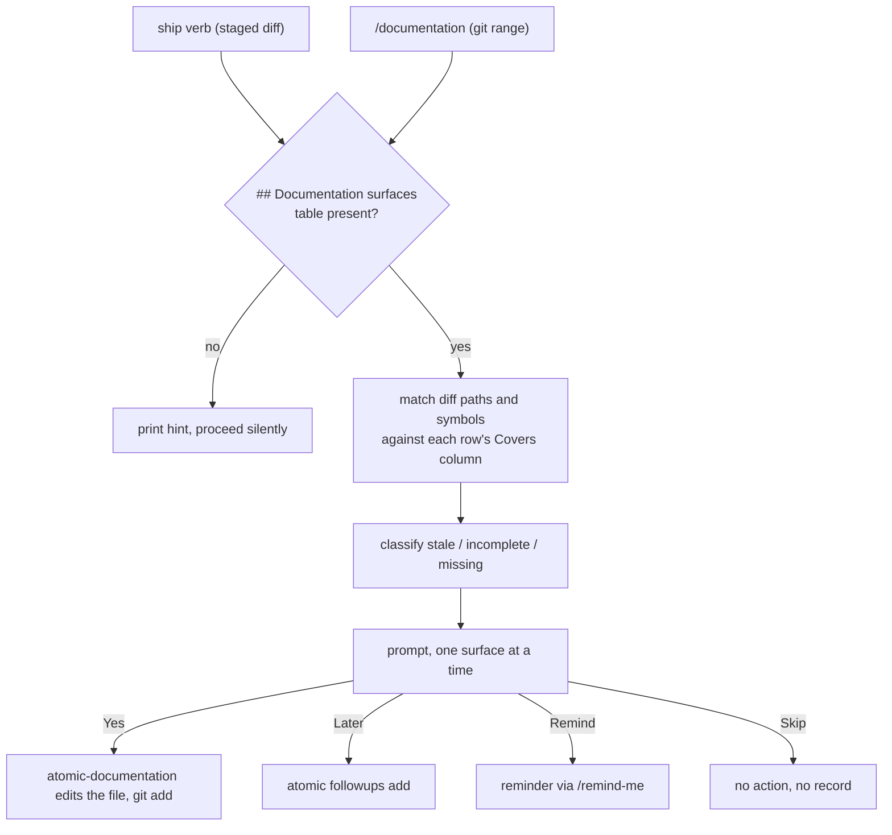
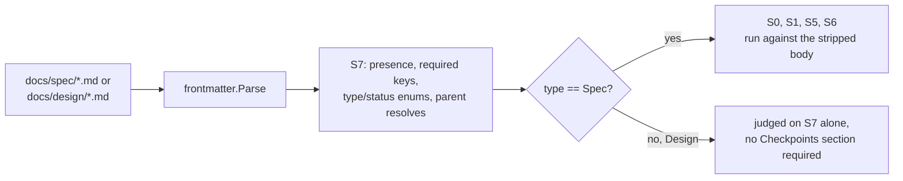

# docs-meta

## What it does

Documentation drifts silently: nothing fails when a page stops matching the code, so the gap is only found by the reader it misleads. And a repo with no stated voice grows one dialect per surface, so a spec, a README, and an agent prompt end up reading as if three people wrote them.

This domain answers both. It defines the voice for every file the repo ships and a separate one for Claude's terminal replies, and it routes each diff to the pages that diff invalidates, at the moment the diff is committed.

## How it works

### Reply voice and file voice

There is no third voice. A spec and a README differ in length and structure, not in voice.

| | Atomic output style | atomic-writing |
|---|---|---|
| Governs | how Claude talks | what Claude writes into files |
| Applies to | main-agent TUI replies | every `.md` file the repo ships, prompt artifacts included |
| Form | fragments, dropped articles, ASCII only | full sentences where prose fits, Mermaid where a picture fits |
| Defined in | [`context/output-styles/atomic.md`](../../context/output-styles/atomic.md) | [`context/skills/atomic-writing/SKILL.md`](../../context/skills/atomic-writing/SKILL.md) |
| Reaches subagents | no | yes |

Output styles attach to the main agent only, so a subagent never sees the atomic reply style. Each agent source composes [`context/_partials/agent-atomic-voice.md`](../../context/_partials/agent-atomic-voice.md) instead, which is why a subagent still answers tersely.

### Diagram layout limits

[`references/mermaid.md`](../../context/skills/atomic-writing/references/mermaid.md)'s diagram-type table sits above a second table, one row per rendering-legibility failure and how to count it:

| Rule | Limit | Check |
|------|-------|-------|
| Direction | `TD` unless the diagram is a straight chain of at most 5 nodes with one-line labels, in which case `LR` is allowed | Count the nodes in the chain; a branch or a chain over 5 nodes forces `TD` |
| Side by side | At most 4 nodes at the same depth; a node fans out to at most 4 | Count nodes sharing a rank, and each node's outgoing edges |
| Label width | At most 24 characters per line, at most 3 lines, split with `<br/>` | Count characters per line in each label |
| Edges | At most 12; at most 2 backward | Count the edges, then how many point to an earlier node |
| Subgraphs | At most 3, never nested | Count `subgraph` keywords |
| Sequence | At most 6 participants, at most 12 messages, participant names of at most 2 words | Count `participant`/actor declarations, arrow lines, words per name |
| ER and class | At most 8 entities, at most 5 attributes each | Count entity or class blocks, and attribute lines |
| Color | No `style`, `classDef`, `linkStyle`, `fill:`, or `%%{init` line | `awk '/^```mermaid/,/^```$/' <file> \| grep -nE 'fill:|^\s*(style|classDef|linkStyle) |%%\{init'` prints nothing |

Over any limit, the rule is to split by abstraction level: one overview diagram with a node per stage, then one diagram per stage under its own `###` heading.

The Mermaid types listed as not used in these docs each paint a fixed palette the host theme cannot restyle: `journey`, `mindmap`, `timeline`, `gantt`, `pie`, `quadrantChart`, `sankey`, `gitGraph`. `journey`, `mindmap`, and `timeline` carry named replacements: `journey` becomes a `sequenceDiagram` when parties exchange messages or a table otherwise, `mindmap` becomes an indented tree in a fenced block, `timeline` becomes a table with one row per event. A separate fact governs subgraphs: a subgraph's `direction` is ignored once any node inside it links outside the subgraph, so nesting subgraphs to force layout does not work.

`SKILL.md` rule 1 points at this table after its per-diagram-type node budgets (9 nodes for a flowchart, 6 participants for a sequence, 8 entities for an ER or class diagram), and its pre-save checklist checks a `flowchart LR` misuse, more than 4 nodes side by side, and any `style`/`fill:` line against it. The worked "Prose that should have been a diagram" example in `SKILL.md`'s `## Examples` section now draws `flowchart TD`.

### Routing a diff to a page

Every branch below ends in a decision the user made, which is why nothing here writes a page unprompted.



Matching is LLM judgment inside the current turn. No Go code parses the surfaces table, and no doctor check validates it.

### The cache and its exit codes

`atomic docs stale` returns 0 fresh, 1 stale, 2 error. Mtime drift and set drift each mark the cache stale on their own. Mtime drift catches new and edited docs. Set drift compares the paths on disk against those the cache lists, which is the only thing that catches a deletion, because deleting a file bumps no surviving file's mtime. A missing cache is exit 2, not exit 1: `docs stale: cache not found at <path> — run scan first`. The stale sentinel reads `docs stale: doc files are newer than doc-surfaces cache`.

Scan scope is fixed: [`docs/`](..), `doc/`, `documentation/`, `wiki/`, `ADR/`, `adr/`, `decisions/`, plus [`README.md`](../../README.md) at the repo root only. A doc tree outside that list is invisible to `atomic docs scan`, though `[scan] ignore` globs in [`.claude/atomic.toml`](../../.claude/atomic.toml) (or a legacy `.signalsignore`) can still exclude paths inside it.

### A frontmatter contract for design and spec files

[`docs/spec/doc-frontmatter.md`](../spec/doc-frontmatter.md) specifies a YAML frontmatter block (`type`, `description`, `domain`, `parent`, `status`) for every `docs/design/<topic>.md` and `docs/spec/<topic>.md` file, so family membership and shipped state become queryable without prose grep. `domain` is required only on a family root, a file with no `parent` key; a file that carries `parent` inherits `domain` from the chain at read time. `status` is one of `draft`, `active`, `shipped`, and the spec assigns the stamping of `shipped` (plus `shipped_sha`) to the finalize phase of `/subagent-implementation` and `/autopilot`, never to automatic derivation from checkpoint completion.

The spec assigns enforcement to `atomic validate spec`: discover `docs/spec/*.md` and `docs/design/*.md`, strip the leading block before any rule runs (so `mdparse.IsATXOnly`, which reads a `---` under a non-empty line as a setext heading underline, never mistakes the block's closing fence for one), and gate the existing S0/S1/S5/S6 checkpoint rules to files whose `type` is `Spec`. A new S7 rule checks the block itself, unconditionally, on every discovered file.

A file's `type` decides which rule set runs against it; S7 checks the block on every file regardless of type.

### Gating validation rules by type

S7 runs on every file; only a `type: Spec` file also gets the checkpoint rules.



[`docs/design/doc-consolidation.md`](../design/doc-consolidation.md) frames this as phase 1, and carries `domain: docs-meta` in its own frontmatter. Phase 2 gives design and spec files a contracted role in wiki inference (Steps 3-5 of [`context/skills/atomic-wiki/references/repo.md`](../../context/skills/atomic-wiki/references/repo.md)); its diagram-carry-over slice has shipped, through [`docs/design/diagram-legibility.md`](../design/diagram-legibility.md) and [`docs/spec/diagram-legibility.md`](../spec/diagram-legibility.md), leaving a purpose-and-vocabulary role for design docs in wiki pages open. Phase 3 adds a consolidation verb that folds a family of shipped specs into `docs/design/<feature>.md` and retires them. [`docs/spec/doc-frontmatter.md`](../spec/doc-frontmatter.md), the phase 1 spec, states its own non-goals: no `feature:` key (family membership is the `parent` chain, resolved at read time), no change to `docs/wiki/*.md` or bucket-doc frontmatter (each already carries its own contract), no wiki-pipeline role for design/spec files (that is phase 2, now partly shipped as above), and no consolidation verb, lineage table, or spec retirement (phase 3).

## Where it lives

### Voice

| Path | Role |
|------|------|
| [`context/output-styles/atomic.md`](../../context/output-styles/atomic.md) | Atomic TUI reply style: drop-list, the verbatim mannered-prose rule, the phrases-readers-hate list, the `[thing] [action] [reason]` pattern, a 120-word default length, the `# Format routing` table, the Auto-Clarity escape hatch, and the `# Boundaries` voice split. |
| [`context/skills/atomic-writing/SKILL.md`](../../context/skills/atomic-writing/SKILL.md) | The voice for files. A `## Structure before sentences` section fixing the page reading order, numbered sentence-level rules, an avoid/use replacement table, a per-surface length table, and a pre-save checklist; rule 1 and the checklist both point at `references/mermaid.md`'s layout table. |
| [`context/skills/atomic-writing/references/mermaid.md`](../../context/skills/atomic-writing/references/mermaid.md) | Loaded on demand when a diagram is being written: type selection from the reader's question, a layout section (direction, width, density, color; see above), and the label and syntax rules that decide whether a block renders or ships as a raw fence. |
| [`context/_partials/agent-atomic-voice.md`](../../context/_partials/agent-atomic-voice.md) | Response-voice rule for subagents replying to an orchestrator. Composed by every agent source under [`context/agents/`](../../context/agents). |
| [`docs/spec/legible-output.md`](../spec/legible-output.md) | Format-routing contract for [`context/output-styles/atomic.md`](../../context/output-styles/atomic.md) and [`docs/reference/output-style.md`](../reference/output-style.md). |
| [`docs/design/legible-output.md`](../design/legible-output.md) | The pattern-verdict table folding the candidate patterns down to the kept routes, plus the out-of-scope rejection of rendered-HTML reply surfaces. |
| [`docs/reference/output-style.md`](../reference/output-style.md) | Human-facing output-style reference. Carries `## Format routing vocabulary` and `## Two surfaces, one file voice`. |

### Diagram legibility

| Path | Role |
|------|------|
| [`docs/design/diagram-legibility.md`](../design/diagram-legibility.md) | Design doc for issue #272's gaps: `references/mermaid.md` had no rule for direction, width, density, or dark-mode color, and a domain's design-doc diagrams never reached its wiki page. Weighs where the layout rules should live (mermaid.md reference, chosen, over `SKILL.md` body or a Go/`atomic validate` parser) and how a design diagram reaches the wiki (redrawn against source by the writer, chosen, over a code copy step or a link-only pointer). |
| [`docs/spec/diagram-legibility.md`](../spec/diagram-legibility.md) | The contract: `references/mermaid.md`'s layout table and type-ban shape it (checkpoint 1, in this domain, shipped), plus [`context/skills/atomic-wiki/references/repo.md`](../../context/skills/atomic-wiki/references/repo.md), `realm.md`, and [`context/agents/atomic-wiki-writer.md`](../../context/agents/atomic-wiki-writer.md) gaining a design-doc-to-wiki diagram-carry-over step (checkpoints 2-3, wiki domain, shipped), and reference-doc rows plus a [`docs/design/doc-consolidation.md`](../design/doc-consolidation.md) change-log entry (checkpoint 4, shipped). Non-goals: no Mermaid-parsing `atomic validate` rule, no new diagram-trigger floor, no purpose-or-vocabulary role for design docs in wiki pages yet, no backfill of existing diagrams outside this change's own design doc edits. |

### Diff routing and the doc-surfaces cache

| Path | Role |
|------|------|
| [`context/skills/atomic-documentation/SKILL.md`](../../context/skills/atomic-documentation/SKILL.md) | Diff-to-surface classifier and content generator. Maintenance and authoring modes; emits the YAML handoff block. |
| [`context/commands/documentation.md`](../../context/commands/documentation.md) | `/documentation`. Bootstrap mode indexes surfaces into CLAUDE instructions; authoring mode walks stale, incomplete, and missing surfaces. Single source file — no separate template, since `make bundle` embeds it directly. |
| [`context/_partials/doc-impact.md`](../../context/_partials/doc-impact.md) | The ship-verb maintenance-mode partial, pulled in via `{{ template "doc-impact" . }}`. Composed by `commit-flow` and `squash-flow`. |
| [`atomic/internal/docs/docs.go`](../../atomic/internal/docs/docs.go) | `Scan` walks the doc directories and writes the doc-surfaces cache; `Stale` reports freshness by mtime and by set drift. |
| [`atomic/cmd/atomic/cmd_docs.go`](../../atomic/cmd/atomic/cmd_docs.go) (`docsAction`) | Maps `Scan`/`Stale` results to the exit codes above. |
| [`atomic/internal/cliusage/cliusage.go`](../../atomic/internal/cliusage/cliusage.go) | `docs scan` and `docs stale` entries in the CLI surface table. |
| [`docs/spec/documentation-as-maintenance.md`](../spec/documentation-as-maintenance.md) | The mode contract: binary verbs, bootstrap, authoring, maintenance, the ship-verb partial. |
| [`docs/design/documentation-as-maintenance.md`](../design/documentation-as-maintenance.md) | Goals and non-goals for replacing hardcoded surface-index updates with discovery. |
| [`docs/spec/documentation-skill-split.md`](../spec/documentation-skill-split.md) | The skill-versus-command boundary: the skill classifies and routes, the command orchestrates. Its "terse technical prose" voice language is superseded; the split it defines is current. |

### Frontmatter contract

| Path | Role |
|------|------|
| [`docs/spec/doc-frontmatter.md`](../spec/doc-frontmatter.md) | The frontmatter contract (`type`, `description`, `domain`, `parent`, `status`) for [`docs/spec/`](../spec) and [`docs/design/`](../design) files, the `atomic validate spec` S7 rule and 1.3.0 backfill migration step it specifies, and its explicit non-goals. |
| [`docs/design/doc-consolidation.md`](../design/doc-consolidation.md) | `status: draft`. The phased plan the frontmatter contract belongs to: frontmatter and validation (phase 1), a wiki-inference role for design/spec files (phase 2, diagram-carry-over slice shipped via [`docs/design/diagram-legibility.md`](../design/diagram-legibility.md), purpose-and-vocabulary role still open), and a consolidation verb that folds shipped-spec families into a design doc, with a lineage table for retired files (phase 3). Its `## Change log` records the phase 2 diagram slice as shipped, 2026-09-20. |

### Authoring rules

Under [`.claude/rules/authoring/`](../../.claude/rules/authoring). Each carries `paths:` frontmatter globbing `context/**`, so it loads only when an artifact source under [`context/`](../../context) is open, in the main agent and in subagents alike.

| Path | Role |
|------|------|
| [`.claude/rules/authoring/axioms.md`](../../.claude/rules/authoring/axioms.md) | Design axioms: cohesion-bounded scope; memory before config before code; destructive ops confirm per item; plain-text indexed selection over multi-select UI; skills auto-fire, commands are explicit-only. |
| [`.claude/rules/authoring/agent-config.md`](../../.claude/rules/authoring/agent-config.md) | Claude Code agent and subagent configuration: frontmatter fields, discovery, override order, memory scopes, output-style composition. |
| [`.claude/rules/authoring/prompting.md`](../../.claude/rules/authoring/prompting.md) | Anthropic prompting patterns and the per-model behavioral notes. |
| [`.claude/rules/authoring/claude-code-refs.md`](../../.claude/rules/authoring/claude-code-refs.md) | URL index for upstream Claude Code documentation. Fetch on demand; these are not snapshots. |

## Constraints

**The `voice` column is always `atomic-writing`.** It names the skill that governs the edit. It is not a choice between alternatives, and a surfaces table offering other values is stale.

**Maintenance mode never emits `impact_type: missing`.** Proposing a new page mid-commit is outside the user's mental context. Only authoring mode, reached through `/documentation`, suggests new pages, and only for a signals domain with 5 or more files and no surface within two directory levels.

**`atomic-documentation` is the only skill that emits a machine-readable block.** The final fenced `yaml` block is the handoff, justified by ship verbs needing an unambiguous per-surface item list for accept/reject prompts. Callers parse the *last* `yaml` or `yml` block and degrade to "no surfaces affected" on a missing block, a parse error, a missing `surfaces` key, or a non-list value. Entries missing `path` or `voice` are skipped, not fatal. Unknown extra fields are accepted. No other skill in this repo emits a machine-readable handoff block; a second consumer of the same shape would duplicate the parse-and-degrade rules above rather than share them.

**The surfaces table belongs in the committed [`CLAUDE.md`](../../CLAUDE.md),** so the whole team shares it. Search order is `claude.local.md` or `CLAUDE.local.md`, then [`CLAUDE.md`](../../CLAUDE.md); the first file containing the heading wins. This repo carries the table directly in the committed root [`CLAUDE.md`](../../CLAUDE.md), since [`context/CLAUDE.md`](../../context/CLAUDE.md) is the bundle source and the root filename is otherwise free. When no file has the heading, the ship-verb partial prints `no documentation surfaces indexed. run /documentation to set up.` and skips without blocking.

**Every spec body carries `## Change tree`, `## Outline`, and `## Flows`,** on top of Goal, Non-goals, Success criteria, Checkpoints, and Risks. An omitted section leaves the implementing subagent to guess the file list, the piece-by-piece breakdown, or the actor-to-step sequence the spec author intended. Use `None — <reason>` when a section has nothing to hold. The rule applies forward only: a pre-existing spec is not backfilled by an unrelated line-level amendment. Full contract in [`context/rules/specs/spec-currency.md`](../../context/rules/specs/spec-currency.md), which auto-loads on any `docs/spec/**` or `docs/design/**` edit.

**The spec body is current truth; the change log is history.** Rewrite the body when a decision changes, then log the amendment with a `**Superseded:**` line. A body that still describes cut behavior gets built by the next fresh-context subagent that reads it.

**The mermaid.md layout table (numbers in `## How it works` above) is a second contract surface this domain owns, alongside the diagram-count/caption contract in `SKILL.md` rule 1.** A diagram over any of its limits, or carrying a `style`/`classDef`/`linkStyle`/`fill:`/`%%{init` line, ships illegible in at least one theme even though it renders without error: `atomic-writing`'s own pre-save checklist and the reviewer dispatched at wiki-pipeline Step 5 are what catch it, since no Go code or `atomic validate` rule parses Mermaid blocks. A journey, mindmap, timeline, gantt, pie, quadrantChart, sankey, or gitGraph diagram is unreadable in the theme the host does not restyle for, which is why none of them are used in these docs.

**The doc-frontmatter contract is a written decision, not running code, as of this scan.** [`docs/spec/doc-frontmatter.md`](../spec/doc-frontmatter.md) and [`docs/design/doc-consolidation.md`](../design/doc-consolidation.md) exist and are committed, but [`atomic/internal/doctemplate/templates/spec.md`](../../atomic/internal/doctemplate/templates/spec.md) and `design-doc.md` carry no frontmatter block, [`atomic/internal/validate/spec.go`](../../atomic/internal/validate/spec.go) has no S7 rule or type-gating, and [`atomic/internal/migrate`](../../atomic/internal/migrate) has no docfrontmatter backfill step. Neither [`context/rules/specs/spec-currency.md`](../../context/rules/specs/spec-currency.md) nor [`docs/reference/conventions.md`](../reference/conventions.md) mentions the block yet. A reader who expects `atomic validate spec` to check it today will not find it.

## Coupling

**workflow** drives this domain. Ship verbs compose `doc-impact` before `signals-gate` in [`context/_partials/commit-flow.md`](../../context/_partials/commit-flow.md) (steps 5 and 6) and `squash-flow.md`. That order is fixed: doc edits must be staged before the signals scan reads the tree. `/subagent-implementation` Phase 3 calls `/documentation`, then passes the surfaces table to `atomic-auditor` alongside `spec`, `range`, `state`, and `scratch`. [`context/_partials/loop-finalize.md`](../../context/_partials/loop-finalize.md)'s Report step closes with a one-line advisory ("N doc surfaces may be stale") only when the loop's finalize policy omitted the docs step and a touched file matches a surfaces-table row — `/quick-fix` is the command whose policy omits it; `/subagent-implementation` always includes docs, so the advisory can never fire there. [`docs/spec/doc-frontmatter.md`](../spec/doc-frontmatter.md) also names `/subagent-implementation` and `/autopilot`'s finalize phase as the future stamper of `status: shipped` and `shipped_sha`, in the same commit as the signals refresh — not yet implemented.

**bundle** ships the artifacts. `make bundle` walks [`context/`](../../context) directly and embeds it via `go:embed` — there is no separate render step, so a change to `/documentation` is a single-file edit to [`context/commands/documentation.md`](../../context/commands/documentation.md). Skills install under the `context/skills/atomic-*/` rule, which is a full directory walk, so `references/` subdirectories install alongside their `SKILL.md`. The output style installs under `context/output-styles/atomic*.md`. The authoring rules live under [`.claude/rules/`](../../.claude/rules), outside the bundled [`context/rules/`](../../context/rules) tree, and never install.

**config** owns the cache location. [`atomic/internal/docs/docs.go`](../../atomic/internal/docs/docs.go) writes to `config.ProjectDir(root)` plus `doc-surfaces.md`, so a `harness.dir` change moves where `atomic docs scan` and `atomic docs stale` read and write.

**wiki** pages are files, so they follow `atomic-writing` like every other surface. The domain-page shape in [`context/skills/atomic-wiki/references/repo.md`](../../context/skills/atomic-wiki/references/repo.md) is that skill's `## Structure before sentences` order applied to one surface, so changing either one without the other forks the contract. [`docs/design/doc-consolidation.md`](../design/doc-consolidation.md) phase 2 proposed editing that same reference file's Steps 3-5 to give design and spec files a contracted role in wiki inference; its diagram-carry-over slice shipped as [`docs/design/diagram-legibility.md`](../design/diagram-legibility.md) and [`docs/spec/diagram-legibility.md`](../spec/diagram-legibility.md), so `references/mermaid.md`'s layout table now also governs the diagrams [`context/agents/atomic-wiki-writer.md`](../../context/agents/atomic-wiki-writer.md) redraws from a domain's design docs into its wiki page, another contract this domain and **wiki** share the way they already share the page-shape one. Purpose and vocabulary role for design docs in wiki pages stays open.

Contracts change in lockstep:

- The YAML block shape in [`context/skills/atomic-documentation/SKILL.md`](../../context/skills/atomic-documentation/SKILL.md) and every caller that parses it ([`context/_partials/doc-impact.md`](../../context/_partials/doc-impact.md), [`context/commands/documentation.md`](../../context/commands/documentation.md)).
- The `# Format routing` section in [`context/output-styles/atomic.md`](../../context/output-styles/atomic.md) and the `## Format routing vocabulary` section in [`docs/reference/output-style.md`](../reference/output-style.md), which documents the same routes for human readers.
