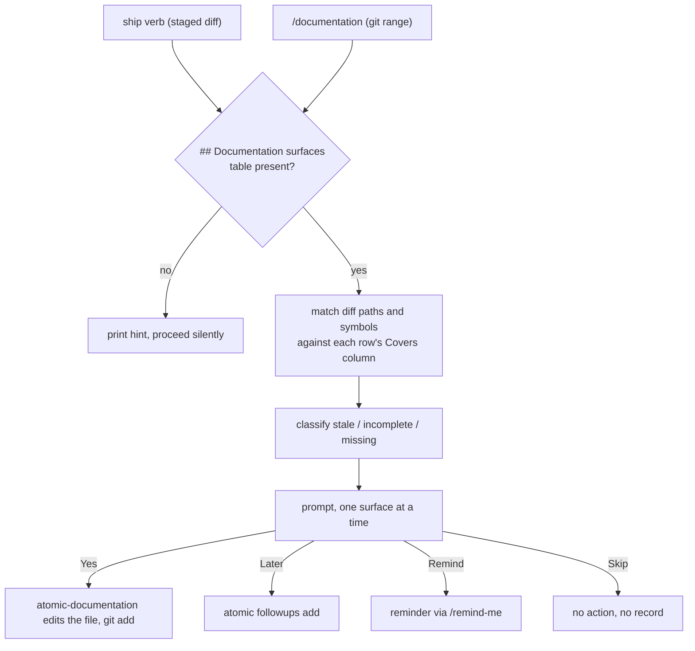

# docs-meta

## What it does

Documentation drifts silently: nothing fails when a page stops matching the code, so the gap is only found by the reader it misleads. And a repo with no stated voice grows one dialect per surface, so a spec, a README, and an agent prompt end up reading as if three people wrote them.

This domain answers both. It defines one voice for every file the repo ships and a separate one for Claude's terminal replies, and it routes each diff to the pages that diff invalidates, at the moment the diff is committed.

## How it works

### Two surfaces, one file voice

There is no third voice. A spec and a README differ in length and structure, not in voice.

| | Atomic output style | atomic-writing |
|---|---|---|
| Governs | how Claude talks | what Claude writes into files |
| Applies to | main-agent TUI replies | every `.md` file the repo ships, prompt artifacts included |
| Form | fragments, dropped articles, ASCII only | full sentences where prose fits, Mermaid where a picture fits |
| Defined in | [`output-styles/atomic.md`](../../output-styles/atomic.md) | [`skills/atomic-writing/SKILL.md`](../../skills/atomic-writing/SKILL.md) |
| Reaches subagents | no | yes |

Output styles attach to the main agent only, so a subagent never sees the atomic reply style. Each agent template composes [`templates/shared/agent-atomic-voice.md`](../../templates/shared/agent-atomic-voice.md) instead, which is why a subagent still answers tersely.

### Routing a diff to a page

Every branch below ends in a decision the user made, which is why nothing here writes a page unprompted.

Matching is LLM judgment inside the current turn. No Go code parses the surfaces table, and no doctor check validates it.

### The cache and its exit codes

`atomic docs stale` returns 0 fresh, 1 stale, 2 error. Two independent triggers mark the cache stale. Mtime drift catches new and edited docs. Set drift compares the paths on disk against those the cache lists, which is the only thing that catches a deletion, because deleting a file bumps no surviving file's mtime. A missing cache is exit 2, not exit 1: `docs stale: cache not found at <path> — run scan first`. The stale sentinel reads `docs stale: doc files are newer than doc-surfaces cache`.

Scan scope is fixed: [`docs/`](..), `doc/`, `documentation/`, `wiki/`, `ADR/`, `adr/`, `decisions/`, plus [`README.md`](../../README.md) at the repo root only. A doc tree outside that list is invisible to `atomic docs scan`, though `.signalsignore` globs can still exclude paths inside it.

## Where it lives

### Artifacts

| Path | Role |
|------|------|
| [`output-styles/atomic.md`](../../output-styles/atomic.md) | Atomic TUI reply style: drop-list, the `[thing] [action] [reason]` pattern, the Auto-Clarity escape hatch, the ten-route `# Format routing` table, and the `# Boundaries` voice split. |
| [`skills/atomic-writing/SKILL.md`](../../skills/atomic-writing/SKILL.md) | The one voice for files. A `## Structure before sentences` section fixing the page reading order, sixteen sentence-level rules, an avoid/use replacement table, a per-surface length table, and a pre-save checklist. |
| [`skills/atomic-writing/references/mermaid.md`](../../skills/atomic-writing/references/mermaid.md) | Loaded on demand when a diagram is being written: type selection from the reader's question, plus the label and syntax rules that decide whether a block renders or ships as a raw fence. |
| [`skills/atomic-documentation/SKILL.md`](../../skills/atomic-documentation/SKILL.md) | Diff-to-surface classifier and content generator. Maintenance and authoring modes; emits the YAML handoff block. |
| [`commands/documentation.md`](../../commands/documentation.md) | `/documentation`. Bootstrap mode indexes surfaces into CLAUDE instructions; authoring mode walks stale, incomplete, and missing surfaces. |
| [`templates/commands/documentation.md`](../../templates/commands/documentation.md) | Render source for the command. |
| [`templates/shared/doc-impact.md`](../../templates/shared/doc-impact.md) | The ship-verb maintenance-mode partial. Composed by `commit-flow` and `squash-flow`. |
| [`templates/shared/agent-atomic-voice.md`](../../templates/shared/agent-atomic-voice.md) | Response-voice rule for subagents replying to an orchestrator. Composed by all seven agent templates. |

### Go packages

| Path | Role |
|------|------|
| [`atomic/internal/docs/docs.go`](../../atomic/internal/docs/docs.go) | `Scan` walks the doc directories and writes the doc-surfaces cache; `Stale` reports freshness by mtime and by set drift. |
| [`atomic/cmd/atomic/main.go`](../../atomic/cmd/atomic/main.go) (`docsAction`) | Maps `Scan`/`Stale` results to the exit codes above. |
| [`atomic/internal/cliusage/cliusage.go`](../../atomic/internal/cliusage/cliusage.go) | `docs scan` and `docs stale` entries in the CLI surface table. |

### Specs and designs

| Path | Role |
|------|------|
| [`docs/spec/documentation-as-maintenance.md`](../spec/documentation-as-maintenance.md) | The two-mode contract: binary verbs, bootstrap, authoring, maintenance, the ship-verb partial. |
| [`docs/design/documentation-as-maintenance.md`](../design/documentation-as-maintenance.md) | Goals and non-goals for replacing hardcoded surface-index updates with discovery. |
| [`docs/spec/documentation-skill-split.md`](../spec/documentation-skill-split.md) | The skill-versus-command boundary: the skill classifies and routes, the command orchestrates. Its "terse technical prose" voice language is superseded; the split it defines is current. |
| [`docs/spec/legible-output.md`](../spec/legible-output.md) | Format-routing contract for [`output-styles/atomic.md`](../../output-styles/atomic.md) and [`docs/reference/output-style.md`](../reference/output-style.md). |
| [`docs/design/legible-output.md`](../design/legible-output.md) | The pattern-verdict table folding 20 candidate patterns to the 10 kept routes, plus the out-of-scope rejection of rendered-HTML reply surfaces. |
| [`docs/reference/output-style.md`](../reference/output-style.md) | Human-facing output-style reference. Carries `## Format routing vocabulary` and `## Two surfaces, one file voice`. |

### Authoring rules

Under [`.claude/rules/authoring/`](../../.claude/rules/authoring). Each carries `paths:` frontmatter globbing `agents/**`, `templates/**`, `skills/**`, `commands/**`, `output-styles/**`, and `rules/**`, so it loads only when an artifact source is open, in the main agent and in subagents alike.

| Path | Role |
|------|------|
| [`.claude/rules/authoring/axioms.md`](../../.claude/rules/authoring/axioms.md) | Five design axioms: cohesion-bounded scope; memory before config before code; destructive ops confirm per item; plain-text indexed selection over multi-select UI; skills auto-fire, commands are explicit-only. |
| [`.claude/rules/authoring/agent-config.md`](../../.claude/rules/authoring/agent-config.md) | Claude Code agent and subagent configuration: frontmatter fields, discovery, override order, memory scopes, output-style composition. |
| [`.claude/rules/authoring/prompting.md`](../../.claude/rules/authoring/prompting.md) | Anthropic prompting patterns and the per-model behavioral notes. |
| [`.claude/rules/authoring/claude-code-refs.md`](../../.claude/rules/authoring/claude-code-refs.md) | URL index for upstream Claude Code documentation. Fetch on demand; these are not snapshots. |

## Constraints

**The `voice` column is always `atomic-writing`.** It names the skill that governs the edit. It is not a choice between alternatives, and a surfaces table offering other values is stale.

**Maintenance mode never emits `impact_type: missing`.** Proposing a new page mid-commit is outside the user's mental context. Only authoring mode, reached through `/documentation`, suggests new pages, and only for a signals domain with 5 or more files and no surface within two directory levels.

**`atomic-documentation` is the only skill that emits a machine-readable block.** The final fenced `yaml` block is the handoff, justified by ship verbs needing an unambiguous per-surface item list for accept/reject prompts. Callers parse the *last* `yaml` or `yml` block and degrade to "no surfaces affected" on a missing block, a parse error, a missing `surfaces` key, or a non-list value. Entries missing `path` or `voice` are skipped, not fatal. Unknown extra fields are accepted. Do not copy this pattern to another skill without the same concrete need.

**The surfaces table belongs in the committed [`CLAUDE.md`](../../CLAUDE.md),** so the whole team shares it. Repos where [`CLAUDE.md`](../../CLAUDE.md) is a bundle source use [`claude.local.md`](../../claude.local.md) instead, which is what this repo does. Search order is [`claude.local.md`](../../claude.local.md) or [`CLAUDE.local.md`](../../CLAUDE.local.md), then [`CLAUDE.md`](../../CLAUDE.md); the first file containing the heading wins. When no file has one, the ship-verb partial prints `no documentation surfaces indexed. run /documentation to set up.` and skips without blocking.

**Every spec body carries `## Change tree`, `## Outline`, and `## Flows`,** on top of Goal, Non-goals, Success criteria, Checkpoints, and Risks. Use `None — <reason>` when a section has nothing to hold. The rule applies forward only: a pre-existing spec is not backfilled by an unrelated line-level amendment. Full contract in [`rules/specs/spec-currency.md`](../../rules/specs/spec-currency.md), which auto-loads on any `docs/spec/**` or `docs/design/**` edit.

**The spec body is current truth; the change log is history.** Rewrite the body when a decision changes, then log the amendment with a `**Superseded:**` line. A body that still describes cut behavior gets built by the next fresh-context subagent that reads it.

## Coupling

**workflow** drives this domain. Ship verbs compose `doc-impact` at step 4 and `signals-gate` at step 5 of [`templates/shared/commit-flow.md`](../../templates/shared/commit-flow.md) and `squash-flow.md`. That order is fixed: doc edits must be staged before the signals scan reads the tree. `/subagent-implementation` Phase 3 calls `/documentation`, then passes the surfaces table to `atomic-auditor` as its fourth input, and closes with a one-line advisory when the implemented files match a surface's Covers column.

**bundle** ships the artifacts. Skills install under the `skills/atomic-*/` rule, which is a full directory walk, so `references/` subdirectories install alongside their `SKILL.md`. The output style installs under `output-styles/atomic*.md`. `/documentation` renders from its template, so a change there needs `make render` before `make bundle`. The authoring rules live under [`.claude/rules/`](../../.claude/rules), outside the bundled repo-root [`rules/`](../../rules) tree, and never install.

**config** owns the cache location. [`atomic/internal/docs/docs.go`](../../atomic/internal/docs/docs.go) writes to `config.ProjectDir(root)` plus `doc-surfaces.md`, so a `harness.dir` change moves where `atomic docs scan` and `atomic docs stale` read and write.

**wiki** pages are files, so they follow `atomic-writing` like every other surface. The domain-page shape in [`skills/atomic-wiki/references/repo.md`](../../skills/atomic-wiki/references/repo.md) is that skill's `## Structure before sentences` order applied to one surface, so changing either one without the other forks the contract.

Two contracts change in lockstep:

- The YAML block shape in [`skills/atomic-documentation/SKILL.md`](../../skills/atomic-documentation/SKILL.md) and every caller that parses it ([`templates/shared/doc-impact.md`](../../templates/shared/doc-impact.md), [`commands/documentation.md`](../../commands/documentation.md)).
- The `# Format routing` section in [`output-styles/atomic.md`](../../output-styles/atomic.md) and the `## Format routing vocabulary` section in [`docs/reference/output-style.md`](../reference/output-style.md), which documents the same ten routes for human readers.
