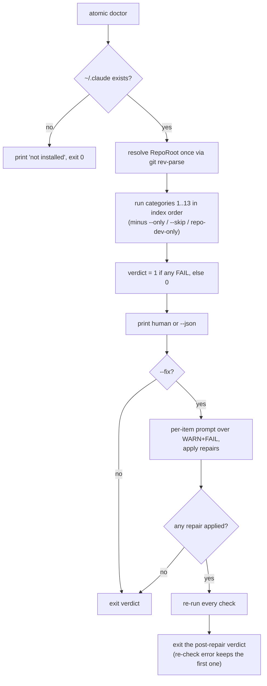

# doctor

## What it does

Most of what this system depends on fails quietly. An installed artifact drifts from the bundle, an `@`-ref goes missing so a session loses its project map, a spec loses the section a subagent reads. Nothing errors; the next run is just worse, and nobody knows why.

This domain makes those failures loud on demand. `atomic doctor` runs a fixed registry of 13 checks over the installed `~/.claude` bundle, the user's `~/.atomic` state, and the current repo, then exits non-zero if any check FAILs. `atomic validate` is the static half: it lints spec structure, cross-reference integrity, bundle parity, and CLI-flag citations in artifacts, with the same exit-code contract. Neither writes anything unless you pass `atomic doctor --fix`.

## How it works

The exit code is decided twice under `--fix`: once from the checks, then again after repairs, which is why a run can print a FAIL and still exit 0.



The printed report is always the pre-repair state.

### The check registry

Indices are stable and never renumbered.

| # | Name | File | Verifies | Fires as | `--fix` |
|---|------|------|----------|----------|---------|
| 1 | install | `checks_install.go` | Each embedded artifact against its installed copy under `~/.claude`, via `claudeinstall.Diff`. | FAIL if any missing, WARN if any drifted, SKIP if `~/.claude` absent | `atomic claude install --merge` |
| 2 | hooks | `checks_hooks.go` | Session-start hook registered in `~/.claude/settings.json`; legacy wrapper-script form reported as drift. | WARN | `atomic hooks install` |
| 3 | signals | `checks_signals.go` | Scan age against `--stale-days`, source-tree change since the scan, then router integrity: [`docs/wiki/index.md`](index.md) present, `@`-ref'd, every domain file in its table on disk, no orphan domain file. | WARN | no |
| 4 | refs | `checks_refs.go` | `@docs/wiki/index.md` present in one of [`claude.local.md`](../../claude.local.md), [`CLAUDE.local.md`](../../CLAUDE.local.md), [`CLAUDE.md`](../../CLAUDE.md), [`claude.md`](../../claude.md). | FAIL | appends the ref block to a chosen candidate |
| 5 | manifest | `checks_manifest.go` | Bundle mirror regenerated from the working tree against the committed `embedded.Manifest()`. Repo-dev only. | FAIL | `make -C atomic bundle` |
| 6 | followups | `checks_followups.go` | Every entry's frontmatter parses, no entry past its `review_by`, `INDEX.md` byte-matches a fresh render. | WARN, SKIP when the folder is absent | INDEX drift only |
| 7 | memory | `checks_memory.go` | Every relative markdown link in this project's `MEMORY.md` resolves inside the memory dir. | WARN | no |
| 8 | binary | `checks_binary.go` | Running version against the latest release on the configured channel (`update.channel` in `~/.atomic/config.toml`, default `stable`), 5s timeout. On the `prerelease` channel, a tip that is not semver-newer is worded as available on that channel rather than misstated with `<`. A lookup error is WARN, never FAIL, so an offline machine does not break doctor. | WARN | no |
| 9 | config | `checks_config.go` | `~/.atomic/config.toml` parses, keys are known, values validate. Folds in a chronic background-update failure read from `~/.atomic/state.json`. | FAIL on parse error or invalid value, WARN on unknown key or chronic failure | no |
| 10 | profile | `checks_profile.go` | Four legs: `~/.atomic/profile.md` exists and is readable; `@~/.atomic/profile.md` is wired; its `lastcheck` stamp is under 30 days old; no candidate file still carries the legacy `@~/.claude/.atomic/profile.md` ref. | WARN | no |
| 11 | code-index | `checks_code_index.go` | Code-index DB mtime against `--stale-days`. At a wiki realm root, aggregates across every non-excluded member DB instead. | WARN; absence is an informational PASS | no |
| 12 | migrate | `checks_migrate.go` | Binary version against `[install].version`; and whether `~/.claude/.atomic` is still a real directory. | WARN | no |
| 13 | repo-config | `checks_repo_config.go` | `<root>/.claude/atomic.toml`: parses, keys known, `[code] ignore` globs valid, `scope` valid, `[repl] idle_timeout` parses. Dispatcher also flags `scope = "repo"` at a root registered as a realm in the `<wikis>` block. | WARN; absence is an informational PASS | no |

Categories 11, 12, and 13 have no `repairPlan` case, so `--fix` prints `cannot auto-fix — unknown category` for them rather than a category-specific line.

### The static lint

Four modes, plus a bare invocation that runs all of them:

```
atomic validate                    -> spec + config + [bundle, repo-dev only] + artifacts
atomic validate spec [paths...]    -> S0 S1 S5 S6 over docs/spec/*.md
atomic validate config             -> C3 C5 C7 C9, whole-repo only
atomic validate bundle             -> manifest parity
atomic validate artifacts [paths]  -> A1 over the bundlemirror corpus
atomic validate <path>...          -> routes docs/spec/*.md to the spec rules, WARNs on anything else
```

| Rule | Mode | Checks | Severity |
|------|------|--------|----------|
| S0 | spec | ATX headings only. A Setext heading stops S1/S5/S6 for that file, because section parsing is unreliable past it. | FAIL |
| S1 | spec | File starts with `# <title>` at line 1. | FAIL |
| S5 | spec | A `## Checkpoints` section whose table header carries `#`, `Checkpoint`, `Files/areas`, `Verifies` as an ordered subsequence. Extra columns are allowed. | FAIL |
| S6 | spec | A `## Change log` section exists. Body may be empty. | FAIL |
| C3 | config | Every `subagent_type: "name"` in `context/commands/*.md` prose resolves to `context/agents/<name>.md`, or is one of the built-ins `general-purpose`, `Explore`, `Plan`. | FAIL |
| C5 | config | Every `@`-ref in [`context/CLAUDE.md`](../../context/CLAUDE.md) resolves to a file. | FAIL |
| C7 | config | No duplicate `name:` across `context/agents/*.md` frontmatter. | FAIL |
| C9 | config | [`context/agents/`](../../context/agents), [`context/skills/`](../../context/skills), [`context/output-styles/`](../../context/output-styles) entries carry the [`atomic`](../../atomic) prefix. Without it they never bundle. | WARN |
| A1 | artifacts | Every `--flag` cited beside an `atomic <verb>` in an artifact's code spans and fenced blocks exists on that verb in the `cliusage` surface. | FAIL |
| bundle | bundle | Generated mirror against the committed manifest. Capped at 5 findings plus an overflow line. | FAIL |

## Where it lives

### Orchestration

| Path | Role |
|------|------|
| [`atomic/internal/doctor/doctor.go`](../../atomic/internal/doctor/doctor.go) | Category registry (`categories`, `Categories()`), `Run` / `RunWith`, `--only`/`--skip`/repo-dev filtering. Resolves `Opts.RepoRoot` once per run. |
| [`atomic/internal/doctor/flags.go`](../../atomic/internal/doctor/flags.go) | Parses `--fix --json --only --skip --stale-days --verbose`. Accepts category indices or names. |
| [`atomic/internal/doctor/exit.go`](../../atomic/internal/doctor/exit.go) | `ExitCode`: 1 if any result is FAIL, else 0. WARN and SKIP never fail the run. |
| [`atomic/internal/doctor/format.go`](../../atomic/internal/doctor/format.go) | `FormatHuman`, `FormatJSON`, `FormatJSONMissingHome`, and `FormatResultLine` (shared with `updatedoctor`). |
| [`atomic/internal/doctor/fix.go`](../../atomic/internal/doctor/fix.go) | `Repairer` with injectable repair funcs, `repairPlan` (the per-category fixability table), the interactive y/N/a/q loop, `RepairSummary`. |
| [`atomic/internal/doctor/fix_impls.go`](../../atomic/internal/doctor/fix_impls.go) | Production repair implementations. Streams subprocess output straight to the writer, no buffering. |
| [`atomic/internal/doctor/stdin_prompter.go`](../../atomic/internal/doctor/stdin_prompter.go) | `Prompter` implementation. Maps `prompt.ErrAborted` to `DecisionAbort`, `prompt.ErrNonInteractive` to `DecisionSkip`. |
| [`atomic/internal/doctor/shortcircuit.go`](../../atomic/internal/doctor/shortcircuit.go) | `ClaudeHomeMissing` plus the canonical message ``"atomic-claude not installed; run `atomic claude install`."`` |
| [`atomic/internal/doctor/repodev.go`](../../atomic/internal/doctor/repodev.go) | `IsRepoDev` / `gitToplevelFn`. Repo-dev marker is [`atomic/internal/bundlemirror/mirror.go`](../../atomic/internal/bundlemirror/mirror.go). |
| [`atomic/internal/doctor/inode_unix.go`](../../atomic/internal/doctor/inode_unix.go) | Inode comparison, so a case-insensitive filesystem does not report [`CLAUDE.md`](../../CLAUDE.md) and [`claude.md`](../../claude.md) as two files. |

### Static lint

| Path | Role |
|------|------|
| [`atomic/internal/validate/validate.go`](../../atomic/internal/validate/validate.go) | Flag parse and subcommand dispatch. Exit 0 pass or warn, 1 any FAIL, 2 bad invocation or internal error. |
| [`atomic/internal/validate/spec.go`](../../atomic/internal/validate/spec.go) | `RunSpecRules(path, src)` — pure, no filesystem access. |
| [`atomic/internal/validate/config.go`](../../atomic/internal/validate/config.go) | `RunConfigRules(repoRoot)`, the `reAtRef` / `reSubagentType` grammars, and `isEmailLocalChar`. |
| [`atomic/internal/validate/artifacts.go`](../../atomic/internal/validate/artifacts.go) | A1: code-span extraction, `longestMatch` verb-path resolution, flag comparison. `ScanArtifactText` is the pure seam. |
| [`atomic/internal/validate/bundle.go`](../../atomic/internal/validate/bundle.go) | Wraps `manifestcheck.Compare` into findings. |
| [`atomic/internal/validate/dispatch.go`](../../atomic/internal/validate/dispatch.go) | Path-aware routing and `runWholeRepo`. |
| [`atomic/internal/validate/finding.go`](../../atomic/internal/validate/finding.go) | `Finding`, deterministic sort by (path, line, rule), `summarize`, `exitCode`. |
| [`atomic/internal/validate/output.go`](../../atomic/internal/validate/output.go) | Human and JSON formatters. JSON envelope is `schema_version: 1`. `--suggest` templates exist for S5 and S6 only. |

### Supporting packages

| Path | Role |
|------|------|
| [`atomic/internal/cliusage/`](../../atomic/internal/cliusage) | The [`atomic`](../../atomic) command surface as structured data. `SetRoot` derives it from the live Cobra tree; `TopLevelVerbs` and `LookupByPath` serve A1. |
| [`atomic/internal/manifestcheck/`](../../atomic/internal/manifestcheck) | `Compare(repoRoot, committed)` — walks the tree with `bundlemirror.Enumerate` and diffs SHA256 against the committed manifest. Writes nothing, spawns nothing. Used by check 5 and by `validate bundle`. |
| [`atomic/internal/updatedoctor/`](../../atomic/internal/updatedoctor) | Post-update adapter. Calls `doctor.Run(Opts{Skip: []int{3, 8}})`, prints FAIL lines only, recovers panics, never changes the update exit code. |
| [`atomic/internal/profile/`](../../atomic/internal/profile) | Detection registry and `DetectAll`, `RenderEnvironmentSection`, `Refresh` / `RefreshIfStale`, `ParseLastcheck` / `IsStale`. Check 10 reads it; `claudeinstall` and the session-start hook write through it. |
| [`atomic/internal/followups/`](../../atomic/internal/followups) | `LoadEntriesWithErrors` is check 6's parse boundary; `Render` is what the INDEX byte-comparison compares against. |

### Docs

| Path | Role |
|------|------|
| [`docs/spec/atomic-doctor.md`](../spec/atomic-doctor.md) | Canonical contract: every check category, fix functions, exit codes, `--fix` behavior. |
| [`docs/design/atomic-doctor.md`](../design/atomic-doctor.md) | Design rationale for the check-registry architecture. |
| [`docs/spec/atomic-validate.md`](../spec/atomic-validate.md) | `atomic validate` contract: the S, C, and A rule sets and their severities. |
| [`docs/design/atomic-validate.md`](../design/atomic-validate.md) | Design rationale for the validate subcommand. |
| [`docs/spec/validate-artifact-cli-flags.md`](../spec/validate-artifact-cli-flags.md) | A1 contract: the `cliusage` surface, scanner rules, known scope limits. Design at [`docs/design/validate-artifact-cli-flags.md`](../design/validate-artifact-cli-flags.md). |
| [`docs/spec/verify-gate-validate.md`](../spec/verify-gate-validate.md) | How the `atomic-verify` skill gates on validate output. Design at [`docs/design/verify-gate-validate.md`](../design/verify-gate-validate.md). |
| [`docs/spec/atomic-update-doctor.md`](../spec/atomic-update-doctor.md) | Post-update auto-fire contract: skip set `[3, 8]`, panic recovery, exit-code preservation, artifact auto-refresh. |
| [`docs/spec/user-profile.md`](../spec/user-profile.md) | Profile schema, the `<stable>`/`<volatile>`/`<deterministic>` tags, install-time stub generation. Design at [`docs/design/user-profile.md`](../design/user-profile.md). |
| [`docs/spec/scope-marker.md`](../spec/scope-marker.md) | Config-domain spec. Cross-listed for check 13's `scope` validation and the `<wikis>` contradiction sub-check. |

## Constraints

- **`--fix` exits on the post-repair state, not the one it printed.** `postRepairExitCode` in [`atomic/cmd/atomic/main.go`](../../atomic/cmd/atomic/main.go) re-runs every check after the repair pass, so CI can gate on `atomic doctor --fix` in one run. The second pass is skipped when no repair was applied, and a re-check that errors keeps the pre-repair verdict rather than reporting health nobody observed. The printed report always reflects the state before repairs.
- **`--fix` and `--json` are mutually exclusive**, rejected at flag-parse time with exit 2. So are a non-positive `--stale-days` and an unknown `--only`/`--skip` token.
- **A missing `~/.claude` short-circuits the whole run.** It prints ``atomic-claude not installed; run `atomic claude install`.`` and exits 0 without running a single check. A green doctor is not proof of a healthy install; it can mean no install at all.
- **Repo-dev-only checks vanish outside this repo.** Check 5 is omitted entirely, not even reported as SKIP, unless you ask for it with `--only 5`. Same for `validate bundle` inside a bare `atomic validate`. Users running in their own projects never see bundle noise.
- **One git subprocess per run.** `Run` resolves `Opts.RepoRoot` once and every check reads that field. A new check that shells out to `git rev-parse` on its own breaks the invariant pinned by `gitcallcount_internal_test.go`.
- **`validate`'s summary always reports 0 PASS.** `summarize` counts findings, and only WARN and FAIL findings are ever emitted, so the PASS column can never be non-zero. It is not a count of files inspected.
- **Two checks combine independent findings into one Result.** Check 9 appends a chronic update-failure detail to whatever the config-validity leg found, capped at WARN on its own. Check 12 concatenates version drift and legacy-state-dir details and takes the worse severity. Reading only the severity loses half the signal; read `Detail`.
- **C5 scans [`context/CLAUDE.md`](../../context/CLAUDE.md) only** (the bundle source that installs as every user's global contract), not the project-local root [`CLAUDE.md`](../../CLAUDE.md). The local overlays are deliberately excluded: they are user-owned and routinely contain backtick spans that look like `@`-refs, such as scoped npm package paths. C5 also skips any `@` preceded by an email local-part character, since RE2 has no lookbehind and `reAtRef` is loose on the right of the `@`.
- **A1 prefers a false negative to a false positive.** A citation whose verb path resolves to nothing emits no finding at all, and the universal flags `--help`, `-h`, `--version`, `-v`, `--repo`, `--no-update-check` always pass. A1 catches wrong flags on known verbs, not unknown verbs.
- **`cliusage`'s hardcoded slice is a fixture, not the runtime source.** `main` calls `SetRoot(rootCmd)` at startup, so production reads the live Cobra tree. Tests that never call `SetRoot` read the static slice, which is why the golden test is the thing keeping A1 honest.

## Coupling

**bundle.** Three surfaces here read bundle-domain inclusion rules. Check 1 uses `claudeinstall.Diff`; check 5 and `validate bundle` both go through `manifestcheck.Compare`, which calls `bundlemirror.Enumerate`; A1 scans that same enumeration as its artifact corpus. Change what bundles and all three change with it.

**signals and wiki.** Checks 3 and 4 own the `@docs/wiki/index.md` contract. `signalsRef` in `checks_refs.go` and `routerRef` in `checks_signals.go` are the constants; the signals domain's wiring convention must move with them. Check 3 additionally parses the router's Domains table, so a change to that table's shape breaks orphan and missing-file detection. Check 13's contradiction sub-check calls `wiki.ReadWikiIndexPaths`.

**config.** Check 9 validates the user schema through `config.Load` and `config.Validate`; check 13 validates the repo schema through `config.LoadRepoConfig`, `config.NewIgnoreMatcher`, and `config.ValidScope`; check 10 resolves paths through `config.ProfilePath`; check 12 detects whether `config.MigrateUserState` completed. A new config key is not covered until one of these learns about it.

**repl.** Checks 9 and 13 both call `config.ValidateIdleTimeout`, the same validator `atomic repl` uses at spawn time, so an invalid `[repl] idle_timeout` surfaces in doctor before a session silently falls through a tier.

**code-intel.** Check 11 locates the DB with `engine.IndexPath` and detects realm scope with `realm.Resolve` / `realm.LoadConfig`. If the engine's index-path convention changes, this check breaks silently.

**workflow.** The `atomic-verify` skill is the consumer that matters: it runs `atomic validate spec` + `config` + `artifacts` when a spec or bundled artifact changed, and treats a FAIL as a gate failure equal to a failing test. `/subagent-implementation` and `/autopilot` invoke that gate at their finish line. `/retrospective-learning` runs `atomic doctor --json --skip signals,binary` and `atomic validate --json` into its scratchpad. All of them degrade silently when the [`atomic`](../../atomic) binary is absent, because these artifacts ship to repos that may not have it.

**Lockstep contracts.**

| Change | Must change with it |
|--------|---------------------|
| Add or renumber a doctor category | `updatedoctor.go`'s hardcoded skip set `[3, 8]` |
| Add a doctor category | A `repairPlan` case in `fix.go`, even a non-fixable one |
| Register or remove a Cobra flag | `TestDeriveCommandsGolden` in [`atomic/cmd/atomic/main_test.go`](../../atomic/cmd/atomic/main_test.go), which pins the derived surface against the hardcoded `cliusage` slice, and therefore what A1 accepts |
| `FormatResultLine` output shape | Both `FormatHuman` and `updatedoctor`'s FAIL-only lines |
