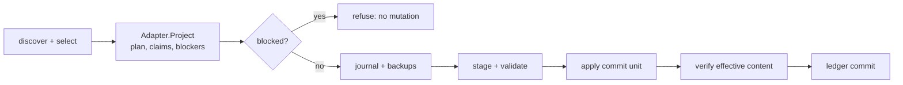
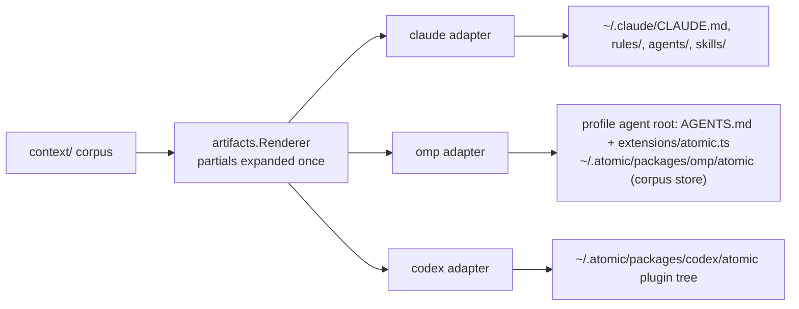
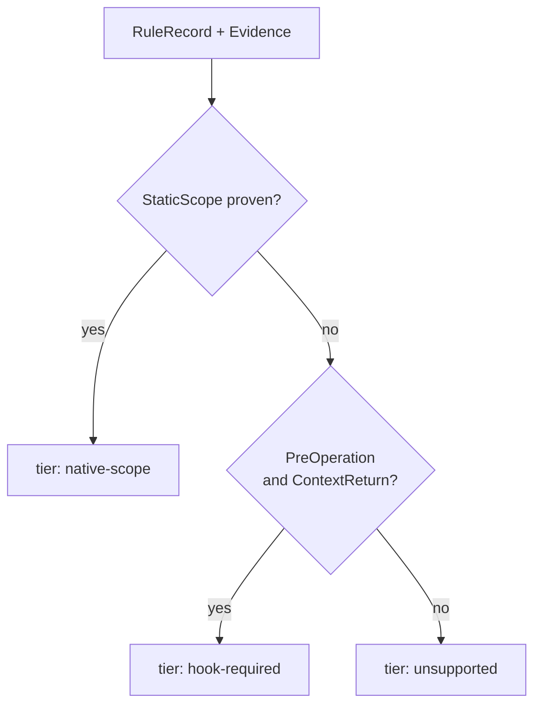

# harness


## What it does


Atomic authors one corpus under [`context/`](../../context), but a user runs one of three harnesses: Claude Code, OMP, or Codex. This domain turns that corpus into a running install in each. A session working here gains an install path, `atomic install`, that writes harness-native files from explicitly selected targets and records what it wrote, plus a ledger that separates Atomic-owned bytes from the user's own. Nothing else records which bytes Atomic wrote: a ledger row holds the digest Atomic last applied, which is what later makes a changed file a conflict instead of silent corruption.

The mechanism: discovery reads native roots and never enrolls; enrollment is a deliberate, approved act; convergence plans one target's writes, journals and backs up the pre-mutation state, stages and validates every projection, applies one native commit unit, verifies effective content, and only then commits ledger state. Each harness adapter owns its native envelope; the shared engine owns the ordering.

The name does not match the paths. The `harness` domain is not one directory. The adapter contract lives in [`atomic/internal/harness/`](../../atomic/internal/harness), the command-level orchestration in [`atomic/internal/install/`](../../atomic/internal/install), the durable state in [`atomic/internal/installstate/`](../../atomic/internal/installstate), the write primitives in [`atomic/internal/managedfile/`](../../atomic/internal/managedfile), the canonical rule model in [`atomic/internal/rules/`](../../atomic/internal/rules), and the rendered corpus in [`atomic/internal/artifacts/`](../../atomic/internal/artifacts). Its user-facing verbs are `atomic install`, `atomic harness ...`, and `atomic state adopt`, defined in [`atomic/cmd/atomic/cmd_install.go`](../../atomic/cmd/atomic/cmd_install.go), [`atomic/cmd/atomic/cmd_harness.go`](../../atomic/cmd/atomic/cmd_harness.go), and [`atomic/cmd/atomic/cmd_state.go`](../../atomic/cmd/atomic/cmd_state.go).


## How it works


### The pipeline: discovery to ledger commit

Discovery never enrolls, and the ledger records a target only after its native bytes verify, so an interrupted operation is recoverable instead of half-recorded.



[`atomic/internal/install/install.go`](../../atomic/internal/install/install.go) owns the ordering one mutating verb follows per target: project read-only, refuse a plan with any blocker, treat an already-converged target as a no-op, obtain explicit consent, then converge through the adapter. The adapter acquires the lifecycle lock at `~/.atomic/install/operation.lock` and recovers unresolved journals oldest-first before it mutates; the read-only projection is re-observed under that lock, so a plan that moved between projection and convergence refuses rather than writing around the change. [`atomic/internal/installstate/transaction.go`](../../atomic/internal/installstate/transaction.go) fixes the durable order: the journal and backups are fsynced before the first native write, and `Complete` commits ledger rows for verified units before marking the journal completed.

A dry run opens no lock and writes nothing: it reports the same blockers and classification, simulates a journal's intended writes in memory, and leaves the filesystem byte-identical.

### The adapter model: one corpus, three native projections

Every harness projects the same once-rendered corpus into its own native envelope, so one source edit reaches Claude, OMP, and Codex through a single generation and no adapter re-renders a body.



The adapter contract is `Adapter` in [`atomic/internal/harness/harness.go`](../../atomic/internal/harness/harness.go): `Discover`, `Capabilities`, and `Lifecycle`. `Registry` in [`atomic/internal/harness/registry.go`](../../atomic/internal/harness/registry.go) resolves one adapter per kind; a kind whose native root the adapter refuses to guess at (Codex without `CODEX_HOME`) contributes no instance to a broad walk and reports the refusal only when named. Each adapter records a versioned `CapabilityMatrix` from CP0 runtime evidence: Claude Code `2.1.273`, OMP `18.1.18`, Codex CLI `0.147.0`, observed `2026-09-15`.

A target's identity is `harness:instance` (kind plus instance), the pair the ledger keys rows by, defined once in [`atomic/internal/installstate/target.go`](../../atomic/internal/installstate/target.go) and delegated to from [`atomic/internal/harness/target.go`](../../atomic/internal/harness/target.go). One physical resource has one ownership row even when several targets can see it; [`atomic/internal/harness/generation.go`](../../atomic/internal/harness/generation.go) refuses a plan that would move a shared resource, such as the OMP package, to a generation another enrolled target still records.

### Rule enforcement tiers

A rule's enforcement tier comes from the target's CP0 evidence, not from intent: only a proven static scope reads as `native-scope`, a proven pre-operation event with context return reads as `hook-required`, and anything less reports `unsupported`.



`rules.Select` in [`atomic/internal/rules/project.go`](../../atomic/internal/rules/project.go) maps a `RuleRecord` onto a target's native scope from an `Evidence` value the adapter derives from its capability matrix. The four tiers are constants in [`atomic/internal/artifacts/artifact.go`](../../atomic/internal/artifacts/artifact.go): `native-scope`, `hook-required`, `deny-enforced`, and `unsupported`. `deny-enforced` is deliberately unreachable from a prose record: only an exact machine predicate on a mediated operation can deny, and a prose rule carries none. A capability row that is missing, partial, or never exercised is false, so unproven behavior can never read as support; `harness.Capability` returns `unsupported` for a role with no row, and `RuleGaps` reports every unproven rule-delivery surface.

The rule corpus parses into checkout-independent `RuleRecord`s ([`atomic/internal/rules/parse.go`](../../atomic/internal/rules/parse.go)): a producer-qualified identity (`shipped:<source>` or `wiki:<project-key>:<domain>`), a class, a `repository-root` base kind, ordered `paths:` globs, a frontmatter-free body, and a source digest. `RuleInstance` binds one record to a project key and an absolute, symlink-resolved base without changing the record or its digest. Parsing rejects unknown scope keys, absolute patterns, parent-escaping patterns, and malformed frontmatter before any target mutation. The matcher in [`atomic/internal/rules/match.go`](../../atomic/internal/rules/match.go) accepts only an exact repository-relative candidate, verifies resolved containment (so an escaping symlink does not match), and returns every overlapping record in stable identity order.

### Install-state layout

The durable state is one tree under `~/.atomic/`, described by the path helpers in [`atomic/internal/config/paths.go`](../../atomic/internal/config/paths.go):

```text
~/.atomic/
├── config.toml                        user configuration; preserved on uninstall
├── profile.md                         authoritative user profile
├── wikis.md                           authoritative wiki registry
├── install/
│   ├── operation.lock                 advisory flock; the inert path has no ownership meaning
│   ├── ledger.json                    enrollment, ownership rows, generations, tiers
│   ├── journals/<operation-id>.json   pre-mutation intent, one per in-flight operation
│   └── transactions/<operation-id>/   stage/ and backup/ for one operation
├── packages/<harness>/atomic/         generated per-harness package
└── <project-key>/state-location.json  per-clone state selection, shared by worktrees
```

The ledger and every journal carry a `Header` with `SchemaVersion` 1 and `MinimumReader` 1 ([`atomic/internal/installstate/schema.go`](../../atomic/internal/installstate/schema.go)); a binary refuses state written by a newer schema before mutating. [`atomic/internal/installstate/classify.go`](../../atomic/internal/installstate/classify.go) classifies an observed installation read-only into one of seven states: `absent`, `legacy-complete`, `legacy-partial`, `v2-clean`, `v2-in-flight`, `v2-orphaned`, `mixed`. [`atomic/internal/installstate/recovery.go`](../../atomic/internal/installstate/recovery.go) reconciles an unresolved journal digest-first: applied bytes are ledger-committed only after they verify, proven-unused staging is discarded, and a backup is restored only when current bytes still equal what Atomic published, so a later edit becomes a conflict rather than a rollback.

Repository state is selected by a harness-neutral ladder in [`atomic/internal/config/statelocation.go`](../../atomic/internal/config/statelocation.go): `ATOMIC_STATE_DIR`, then `~/.atomic/<project-key>/state-location.json`, then the user `state.dir` default, then [`.claude`](../../.claude). `atomic state adopt` records a selection; the retired `ATOMIC_HARNESS` variable is never an alias and blocks resolution while set.


## Where it lives


### Adapter contract and registry

|Path|Role|
|---|---|
|[`atomic/internal/harness/harness.go`](../../atomic/internal/harness/harness.go)|`Kind`, `Instance`, the `Adapter` interface, and the shared errors (`ErrUnsupported`, `ErrPlanNotApproved`, `ErrEvidenceConflict`, `ErrSharedResource`).|
|[`atomic/internal/harness/registry.go`](../../atomic/internal/harness/registry.go)|`Registry`: one adapter per kind; read-only `Discover`, explicit `Select`.|
|[`atomic/internal/harness/lifecycle.go`](../../atomic/internal/harness/lifecycle.go)|`Lifecycle` hook set (`Project`, `Converge`, `Verify`, `Remove`) and `Plan`/`PlanRequest`/`Convergence`/`Removal`.|
|[`atomic/internal/harness/capability.go`](../../atomic/internal/harness/capability.go)|`CapabilityMatrix` and the per-version records `ClaudeCapabilities`, `OMPCapabilities`, `CodexCapabilities`.|
|[`atomic/internal/harness/target.go`](../../atomic/internal/harness/target.go)|`Target` (kind, instance, native root, convergence status) and its `harness:instance` key.|
|[`atomic/internal/harness/selection.go`](../../atomic/internal/harness/selection.go)|`Selector`; refuses an empty or ambiguous instance selection instead of guessing.|
|[`atomic/internal/harness/generation.go`](../../atomic/internal/harness/generation.go)|`EnsureSharedGeneration` refuses a plan that would move a shared resource out from under another target.|
|[`atomic/internal/harness/provider.go`](../../atomic/internal/harness/provider.go)|`ProviderID` rejects a concrete provider or model token from generated bytes.|
|[`atomic/internal/harness/`](../../atomic/internal/harness) (`agent.go`, `skill.go`, `rule.go`)|Offline projections: canonical agent, skill, and rule artifacts to native documents, each reporting unproven surfaces as gaps.|
|[`atomic/internal/harness/status.go`](../../atomic/internal/harness/status.go)|`RowStatus`, `TargetStatus`, and `Resources`, which merge ledger rows with discovered instances into one record per physical resource.|

### Harness adapters

|Path|Role|
|---|---|
|[`atomic/internal/harness/claude/`](../../atomic/internal/harness/claude)|Claude adapter: discovery over `CLAUDE_CONFIG_DIR`, direct global [`CLAUDE.md`](../../CLAUDE.md), narrow `settings.json` mutations, and the legacy migration engine.|
|[`atomic/internal/harness/omp/`](../../atomic/internal/harness/omp)|OMP adapter: profiles resolved via `omp config path`, the generated shared package, the profile `AGENTS.md` block, and `.omp/rules/` card projection.|
|[`atomic/internal/harness/codex/`](../../atomic/internal/harness/codex)|Codex adapter: `CODEX_HOME`, generated marketplace and plugin tree, TOML agents, rule index and matcher; emits no hook configuration.|

### Install orchestration and CLI

|Path|Role|
|---|---|
|[`atomic/internal/install/install.go`](../../atomic/internal/install/install.go)|`Steps`: discover, plan, approve, converge, report; `DefaultRegistry` composes the three adapters.|
|[`atomic/internal/install/report.go`](../../atomic/internal/install/report.go)|`List`, `Status`, and `Diff`.|
|[`atomic/internal/install/rules.go`](../../atomic/internal/install/rules.go)|`RulesStatus` (tier, gaps, per-resource state) and `RulesSync`.|
|[`atomic/internal/install/uninstall.go`](../../atomic/internal/install/uninstall.go)|`UninstallTarget`, `UninstallAll`, and their read-only dry-run plans.|
|[`atomic/cmd/atomic/cmd_install.go`](../../atomic/cmd/atomic/cmd_install.go)|`atomic install` and its flags (`--harness`, `--instance`, `--all`, `--replace`, `--leave-unowned`, `--dry-run`, `--yes`, `--json`).|
|[`atomic/cmd/atomic/cmd_harness.go`](../../atomic/cmd/atomic/cmd_harness.go)|`atomic harness list`, `status`, `enroll`, `adopt`, `repair`, `diff`, `uninstall`, and `rules` (`status`, `sync`).|
|[`atomic/cmd/atomic/cmd_state.go`](../../atomic/cmd/atomic/cmd_state.go)|`atomic state adopt` (`--dir`, `--clear`, `--dry-run`, `--json`).|

### Durable state and write primitives

|Path|Role|
|---|---|
|[`atomic/internal/installstate/schema.go`](../../atomic/internal/installstate/schema.go)|`Header` (`SchemaVersion` 1, `MinimumReader` 1) and refusal of newer state.|
|[`atomic/internal/installstate/lock.go`](../../atomic/internal/installstate/lock.go)|`AcquireLock`/`Release` on the advisory flock, with writer identity recorded inside.|
|[`atomic/internal/installstate/ledger.go`](../../atomic/internal/installstate/ledger.go)|`Row` (target, resource, consumer, generation, tier, applied digest) and `Ledger`.|
|[`atomic/internal/installstate/target.go`](../../atomic/internal/installstate/target.go)|`TargetRecord` and the `harness:instance` key.|
|[`atomic/internal/installstate/journal.go`](../../atomic/internal/installstate/journal.go)|The per-operation journal.|
|[`atomic/internal/installstate/transaction.go`](../../atomic/internal/installstate/transaction.go)|`Transaction`: journal and backups before mutation, verification before ledger commit.|
|[`atomic/internal/installstate/recovery.go`](../../atomic/internal/installstate/recovery.go)|Digest-driven `Recover` and `Rollback`.|
|[`atomic/internal/installstate/classify.go`](../../atomic/internal/installstate/classify.go)|The seven-state read-only classifier.|
|[`atomic/internal/installstate/retention.go`](../../atomic/internal/installstate/retention.go)|`Retention` and `Cleanup` for target and full uninstall.|
|[`atomic/internal/managedfile/managedfile.go`](../../atomic/internal/managedfile/managedfile.go)|Line-anchored block boundaries, `Digest`, and block splice/append helpers.|
|[`atomic/internal/managedfile/observe.go`](../../atomic/internal/managedfile/observe.go)|`Observe` (current bytes, digest, conflict), `TreeDigest`, and resource-bytes digests.|
|[`atomic/internal/managedfile/evidence.go`](../../atomic/internal/managedfile/evidence.go)|`Claim`/`Assessment`: only selection bytes or one parseable block prove ownership.|
|[`atomic/internal/managedfile/publish.go`](../../atomic/internal/managedfile/publish.go)|Atomic file writes and journaled generated-directory publication.|
|[`atomic/internal/managedfile/backup.go`](../../atomic/internal/managedfile/backup.go)|Durable pre-mutation backups with retention metadata.|

### Corpus, rules, and runtime proof

|Path|Role|
|---|---|
|[`atomic/internal/artifacts/catalog.go`](../../atomic/internal/artifacts/catalog.go)|`Catalog.Load` enumerates [`context/`](../../context); only command, agent, and steering artifacts pass through the template engine.|
|[`atomic/internal/artifacts/renderer.go`](../../atomic/internal/artifacts/renderer.go)|`ClaudeGlobal`, `LoaderPair`, and `OMPSteering` native renderers.|
|[`atomic/internal/artifacts/artifact.go`](../../atomic/internal/artifacts/artifact.go)|`Kind`, `Target`, `Delivery`, `EnforcementTier`, and `ProjectionDigest`.|
|[`atomic/internal/rules/parse.go`](../../atomic/internal/rules/parse.go)|`LoadShipped`/`LoadWiki` and the strict `paths:` parser.|
|[`atomic/internal/rules/match.go`](../../atomic/internal/rules/match.go)|`Matcher`: exact candidate paths, resolved containment, stable all-match order.|
|[`atomic/internal/rules/pattern.go`](../../atomic/internal/rules/pattern.go)|`CompileGlob`: one-way glob translation for non-Go runtimes, pinned to the canonical matcher by test.|
|[`atomic/internal/rules/project.go`](../../atomic/internal/rules/project.go)|`Select`: CP0 evidence to a target-native `Projection`.|
|[`atomic/internal/runtimeproof/runtimeproof.go`](../../atomic/internal/runtimeproof/runtimeproof.go)|Isolated harness scenario runner: bounded launch, credential-stripped env, retained events and file bytes.|
|[`atomic/internal/embeddedcorpus/embeddedcorpus.go`](../../atomic/internal/embeddedcorpus/embeddedcorpus.go)|Loads the canonical corpus from the embedded bundle with no checkout to read.|
|[`atomic/internal/ids/ids.go`](../../atomic/internal/ids/ids.go)|`Slug` and `ShortID` for generated operation and resource names.|


## Constraints


- **Discovery never enrolls.** A scan creates no ledger, journal, or adoption state; a target becomes enrolled only through an approved enrollment plan ([`atomic/internal/harness/harness.go`](../../atomic/internal/harness/harness.go)). Violating this makes a read-only probe mutate the machine it inspected.
- **The ledger commits only after native verification.** `Transaction.Complete` writes verified rows durably before marking the journal complete; an interruption between the two leaves an unresolved journal that recovery treats idempotently. Committing earlier would record bytes that never landed ([`atomic/internal/installstate/transaction.go`](../../atomic/internal/installstate/transaction.go)).
- **An ambiguous instance selection is refused, never guessed.** Two native roots for one harness without an `--instance` filter is `AmbiguousSelectionError`, not a default pick; guessing writes into the wrong root ([`atomic/internal/harness/selection.go`](../../atomic/internal/harness/selection.go)).
- **One physical resource, one ownership row.** Shared packages and native-root files both key on identity, and `EnsureSharedGeneration` refuses before mutation when two enrolled targets record different generations of one resource. Converging one would leave the other's row describing absent bytes ([`atomic/internal/harness/generation.go`](../../atomic/internal/harness/generation.go)).
- **A managed block is never guessed at.** `BlockBoundaries` rejects a missing, unclosed, repeated, or out-of-order tag shape; an ambiguous file may not receive an appended block, because its boundary cannot be determined ([`atomic/internal/managedfile/managedfile.go`](../../atomic/internal/managedfile/managedfile.go)).
- **Ownership is proven by bytes, not by name.** Only selection bytes or one parseable Atomic block prove ownership; a resource name, a legacy config path, and a legacy version string prove nothing ([`atomic/internal/managedfile/evidence.go`](../../atomic/internal/managedfile/evidence.go)).
- **A tier is reported from evidence, not intent.** `hook-required` and `unsupported` behavior must never be labeled native parity, and `deny-enforced` is unreachable from a prose record. Overstating a tier ships a boundary the harness does not enforce ([`atomic/internal/rules/project.go`](../../atomic/internal/rules/project.go)).
- **A dry run is byte-identical.** It opens no lock and recovers no journal; it previews unresolved journals in memory and reports `blocked_on_recovery` rather than planning around bytes it could not reconcile ([`atomic/internal/install/install.go`](../../atomic/internal/install/install.go), [`atomic/internal/install/uninstall.go`](../../atomic/internal/install/uninstall.go)).
- **Uninstall removes only unchanged resources.** A resource whose bytes changed underneath Atomic refuses the whole removal; a resource another enrolled consumer depends on is retained. Visibility by an unenrolled instance is not a dependency ([`atomic/internal/harness/uninstall.go`](../../atomic/internal/harness/uninstall.go)).
- **`ATOMIC_HARNESS` is retired and is not an alias.** While it is set, resolution refuses with instructions; the state ladder never consults a harness fingerprint ([`atomic/internal/config/statelocation.go`](../../atomic/internal/config/statelocation.go)).


## Coupling


**bundle.** `bundle` renders [`context/`](../../context) once into the binary's embedded corpus; this domain consumes that output. [`atomic/internal/artifacts/catalog.go`](../../atomic/internal/artifacts/catalog.go) and `renderer.go` enumerate and project it, and [`atomic/internal/embeddedcorpus/`](../../atomic/internal/embeddedcorpus) loads it with no checkout. The embed and mirror mechanics (`make bundle`, `//go:embed bundle`) belong to `bundle`; the adapter projections belong here. Contract: [`docs/wiki/bundle.md`](bundle.md).

**config.** The `~/.atomic` layout, the enrollment ledger path, and the state-selection ladder are documented in this domain and resolved through [`atomic/internal/config/`](../../atomic/internal/config). `atomic state adopt` selects a root; `config` owns the `state.dir` key and mutable-path authorities. Contract: [`docs/wiki/config.md`](config.md).

**doctor.** Doctor categories 15 to 24 read this domain's ledger, journals, capability records, and rule status read-only, and ledger-managed `atomic doctor --fix` reuses this engine's converge planner rather than a separate repair path. A change to the ledger schema, a capability row, or a rule-delivery role lands in a doctor check. Contract: [`docs/wiki/doctor.md`](doctor.md).

**signals and wiki.** Repository wiki refresh is the second canonical rule producer: it writes `wiki:<project-key>:<domain>` pointer cards under `<state-root>/rules/wiki/`, which this domain parses and projects. Realm refresh produces no scoped pointer rules. An operation without a proven native scoped-rule surface receives no matched body and reports `unsupported`.

**workflow.** `/refresh-wiki` and the ship verbs auto-converge only already-enrolled targets, so a target that is not enrolled is never silently written. Enrolled-target convergence (`ConvergeEnrolled`) is what an update runs after binary selection.

**Lockstep contracts.** [`docs/spec/omp-plugin-compatibility.md`](../spec/omp-plugin-compatibility.md) is the implementation contract for the adapter model, enrollment, and rule tiers. [`docs/design/omp-plugin-compatibility.md`](../design/omp-plugin-compatibility.md) carries the architecture and the write-authority table. [`docs/research/harness-capability-matrix.md`](../research/harness-capability-matrix.md) holds the versioned native-behavior evidence every projection is gated by; a capability row can reduce a surface to `unsupported` but does not reopen the architecture.
