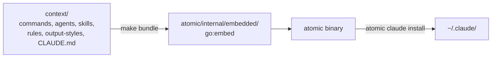

<wiki-type>repo</wiki-type>
<scan-sha>77c8a5bd7ce37a069b7cf8b22e70b5970cc5fdb9</scan-sha>
<wiki-schema>1</wiki-schema>

# Project signals

## What this repo is

A Claude Code configuration — commands, agents, skills, rules, and an output style — plus the [`atomic`](../../atomic) Go CLI that renders, packages, and installs it. The markdown artifacts are the product; the binary is how they ship and how they stay healthy.

Everything installable is committed source under [`context/`](../../context). One step turns it into a running install: `make bundle` expands [`context/`](../../context) (substituting any `{{ template "<name>" . }}` reference to [`context/_partials/`](../../context/_partials) along the way) straight into the Go binary's embedded filesystem, and `atomic claude install` copies that filesystem into `~/.claude/`.

Edit [`context/`](../../context) directly; nothing downstream of it is ever hand-edited. [`atomic/internal/embedded/`](../../atomic/internal/embedded) is a gitignored build artifact, regenerated by `make bundle` and never committed. The binary carries more than the installer: `doctor`, `wiki`, `code`, `serve`, `bus`, and `repl` are the other verb families, each mapped to a domain below.

## Domains

Domains are vertical slices by feature concern, not horizontal layers by file type — things that break together belong together. Read a domain file when a task reaches for that feature; each names its own cross-domain coupling in a `## Coupling` section, and lists the full path set this table only points at.

| Domain | Start here | What it does | Detail |
|--------|-----------|--------------|--------|
| signals | [`atomic/internal/signals/`](../../atomic/internal/signals) | Scan, infer, and wire the project context Claude loads each session. | [`docs/wiki/signals.md`](signals.md) |
| bundle | [`atomic/internal/bundlemirror/`](../../atomic/internal/bundlemirror) | Render templates, embed them in the binary, install into `~/.claude`. | [`docs/wiki/bundle.md`](bundle.md) |
| doctor | [`atomic/internal/doctor/`](../../atomic/internal/doctor) | Integrity checks and static artifact validation. | [`docs/wiki/doctor.md`](doctor.md) |
| workflow | [`context/commands/`](../../context/commands) | Plan, implement, review, ship — and the subagent loop that drives it. | [`docs/wiki/workflow.md`](workflow.md) |
| config | [`atomic/internal/config/`](../../atomic/internal/config) | User and repo config, state at `~/.atomic`, hooks, follow-ups, self-update. | [`docs/wiki/config.md`](config.md) |
| docs-meta | [`context/skills/atomic-writing/`](../../context/skills/atomic-writing) | Writing voice and diff-driven documentation routing. | [`docs/wiki/docs-meta.md`](docs-meta.md) |
| wiki | [`atomic/internal/wiki/`](../../atomic/internal/wiki) | Cross-repo knowledge layer: scan, classify, synthesize, capture buckets. | [`docs/wiki/wiki.md`](wiki.md) |
| code-intel | [`atomic/internal/codeintel/`](../../atomic/internal/codeintel) | Tree-sitter symbol graph, the `atomic code` verbs, and the MCP server. | [`docs/wiki/code-intel.md`](code-intel.md) |
| serve | [`atomic/internal/serve/`](../../atomic/internal/serve) | Local read-only web UI over the wiki and the code graph. | [`docs/wiki/serve.md`](serve.md) |
| bus | [`atomic/internal/bus/`](../../atomic/internal/bus) | Messaging between concurrent Claude sessions over named rooms; 19 verbs. | [`docs/wiki/bus.md`](bus.md) |
| repl | [`atomic/internal/repl/`](../../atomic/internal/repl) | Persistent Python and Node interpreter sessions an agent drives. | [`docs/wiki/repl.md`](repl.md) |

## Framework & runtime

- **Go 1.25**, single module at [`atomic/go.mod`](../../atomic/go.mod) (`module github.com/damusix/atomic-claude/atomic`), building the [`atomic`](../../atomic) binary.
- **tsbinding sub-module** at [`atomic/internal/codeintel/tsbinding/go.mod`](../../atomic/internal/codeintel/tsbinding/go.mod) (`module github.com/malivvan/tree-sitter`, go 1.23.4) — the wazero + tree-sitter WASM binding, versioned separately.
- **`//go:embed bundle`** in [`atomic/internal/embedded/bundle.go`](../../atomic/internal/embedded/bundle.go), over the gitignored `bundle/` directory that `make bundle` writes.
- **No web framework.** SQLite is used only by the code-intel engine, at `<projectRoot>/.claude/.atomic-index/atomic.db`.
- **VitePress docs site** ([`package.json`](../../package.json), [`.vitepress/config.mts`](../../.vitepress/config.mts)) is a separate product from the Go build and the embedded bundle — `docs:build`, `docs:dev`, `docs:preview`, deployed by [`.github/workflows/docs.yml`](../../.github/workflows/docs.yml). Its `playwright` devDependency belongs to [`scripts/graph-gates.mjs`](../../scripts/graph-gates.mjs), a local-only gate harness for the `atomic serve` graph views, not to the site.

External Go dependencies:

| Dependency | Used for |
|------------|----------|
| `gopkg.in/yaml.v3` | YAML frontmatter |
| `github.com/tailscale/hujson` | lenient JSON for hooks and settings |
| `github.com/pelletier/go-toml/v2` | TOML config |
| `github.com/charmbracelet/huh` | interactive TUI prompts |
| `github.com/tetratelabs/wazero` | WASM runtime for tree-sitter |
| `github.com/modelcontextprotocol/go-sdk` | MCP server |
| `github.com/bmatcuk/doublestar/v4` | glob matching for the repo-scoped code-intel ignore config |

## Build / test / lint

All commands run from [`atomic/`](../../atomic) (CI: `working-directory: ./atomic`):

| Purpose | Command | Source |
|---------|---------|--------|
| Regenerate embedded bundle | `go generate ./...` or `make -C atomic bundle` | [`atomic/Makefile`](../../atomic/Makefile) target `bundle` |
| Run tests | `go test ./...` | [`atomic/Makefile`](../../atomic/Makefile) target `test` |
| Vet | `go vet ./...` | [`atomic/Makefile`](../../atomic/Makefile) target `vet` |
| Format check | `gofmt -l .` | [`atomic/Makefile`](../../atomic/Makefile) target `fmt` |
| Build binary | `go build -o ../bin/atomic ./cmd/atomic` | [`atomic/Makefile`](../../atomic/Makefile) target `build` |
| Tidy deps | `go mod tidy` | [`atomic/Makefile`](../../atomic/Makefile) target `tidy` |
| Rebuild `atomic serve` frontend | `make -C atomic frontend` | [`atomic/Makefile`](../../atomic/Makefile) target `frontend` |
| Release | `goreleaser release --clean` | [`.github/workflows/release.yml`](../../.github/workflows/release.yml) (on `v*` tag) |

CI has no drift gates: both [`atomic/internal/embedded/`](../../atomic/internal/embedded) and `atomic/internal/serve/frontend/dist/` are gitignored, so "Generate bundle and frontend" in CI only has to make the packages compile, not match a committed copy. The frontend job's `bun run build.ts` step proves the app builds and nothing more.

The CI test job installs Bun (`oven-sh/setup-bun@v2`, pinned `1.3.13`) and runs `bun install --frozen-lockfile` in [`atomic/internal/serve/frontend/`](../../atomic/internal/serve/frontend) before that step — `go generate ./...` runs the Bun frontend build via the `go:generate` directive in [`atomic/internal/serve/frontend_dist.go`](../../atomic/internal/serve/frontend_dist.go).

## DevOps & CI

- **CI**: GitHub Actions ([`.github/workflows/`](../../.github/workflows)). Four workflows — `ci.yml` (test, vet, fmt, frontend build + tests), `docs.yml` (VitePress build and deploy), `release-please.yml` (changelog), `release.yml` (goreleaser on tag).
- **Release**: goreleaser builds `linux/darwin x amd64/arm64` with CGO disabled, version stamped from `internal/version` via ldflags; release-please owns the version bump and tag on push to main.
- **Pre-commit hook** ([`.githooks/pre-commit`](../../.githooks/pre-commit)): one stage, firing only when a follow-ups entry file is staged — regenerate follow-ups `INDEX.md`. Neither the bundle, a rendered artifact copy, nor `serve/frontend/dist` is a pre-commit stage, since none is committed. Install with `make hooks`.

## Language breakdown

| Language | LOC | Files | % |
|----------|-----|-------|---|
| Go | 180772 | 602 | 59% |
| Markdown | 49979 | 338 | 16% |
| TypeScript | 46327 | 300 | 15% |
| JavaScript | 10670 | 20 | 3% |
| CSS | 7801 | 15 | 2% |
| JSON | 3863 | 14 | 1% |
| Shell | 928 | 8 | 0% |
| Vue | 782 | 3 | 0% |
| YAML | 530 | 10 | 0% |
| Python | 329 | 2 | 0% |

Counts come from `atomic signals scan`, which writes the full per-file substrate to [`docs/wiki/scan.md`](scan.md). C sources (`tsbinding/src/`) are vendored on demand rather than committed, so they do not appear here.
