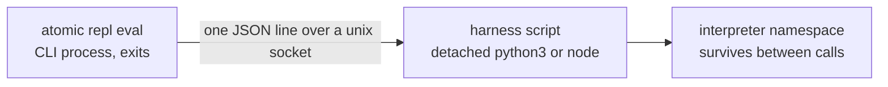
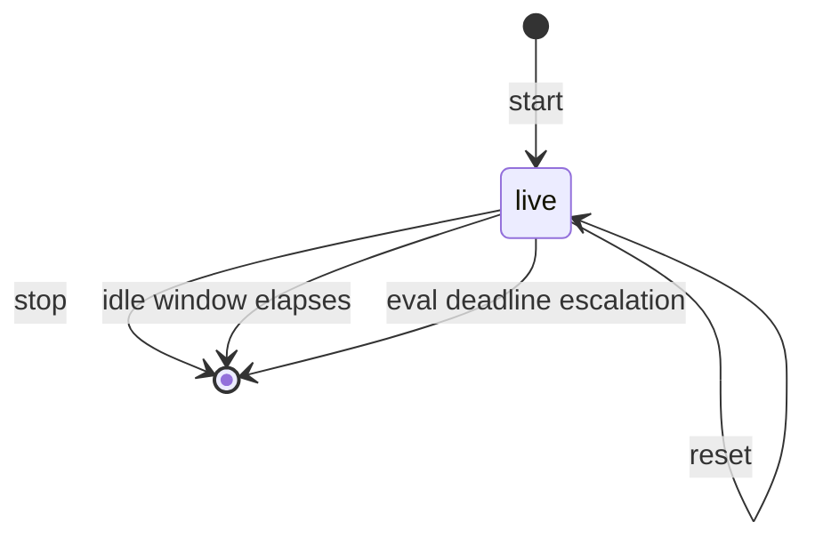
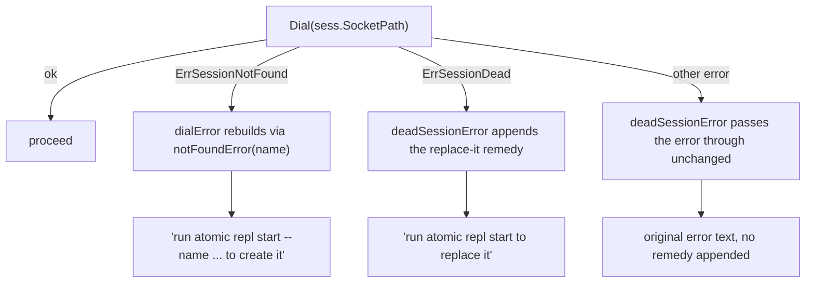

# repl

## What it does

An agent working through Bash gets one process per call, so state dies between calls and every step has to rebuild what the last one computed. `atomic repl` removes that: a named session holds an interpreter namespace, and a variable set in one call is readable in the next.

A session is a detached `python3` or `node` child running an embedded harness script that serves its own unix socket. The Go side is a stateless spawner and client with no process of its own, so killing [`atomic`](../../atomic) never kills a session.

## How it works

The CLI process is the thing that ends; the state is the thing that does not.

### Verbs

Six verbs, registered by `buildReplCmd` in [`atomic/cmd/atomic/main.go`](../../atomic/cmd/atomic/main.go) and dispatched by `ReplAction` in [`atomic/internal/repl/action.go`](../../atomic/internal/repl/action.go). Every verb takes `--json`; the JSON shape differs per verb (see [`docs/reference/repl.md`](../reference/repl.md)).

| Verb | Does | Flags |
|------|------|-------|
| `start` | Spawns a harness for `--name`, or reports the live one | `--name --lang --env --bin --json` |
| `eval` | Runs code against the session; code from the positional arg or piped stdin | `--name --timeout --json` |
| `list` | Enumerates sessions in the repo-plus-realm scope, or every scope | `--all --json` |
| `status` | Reports one session's liveness, pid, and origin root | `--name --all --json` |
| `reset` | Clears the interpreter namespace; the process stays alive | `--name --json` |
| `stop` | Ends the session; the harness removes its socket and meta | `--name --json` |

`--lang` takes `py` or `js`; `python`, `node`, and `javascript` are accepted aliases. `eval` reads stdin only when stdin is not a terminal, so a bare `eval --name s` in an interactive shell fails loud instead of blocking. Code that itself starts with a dash goes after a `--` separator.

### Session lifecycle

Two of the three ways a session ends are ones nobody typed, so an agent has to treat a missing session as ordinary rather than exceptional.

The idle window resolves from repo config, then user config, then the built-in default:

`.claude/atomic.toml [repl] idle_timeout` -> `~/.atomic/config.toml [repl] idle_timeout` -> `DefaultIdleTimeout` (1h)

A present but invalid value is skipped in favor of the next tier rather than blocking a start, and `start` prints one stderr warning per bad value naming the file. Zero or negative is invalid, never "disable". Both harnesses check the window against a monotonic clock, so an NTP step cannot fake or mask it, and they check it every accept-loop pass rather than only on accept timeout: a client that connects and asks nothing must not hold a session open.

### Scope

A session belongs to one scope root and is found from the union of two.

- `start` keys the new session to the repo root, the first element of `resolveScopeRoots`.
- `eval`, `list`, `status`, `reset`, and `stop` search the repo root first, then the enclosing realm root, and take the first match.
- Realm membership comes from the scope marker, never the `<wikis>` registry. That registry is a per-user preference file, so letting it decide would make a session's visibility depend on whose machine it runs on.
- Invoked at a realm root directly, `repoctx` finds no repo marker and falls back to that directory, so both roots converge and the union collapses to one entry.
- `--all` on `list` and `status` enumerates every scope directory under `~/.atomic/repl` instead. It exists because `ScopeKey` is a one-way hash: a scope directory cannot be turned back into the root that produced it.

### Error text after a session is found but not reached

`findSession` resolving a name only proves a meta file was on disk a moment ago; the dial that follows can still fail, and `eval`, `status`, `reset`, and `stop` each route that dial error through `dialError` before printing it. `dialError` special-cases `ErrSessionNotFound`, rebuilding it through `notFoundError` rather than passing it through raw: `Dial` returns that error when no socket exists at the path, which is what happens in the window `stop` opens by returning on the harness's shutdown ack while the harness is still removing its own socket and meta. A verb landing in that window finds the meta, then dials nothing. `notFoundError` builds the message text once but is invoked from two call sites: `findSessionInDirs`'s own pre-dial return, for a name that was never started, and `dialError`'s post-dial rebuild, for this vanished-mid-window case.

`dialError` rebuilding through `notFoundError` is what keeps a reaped session and a name never started reading identically even when the not-found error originates from `Dial` instead of `findSession` (`TestNotFoundAfterSocketVanishes_ReadsLikeNeverStarted` in [`atomic/internal/repl/action_test.go`](../../atomic/internal/repl/action_test.go) covers `eval`, `status`, `reset`, and `stop` against a seeded meta-without-socket session). Only `ErrSessionDead` gets the replace-it remedy appended; any other error `Dial` returns, an eval timeout, a protocol mismatch, a decode failure, passes through `deadSessionError` with its own original message and no remedy text at all, confirmed by `TestEvalAction_ProtocolMismatchFailsLoudNamingStopThenStart`, whose stderr carries the raw `ProtocolMismatchError` text naming `repl stop` then `repl start`, not "replace it."

### Exit codes

Fixed literal values, pinned by `TestExitCodes_PinnedValues`, defined in [`atomic/internal/repl/protocol.go`](../../atomic/internal/repl/protocol.go). Callers route on the code, never on parsed prose. `exitCodeForErr` in `action.go` is the one place a package error becomes one.

| Code | Meaning | What to do |
|------|---------|------------|
| 0 | Success | — |
| 1 | Usage error: bad flag, no code to eval | Fix the invocation |
| 2 | No session by that name | `atomic repl start` |
| 3 | The evaluated code raised or threw | Fix the code; the traceback is on stderr and in `Response.Error` |
| 4 | Eval deadline elapsed; the session was ended | Start again, or raise `--timeout` |
| 5 | Socket present but refusing: the harness crashed or was killed | `atomic repl start` to replace it |
| 6 | `--lang`'s interpreter is not on PATH, or `--bin` does not resolve | Install it, or point `--bin` at a real path |
| 7 | The live harness speaks a protocol version this binary does not | `atomic repl stop` then `atomic repl start` |

`list` is the one verb that always exits 0. It enumerates rather than targets a single session, so a dead entry is reported inline, never as a command failure.

## Where it lives

### Go packages

| Path | Role |
|------|------|
| [`atomic/internal/repl/protocol.go`](../../atomic/internal/repl/protocol.go) | Wire types, `ProtocolVersion`, the four ops, `MaxStreamBytes`, the eight exit codes |
| [`atomic/internal/repl/paths.go`](../../atomic/internal/repl/paths.go) | `ScopeKey`, session dir, socket / meta / lock paths, `ValidateName` |
| [`atomic/internal/repl/meta.go`](../../atomic/internal/repl/meta.go) | The on-disk session record and its atomic write |
| [`atomic/internal/repl/envfile.go`](../../atomic/internal/repl/envfile.go) | `--env` KEY=VALUE parsing |
| [`atomic/internal/repl/spawn.go`](../../atomic/internal/repl/spawn.go) | Interpreter resolution, harness materialization, `EnsureStarted`, `DefaultSpawn`, `IsLive` |
| [`atomic/internal/repl/client.go`](../../atomic/internal/repl/client.go) | Dial, one round trip per connection, `Eval` and the timeout escalation; `ErrSessionNotFound` is defined here |
| [`atomic/internal/repl/action.go`](../../atomic/internal/repl/action.go) | Verb dispatch, scope and idle-timeout resolution, flag parsing, error-to-exit-code mapping, `deadSessionError` and `dialError` |
| [`atomic/internal/repl/harness_embed.go`](../../atomic/internal/repl/harness_embed.go) | `go:embed` of both harness scripts, canonical language ids, materialized filenames |
| [`atomic/cmd/atomic/main.go`](../../atomic/cmd/atomic/main.go) | `buildReplCmd` and `runRepl` |
| [`atomic/internal/cliusage/cliusage.go`](../../atomic/internal/cliusage/cliusage.go) | Six `{"repl", <verb>}` entries feeding `--help` and the A1 artifact-citation lint |

### Harness scripts and their tests

| Path | Role |
|------|------|
| [`atomic/internal/repl/harness/python_harness.py`](../../atomic/internal/repl/harness/python_harness.py) | Python harness: accept loop, exec-then-eval-tail-expression semantics, traceback trimming |
| [`atomic/internal/repl/harness/node_harness.js`](../../atomic/internal/repl/harness/node_harness.js) | Node harness: `vm.runInContext` against a persistent sandbox, stream capture, stack trimming |
| [`atomic/internal/repl/harness_contract_test.go`](../../atomic/internal/repl/harness_contract_test.go) | Cross-language conformance suite both harnesses are held to |
| [`atomic/internal/repl/binary_e2e_test.go`](../../atomic/internal/repl/binary_e2e_test.go) | The only test that drives the built binary as separate OS processes under a temp `HOME` |
| [`atomic/internal/repl/action_test.go`](../../atomic/internal/repl/action_test.go) | Verb-dispatch tests, including `dialError`'s not-found-after-socket-vanishes coverage |

### Docs

| Path | Role |
|------|------|
| [`docs/reference/repl.md`](../reference/repl.md) | User-facing reference: scope model, all six verbs with examples, exit-code table, idle timeout |
| [`docs/spec/atomic-repl.md`](../spec/atomic-repl.md) | Implementation contract: goal, non-goals, success criteria, checkpoints, risks |
| [`docs/design/atomic-repl.md`](../design/atomic-repl.md) | Rationale: four approaches weighed (central daemon, embedded goja, Jupyter kernel protocol, per-session self-serving harness) and the mechanism-decision table |

## Constraints

**A reaped session and a name that was never started can still produce the same message even when the error surfaces from different call sites.** `notFoundError` in `action.go` is the one place the not-found message text is built, but it is invoked from two places: `findSession`'s own not-found path, and `dialError`'s rebuild of a post-dial `ErrSessionNotFound`. A session whose meta was on disk when `findSession` approved it can still vanish (socket removed, then meta) before the dial that follows, and the reader is owed the same sentence regardless of which call site caught it. The remedy either way is `atomic repl start`.

**`ScopeKey` hashes the cleaned scope root rather than embedding it** (SHA-256, first 12 hex chars). That is what bounds the socket path under `maxSocketPathLen = 103`: `sun_path` is 104 bytes on macOS and 108 on Linux, NUL included, so an arbitrarily deep repo still produces a fixed-width session directory name. A session name long enough to overflow the limit is rejected by `SocketPath` rather than handed to a spawn.

**`EnsureStarted` takes the liveness probe, the stale-socket cleanup, and the spawn under one flock.** Guarding only the spawn call would let two racing `start` calls both observe "dead" and both spawn, the second binding over the first's socket and orphaning a process holding live state. A racer that loses the lock re-probes under it and reports already-running.

**`materializeHarness` rewrites the on-disk script from embedded bytes on every spawn**, through a temp file and a rename. The disk copy is a cache of the binary's bytes, never trusted stale, so an `atomic update` cannot leave a harness on disk speaking a protocol the client no longer does. The Node harness lands as `node_harness.mjs`, not `.js`: nothing under `~/.atomic/repl` has a [`package.json`](../../package.json) of its own, and whichever one Node finds by walking up is a stranger's.

**The eval timeout escalation verifies process identity before signaling anything.** `defaultPidMatch` runs `ps -p <pid> -o etime=,state=` and rejects zombie state `Z`, because a pid read from a file is a number, not a process, and a SIGKILL at the wrong one is unrecoverable. The sequence is SIGINT, a 2s grace period, then SIGKILL, with the socket and meta removed either way. The escalation exists because the two harnesses answer SIGINT differently: Node installs no handler and dies outright, while Python catches the `KeyboardInterrupt` inside the eval and keeps serving. Converging them is what keeps one command from producing two outcomes.

**`Meta` carries no field for the `--env` values a session started with.** `list` and `status` render that struct directly, so having nowhere to put a secret is a stronger guarantee than remembering to filter one out at render time.

**File modes are asserted, not incidental.** Session directories are `0o700`; socket and meta files are `0o600`, and both harnesses set a `0o177` umask before bind and `chmod` after, so the socket is never briefly world-readable. A session socket is code execution into a process that may hold `--env` secrets.

**`MaxStreamBytes` (64 KiB) caps `Response.Stdout` and `Response.Stderr` independently, and the harness enforces it, not the Go client.** A runaway loop's output has to be bounded before it crosses the socket, not after. The `repr`/`inspect` of the final value is capped on the same budget.

**The harness's working directory is always the resolved scope root**, never wherever `atomic repl start` happened to run, so relative paths in evaluated code resolve consistently.

**`ValidateName`** rejects an empty name, a leading `-` (indistinguishable from a flag), a path separator, a null byte, and `.` or `..`. It mirrors `validateBucketName` in [`atomic/internal/wiki/bucket.go`](../../atomic/internal/wiki/bucket.go) for the same reason: the name becomes a filename.

**`SpawnFunc`, `SignalFunc`, and `PidMatchFunc` are injectable seams.** Production always passes nil and takes the default; tests inject stubs so the concurrency and escalation paths run without a real interpreter, a real signal, or a real wall-clock wait.

## Coupling

- **config domain.** `[repl] idle_timeout` is a config-domain schema key at both scopes (`replSection` and `ValidateIdleTimeout` in [`atomic/internal/config/repo.go`](../../atomic/internal/config/repo.go)), shared by `RepoConfig.Repl` and the user-level `Config.Repl`. repl consumes it through `resolveIdleTimeout` and owns none of it. `RootDir` also depends on `config.Dir(home)` for the `~/.atomic/repl` state root.
- **config domain (scope resolution).** `resolveScopeRoots` calls `repoctx.ResolveFrom` for the repo root and `config.FindScopeRoot(dir, "realm")` for the enclosing realm. Both are config-domain primitives, so a session's cross-repo visibility is entirely a function of how the scope-marker walk resolves.
- **doctor domain.** Both validation call sites live in doctor, at different severity ceilings: repo-scoped (`checks_repo_config.go`, category 13) folds an invalid `idle_timeout` into a WARN, user-scoped (`checks_config.go`, category 9) fails `config.Validate` and reports FAIL. See [`docs/wiki/doctor.md`](doctor.md).
- **bundle domain.** repl ships no command, agent, or skill of its own. The `## Persistent REPL sessions` section in [`context/CLAUDE.md`](../../context/CLAUDE.md) and the intent row in [`context/commands/atomic-help.md`](../../context/commands/atomic-help.md) are bundle inputs, so editing either needs `make bundle`.
- **Verb count.** `repl` is one of the top-level Cobra verbs [`atomic/cmd/atomic/main_test.go`](../../atomic/cmd/atomic/main_test.go)'s `TestRootCmdExact23Verbs` pins. Adding, removing, or renaming any verb anywhere in the binary updates that list.
