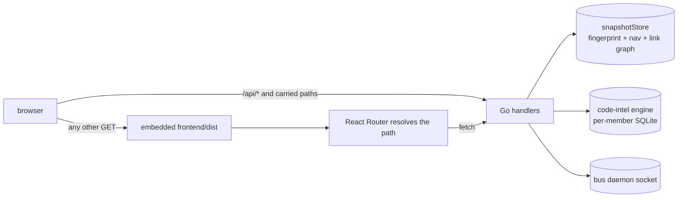
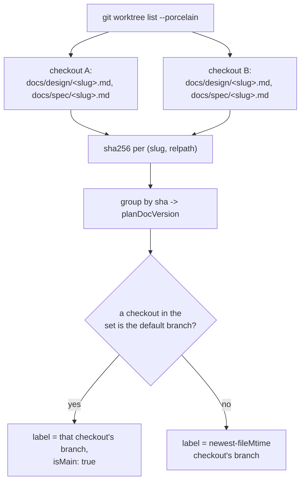
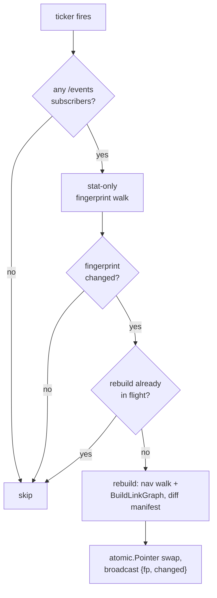

# serve


## What it does


A wiki realm is a set of markdown files and a set of SQLite symbol graphs. Read as files, the links between them stay invisible: nothing shows which pages reference each other, which repos are stale, or what a symbol connects to across members.

`atomic serve [path] [--port N] [--host H] [--open]` renders all of it in a browser (default port 4500, default bind `127.0.0.1`). Go serves a JSON API; the UI is a React + TypeScript SPA built by Bun, committed as `frontend/dist/` and embedded with `go:embed`, so `go build` never invokes Bun or Node.

Serve is read-only with respect to realm and repo content. The `/api/bus/*` chat endpoints are the one exception: they write to the bus daemon's own state (room membership and messages), never to files, and every one of them is refused unless the request's TCP peer is loopback.


## How it works


Every path that is not an API route returns the SPA shell, which is how a deep link works without a server-side route table.



`newSPAHandler` serves a file from `frontend/dist/` when one exists at the request path and otherwise returns `index.html`, so a deep link like `/page/docs/wiki/serve.md` reaches the client router instead of 404ing.

### HTTP surface

| Route | Returns |
|-------|---------|
| `GET /healthz` | Liveness probe, plain text `ok` |
| `GET /api/page/<relpath>` | Rendered markdown as HTML-in-JSON, plus title, breadcrumb segments, `hasMermaid`. Empty relpath serves the scope landing (realm index, else [`README.md`](../../README.md)). A directory with no index file returns `{dir, entries}` |
| `GET /api/file/<relpath>` | Chroma line-table HTML for a source file |
| `GET /api/rail/<relpath>` | One payload: `properties`, `out`, `in`, `graphDataURL` |
| `GET /api/nav` | Realm scope: six groups (Realm, Repos, Concerns, Knowledge, Buckets, External) with staleness badges. Repo scope: docs file tree |
| `GET /api/search/md?q=` | Literal case-insensitive substring search over `*.md`, capped at 50 results |
| `GET /api/code/search?q=&only=&exclude=` | Federated symbol search, grouped per member. An unindexed member returns `indexed:false` with empty results, not an error |
| `GET /api/search/stream?q=&src=` | SSE: one `md` event, one `code` event per member as its search completes, terminal `end` |
| `GET /api/code/{node,callers,callees,impact,files,schema,file}` | Code-explorer JSON, backing the code modal and SQL schema view |
| `GET /api/status` | Realm health: wiki staleness plus code-index health |
| `GET /api/external` | External-link registry with first-seen dates |
| `GET /api/plans[?member=<key>]` | One row per plan slug, aggregated across every git worktree of the target repo (realm root or a named member) |
| `GET /api/plans/page?worktree=<id>&path=<relpath>[&raw=1]` | One committed doc or bundle file, resolved by worktree id rather than the served root. `raw=1` streams the file's own bytes with `Content-Security-Policy: sandbox` |
| `GET /api/plans/members` | Every repo Plans can aggregate — empty outside realm scope, where the page renders no picker |
| `GET /api/bus/*` | Bus chat facade, loopback-only (routes below) |
| `GET /events` | Live-reload SSE, `{fp, changed}` |
| `GET /graph/data[?node=&depth=]` | Docs link graph as Cytoscape elements. `node=` gives a BFS subgraph, default depth 2. Edge classes: `md-link`, `wikilink`, `fingerprint` |
| `GET /code/graph/data[?member=]` | One member's entire symbol graph as flat JSON, plus a content fingerprint |
| `GET /code/graph/members` | Realm members with indexed state, for the code view's member picker |
| `GET /*` | Static file from `frontend/dist/`, else `index.html` |

Bus routes, all under `/api/bus/`:

| Method | Routes |
|--------|--------|
| `GET` | `status`, `rooms`, `who`, `sessions`, `transcript`, `log`, `tail` |
| `POST` | `join`, `send`, `say`, `halt`, `resume`, `leave` |

### Security model

Three guards, each at a different layer:

| Guard | Where | Rejects |
|-------|-------|---------|
| `isLoopbackPeer` | every `/api/bus/*` request | a non-loopback TCP peer |
| `safeResolve` (`render.go`) | page, rail, file | a path escaping the served root |
| `requireRoom` | bus room names | a name that would escape `RoomLogPath` |
| `resolvePlansPath` (`api_plans_page.go`) | plans page and raw-file reads | a path escaping a worktree-issued root, or an unregistered worktree id |

**Read-only, and the one hole in it.** `isLoopbackPeer` parses `r.RemoteAddr` with `net.SplitHostPort` and `net.ParseIP(...).IsLoopback()`, never a header, so `--host 0.0.0.0` extends browsing to the LAN but never bus send or halt. It also cannot see through a reverse proxy that terminates LAN traffic locally, which is outside the gate's threat model rather than a gap in it. Unparseable addresses fail closed.

**Path traversal is rejected at the handler**, not by the filesystem. `safeResolve` and `resolvePlansPath` both delegate to `render.go`'s `resolveContained`, but against different allowed roots: `safeResolve` is fixed to the single served root at every existing call site (`api_handlers.go`, `context_handler.go`, `graph.go`); `resolvePlansPath` calls `resolveContained` directly against whichever worktree root the plans registry resolved the request's `worktree` id to, since a worktree can sit anywhere on disk. `requireRoom` is the equivalent guard for bus room names, which get spliced into a filesystem path.

**`webSessionID` is derived from the served directory**, as `serve-web-<first 8 hex of sha256(TargetDir)>`, not from the pid, so a restarted server reclaims its existing roster entry instead of minting a new member each time. One identity per serve instance, shared by every browser tab.

### Scope and serving

**`Run` versus `RunWithContext`.** `Run` owns signal handling and returns an exit code to `main`. `RunWithContext` is the testable seam that takes a context and `Options` directly.

**`--port 0` asks the OS for a free port** and the chosen URL is printed to stdout, so tests and scripts can parse it. A wildcard bind also prints every reachable LAN address below the loopback URL.

**`DisplayScopeRepo` covers a repo with no code index.** Docs-only mode is valid; serve never requires an index to start.

**[`.claude`](../../.claude) is not skipped by the walkers.** It holds servable project docs that `atomic wiki linkify` cites across members; skipping it would render valid links as broken and 404 their rails. Nested dotdirs inside it are still skipped.

**Wikilink resolution happens once.** `wikilinkResolverFromGraph` reads the focused page's already-resolved outbound edges filtered to `mdlink.Wikilink`, so the page body and the right rail cannot disagree. Renaming that constant breaks the resolver.

### Bus facade

**No bus read route spawns a daemon.** `status`, `rooms`, and `who` go through `h.do` to `bus.Dial`; `log` reads the room log file with no daemon involved; `tail` dials directly for a subscription. All degrade to a not-running or empty response. Only `join` and `send`'s join-if-needed path use `h.doEnsure` to `bus.EnsureDaemon`. Opening `/bus` never starts a daemon; sending into a room does.

**Transcript parsing is deliberately tolerant.** `api_bus_transcript.go` skips unknown line types, malformed JSON, and over-length lines rather than failing the read, bounds memory with a sliding window, and truncates each rendered block. A future change to Claude Code's `.jsonl` format degrades rendering quality, not availability. Session ids are validated against `^[A-Za-z0-9._-]{1,128}$` before being spliced into a glob.

### Plans

`/plans` lists one row per slug — the shared filename stem of `docs/design/<slug>.md` and `docs/spec/<slug>.md` — and `/plans/:slug/*` opens one. A row aggregates across every git worktree `git worktree list --porcelain` reports for the repo, so a slug worked on in three worktrees at once still reads as one row.

A committed document collapses across worktrees by content SHA-256, never by filename or branch name, so two checkouts holding byte-identical bytes fold into one version and two checkouts holding different bytes produce two. A scratchpad bundle never collapses this way: each worktree's `.claude/.scratchpad/<slug>/` is its own `planBundle` entry, attributed to the checkout that holds it, because nothing merges an uncommitted directory.



Two checkouts editing the same bytes read as one version with two checkouts listed under it; a checkout that has diverged reads as a second version, never a second row.

`resolveDefaultBranch` (`plans.go`) decides which checkout's version counts as merged — `refs/remotes/origin/HEAD`, else `init.defaultBranch` from the shared git config, else `main` when some checkout holds it, else `master` — with no `git` subprocess beyond the one `worktree list` call. `checkoutID` derives each worktree's opaque id as the first 12 hex characters of `sha256(resolved checkout path)`, re-issued by `resolverFor` on every aggregator rebuild and never accepted from a client; `plansRegistry.resolveWorktree` looks an id up against the one aggregator that issued it and confirms it is still current before resolving.

A row's title and description come from `extractMeta` reading the representative version's content (the merged version when one exists, else the newest) — the first heading for the title, the `## Goal` paragraph for the description, falling back to the document's first body paragraph. A bundle's `meta.toml` `description` field is never used for a row's display text; it is provenance only. The dot picker's count and merged state come from one document's version set — the spec doc's when present, else the design doc's — never a union of both.

Bundle files render by classification, never by client-supplied extension: `.md`/`.markdown` fetches through `/api/plans/page` and renders server-side, identically to a committed doc; `.html`/`.htm` renders through `BundleFileViewer`'s `HtmlWindow`, the same code-fence window chrome (dots bar, filename caption) a markdown code block gets, filling the pane via a `mode-plans-frame` body class rather than the prose measure — everything else is never fetched into the React tree, the client points a download link straight at `/api/plans/page?...&raw=1`. Every raw fetch, whichever kind requested it, gets `Content-Security-Policy: sandbox` on the response.

**`usePlansScope` is the one place Plans code reads or writes `?member=`, `?at=`, and the `/plans/:slug/*` route.** Before it existed, five call sites each re-derived the same state from their own `useSearchParams`/`useLocation` calls and assembled their own `/plans` URLs, which is how they drifted. Every consumer now either reads a field (`member`, `at`, `slug`, `relpath`, `isPlansRoute`) or calls a writer (`openSlug`, `openFile`, `setAt`, `setMember`) — never `react-router` directly. `setAt` and `setMember` navigate through `{ pathname, search, hash }` rather than `setSearchParams`, because `setSearchParams`'s `"?" + params` form drops a heading anchor open at the time of the write.

Reading a slug is two panes agreeing on one resolution. `SlugView` owns the sticky `?at=` query parameter, naming a checkout's branch, through `usePlansScope`'s `setAt`; `PlansRail` (mounted separately in the shell's aside) computes the identical resolution read-only through `components/plans/resolve.ts`'s `resolveDocVersion`, so the body and the rail's version picker can never show different versions. When the resolved checkout's branch does not match `at` — no selection yet, or the requested branch has no version for a newly opened file — `SlugView` rewrites the URL to match rather than blocking on it: navigation always wins over the sticky preference.

A row's `updatedAt` is `rowUpdatedAt` (`plans.go`): the newest mtime across every doc version and every bundle file, never `meta.toml`'s own `updated` field (a Save-verb rewrite stamp, not a per-file one). `/api/plans` sorts rows by it, descending, with a slug tiebreak, so the list reads newest-touched first. `PlansView`'s toolbar is sticky and carries a client-side filter (`filterPlanRows` in `searchItems.ts`, case-insensitive substring over title/description/slug) shared with the ⌘K palette's plans tab, so the two surfaces never disagree on a match; ⌘F/Ctrl+F focuses the filter input while `/plans` is mounted, unless focus already sits in a text field, and Escape clears it.


### Graph pane

The carried scripts form a dependency chain, and each stage reads the previous one's `window` global at its own top-level init:

```
cosmos-graph.js  ->  graph-core.js  ->  system-graph.js
(window.Cosmos)      (window.GraphCore)  code-graph.js
```

The rail mini-graph's `cytoscape.min.js` is an unrelated load; the rail never uses cosmos.gl.

**Graph fingerprints are content-derived**, from sorted node and edge tuples rather than counts and a timestamp, so a renamed symbol invalidates the cached layout. The code view namespaces its IndexedDB key as `code:<member>:<fingerprint>` to avoid colliding with the docs profile in the same store.

**`/code/graph/data` dedups parallel edges before responding.** The database correctly stores one `calls` edge per call site, so a helper invoked from N places produces N identical `(source, target, kind)` rows that the client would draw as N stacked links. `dedupParallelEdges` collapses them preserving first-seen order, and `graphFingerprint` runs on the deduped set so a duplicate-count-only change does not churn the layout cache.

### Live reload

Three gates stand in front of the expensive rebuild, so an idle server does no periodic filesystem work at all and a burst of edits rebuilds once rather than once per tick.



Gate 3 skips rather than blocks: a caller that finds a rebuild in flight gets the current snapshot back and picks up the change on a later pass. Every per-request handler shares this same `ensureFresh` path, so the ticker is a freshness nudge for subscribers rather than the only thing that rebuilds.

**The realm snapshot is swapped, never mutated.** `snapshot.go` publishes an immutable `realmSnapshot` through a single `atomic.Pointer` swap, so a torn read is structurally impossible. Page and rail handlers reach it through the `graphProvider` interface rather than holding a `*Graph`.

The ticker starts once at startup and stops on the same context that drives graceful shutdown.

**The `changed` list in an `/events` payload is capped at 100 entries** and omitted above the cap. The client treats an omitted list as "everything changed" and refetches.

**Live-reload does not patch the graph pane or Plans.** A subscribed tab refetches its nav tree unconditionally and its open page and rail conditionally, but the graph pane reflects a realm change only on its next `/graph/data` or `/code/graph/data` fetch, and Plans has no live-reload wiring at all — `PlansView` and `SlugView` refetch `/api/plans` only on mount and on navigation. Tracked by the `cosmos-graph-live-reload-reconcile` follow-up.


## Where it lives


Go, all in [`atomic/internal/serve/`](../../atomic/internal/serve):

| Path | Role |
|------|------|
| `serve.go` | `Run` / `RunWithContext`, `Options`, `DisplayScope`, `ResolveDisplayScope`, the whole mux (including the three `/api/plans*` routes), `newSPAHandler`, listener and graceful shutdown |
| `api_handlers.go` | The page, file, rail, nav, md-search, code-search, and search-stream handlers; `writeAPIJSON` / `writeAPIError` share one `{"error": "..."}` envelope |
| `context_handler.go` | Relpath resolution shared by page and rail (index files, directory listing) |
| `render.go` | goldmark + chroma renderer, mermaid fence pass-through, `RenderMarkdownWithGraph`, `safeResolve`, `resolveContained` (the shared containment algorithm both `safeResolve` and `api_plans_page.go` call) |
| `wikilink.go` | goldmark inline parser and renderer for `[[page]]` / `[[page\|alias]]` |
| `graph.go` | `BuildLinkGraph` plus the `Graph` queries: `Has`, `Outbound`, `Backlinks`, `IsOrphan`, `NodeType`, `Meta` |
| `snapshot.go` | `snapshotStore` — fingerprint, nav paths, and link graph behind one `atomic.Pointer` |
| `events.go` | `/events` SSE endpoint and the subscriber-gated ticker |
| `graphoverlay.go` | `/graph/data` Cytoscape element assembly |
| `graphcache.go` | Fingerprint-invalidated cache for the whole-realm graph payload |
| `provenance.go` | Provenance DAG from `reflects:` / `sources:` frontmatter, feeding the `fingerprint` edge class |
| `nav.go` | Realm and repo nav group builders, `computeStaleness` |
| `rail_handler.go` | Rail properties from key-ordered YAML frontmatter |
| `search_md.go`, `search_stream.go` | Markdown search and the SSE framing around it |
| `codesearch.go` | Federated symbol-search fan-out across members |
| `codeexplorer.go` | `CodeEngine` / `EngineProvider` seams and the `/api/code/*` handlers |
| `codegraph.go` | `/code/graph/data` export, `dedupParallelEdges`, `graphFingerprint` |
| `code_graph_members.go` | `/code/graph/members` |
| `code_members.go` | `memberResolver` — realm federation union self-index discovery; `codeMember`, reused by `plansMembers` |
| `health.go` | `/api/status` realm health |
| `external.go` | `BuildExternalRegistry`, `GitOrMtimeDateFn` |
| `stale.go` | Sole parser for `wiki.Stale` output |
| `walk.go` | `shouldSkipDir`, shared by every file walker in the package |
| `plans.go` | `plansAggregator` — the worktree enumeration, content-SHA version grouping, bundle collection, `rowUpdatedAt` (newest mtime across a row's doc versions and bundle files, rows sorted descending with a slug tiebreak), and the stat-only fingerprint cache the Plans surface reads from |
| `api_plans.go` | `/api/plans` and `/api/plans/members`; `plansRegistry` sharing one `plansAggregator` per root and indexing worktree ids across every aggregator built |
| `api_plans_page.go` | `/api/plans/page`; `resolvePlansPath`, `plansContentType`'s HTML/XML-sniff clamp for `raw=1` responses |
| `api_bus.go` | `/api/bus/*` handler: loopback gate, dial-vs-ensure split, `requireRoom`, `writeBusError` |
| `api_bus_transcript.go` | `/api/bus/sessions` and `/api/bus/transcript` |
| `frontend_dist.go` | `//go:embed all:frontend/dist` and `//go:generate bun run --cwd frontend build.ts` |

Frontend, all under [`atomic/internal/serve/frontend/`](../../atomic/internal/serve/frontend):

| Path | Role |
|------|------|
| [`atomic/internal/serve/frontend/CLAUDE.md`](../../atomic/internal/serve/frontend/CLAUDE.md) | The workspace's own conventions: Bun only, LogosDX for data, Ark UI for primitives, one folder per component |
| `build.ts` | `Bun.build` into `dist/assets/`, copies `public/` verbatim, writes `dist/index.html` |
| `index.html` | SPA shell, loads the carried scripts |
| `src/routes.tsx` | `/`, `/page/*`, `/graph`, `/plans`, `/plans/:slug/*`, `/bus`, `/search`, `/status`, `/external`, `/code/schema` |
| `src/layouts/Shell/` | Three-pane shell (top bar, nav tree, content, rail); installs `window.AtomicGraphUI` |
| `src/pages/` | Route screens, including `Graph/` (Docs and Code views), `Bus/`, `Plans.tsx` and `PlansSlug.tsx` (thin wrappers over `components/plans/`) |
| `src/components/` | `nav`, `rail`, `search`, `code-modal`, `schema`, `plans`, and generic `ui` primitives |
| `src/components/plans/PlansView.tsx` | The `/plans` list: sticky toolbar, one row per slug with `updatedAt`, ⌘F-captured client-side filter (`filterPlanRows`), member picker, `chipsFor` (design/spec/brief/state/followups/findings/options chips from what a row actually carries) |
| `src/components/plans/SlugView.tsx` | The opened slug: owns the sticky `?at=` write and its yield via `usePlansScope`, fetches the active doc or bundle file, mounts mermaid, emits page headings for the rail's Contents tab |
| `src/components/plans/usePlansScope.ts` | The one hook that reads and writes `?member=`, `?at=`, and the `/plans/:slug/*` route; every other Plans component reads its fields or calls its writers instead of `react-router` directly |
| `src/components/plans/VersionPicker.tsx` | Right-rail type-ahead over a doc's version set (Ark `Combobox`), hidden when a doc has one version |
| `src/components/plans/BundleFileViewer.tsx` | Renders a bundle file by kind: markdown through the page fetch, html through `HtmlWindow`'s code-fence chrome (`mode-plans-frame`), file through a raw-URL download link |
| `src/components/plans/resolve.ts` | `resolveDocVersion`, `resolveBundleFile`, `findDoc`, `findCheckoutById` — the one resolution algorithm `SlugView` and `PlansRail` both call, so they cannot compute different answers |
| `src/components/rail/PlansRail.tsx` | Right rail for an opened slug: version picker, the row's docs + bundle files as nav entries, active file's headings — mounted outside `SlugView`'s route subtree, re-derives slug/path from the URL itself |
| `src/components/nav/IconRail.tsx` | The five mode icons (Docs, Graph, Schema, Message Bus, Plans) routed below the Browse toggle |
| `src/components/search/SearchPalette.tsx`, `searchItems.ts` | Cmd-K palette; a `plans` source tab fetches the full `/api/plans` payload once and filters client-side (`planPaletteItems`, built on `filterPlanRows`, the same filter `PlansView`'s toolbar uses), since Plans has no search endpoint |
| `src/hooks/useLiveReload.ts` | `EventSource('/events')` to a `realm.changed` observer event; `shouldRefetchPage` decides page and rail refetch |
| `src/utils/api.ts` | The single shared `FetchEngine` |
| `src/utils/plansApi.ts` | Typed shapes and fetchers for `/api/plans`, `/api/plans/members`, `/api/plans/page`; `bundleLocalPath` strips a bundle file's `relpath` down to its part after `.scratchpad/<slug>/` |
| `src/utils/graphEngineAdapter.ts` | Lazy-loads the carried scripts in dependency order, mounts a profile, owns member resolution |
| `src/utils/typeColors.ts` | Single-source type-to-color derivation, exposed on `window` for the carried scripts |
| `public/graph-core.js` | View-agnostic cosmos.gl engine: mount, teardown, retheme, WebGL2 detection, IndexedDB layout cache, label overlay, drag |
| `public/system-graph.js`, `public/code-graph.js` | The docs and code profiles: data fetch, palette, cache key, hover and click hooks |
| `public/vendor/` | `cosmos-graph.js`, `cytoscape.min.js`, `mermaid.min.js` |

Outside the package:

| Path | Role |
|------|------|
| [`atomic/cmd/atomic/main.go`](../../atomic/cmd/atomic/main.go) | Dispatches `atomic serve` |
| [`atomic/internal/cliusage/cliusage.go`](../../atomic/internal/cliusage/cliusage.go) | `serve` entry: args `[path]`, flags `--port`, `--host`, `--open` |
| [`atomic/internal/mdlink/`](../../atomic/internal/mdlink) | `ExtractLinks` for markdown links and wikilinks |
| [`atomic/internal/frontmatter/`](../../atomic/internal/frontmatter) | `Parse` (strip before goldmark, and before Plans' `extractMeta` reads a doc's `## Goal`) and `ParseOrdered` (rail properties) |
| [`atomic/internal/scratchpad/`](../../atomic/internal/scratchpad) | `List` walks a repo's scratchpad root for `meta.toml`-bearing bundles; `plans.go` calls it per worktree, never rewrites it |
| [`scripts/graph-gates.mjs`](../../scripts/graph-gates.mjs) | Playwright gate harness for both graph views, run by hand |
| [`scripts/test-system-graph-culling.cjs`](../../scripts/test-system-graph-culling.cjs) | Manual unit test for `graph-core.js`'s `computeLabelSet()` |

Docs:

| Path | Covers |
|------|--------|
| [`docs/spec/atomic-serve.md`](../spec/atomic-serve.md) | Success criteria, non-goals, the read-only contract and its bus-chat narrowing |
| [`docs/design/atomic-serve.md`](../design/atomic-serve.md) | Scope model, asset vendoring, route map |
| [`docs/reference/serve.md`](../reference/serve.md) | User-facing: flags, scope table, every route, graph mode, bus chat |
| [`docs/spec/serve-react-frontend.md`](../spec/serve-react-frontend.md), [`docs/design/serve-react-frontend.md`](../design/serve-react-frontend.md) | The React SPA and the `/api/*` contract table |
| [`docs/spec/serve-live-reload.md`](../spec/serve-live-reload.md), [`docs/design/serve-live-reload.md`](../design/serve-live-reload.md) | Snapshot store, `/events`, page-mode reconcile |
| [`docs/spec/serve-bus-chat.md`](../spec/serve-bus-chat.md), [`docs/design/serve-bus-chat.md`](../design/serve-bus-chat.md) | The `/bus` page, loopback gate, session rail, transcript parsing |
| [`docs/spec/cosmos-system-graph.md`](../spec/cosmos-system-graph.md), [`docs/design/cosmos-system-graph.md`](../design/cosmos-system-graph.md) | The cosmos.gl rendering contract both graph views delegate to |
| [`docs/spec/code-graph.md`](../spec/code-graph.md), [`docs/design/code-graph.md`](../design/code-graph.md) | The code graph view: granularity, palette, layout cache, member picker |
| [`docs/spec/serve-plans-page.md`](../spec/serve-plans-page.md), [`docs/design/serve-plans-page.md`](../design/serve-plans-page.md) | The Plans surface: aggregation model, worktree-id containment, `atomic scratchpad` and project-keyed state paths it shares a spec with |


## Constraints


**The SPA fallback returns 200, not 404.** Any unknown non-API path serves `index.html`. A typo in an asset path yields HTML where JavaScript was expected, which surfaces as a parse error in the browser rather than a missing-file error.

**Carried script load order matters, and getting it wrong fails silently.** Both graph profiles read `window.GraphCore` at their own top-level init, so loading a profile before `graph-core.js` produces no error, just a pane that never mounts.

**`code-graph.js`'s `KIND_GROUPS` table must track `AllNodeKinds`** in [`atomic/internal/codeintel/types/types.go`](../../atomic/internal/codeintel/types/types.go) (39 values, mapped to 8 visual groups). A kind missing from the table falls through to the `other` bucket instead of erroring, so a taxonomy gap is invisible until someone cross-checks the counts.

**`public/` is copied verbatim into `dist/` by `build.ts`; `public/` is committed, `dist/` is gitignored.** Editing `public/code-graph.js` without re-running `make -C atomic frontend` leaves the served copy stale in a binary you built earlier — `make build|test|vet` rebuild it first, a bare `go build` does not. CI has a dedicated frontend job that runs `bun test` and `bun run build.ts`; there is no committed copy to diff against.

**The build disables identifier minification on purpose.** At this dependency-graph size the renamer's tie-breaker is non-deterministic, which would make the dist drift gate fail on identical input. Whitespace and syntax minification stay on.

**`bun:test` does not reset modules between test files.** `loadScript`'s `loaded` cache and `railCytoscapeStyle`'s `window.__railCy` global both leak across files, so `src/test/setup.testing.ts` resets them in a global `afterEach` on top of whatever individual suites do.

**A Plans row never reads a file inside the quiet window.** `plansAggregator.build` and `plansAggregator.fingerprint` both skip a [`docs/design`](../design)/[`docs/spec`](../spec) entry whose mtime is under 2 seconds old (`defaultQuietWindow`, shared with `snapshot.go`'s), so a file mid-write cannot tear a version's content SHA across the two reads.

**A symlink under [`docs/design/`](../design) or [`docs/spec/`](../spec) is never followed.** The docs walk spans every checkout including review-only worktrees, and a symlink there would hash and title-extract an arbitrary file from outside the repository into a row.

**`safeResolve`'s allowed root is never widened for Plans.** `api_plans_page.go` calls `resolveContained` directly against a worktree-issued root instead, so cross-worktree reads cannot relax containment at any of `safeResolve`'s other call sites.


## Coupling


- **wiki domain.** `serve` calls `wiki.Stale`, `wiki.ReadScanMembers`, `wiki.ReadBucketEntries`, `wiki.ResolveFingerprint`, and `wiki.FileSHA256`. The `DRIFT` / `STALE` line grammar is a wire format between them: a change to it breaks `stale.go`, and with it the nav badges and `/api/status`. `plansMembers` also calls `wiki.ReadScanMembers` to enumerate every wiki-scanned member Plans can aggregate, alongside `realm.Resolve`'s declared members.
- **code-intel domain.** `serve` calls `realm.Resolve` for scope, opens per-member indexes through `engine.NewWithDBPath`, and talks to the engine only through the `CodeEngine` interface in `codeexplorer.go`. Adding a method there means every fake in `codeexplorer_fakes_test.go` grows too. `api_plans.go` reuses `realm.Resolve` and the `codeMember` type from `code_members.go` to build its member list, rather than defining a second one.
- **bus domain.** `api_bus.go` imports `internal/bus` in-process, not as a subprocess, and uses `bus.JoinIdentity`, `bus.Dial`, `bus.EnsureDaemon`, and `bus.RoomLogPath`. The wire types `bus.Request`, `bus.Response`, `bus.Envelope`, `bus.RoomInfo`, `bus.Member`, and `bus.Error` cross the boundary with no translation layer, so their JSON shapes are also serve's contract with the `/bus` frontend. `bus.Error.Code` drives the HTTP status mapping.
- **doctor domain.** `health.go` calls `doctor.RunCheckCodeIndexRealmWith` and `doctor.RunCheckCodeIndexWith` for the code-index half of `/api/status`. Separately, `atomic validate artifacts` lints `atomic serve` citations against `cliusage.go`, so a new flag has to be registered there or valid citations start failing.
- **config domain.** Member database paths resolve through `config.IndexDBPath`, which is harness-dir aware. Serve never hardcodes [`.claude/.atomic-index/`](../../.claude/.atomic-index). `plans.go` resolves each worktree's bundle root through `config.ScratchpadDir` and validates a doc's filename stem with `config.ValidateSegment` before it can become a path or row key.
- **workflow domain.** `plans.go` calls `scratchpad.List` per worktree to enumerate `meta.toml`-bearing bundles; `atomic scratchpad new/path/archive` — the write side of that same bundle layout — is a workflow-domain verb serve never calls, since Plans stays read-only.
- **bundle domain.** `go generate ./...` runs the Bun frontend build through `frontend_dist.go`'s `go:generate` directive, so the bundle step depends on a populated `frontend/node_modules`. CI installs Bun and runs `bun install --frozen-lockfile` before generating.
