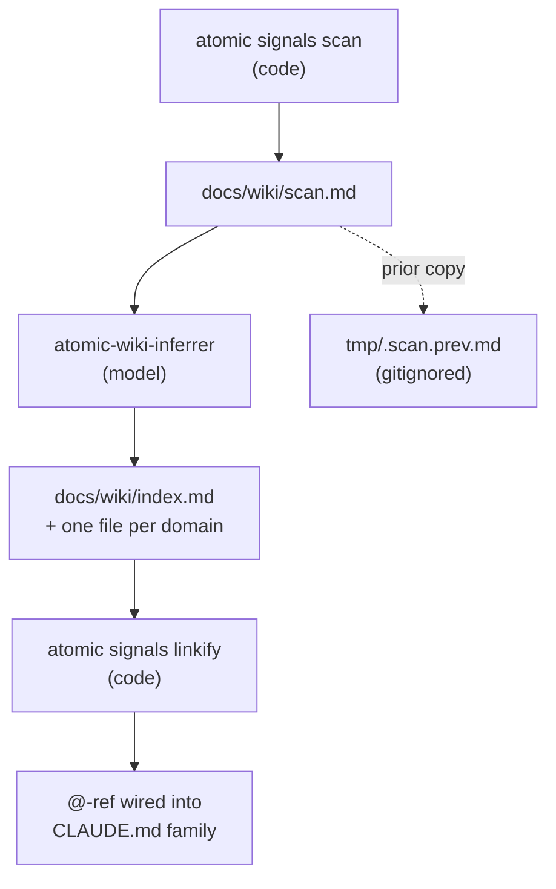

# signals

## What it does

A Claude session in this repo starts already knowing the repo's shape — languages, build commands, where each feature lives — instead of spending its first turns discovering it. This domain is what puts that knowledge in context, and keeps it true as the code moves.

It writes three kinds of file, and the difference between them is the whole design:

| File | Written by | When it loads |
|------|-----------|---------------|
| [`docs/wiki/scan.md`](scan.md) | code | never — it runs to thousands of lines |
| [`docs/wiki/index.md`](index.md), the **router** | a model | every turn, via an `@`-ref in a [`CLAUDE.md`](../../CLAUDE.md)-family file |
| `docs/wiki/<domain>.md` | a model | on demand, when a task reaches that domain |

Only the router is `@-ref`'d, so the router alone is what every turn pays for. It points; detail lives one hop away in a domain file — this page is one. `scan.md` is the raw substrate underneath both: committed, read on demand by the inferrer, never loaded into a session.

**The naming is a trap worth knowing up front.** The domain, the Go package, and the CLI verb are all called `signals`, but nothing lands in a path containing that word — output goes to [`docs/wiki/`](.), and the command that drives it is `/refresh-wiki`. There is also a separate `wiki` domain: the same inferrer agent, pointed at a whole realm of repos instead of this one. See [`docs/wiki/wiki.md`](wiki.md).

## How it works

Which side owns a step is the contract: code does every deterministic transform, and the model only writes prose.



### Staleness and the gate verbs

**Staleness is content-based, not mtime-based.** `Stale` reassembles the deterministic body exactly as `Scan` would and compares bytes. An idempotent regeneration that only bumps mtimes stays fresh. `Scan` reinforces this by skipping the write entirely when the body is unchanged.

Exit codes, shared by the two gate verbs:

| Verb | 0 | 1 | 2 |
|------|---|---|---|
| `atomic signals stale` | fresh, silent | stale, prints evidence and directive | hard error, for example `scan.md` missing |
| `atomic signals diff` | no diff | diff present, written to stdout | no prior version, or hard error |

Exit 1 versus exit 2 is the distinction callers act on: "out of date" is a refresh trigger, "broken" is not. On exit 1 `stale` prints two lines, deliberately imperative because the consumer is a model that can rationalize a bare exit code away:

```
signals: STALE — a fresh scan would change the deterministic snapshot (~N lines)
→ refresh required; dispatch atomic-wiki-inferrer. do not skip.
```

**`<scan-sha>` has exactly one job.** It catches a `scan.md` committed without a matching re-infer, forcing `scope = full`. No other staleness decision consults it; routine scope decisions use `git diff HEAD -- docs/wiki/scan.md` directly.

**`scan.md` is committed; `tmp/.scan.prev.md` is not.** The committed blob is the diff baseline both the scope computation and the `<scan-sha>` tiebreaker read. The `tmp/` copy is a gitignored fallback for environments without git.

### What the scan walks

**`.signalsignore` has two tiers.** A plain line is an exclude glob and the file vanishes from the tree; a `+`-prefixed line marks the file `[generated]`, so it still appears with metadata but the inferrer skips it for domain content. Each glob is matched against both the repo-relative path and the bare filename, so `gen.go` matches `gen.go` and `dir/gen.go` alike.

**Language stats are extension-only and capped at ten.** No content sniffing, and a language absent from the table is either below the top ten by LOC or has no mapped extension.

## Where it lives

### Artifacts

| Path | Role |
|------|------|
| [`context/agents/atomic-wiki-inferrer.md`](../../context/agents/atomic-wiki-inferrer.md) | The orchestrator. Detects repo vs realm scope, loads the matching pipeline reference, sub-dispatches `atomic-wiki-writer` per domain and `atomic-reviewer` per domain file, then assembles the router. Writes nothing outside the active wiki root and the single `@-ref` target. |
| [`context/agents/atomic-wiki-writer.md`](../../context/agents/atomic-wiki-writer.md) | Authors one domain page from source. Carries the `atomic-writing` skill in frontmatter rather than being asked to invoke it, and holds no `Agent` tool. |
| [`context/commands/refresh-wiki.md`](../../context/commands/refresh-wiki.md) | `/refresh-wiki` — the only entry point, idempotent across first run and refresh. Repo scope runs R1-R8; realm scope runs a separate 13-step pipeline. |
| [`context/skills/atomic-wiki/references/repo.md`](../../context/skills/atomic-wiki/references/repo.md) | The repo-scope pipeline the inferrer executes (Steps 1-9). The inferrer reads it from the installed path `~/.claude/skills/atomic-wiki/references/repo.md`, not from this repo. |
| [`context/_partials/signals-gate.md`](../../context/_partials/signals-gate.md) | The `signals-gate` partial composed into ship verbs. Owns the docs-only guard and the `atomic signals stale` exit-code routing. |

### Go packages

| Path | Role |
|------|------|
| [`atomic/internal/signals/signals.go`](../../atomic/internal/signals/signals.go) | `Scan` / `Stale` / `Diff` / `Show` / `LinkifyFiles`. Owns the [`docs/wiki/scan.md`](scan.md) and `tmp/.scan.prev.md` paths, `.signalsignore` parsing, and the `ErrStale` / `ErrDiffPresent` / `ErrNoPrior` sentinels. |
| [`atomic/internal/signals/tree.go`](../../atomic/internal/signals/tree.go) | File enumeration and the depth-capped tree render. Owns `skippedPrefixes` and the `git ls-files` versus `WalkDir` split. |
| [`atomic/internal/signals/languages.go`](../../atomic/internal/signals/languages.go) | Extension-to-language map and per-language LOC totals. |
| [`atomic/internal/signals/manifests.go`](../../atomic/internal/signals/manifests.go) | Manifest parsers for `Cargo.toml`, `Gemfile`, `composer.json`, `go.mod`, [`package.json`](../../package.json), `pom.xml`, `pyproject.toml`, `requirements.txt`, found anywhere in the tree. |
| [`atomic/internal/signals/diff.go`](../../atomic/internal/signals/diff.go) | `atomic signals diff` — `git diff` inside a repo, unix `diff` against `tmp/.scan.prev.md` outside one. |
| [`atomic/cmd/atomic/main.go`](../../atomic/cmd/atomic/main.go) (`runSignals`) | Verb dispatch and the process exit codes for `scan`, `show`, `stale`, `diff`, `linkify`. |
| [`atomic/internal/doctor/checks_signals.go`](../../atomic/internal/doctor/checks_signals.go) | Doctor category 3 (`signals`). Freshness plus router integrity. All WARN, never FAIL. |
| [`atomic/internal/doctor/checks_refs.go`](../../atomic/internal/doctor/checks_refs.go) | Doctor category 4 (`refs`). The only FAIL-severity check in this domain. |
| [`atomic/internal/cliusage/cliusage.go`](../../atomic/internal/cliusage/cliusage.go) | The five `signals` verb entries. `atomic validate artifacts` lints artifact citations against this table, so a verb or flag added here and nowhere else silently passes the lint. |

### Docs

| Path | Covers |
|------|--------|
| [`docs/spec/signals-workflow.md`](../spec/signals-workflow.md) | End-to-end lifecycle: files produced, the stale gate, inferrer dispatch, `@-ref` wiring rules, fallback flow. Canonical for the agent and the command. |
| [`docs/spec/signals-refresh-timing.md`](../spec/signals-refresh-timing.md) | When the refresh fires and how the inferrer is scoped. C1 `changed_range`, C2 docs-only guard, C3 implementation-loop finalize, C4 autopilot, C5 wiring surfaces. |
| [`docs/spec/signals-router.md`](../spec/signals-router.md) | Router shape, domain file layout, incremental versus full mode, the domain split budget, naming continuity. |
| [`docs/spec/signals-wiki-linkify.md`](../spec/signals-wiki-linkify.md) | Linkify contract: disk resolution as the filter, the skip-set, gitignore layer, idempotence, fenced blocks untouched. |
| [`docs/spec/wiki-storage-relocation.md`](../spec/wiki-storage-relocation.md) | The [`docs/wiki/`](.) layout and which staging steps include `scan.md`. |
| [`docs/reference/repo-wiki.md`](../reference/repo-wiki.md) | User-facing account of when a refresh fires. |
| [`docs/design/signals-router.md`](../design/signals-router.md) | Why a flat eager-loaded file fails at scale, and the domain-partitioning answer. |
| [`docs/design/signals-refresh-timing.md`](../design/signals-refresh-timing.md) | Why the primary refresh sits at implementation finalize and why `atomic signals stale` is the coordinator instead of a marker file. |
| [`docs/spec/signals-project-detection.md`](../spec/signals-project-detection.md) | Framework and dependency annotations on manifest bullets. Unimplemented: `manifests.go` has no detection rules, and the signals package never reads [`.claude/atomic.toml`](../../.claude/atomic.toml). The spec also predates the current layout, naming `deterministic-signals.md` and [`.claude/project/`](../../.claude/project). |

## Constraints

**[`docs/wiki/`](.) is excluded from its own scan, and removing that exclusion wedges the stale gate permanently.** The inferrer writes a `<scan-sha>` of `scan.md` into `index.md`, which changes `index.md`'s blob SHA. If [`docs/wiki/`](.) were walked, that change would alter the scan tree, which would alter `scan.md`, which would make `atomic signals stale` return exit 1 forever. `skippedPrefixes` in `tree.go` holds the fixed [`docs/wiki/`](.) prefix alongside the two harness-relative ones.

**Write backtick paths, never markdown links and never `@-refs`.** `atomic signals linkify` renders resolvable tokens into relative links afterward, skipping `scan.md`, [`CLAUDE.md`](../../CLAUDE.md), and fenced code blocks, and rewriting a file only when the content changed. A token that does not resolve on disk is left as plain text, which is how `` `git status` `` and `` `atomic signals scan` `` survive. A token built only from `.` and `/` is left alone too — it would otherwise resolve to the repo root and link there.

**The `--out` flag help names the wrong destination.** It reads `write substrate to <dir> instead of <root>/.claude/project/`, while the flag actually writes `<dir>/docs/wiki/scan.md`.

## Coupling

**workflow** owns when the refresh fires. `/subagent-implementation` finalize and `/autopilot` pre-ship each dispatch the inferrer once with `mode: silent` and `changed_range: <loop-base>..HEAD`, committed as `chore(signals): refresh after <topic>`. Ship verbs are the ad-hoc fallback through the `signals-gate` partial. All three stage with `git add docs/wiki/*.md`. Change the inferrer's dispatch interface and all three call sites change with it.

**doctor** consumes two contracts. `checks_refs.go` hardcodes `signalsRef = "@docs/wiki/index.md"` and the `candidateFiles` search order ([`claude.local.md`](../../claude.local.md), [`CLAUDE.local.md`](../../CLAUDE.local.md), [`CLAUDE.md`](../../CLAUDE.md), [`claude.md`](../../claude.md)). `checks_signals.go` parses the router's Domains table to detect missing and orphan domain files, reading the **last** content column of each row. Changing the router's column layout breaks that parser.

**config** supplies `output.signals.max_depth` from `~/.atomic/config.toml`, and `config.ScratchpadDir` / `config.ProjectDir` feed the scan's skip prefixes, so a non-default `harness.dir` changes what the scan walks.

**bundle** ships the inferrer, the command, and the `signals-gate` partial as source files directly under [`context/`](../../context) — [`context/agents/atomic-wiki-inferrer.md`](../../context/agents/atomic-wiki-inferrer.md), [`context/commands/refresh-wiki.md`](../../context/commands/refresh-wiki.md), [`context/_partials/signals-gate.md`](../../context/_partials/signals-gate.md). A single `make bundle` expands any `{{ template ... }}` directive into the embedded bundle; nothing is written back into [`context/`](../../context), so editing any of the three is editing the shipped source directly.

**wiki** shares the inferrer. The same agent serves repo scope here and realm scope there, branching on dispatch args. The `signals-gate` partial calls `atomic wiki mark-dirty` after a refresh.

**code-intel** is an optional input. `/refresh-wiki` R4 syncs a warm index or builds a cold one before dispatch, so domain clustering can use real import and call edges. Every path degrades to filename heuristics without surfacing an error.
