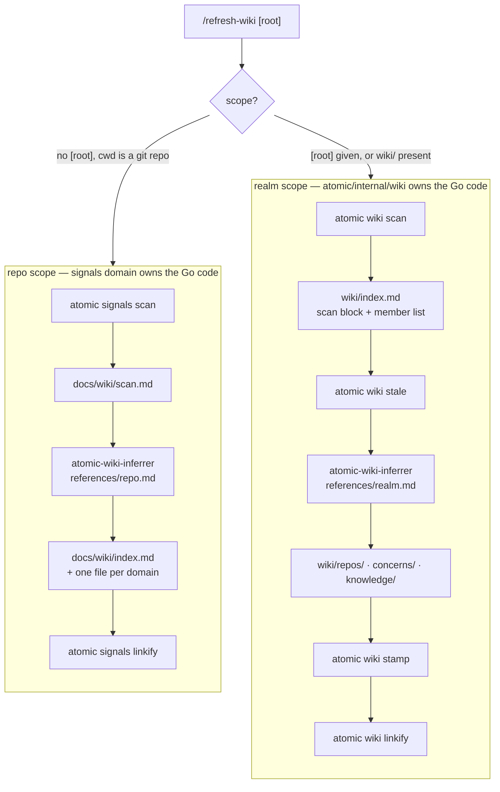
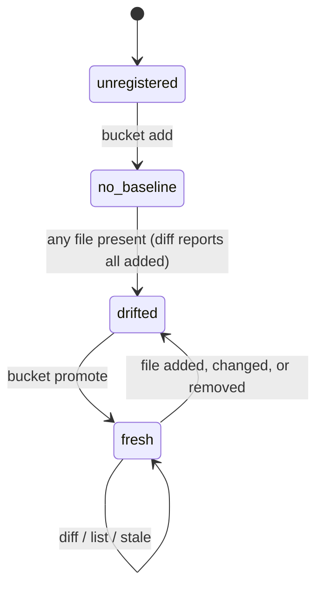

# wiki

## What it does

A set of related repos has no shared description of itself. Answering "what does this system do" means opening each repo in turn, and any hand-written overview starts rotting the day it is written, with nothing to say which parts have gone stale.

A wiki is that description, generated and fingerprint-stamped. Code owns structure (discovery, classification, managed regions, SHA-256 fingerprints); the model owns meaning (summaries, concerns, knowledge pages). Freshness is deterministic: a stamped fingerprint either matches the source or it does not, so the LLM pass only re-authors what code has proven stale.

Two scopes exist and they do not share an implementation. **Repo scope** lives at [`docs/wiki/`](.) inside one repo and is built by the signals domain. **Realm scope** lives at `<root>/wiki/`, its own git repo, spans the member repos found under `<root>`, and is built by [`atomic/internal/wiki/`](../../atomic/internal/wiki). `/refresh-wiki` is the single entry point and detects which applies.

## How it works

One command, but the two scopes share no Go code, only the agent that runs between their steps.

Everything under [`atomic/internal/wiki/`](../../atomic/internal/wiki) is realm scope. The repo-scope pipeline exists as prompt text in [`skills/atomic-wiki/references/repo.md`](../../skills/atomic-wiki/references/repo.md), and the verbs it calls belong to the signals domain.

### Verbs

`atomic wiki <verb>`, dispatched by `wikiAction` in [`atomic/internal/wiki/action.go`](../../atomic/internal/wiki/action.go).

| Verb | Args and flags | Behavior |
|------|----------------|----------|
| `scan` | `--root` | Discover members, classify, scaffold `wiki/`, rewrite the managed regions, register in `~/.claude/CLAUDE.md`, rebuild bucket indexes. Prints a member handoff to stdout. |
| `stale` | `--root` | Read-only freshness report. Exit 0 fresh, 1 stale, 2 hard error. |
| `init` | `--scope repo\|realm`, `--root` | Write the fixed-content steering [`CLAUDE.md`](../../CLAUDE.md) for that scope plus the `scope` marker in [`.claude/atomic.toml`](../../.claude/atomic.toml). Idempotent. |
| `stamp <file>` | `--repo` / `--root --cites` / `--knowledge --sources` | Write `reflects_rev`, `reflects:`, or `sources:` frontmatter. Three mutually exclusive modes. |
| `linkify` | `--root` | Rewrite path citations under `wiki/` as relative markdown links. Idempotent; never touches fenced code. |
| `mark-dirty` | none | Touch `<root>/wiki/.dirty` when cwd is under a registered realm. Internal: no Cobra subcommand, no `cliusage` entry, not in `/atomic-help`. |
| `bucket add <name>` | `--root` | Register a bucket: manifest dir, `index.md` stub, registry entry, realm [`CLAUDE.md`](../../CLAUDE.md) capture-surfaces bullet. |
| `bucket list` | `--root` | Status listing. Read-only. |
| `bucket diff <name>` | `--root` | Diff against baseline and write `current`. Exit 0 empty, 1 non-empty. |
| `bucket promote <name>` | `--root` | Recompute the walk live, rotate `baseline` to `previous`, write the fresh walk as `baseline`. |
| `bucket doc <bucket> <slug>` | `--root`, `--router` | Scaffold `<bucket>/<slug>.md` from the embedded template. Refuses a collision. |
| `bucket skill <bucket>` | `--root` | Scaffold `<realm>/.claude/skills/<bucket>-management/SKILL.md`. No-op if present. |
| `bucket index [<bucket>]` | `--root` | Force a rebuild of the two index regions outside a scan. |

### Member classification

`classifyMembers` takes the first rule that matches, per member:

| Order | Test | Status |
|-------|------|--------|
| 1 | The prior scan block said `summarized` and that summary file is still on disk | `summarized`, preserved |
| 2 | `<member>/docs/wiki/index.md` exists, or the legacy `<member>/.claude/project/signals.md` does | `indexed` |
| 3 | `wiki/repos/<name>.md` exists, or `wiki/repos/<name>/` holds at least one `.md` | `summarized` |
| 4 | Nothing above matched | `pending` |

Rule 2 outranks rule 3, so a member that graduates to `indexed` keeps its summary file on disk but loses its recorded `SummaryPath`. That is why `resolveSummaryMember` needs a base-name fallback and cannot rely on the claim alone.

`discoverMembers` walks from the root's children, stops at each `.git` boundary, and skips `node_modules`, `dist`, `build`, `target`, `vendor`, `.worktrees`, `tmp`, `.git`, and the wiki directory. The root is never a member.

### Bucket lifecycle

Only `promote` advances the baseline, so a failed synthesis leaves the drift intact for the next run.

The manifest directory `wiki/.buckets/<name>/` holds three files. `current` is a debugging artifact written by `diff` and `promote` and never read back as state. `baseline` is what `diff` compares against. `previous` is the prior baseline. `PromoteBucket` always recomputes the walk live rather than reading `current`.

`BucketDiff` writes `current`; `bucketDiffReadOnly` (used by `list` and `stale`) does not. Status verbs have no side effects. `/refresh-wiki` promotes a bucket only when synthesis *and* stamping both succeed.

`WalkBucket` excludes the bucket-root `index.md`, `.DS_Store`, `Thumbs.db`, and any `skipDirs` subtree.

### Bucket-doc frontmatter

`<bucket>/<slug>.md` is one topic per file. Six recognized keys:

| Key | Writer | Fallback when absent |
|-----|--------|----------------------|
| `title` | author | first H1, then filename stem |
| `type` | author | none; free-form (`Research`, `Ticket`, …) |
| `description` | author | first non-structural prose line, truncated to 120 chars |
| `tags` | author | none; a bare string reads as a one-element list, any other malformed shape is ignored whole |
| `status` | author | none; free-form |
| `created` | code | stamped by `atomic wiki bucket doc` at scaffold time |

Every key is optional. A doc carrying none of the six is still listed, under an `### Unindexed` heading, rather than dropped.

The topic walk covers the bucket root plus one directory level. A directory beside a matching `<slug>.md` collapses into that entry as a **router**; a directory with no sibling file lists as an **orphan** subtree.

### Managed regions

XML-tag regions (`<tag>…</tag>`) are the mechanism for every code-generated splice in a wiki markdown file: `<wiki-scan>`, `wiki-member-list`, `<wiki-buckets>`, `<wiki-bucket-list>`, `<bucket-docs>`. Heading-bounded splicing cannot tell "the next heading" from a heading a user typed inside the generated block.

- A blank line on each side of the region content is mandatory, not cosmetic. CommonMark parses a tag alone on a line as an HTML block running to the next blank line, so unpadded content renders as raw text. `renderManagedRegion` is the only emitter of that padding.
- A splice that finds exactly one of the open or close tags returns the document byte-for-byte unchanged plus an error. Every call site warns to stderr and continues, matching `Scan`'s behavior.
- `atomic wiki scan` is idempotent: it rewrites only the managed regions. Content outside them, and everything under `repos/`, `concerns/`, and `knowledge/`, is untouched.
- Scan refuses to run when `wiki/` exists but `index.md` is absent or carries no `<wiki-scan>` marker, and names the path in the error.

### Fingerprints

Code writes every fingerprint value; the model only declares what was cited.

| Mode | Invocation | Writes | Value |
|------|-----------|--------|-------|
| summary | `stamp <file> --repo <dir>` | `reflects_rev` | `git rev-parse HEAD` in `<dir>` |
| concern | `stamp <file> --root <realm> --cites a,b` | `reflects:` list of `<id>@<fp>` | per id, resolved by `resolveFingerprint` |
| knowledge | `stamp <file> --knowledge --sources ...` | `sources:` list | caller's entries verbatim; hashes come from `wiki/.buckets/<name>/current` |

An unresolvable id is skipped without error in both stamp and concern paths. Missing, garbled, or unparseable fingerprint frontmatter always reports stale rather than fresh.

### Freshness and drift

The session-start hook calls `CheckStaleness` with a 30-day threshold, a constant in [`atomic/internal/hooks/hooks.go`](../../atomic/internal/hooks/hooks.go). It performs stats and reads only and never spawns git. A `<root>/wiki/.dirty` marker nudges regardless of age; `/refresh-wiki` clears it only after a fully clean run, and re-runs `scan` to bump the `generated` date that resets the neglect timer.

`<wiki-scan>` carries `root` and `generated` on the open tag and records membership and status only, never fingerprints. `<wiki-buckets>` carries `<bucket name="…" path="…"/>` entries; a `declined="true"` attribute on the open tag records that the user declined the one-time bucket offer, and `spliceBucketEntry` removes it when a real bucket is added.

## Where it lives

### Artifacts

| Path | Role |
|------|------|
| [`commands/refresh-wiki.md`](../../commands/refresh-wiki.md) | `/refresh-wiki [root]`. Detects scope, then runs the repo branch (R1-R8) or the realm branch (Steps 1-13). Rendered from [`templates/commands/refresh-wiki.md`](../../templates/commands/refresh-wiki.md). |
| [`agents/atomic-wiki-inferrer.md`](../../agents/atomic-wiki-inferrer.md) | The orchestrator. Resolves `$HOME`, reads the installed pipeline reference, executes it, and dispatches the writer and reviewer per domain. Authors no page itself. Rendered from [`templates/agents/atomic-wiki-inferrer.md`](../../templates/agents/atomic-wiki-inferrer.md). |
| [`agents/atomic-wiki-writer.md`](../../agents/atomic-wiki-writer.md) | The page author, one dispatch per domain. Declares `skills: [atomic-writing]`, so the page contract loads as context instead of arriving as a request, and holds no `Agent` tool, so it cannot fan out. Rendered from [`templates/agents/atomic-wiki-writer.md`](../../templates/agents/atomic-wiki-writer.md). |
| [`skills/atomic-wiki/SKILL.md`](../../skills/atomic-wiki/SKILL.md) | Conversational entry point: realm resolution, bucket creation, bucket-doc authoring, staleness queries. No command invokes it. |
| [`skills/atomic-wiki/references/repo.md`](../../skills/atomic-wiki/references/repo.md) | Repo-scope pipeline (Steps 1-9): the domain-page shape, the reviewer checklist, the incremental-vs-full scope rule, and the router shape. |
| [`skills/atomic-wiki/references/realm.md`](../../skills/atomic-wiki/references/realm.md) | Realm-scope pipelines: wiki-output (W1-W7) and bucket-synthesis (B1-B5), plus the bucket-doc frontmatter contract. |
| [`templates/shared/signals-gate.md`](../../templates/shared/signals-gate.md) | Ship-verb partial. Calls `atomic wiki mark-dirty` after the signals refresh. |

### Package files

| Path | Role |
|------|------|
| [`atomic/internal/wiki/wiki.go`](../../atomic/internal/wiki/wiki.go) | `Scan(root, Options)`: collision check, parse prior entries, `discoverMembers`, `classifyMembers`, scaffold, write scan block, write member list, rebuild bucket indexes. `Options.Clock` is injectable for deterministic tests. Also holds `DeriveMemberDescription` and the legacy-marker migration. |
| [`atomic/internal/wiki/stale.go`](../../atomic/internal/wiki/stale.go) | `Stale(root, out)`: membership drift, per-artifact fingerprint drift, bucket drift. `resolveSummaryMember` maps a `repos/*.md` file back to its owning member. |
| [`atomic/internal/wiki/stamp.go`](../../atomic/internal/wiki/stamp.go) | The three stamp modes and `resolveFingerprint`. Fingerprints are only ever written here. |
| [`atomic/internal/wiki/bucket.go`](../../atomic/internal/wiki/bucket.go) | Manifest core: `WalkBucket` (sorted `<relpath>\t<sha256hex>`), `RegisterBucket`, `BucketDiff`, `bucketDiffReadOnly`, `PromoteBucket`, `validateBucketName`. |
| [`atomic/internal/wiki/bucket_registry.go`](../../atomic/internal/wiki/bucket_registry.go) | `<wiki-buckets>` registry splice, `## Capture surfaces` section in the realm [`CLAUDE.md`](../../CLAUDE.md), and `createBucketIndexStub`. |
| [`atomic/internal/wiki/bucketindex.go`](../../atomic/internal/wiki/bucketindex.go) | Topic-granularity walk plus the `<bucket-docs>` and `<wiki-bucket-list>` region renderers. `RebuildAllBucketIndexes` joins per-bucket failures rather than stopping. |
| [`atomic/internal/wiki/bucketdoc.go`](../../atomic/internal/wiki/bucketdoc.go) | `ScaffoldBucketDoc` / `ScaffoldBucketSkill`, backed by `//go:embed templates/*.md`. |
| [`atomic/internal/wiki/templates/`](../../atomic/internal/wiki/templates) | Three scaffold templates (`bucket-doc.md`, `bucket-router-claude.md`, `bucket-skill.md`) with `{{TOKEN}}` placeholders. |
| [`atomic/internal/wiki/managedregion.go`](../../atomic/internal/wiki/managedregion.go) | The XML-tag region primitive every code-generated splice uses. |
| [`atomic/internal/wiki/registry.go`](../../atomic/internal/wiki/registry.go) | `RegisterWiki` writes the realm index path into the `<wikis>` block of `~/.claude/CLAUDE.md`; `PrintHandoff` renders the scan stdout contract. |
| [`atomic/internal/wiki/staleness.go`](../../atomic/internal/wiki/staleness.go) | `CheckStaleness` (session-start nudge, no git spawns) and `MarkDirty`. |
| [`atomic/internal/wiki/linkify.go`](../../atomic/internal/wiki/linkify.go) | `LinkifyWiki`. Base resolution: `repos/**` uses each summary's `repo:` frontmatter, `concerns/*.md` and `index.md` use the realm root. |
| [`atomic/internal/wiki/init.go`](../../atomic/internal/wiki/init.go) | The two steering scaffolds written by `wiki init`. |
| [`atomic/internal/wiki/action.go`](../../atomic/internal/wiki/action.go) | CLI dispatch, `resolveWikiRoot`, and the per-verb actions. |
| [`atomic/internal/wiki/exports.go`](../../atomic/internal/wiki/exports.go), `scan_members.go` | `FileSHA256`, `ResolveFingerprint`, `ReadScanMembers` — the read-only surface `atomic serve` consumes. |

### Docs

| Path | Covers |
|------|--------|
| [`docs/spec/wiki.md`](../spec/wiki.md) | Core contract: verb success criteria, classification rules, `<wiki-scan>` block format, `<wikis>` registry, fingerprint store, staleness, forcing function. |
| [`docs/spec/wiki-buckets.md`](../spec/wiki-buckets.md) | Bucket contract: the two-phase diff/promote split, `<wiki-buckets>` format, capture surfaces, knowledge-page layout, the `capture → knowledge → concerns` citation DAG. |
| [`docs/spec/bucket-doc-management.md`](../spec/bucket-doc-management.md) | Child of `wiki-buckets`. Frontmatter contract, the topic walk, both managed regions, the `doc`/`skill`/`index` verbs. |
| [`docs/spec/wiki-stale-summary-resolution.md`](../spec/wiki-stale-summary-resolution.md) | The four member-location × summary-layout shapes and the three-step `resolveSummaryMember` order. |
| [`docs/spec/wiki-bucket-arg-hardening.md`](../spec/wiki-bucket-arg-hardening.md) | Help probes must never mutate state; bucket names must be safe path segments. |
| [`docs/spec/wiki-storage-relocation.md`](../spec/wiki-storage-relocation.md) | The [`docs/wiki/`](.) layout, OKF frontmatter, and the `<wiki-type>`/`<scan-sha>`/`<wiki-schema>` control blocks. |
| [`docs/spec/wiki-drift-scope.md`](../spec/wiki-drift-scope.md) | How a repo-scope refresh chooses incremental versus full re-infer. |
| [`docs/spec/wiki-deterministic-setup.md`](../spec/wiki-deterministic-setup.md) | The `atomic wiki init` verb. |
| [`docs/spec/signals-wiki-linkify.md`](../spec/signals-wiki-linkify.md) | The linkify contract shared by `signals linkify` and `wiki linkify`. |
| [`docs/design/wiki.md`](../design/wiki.md), [`docs/design/wiki-buckets.md`](../design/wiki-buckets.md), [`docs/design/bucket-doc-management.md`](../design/bucket-doc-management.md), [`docs/design/signals-wiki-unification.md`](../design/signals-wiki-unification.md) | Rationale and rejected alternatives behind the specs above. |
| [`docs/reference/wiki-workflow.md`](../reference/wiki-workflow.md) | User-facing guide: realm mental model, disk layout, member states, bucket authoring, bucket-name rules. |
| [`docs/reference/concepts.md`](../reference/concepts.md) | `## Wikis` section: signals versus wikis, the three member states, the nudge model. |

## Constraints

**The inferrer reads its pipeline from the installed path** (`~/.claude/skills/atomic-wiki/references/`), not from the repo copy. Editing the repo copy has no effect until `atomic claude install` runs.

**Do not merge the two bucket walks.** The topic walk (bucket root plus one directory level, for the index regions) and `WalkBucket` (every file, hashed, for staleness) answer different questions at different granularities. Collapsing them breaks one of the two.

**Two fingerprint-resolution facts that cost time when missed.**

- `resolveFingerprint` recognizes an indexed member only by the legacy `<id>/.claude/project/signals.md` path. A member migrated to [`docs/wiki/index.md`](index.md) falls through to the git-HEAD branch instead.
- `Stale` resolves a `knowledge/<topic>.md` citation against `<root>/wiki/`, but `StampConcern` resolves every id against the single `--root` it was given. `/refresh-wiki` passes the realm root there, so a knowledge-page citation resolves to a path that does not exist and is silently skipped. Repo ids are unaffected.

**Bucket names must be safe single path segments:** not empty or whitespace, not `-`-prefixed, no `/` or `\`, not `.` or `..`, and not the reserved `wiki`. `validateBucketName` is the register-time backstop for programmatic callers; the CLI scanner rejects dash tokens first.

**Slug validation is deliberately asymmetric.** Bucket-doc slugs must match `[a-z0-9-]+` and fail hard on mismatch. Knowledge topic filenames must match `[a-z0-9][a-z0-9-]*\.md` and are skipped with exit 0 on mismatch, not failed.

**`resolveWikiRoot` is the single arg scanner behind every `bucket` verb.** It accepts `--root` in any position, recognizes `-h`/`-help`/`--help` anywhere and returns a sentinel that makes the verb print usage and exit 0 with no filesystem write, and rejects any other dash-prefixed token rather than letting it become a positional. `scan`, `stale`, and `linkify` use a plain `flag.FlagSet` and do not share this behavior.

**`ScaffoldBucketDoc` refuses a collision; `ScaffoldBucketSkill` treats one as a silent no-op.** A doc-slug collision usually means a naming mistake worth surfacing; re-running the skill scaffold on a realm that already has it is the expected outcome.

**Realm scope has no `<wiki-type>` sentinel.** `atomic-wiki-inferrer` documents realm detection as `wiki/index.md` carrying `<wiki-type>realm</wiki-type>`, but no code path writes that block. Only [`atomic/internal/migrate/`](../../atomic/internal/migrate) writes `<wiki-type>repo</wiki-type>`, into [`docs/wiki/index.md`](index.md). In practice realm scope is detected by the presence of `wiki/index.md` with a `<wiki-scan>` block, which is what `/refresh-wiki` Step 0 falls back to.

## Coupling

- **signals domain** owns the entire repo-scope implementation. `atomic signals scan --out <dir>` is a direct dependency of realm wiki-output mode: the inferrer redirects the scan so it never writes into the member repo. A change to that flag or to `scan.md`'s format breaks member summarization. `atomic signals linkify` handles [`docs/wiki/`](.); `atomic wiki linkify` handles `wiki/`. Neither covers the other's tree.
- **docs-meta domain** owns the page shape both pipeline references encode. The five-section domain-page order in [`skills/atomic-wiki/references/repo.md`](../../skills/atomic-wiki/references/repo.md) and the realm summary shape in [`skills/atomic-wiki/references/realm.md`](../../skills/atomic-wiki/references/realm.md) are the `atomic-writing` skill's `## Structure before sentences` order applied to these two surfaces. Change one without the other and the contract forks.
- **config domain** owns `~/.claude/CLAUDE.md` and [`.claude/atomic.toml`](../../.claude/atomic.toml). `RegisterWiki` and `CheckStaleness` read and write the `<wikis>` block there, and `atomic claude install` writes the same file — the `claude-merge` cold-op brief preserves `<wikis>` verbatim for that reason. `wikiInitAction` calls `config.EnsureScopeMarker`; a root already marked with the other scope exits 1 without touching either file. `atomic where` and `repoctx` prefer that marker over this domain's `<wikis>` registry.
- **workflow domain** owns the ship verbs. Every one composes [`templates/shared/signals-gate.md`](../../templates/shared/signals-gate.md), which calls `atomic wiki mark-dirty`. A new ship verb that skips the partial silently breaks the drift marker. `/refresh-wiki` Step 13 commits the wiki through the `atomic-git-discipline` skill.
- **doctor domain** owns [`atomic/internal/cliusage/cliusage.go`](../../atomic/internal/cliusage/cliusage.go), the single source of truth for the CLI surface. Registering a `wiki` verb in [`atomic/cmd/atomic/main.go`](../../atomic/cmd/atomic/main.go) without a matching `cliusage` entry desyncs `--help` from the A1 citation lint. `mark-dirty` is deliberately absent from both.
- **bundle domain** owns rendering and embedding. [`commands/refresh-wiki.md`](../../commands/refresh-wiki.md) and [`agents/atomic-wiki-inferrer.md`](../../agents/atomic-wiki-inferrer.md) are rendered outputs; edit the templates, then `make render` and `make bundle`. The three files in [`atomic/internal/wiki/templates/`](../../atomic/internal/wiki/templates) are a separate `go:embed` — compiled into the binary, never mirrored into [`atomic/internal/embedded/bundle/`](../../atomic/internal/embedded/bundle), never installed to `~/.claude`.
- **serve domain** consumes `ReadScanMembers` (nav tree, code members), `ReadBucketEntries` (nav tree), and `FileSHA256` plus `ResolveFingerprint` (provenance panel). Renaming any of them breaks `atomic serve`. The exported `BucketDiffReadOnly` wrapper has no caller outside this package.
