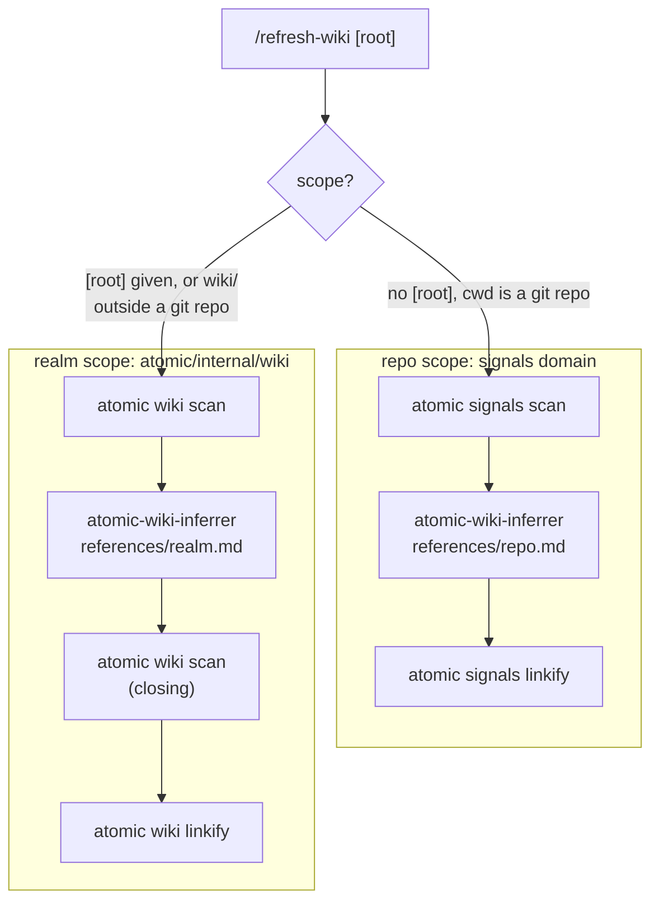
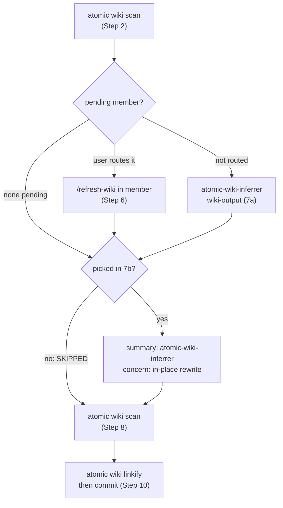
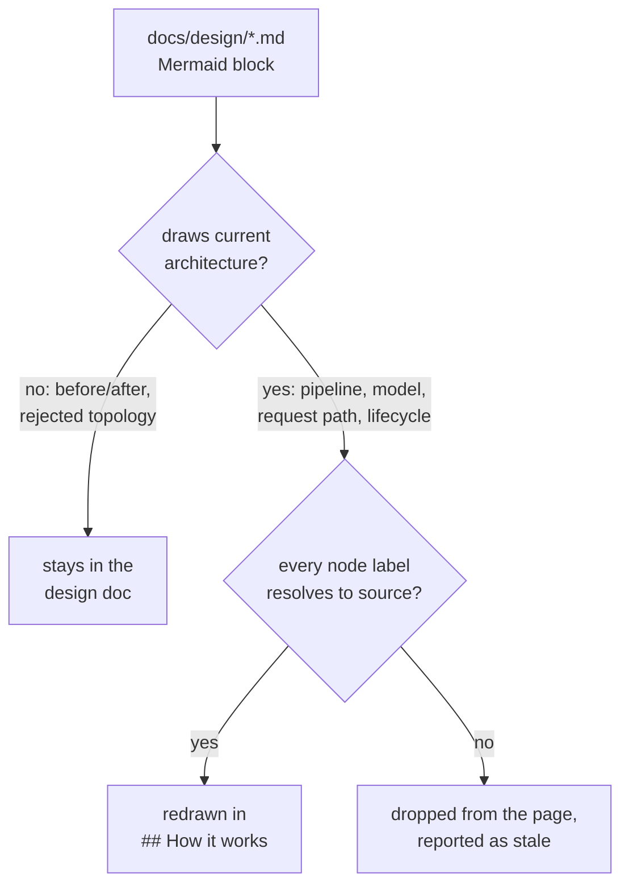
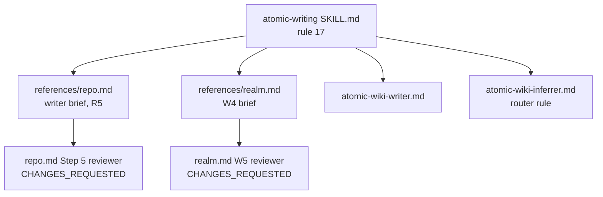
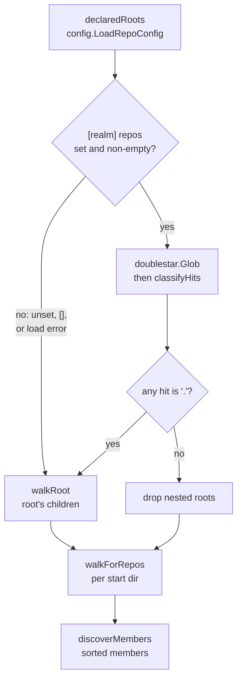
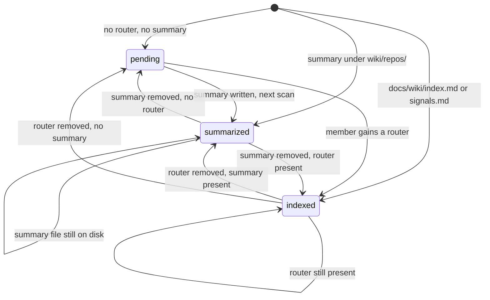
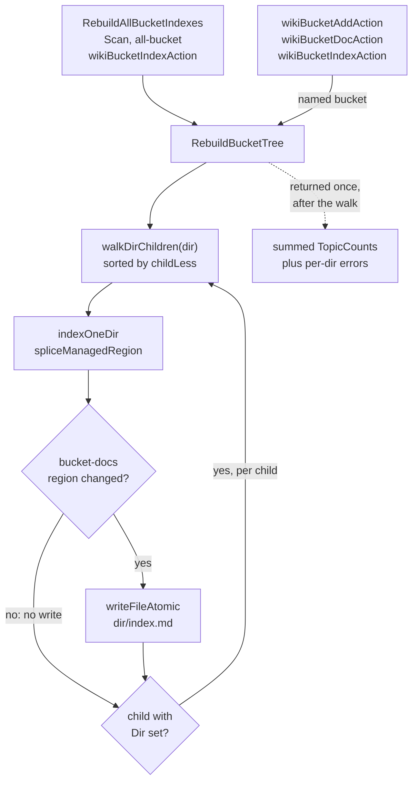

# wiki

## What it does

A set of related repos has no shared description of itself. Answering "what does this system do" means opening each repo in turn, and a hand-written overview has no structure that says which repos it covers or where their own docs live.

A wiki is that description. Code owns structure (member discovery, classification, managed regions, bucket indexes); the model owns meaning (repo summaries and cross-cutting concerns). Nothing tracks whether a summary or concern is current: `atomic wiki stale` reports membership drift only, and `/refresh-wiki` re-authors only the summaries and concerns the user picks.

Repo scope and realm scope share no implementation. **Repo scope** lives at [`docs/wiki/`](.) inside one repo and is built by the signals domain. **Realm scope** lives at `<root>/wiki/`, its own git repo, spans the member repos found under `<root>`, and is built by [`atomic/internal/wiki/`](../../atomic/internal/wiki). `/refresh-wiki` is the single entry point and detects which applies.

## How it works

One command, but the scopes share no Go code, only the agent that runs between their steps. The realm pipeline scans twice, so the committed `index.md` records the statuses the run itself produced.

```mermaid
flowchart TD
    %% source: context/commands/refresh-wiki.md, context/skills/atomic-wiki/references/repo.md, context/skills/atomic-wiki/references/realm.md
    RW["/refresh-wiki [root]"] --> D{"scope?"}
    D -->|"no [root], cwd is a git repo"| A1
    D -->|"[root] given, or wiki/<br/>outside a git repo"| B1

    subgraph P1["repo scope: signals domain"]
        A1["atomic signals scan"] --> A3["atomic-wiki-inferrer<br/>references/repo.md"]
        A3 --> A5["atomic signals linkify"]
    end

    subgraph P2["realm scope: atomic/internal/wiki"]
        B1["atomic wiki scan"] --> B2["atomic-wiki-inferrer<br/>references/realm.md"]
        B2 --> B3["atomic wiki scan<br/>(closing)"]
        B3 --> B4["atomic wiki linkify"]
    end
```

Everything under [`atomic/internal/wiki/`](../../atomic/internal/wiki) is realm scope. The repo-scope pipeline exists as prompt text in [`context/skills/atomic-wiki/references/repo.md`](../../context/skills/atomic-wiki/references/repo.md), and the verbs it calls belong to the signals domain.

### Realm refresh

Only pending repos get a summary without asking; an existing summary or concern changes only when the user picks it, and the closing scan runs after every write.

```mermaid
flowchart TD
    %% source: context/commands/refresh-wiki.md (realm Steps 2-10)
    S2["atomic wiki scan<br/>(Step 2)"] --> P{"pending member?"}
    P -->|"user routes it"| R6["/refresh-wiki in member<br/>(Step 6)"]
    P -->|"not routed"| W7a["atomic-wiki-inferrer<br/>wiki-output (7a)"]
    P -->|"none pending"| L7b
    R6 --> L7b{"picked in 7b?"}
    W7a --> L7b
    L7b -->|"yes"| RA["summary: atomic-wiki-inferrer<br/>concern: in-place rewrite"]
    L7b -->|"no: SKIPPED"| S8["atomic wiki scan<br/>(Step 8)"]
    RA --> S8
    S8 --> LK["atomic wiki linkify<br/>then commit (Step 10)"]
```

Step 7b lists every existing `repos/` summary (leaving out the ones 7a just wrote and any whose repo is not a member) and every `concerns/*.md` file as one numbered list, and accepts indices, ranges, `all`, `none`, or `all except N`. A selected summary re-runs the inferrer in wiki-output mode for that member; a selected concern is re-synthesized in place from the signals files and summaries it cites. No step creates a concern. Step 5 stops early, printing `nothing to refresh.` and skipping to the commit, when nothing is pending, no bucket was just created, and `repos/` and `concerns/` hold nothing to offer. Step 3's one-time bucket offer and Step 4's placeholder fill run between the first scan and Step 5. The run calls no `atomic wiki stale`, since the scan it would compare against has just been rewritten.

### Design-doc diagrams carried into pages

Inside A3 and B2, the writer dispatch a domain receives carries a `<design_docs>` block: `repo.md` Step 3 assigns every `docs/design/*.md` file to a domain (the domain named by its `domain:` frontmatter, or otherwise the domain whose paths it describes), and `realm.md` W3/W4 do the same for `target_repo`'s design docs in wiki-output mode. `atomic-wiki-writer` then decides, per Mermaid block in a listed design doc, whether it belongs on the page.

```mermaid
flowchart TD
    %% source: context/skills/atomic-wiki/references/repo.md, context/skills/atomic-wiki/references/realm.md, context/agents/atomic-wiki-writer.md
    DD["docs/design/*.md<br/>Mermaid block"] --> K{"draws current<br/>architecture?"}
    K -->|"no: before/after,<br/>rejected topology"| STAY["stays in the<br/>design doc"]
    K -->|"yes: pipeline, model,<br/>request path, lifecycle"| R{"every node label<br/>resolves to source?"}
    R -->|"yes"| REDRAW["redrawn in<br/>## How it works"]
    R -->|"no"| DROP["dropped from the page,<br/>reported as stale"]
```

A design diagram lands on the page only when it draws current architecture and every node still resolves to source; a decision diagram or a diagram with dead nodes never reaches the page unreported. The redrawn block's node labels resolve to a file or symbol in the domain's source paths, checked with `atomic code search <label>` when the code index exists, grep otherwise, and the reviewer dispatched in Step 5 / W5 checks that the diagram either landed on the page or was named as stale, and that every Mermaid block on the page passes `~/.claude/skills/atomic-writing/references/mermaid.md`.

### No-counts ban

The ban on counting things in the repo is stated once, in `atomic-writing` rule 17, and every page-writing surface carries it as one line, so the reviewer in each pipeline can fail a page that breaks it.

```mermaid
flowchart TD
    %% source: docs/design/wiki-durable-facts.md, context/skills/atomic-writing/SKILL.md, context/skills/atomic-wiki/references/repo.md, context/skills/atomic-wiki/references/realm.md, context/agents/atomic-wiki-writer.md, context/agents/atomic-wiki-inferrer.md
    SKILL["atomic-writing SKILL.md<br/>rule 17"] --> REPO["references/repo.md<br/>writer brief, R5"]
    SKILL --> REALM["references/realm.md<br/>W4 brief"]
    SKILL --> WRITER["atomic-wiki-writer.md"]
    SKILL --> INFER["atomic-wiki-inferrer.md<br/>router rule"]
    REPO --> RREV["repo.md Step 5 reviewer<br/>CHANGES_REQUESTED"]
    REALM --> RLREV["realm.md W5 reviewer<br/>CHANGES_REQUESTED"]
```

A version and a documented contract value are the only carve-out. This repo's [`docs/wiki/CLAUDE.md`](CLAUDE.md) steering file carries the same line.

### Verbs

`atomic wiki <verb>`, dispatched by `wikiAction` in [`atomic/internal/wiki/action.go`](../../atomic/internal/wiki/action.go). Any other verb exits 1 with `unknown verb`.

| Verb | Args and flags | Behavior |
|------|----------------|----------|
| `scan` | `--root` | Discover members, classify, scaffold `wiki/`, rewrite the managed regions, write the realm scope marker, register in `~/.claude/CLAUDE.md`, rebuild bucket indexes. Prints a member handoff to stdout. |
| `stale` | `--root` | Read-only membership-drift report: `DRIFT added\|removed\|status` lines. Exit 0 no drift, 1 drift, 2 hard error. |
| `init` | `--scope repo\|realm`, `--root` | `repo` writes the fixed-content steering file [`docs/wiki/CLAUDE.md`](CLAUDE.md); `realm` writes `wiki/CLAUDE.md` holding only the `@index.md` self-reference. Both also write the `scope` marker in [`.claude/atomic.toml`](../../.claude/atomic.toml). An existing file is left as is. |
| `linkify` | `--root` | Rewrite path citations under `wiki/` as relative markdown links. Idempotent; never touches fenced code. |
| `bucket add <name>` | `--root` | Register a bucket: folder, `index.md` stub, `<wiki-buckets>` registry entry, capture-surfaces bullet in `<root>/CLAUDE.md`, then a `RebuildBucketTree` pass. Refuses a name already in the registry. |
| `bucket list` | `--root` | One `<name>\t<path>` line per registered bucket. Exit 0 even when none are registered. |
| `bucket doc <bucket> <slug>` | `--root` | Scaffold the item folder `<bucket>/<slug>/index.md` plus its `<slug>/01_raw/index.md` stage, print the `<slug>/index.md` path, then rebuild the bucket's indexes. Refuses an existing `<slug>` path. |
| `bucket skill <bucket>` | `--root` | Scaffold `<realm>/.claude/skills/<bucket>-management/SKILL.md`. No-op if present. |
| `bucket index [<bucket>]` | `--root` | Force a rebuild of the `<bucket-docs>` region in every directory of one bucket (or every registered bucket) and the `<wiki-bucket-list>` region outside a scan, printing `<name>: N indexed, M unindexed` per bucket, summed over the whole tree. |

### Member discovery

Only an unset, empty, or unloadable `[realm] repos`, or an entry matching `"."`, sends discovery through the whole-root walk; any other value walks only the directories its entries matched.

```mermaid
flowchart TD
    %% source: atomic/internal/wiki/wiki.go (discoverMembers, declaredRoots, classifyHits, skippedRoot, walkRoot, walkForRepos), docs/spec/wiki.md
    DR["declaredRoots<br/>config.LoadRepoConfig"] --> K{"[realm] repos<br/>set and non-empty?"}
    K -->|"no: unset, [],<br/>or load error"| WR["walkRoot<br/>root's children"]
    K -->|"yes"| G["doublestar.Glob<br/>then classifyHits"]
    G --> W{"any hit is '.'?"}
    W -->|"yes"| WR
    W -->|"no"| N["drop nested roots"]
    N --> WF["walkForRepos<br/>per start dir"]
    WR --> WF
    WF --> M["discoverMembers<br/>sorted members"]
```

`declaredRoots` reads `[realm] repos` from `<root>/.claude/atomic.toml` through `config.LoadRepoConfig`. Each entry is cleaned, rejected when empty, absolute, or leaving the root, and expanded with `doublestar.Glob` under `WithNoFollow`; an entry that is not a valid pattern or matches nothing is rejected too. `classifyHits` keeps directory hits and turns symbolic-link hits (the link itself or a path through one), unreadable hits, and file hits into at most one warning per kind for that entry. `skippedRoot` silently drops a hit that is the wiki directory, under it, or has a `skipDirs` segment, and a hit nested inside another declared root is dropped. When no entry yields a directory, discovery returns no members.

`walkForRepos` returns a git repo as a member without descending, so a declared root that is itself a repo is a member, and a declared root inside a member repo is still walked, unless another declared root contains it. Every walk stops at each `.git` boundary and skips `node_modules`, `dist`, `build`, `target`, `vendor`, `.worktrees`, `tmp`, `.git`, and the wiki directory. The root is never a member.

Every `[realm] repos` problem is a warning, never a failure: `Scan` prints each as `atomic wiki scan: warning: <msg>` and `Stale` as `atomic wiki stale: warning: <msg>`, both on stderr, and neither changes stdout or the exit code. A config load error and an unknown `realm.*` key warn too.

### Member classification

`classifyMembers` takes the first rule that matches, per member:

| Order | Test | Status |
|-------|------|--------|
| 1 | The prior scan block said `summarized` and that summary file is still on disk | `summarized`, preserved |
| 2 | `<member>/docs/wiki/index.md` exists, or the legacy `<member>/.claude/project/signals.md` does | `indexed` |
| 3 | `wiki/repos/<name>.md` exists, or `wiki/repos/<name>/` holds at least one `.md` | `summarized` |
| 4 | Nothing above matched | `pending` |

Once a scan records a member as `summarized`, rule 1 keeps it there while its summary file exists, even after the member gains its own [`docs/wiki/index.md`](index.md):

```mermaid
stateDiagram-v2
    %% source: docs/design/wiki.md, atomic/internal/wiki/wiki.go (classifyMembers)
    [*] --> pending: no router, no summary
    [*] --> indexed: docs/wiki/index.md or signals.md
    [*] --> summarized: summary under wiki/repos/
    pending --> summarized: summary written, next scan
    pending --> indexed: member gains a router
    summarized --> summarized: summary file still on disk
    summarized --> indexed: summary removed, router present
    summarized --> pending: summary removed, no router
    indexed --> indexed: router still present
    indexed --> summarized: router removed, summary present
    indexed --> pending: router removed, no summary
```

Rule 2 outranks rule 3 only for a member not already recorded `summarized`: with both a router and a summary on disk it classifies `indexed`, and its summary file stays on disk unreferenced by the `<wiki-scan>` block.

### Buckets

A bucket is a user-named capture folder at the realm root, beside `wiki/`. It has no manifest and no freshness state; its only derived output is its doc index. `bucket add` runs these writes in order, each gated on the one before:

1. `RegisterBucket` validates the name and refuses one already in the `<wiki-buckets>` registry in `wiki/index.md`, writing nothing.
2. The bucket folder and its `index.md` stub (`createBucketIndexStub`) are created.
3. `spliceBucketEntry` adds `<bucket name="…" path="…"/>` to the registry.
4. `writeCaptureSurfacesSection` adds the bucket's bullet under `## Capture surfaces` in the realm [`CLAUDE.md`](../../CLAUDE.md).
5. `RebuildBucketTree` fills the new folder's `<bucket-docs>` region.

`atomic wiki scan` and an all-bucket `atomic wiki bucket index` rebuild every directory of each registered bucket through `RebuildAllBucketIndexes`, then the realm `<wiki-bucket-list>` region. A named `atomic wiki bucket index <bucket>` runs `RebuildBucketTree` on that bucket alone, then `rebuildRealmBucketList`. Buckets get no inference pass.

An item is a folder, not a file. `atomic wiki bucket doc` (`ScaffoldBucketDoc`) writes two files from the embedded templates, and later stages are numbered folders the user adds (`02_findings/`, `10_publish/`):

    <bucket>/
      <slug>/
        index.md          bucket-doc.md: frontmatter keys below, created stamped
        01_raw/
          index.md        bucket-stage.md: title Raw, created stamped

`ScaffoldBucketDoc` creates `<slug>/` with `os.Mkdir`, so an existing path aborts before any write, and on a later failure it removes the folder it made, so a retry does not refuse a half-built item.

### Bucket-doc frontmatter

Every listed `.md` file and every folder's `index.md` (an item's `<slug>/index.md` included) is read for the same keys:

| Key | Writer | Fallback when absent |
|-----|--------|----------------------|
| `title` | author | first H1, then filename stem |
| `type` | author | none; free-form (`Research`, `Ticket`, …) |
| `description` | author | first non-structural prose line, truncated to 120 chars |
| `tags` | author | none; a bare string reads as a one-element list, any other malformed shape is ignored whole |
| `status` | author | none; free-form |
| `created` | code | stamped by `atomic wiki bucket doc` at scaffold time |

Every key is optional. A doc or folder carrying none of them is still listed, under an `### Unindexed` heading, rather than dropped. `deriveTitle` takes the frontmatter `title`, then the first H1 outside a fence, then the directory name for a folder whose `index.md` is absent or carries neither.

### Bucket tree index

Each directory's `index.md` is rebuilt before any of its subdirectories is visited, and a region that renders unchanged is not written, so a rebuild over an unchanged bucket writes no file.

```mermaid
flowchart TD
    %% source: atomic/internal/wiki/bucketindex.go, atomic/internal/wiki/action.go, atomic/internal/wiki/wiki.go, atomic/internal/wiki/registry.go, docs/spec/bucket-icm-structure.md
    ALL["RebuildAllBucketIndexes<br/>Scan, all-bucket<br/>wikiBucketIndexAction"] --> RBT["RebuildBucketTree"]
    ONE["wikiBucketAddAction<br/>wikiBucketDocAction<br/>wikiBucketIndexAction"] -->|"named bucket"| RBT
    RBT --> WDC["walkDirChildren(dir)<br/>sorted by childLess"]
    WDC --> IOD["indexOneDir<br/>spliceManagedRegion"]
    IOD --> CH{"bucket-docs<br/>region changed?"}
    CH -->|"yes"| WFA["writeFileAtomic<br/>dir/index.md"]
    CH -->|"no: no write"| SUB{"child with<br/>Dir set?"}
    WFA --> SUB
    SUB -->|"yes, per child"| WDC
    RBT -.->|"returned once,<br/>after the walk"| SUM["summed TopicCounts<br/>plus per-dir errors"]
```

`walkDirChildren` lists a directory's direct children: each `.md` file other than `index.md`, and each subdirectory not in `skipDirs`. Dot-prefixed names of either kind are skipped, and their subtrees are never walked. A subdirectory entry reads its metadata from its own `index.md` and links to `<name>/index.md`. A `<slug>.md` beside a `<slug>/` lists as two separate entries.

`childLess` puts names with a leading digit run first, ordered by that number's value (`9_x` before `10_x`, compared as digit strings so a prefix past int64 still orders), ties broken by full name; names without a prefix follow in byte order. `indexOneDir` creates `index.md` holding only the region when none exists.

A directory that fails to list, read, splice, or write adds one error; a directory that cannot be listed is not descended into, and the walk continues with its siblings. `reportTreeErrors` prints each one; `bucket doc`, `bucket add`, and a named `bucket index` exit 1 on any error other than `errUnpairedRegion`, while `scan` and an all-bucket `bucket index` only report.

`IndexDir` is a different walk, kept for `atomic docs index`: `walkBucketTopics` lists one directory, collapsing a subdirectory beside a matching `<slug>.md` into that entry as a **router** and listing a subdirectory with no sibling file as an **orphan** subtree. Neither rule applies inside a bucket.

### Managed regions

XML-tag regions (`<tag>…</tag>`) delimit every code-generated splice in a wiki markdown file, because heading-bounded splicing cannot tell "the next heading" from a heading a user typed inside the generated block. Each region has one splicer:

| Region | Splicer | Malformed region |
|--------|---------|------------------|
| `wiki-member-list`, `<wiki-bucket-list>`, `<bucket-docs>` | `spliceManagedRegion` / `renderManagedRegion` in [`atomic/internal/wiki/managedregion.go`](../../atomic/internal/wiki/managedregion.go) | returns `errUnpairedRegion`, document unchanged |
| `<wiki-scan>` | `rewriteScanBlock` in [`atomic/internal/wiki/wiki.go`](../../atomic/internal/wiki/wiki.go) | absent or malformed open tag appends a fresh block; a missing close tag truncates from the open tag to EOF |
| `<wiki-buckets>` | `rewriteBucketsBlock` in [`atomic/internal/wiki/bucket_registry.go`](../../atomic/internal/wiki/bucket_registry.go) | a fresh block is appended |

- A blank line on each side of the region content is mandatory, not cosmetic. CommonMark parses a tag alone on a line as an HTML block running to the next blank line, so unpadded content renders as raw text. `renderManagedRegion` is the only emitter of that padding; `rewriteScanBlock` adds none.
- An unpaired `wiki-member-list` fails the scan: `writeMembersSection` returns the `errUnpairedRegion`, and `Scan` errors with `wiki scan: write members section`. An unpaired `<bucket-docs>` or `<wiki-bucket-list>` warns to stderr and the run continues.
- `atomic wiki scan` is idempotent: it rewrites only the managed regions. Content outside them, and everything under `repos/` and `concerns/`, is untouched. A fresh scan scaffolds `index.md`, [`README.md`](../../README.md), [`CLAUDE.md`](../../CLAUDE.md), `repos/`, and `concerns/`, and `git init`s `wiki/`; it overwrites none of them when present.
- Scan refuses a `wiki/` whose `index.md` lacks the `<wiki-scan>` marker, or which has no `index.md` and holds anything but the one unedited `CLAUDE.md` that `wiki init --scope realm` writes. An empty `wiki/` is refused. The error names the path.

### Membership drift

`<wiki-scan>` carries `root` and `generated` on the open tag and records membership and status only. `generated` records the date of the last scan; nothing reads it as a freshness signal.

`Stale` compares that block against a live `discoverMembers` plus `classifyMembers` call with a nil prior map, so rule 1 never applies to it. Discovery honors `[realm] repos` here too, so a recorded member outside the declared roots prints as `DRIFT removed <path>`, the same as a deleted repo. It reads no frontmatter, hashes no files, and runs no git. The session-start hook computes no wiki staleness; its orientation line names the repo-scope wiki and realm position from `where.Resolve`.

`<wiki-buckets>` carries `<bucket name="…" path="…"/>` entries; a `declined="true"` attribute on the open tag records that the user declined the one-time bucket offer, and `spliceBucketEntry` removes it when a real bucket is added.

## Where it lives

### Artifacts

| Path | Role |
|------|------|
| [`context/commands/refresh-wiki.md`](../../context/commands/refresh-wiki.md) | `/refresh-wiki [root]`. Detects scope, then runs the repo branch (R1-R8) or the realm branch (Steps 1-10). |
| [`context/agents/atomic-wiki-inferrer.md`](../../context/agents/atomic-wiki-inferrer.md) | The orchestrator. Resolves `$HOME`, reads the installed pipeline reference, executes it, and dispatches the writer and reviewer per domain. Authors no page itself. Realm scope runs only wiki-output mode, activated by `target_repo` plus `wiki_dir`. Composes the `agent-atomic-voice`, `agent-code-intel`, and `agent-where` partials from [`context/_partials/`](../../context/_partials), expanded by `make bundle`. |
| [`context/agents/atomic-wiki-writer.md`](../../context/agents/atomic-wiki-writer.md) | The page author, one dispatch per domain. Declares `skills: [atomic-writing]`, so the page contract loads as context instead of arriving as a request, and holds no `Agent` tool, so it cannot fan out. Redraws every current-architecture diagram from the domain's `<design_docs>` list into the page, checked against source, as its own workflow step ("Redraw the design diagrams") ahead of the concerns step. Composes the `agent-atomic-voice` and `agent-code-intel` partials from [`context/_partials/`](../../context/_partials), expanded by `make bundle`. |
| [`context/skills/atomic-wiki/SKILL.md`](../../context/skills/atomic-wiki/SKILL.md) | Conversational entry point: realm resolution, bucket creation, bucket-doc authoring, membership-drift queries. No command invokes it. |
| [`context/skills/atomic-wiki/references/repo.md`](../../context/skills/atomic-wiki/references/repo.md) | Repo-scope pipeline (Steps 1-9): the domain-page shape, the reviewer checklist, the incremental-vs-full scope rule, the router shape, and (Step 3) the per-domain assignment of `docs/design/*.md` files passed to Step 4's writer dispatch as `<design_docs>`. |
| [`context/skills/atomic-wiki/references/realm.md`](../../context/skills/atomic-wiki/references/realm.md) | Realm-scope wiki-output pipeline (W1-W7), the bucket-doc frontmatter contract and the per-folder `index.md` listing, and (W3/W4) the same design-doc-to-domain assignment and writer redraw responsibility for `target_repo`'s design docs. |

### Package files

| Path | Role |
|------|------|
| [`atomic/internal/wiki/wiki.go`](../../atomic/internal/wiki/wiki.go) | `Scan(root, Options)`: collision check, parse prior entries, `discoverMembers` (with `declaredRoots`, `classifyHits`, `skippedRoot`, `walkRoot`, `walkForRepos`), `classifyMembers`, scaffold, write scan block, write member list, rebuild bucket indexes. `Options.Clock` is injectable for deterministic tests. Also holds `DeriveMemberDescription` and the legacy-marker migration. |
| [`atomic/internal/wiki/stale.go`](../../atomic/internal/wiki/stale.go) | `Stale(root, out)`: membership drift only, printing `discoverMembers` warnings to stderr, and the `StaleCode*` exit constants. |
| [`atomic/internal/wiki/scan_members.go`](../../atomic/internal/wiki/scan_members.go) | `ReadScanMembers`: lists members from the `<wiki-scan>` block without a filesystem walk. |
| [`atomic/internal/wiki/bucket.go`](../../atomic/internal/wiki/bucket.go) | `validateBucketName` and `RegisterBucket`, the registry-backed duplicate check. |
| [`atomic/internal/wiki/bucket_registry.go`](../../atomic/internal/wiki/bucket_registry.go) | `<wiki-buckets>` registry splice and read (`readBucketEntries`, exported `ReadBucketEntries`), `## Capture surfaces` section in `<root>/CLAUDE.md`, and `createBucketIndexStub`. |
| [`atomic/internal/wiki/bucketindex.go`](../../atomic/internal/wiki/bucketindex.go) | The `<bucket-docs>` and `<wiki-bucket-list>` region renderers. `RebuildBucketTree` (`walkDirChildren`, `childLess`) indexes every directory of a bucket; `RebuildAllBucketIndexes` runs it per registered bucket and returns counts by name plus every error. `IndexDir` (`walkBucketTopics`) is the one-level router/orphan listing for `atomic docs index`, or with `check` reports without writing. |
| [`atomic/internal/wiki/bucketdoc.go`](../../atomic/internal/wiki/bucketdoc.go) | `ScaffoldBucketDoc` (item folder plus `01_raw/` stage) / `ScaffoldBucketSkill`, and `validateSlug`, backed by `//go:embed templates/*.md`. |
| [`atomic/internal/wiki/templates/`](../../atomic/internal/wiki/templates) | Scaffold templates (`bucket-doc.md`, `bucket-stage.md`, `bucket-skill.md`) with `{{TOKEN}}` placeholders. |
| [`atomic/internal/wiki/managedregion.go`](../../atomic/internal/wiki/managedregion.go) | The XML-tag region primitive behind the `wiki-member-list`, `<wiki-bucket-list>`, and `<bucket-docs>` splices. |
| [`atomic/internal/wiki/registry.go`](../../atomic/internal/wiki/registry.go) | `RegisterWiki` writes the realm index path into the `<wikis>` block of `~/.claude/CLAUDE.md`; `PrintHandoff` renders the scan stdout contract. Also holds `writeFileAtomic`, the temp-file-and-rename writer behind the region splices and the bucket scaffolds. |
| [`atomic/internal/wiki/staleness.go`](../../atomic/internal/wiki/staleness.go) | `ReadWikiIndexPaths`: reads the `<wikis>` block, matching whole-line tags only. |
| [`atomic/internal/wiki/linkify.go`](../../atomic/internal/wiki/linkify.go) | `LinkifyWiki`. Base resolution: `repos/**` uses each summary's `repo:` frontmatter, `concerns/*.md` and `index.md` use the realm root. |
| [`atomic/internal/wiki/init.go`](../../atomic/internal/wiki/init.go) | The steering scaffolds written by `wiki init`. |
| [`atomic/internal/wiki/action.go`](../../atomic/internal/wiki/action.go) | CLI dispatch, `resolveWikiRoot`, and the per-verb actions. |
| [`atomic/cmd/atomic/cmd_wiki.go`](../../atomic/cmd/atomic/cmd_wiki.go) | Cobra wiring for `atomic wiki` and `atomic wiki bucket`; every subcommand forwards to `wiki.WikiAction`. |

### Docs

| Path | Covers |
|------|--------|
| [`docs/spec/wiki.md`](../spec/wiki.md) | Core contract: `scan`, `linkify`, `stale`, `signals scan --out`, and `/refresh-wiki` success criteria, classification rules, `<wiki-scan>` block format, `<wikis>` registry. |
| [`docs/spec/realm-wiki-drop-refresh.md`](../spec/realm-wiki-drop-refresh.md) | The removal of realm freshness tracking and bucket synthesis, and the pick-list realm `/refresh-wiki` flow. |
| [`docs/spec/wiki-buckets.md`](../spec/wiki-buckets.md) | Bucket contract: `add`/`list`, `<wiki-buckets>` format, capture surfaces, the one-time `/refresh-wiki` bucket offer. |
| [`docs/spec/bucket-doc-management.md`](../spec/bucket-doc-management.md) | Child of `wiki-buckets`. Frontmatter contract, both managed regions, the `doc`/`skill`/`index` verbs. |
| [`docs/spec/bucket-icm-structure.md`](../spec/bucket-icm-structure.md) | The bucket folder tree: an `index.md` in every directory, numeric-prefix ordering, item folders with `01_raw/`, removal of `--router`. |
| [`docs/spec/wiki-bucket-arg-hardening.md`](../spec/wiki-bucket-arg-hardening.md) | Help probes must never mutate state; bucket names must be safe path segments. |
| [`docs/spec/wiki-storage-relocation.md`](../spec/wiki-storage-relocation.md) | The [`docs/wiki/`](.) layout, OKF frontmatter, and the `<wiki-type>`/`<scan-sha>`/`<wiki-schema>` control blocks. |
| [`docs/spec/wiki-drift-scope.md`](../spec/wiki-drift-scope.md) | How a repo-scope refresh chooses incremental versus full re-infer. |
| [`docs/spec/wiki-deterministic-setup.md`](../spec/wiki-deterministic-setup.md) | The `atomic wiki init` verb. |
| [`docs/spec/signals-wiki-linkify.md`](../spec/signals-wiki-linkify.md) | The linkify contract shared by `signals linkify` and `wiki linkify`. |
| [`docs/spec/wiki-durable-facts.md`](../spec/wiki-durable-facts.md) | The no-counts ban and where each pipeline enforces it. |
| [`docs/design/wiki.md`](../design/wiki.md), [`docs/design/wiki-buckets.md`](../design/wiki-buckets.md), [`docs/design/bucket-doc-management.md`](../design/bucket-doc-management.md), [`docs/design/signals-wiki-unification.md`](../design/signals-wiki-unification.md), [`docs/design/wiki-durable-facts.md`](../design/wiki-durable-facts.md) | Rationale and rejected alternatives behind the specs above. The per-topic router walk in [`docs/design/bucket-doc-management.md`](../design/bucket-doc-management.md) is superseded by [`docs/spec/bucket-icm-structure.md`](../spec/bucket-icm-structure.md). |
| [`docs/reference/realm-wiki.md`](../reference/realm-wiki.md) | User-facing guide: realm mental model, disk layout, choosing members with `[realm] repos`, repo states, membership drift, re-authoring summaries and concerns, the inert leftovers on an upgraded realm, bucket authoring, bucket-name rules. |
| [`docs/reference/atomic-toml.md`](../reference/atomic-toml.md) | `## [realm] repos`: matching rules, nested-root and symlink behavior, and every warning. |
| [`docs/guides/knowledge-base.md`](../guides/knowledge-base.md) | The realm layout, capture surfaces, and how a session finds material. |
| [`docs/reference/concepts.md`](../reference/concepts.md) | `## Wikis` section: repo versus realm scope and the realm verbs. |

## Constraints

**The inferrer reads its pipeline from the installed path** (`~/.claude/skills/atomic-wiki/references/`), not from the repo copy. Editing the repo copy has no effect until `atomic claude install` runs.

**A clean `atomic wiki stale` says nothing about content.** Exit 0 means the member set and statuses match the `<wiki-scan>` block. A summary or concern describing a repo that has since changed is invisible to every verb; only a user pick in `/refresh-wiki` Step 7b, or a hand edit, updates it.

**Older realms keep inert files.** A realm built by an earlier release may still hold `wiki/.dirty`, `wiki/.buckets/`, `wiki/knowledge/`, `reflects_*` frontmatter, and a `.dirty` line in `wiki/.gitignore`. No code reads or removes them, and `/refresh-wiki` Step 7b does not offer `wiki/knowledge/` pages.

**Bucket names must be safe single path segments:** not empty or whitespace, not `-`-prefixed, no `/` or `\`, not `.` or `..`, and not the reserved `wiki`. `validateBucketName` is the register-time backstop for programmatic callers; the CLI scanner rejects dash tokens first.

**Bucket-doc slugs must match `[a-z0-9-]+` and must not name a `skipDirs` folder** (`build`, `dist`, `target`, `tmp`, `vendor`); `validateSlug` fails hard on either, since the tree walk would never index such an item.

**`writeFileAtomic` keeps an existing file's permission bits** and gives a new file `0644`, so a region rebuild never resets the mode of a user's `index.md`.

**`resolveWikiRoot` is the single arg scanner behind every `bucket` verb.** It accepts `--root` in any position, recognizes `-h`/`-help`/`--help` anywhere and returns a sentinel that makes the verb print usage and exit 0 with no filesystem write, and rejects any other dash-prefixed token rather than letting it become a positional. `scan`, `stale`, `linkify`, and `init` use a plain `flag.FlagSet` and do not share this behavior.

**`ScaffoldBucketDoc` refuses an existing `<slug>` path; `ScaffoldBucketSkill` treats an existing file as a silent no-op.** A doc-slug collision usually means a naming mistake worth surfacing; re-running the skill scaffold on a realm that already has it is the expected outcome.

**Realm scope has no `<wiki-type>` sentinel.** `atomic-wiki-inferrer` and `/refresh-wiki` Step 0 both name `<wiki-type>realm</wiki-type>` in `wiki/index.md` as a realm signal, but no code path writes that block. Repo scope gets `<wiki-type>repo</wiki-type>` in [`docs/wiki/index.md`](index.md) from [`context/skills/atomic-wiki/references/repo.md`](../../context/skills/atomic-wiki/references/repo.md) Step 7, and from [`atomic/internal/migrate/`](../../atomic/internal/migrate) on upgrade. In practice realm scope is reached through Step 0's other tests: a supplied `[root]`, or a `wiki/` directory at a cwd outside any git repo. The inferrer itself picks realm scope from the `target_repo`/`wiki_dir` dispatch args.

**A stale design diagram is reported differently by scope.** Repo scope surfaces it in the writer's concerns block (`docs/design/<file>.md:<line> — diagram no longer matches source (severity: risk)`), collected by the orchestrator's Step 6b. Realm scope has no concerns channel, so `realm.md`'s W4 instructs the writer to name it instead as one `## Constraints` line on the page itself. A reviewer checking a realm summary for a stale diagram looks on the page, not in a returned concerns block.

## Coupling

- **signals domain** owns the entire repo-scope implementation. `atomic signals scan --out <dir>` is a direct dependency of realm wiki-output mode: the inferrer redirects the scan so it never writes into the member repo. A change to that flag or to `scan.md`'s format breaks member summarization. `atomic signals linkify` handles [`docs/wiki/`](.); `atomic wiki linkify` handles `wiki/`. Neither covers the other's tree.
- **docs-meta domain** owns the page shape both pipeline references encode. The domain-page order in [`context/skills/atomic-wiki/references/repo.md`](../../context/skills/atomic-wiki/references/repo.md) and the realm summary shape in [`context/skills/atomic-wiki/references/realm.md`](../../context/skills/atomic-wiki/references/realm.md) are the `atomic-writing` skill's `## Structure before sentences` order applied to each. Change one without the other and the contract forks. The same domain owns `~/.claude/skills/atomic-writing/references/mermaid.md`, which both the writer (validating a redrawn design diagram) and the reviewer (checking every Mermaid block on the page) apply, and rule 17, the no-counts ban both reviewers enforce. `atomic docs index` in [`atomic/cmd/atomic/cmd_docs.go`](../../atomic/cmd/atomic/cmd_docs.go) calls `wiki.IndexDir` to build a `<bucket-docs>` region in each directory it is given, one level deep with the router and orphan rules; it shares `indexOneDir` and `writeFileAtomic` with the bucket tree walk.
- **Design-doc ownership is decided per file, at partition time.** `repo.md` Step 3 assigns each `docs/design/*.md` file to a domain (its `domain:` frontmatter, or the domain whose paths it describes) and hands that list to the domain's writer dispatch as `<design_docs>`; `realm.md` W3/W4 do the same for a member repo's design docs. A design doc's owning domain is therefore whatever that assignment produces, not fixed by directory location, and can differ from the domain that happens to read this page.
- **config domain** owns `~/.claude/CLAUDE.md` and [`.claude/atomic.toml`](../../.claude/atomic.toml). `RegisterWiki` writes the `<wikis>` block there and `ReadWikiIndexPaths` reads it, and `atomic claude install` writes the same file — the `claude-merge` cold-op brief preserves `<wikis>` verbatim for that reason. `wikiInitAction` and `wikiScanAction` call `config.EnsureScopeMarker`; under `init` a root already marked with the other scope exits 1 without touching either file, and under `scan` it only warns. `atomic where` and `repoctx` prefer that marker over this domain's `<wikis>` registry. `declaredRoots` reads `[realm] repos` through `config.LoadRepoConfig` and `config.RepoConfigPath`, and forwards only the `realm.*` load warnings; a change to that section's shape or warning keys changes member discovery.
- **workflow domain** owns the ship verbs. No ship verb touches a realm wiki. `/refresh-wiki` Step 10 commits the wiki through the `atomic-git-discipline` skill.
- **doctor domain** owns [`atomic/internal/cliusage/cliusage.go`](../../atomic/internal/cliusage/cliusage.go), the single source of truth for the CLI surface. Registering a `wiki` verb in [`atomic/cmd/atomic/cmd_wiki.go`](../../atomic/cmd/atomic/cmd_wiki.go) without a matching `cliusage` entry desyncs `--help` from the A1 citation lint. [`atomic/internal/doctor/checks_repo_config.go`](../../atomic/internal/doctor/checks_repo_config.go) reads the registry through `ReadWikiIndexPaths`.
- **bundle domain** owns rendering and embedding. [`context/commands/refresh-wiki.md`](../../context/commands/refresh-wiki.md) and [`context/agents/atomic-wiki-inferrer.md`](../../context/agents/atomic-wiki-inferrer.md) are embedded by `make bundle`, which expands any `{{ template }}` partials referenced from [`context/_partials/`](../../context/_partials). The files in [`atomic/internal/wiki/templates/`](../../atomic/internal/wiki/templates) are a separate `go:embed` — compiled into the binary, never mirrored into [`atomic/internal/embedded/bundle/`](../../atomic/internal/embedded/bundle), never installed to `~/.claude`.
- **serve domain** consumes `ReadBucketEntries` and the `Member` type (nav tree in [`atomic/internal/serve/nav.go`](../../atomic/internal/serve/nav.go)), `ReadScanMembers` ([`atomic/internal/serve/nav.go`](../../atomic/internal/serve/nav.go), `code_members.go`, `api_plans.go`), and `Stale` plus `StaleCodeError` (membership-drift status in [`atomic/internal/serve/stale.go`](../../atomic/internal/serve/stale.go) and `staleness_cache.go`). Renaming any of them breaks `atomic serve`.
- **code-intel domain** reads realm membership through `ReadScanMembers` ([`atomic/internal/codeintel/realm/seed.go`](../../atomic/internal/codeintel/realm/seed.go)) and the registry through `ReadWikiIndexPaths` ([`atomic/internal/codeintel/realm/resolver.go`](../../atomic/internal/codeintel/realm/resolver.go)); [`atomic/internal/where/where.go`](../../atomic/internal/where/where.go) reads the same registry and, to place the cwd inside a realm, `ReadScanMembers`.
