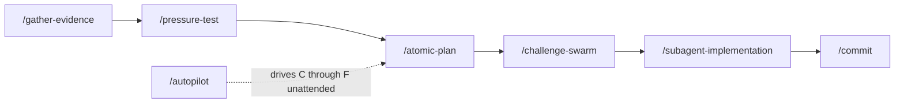
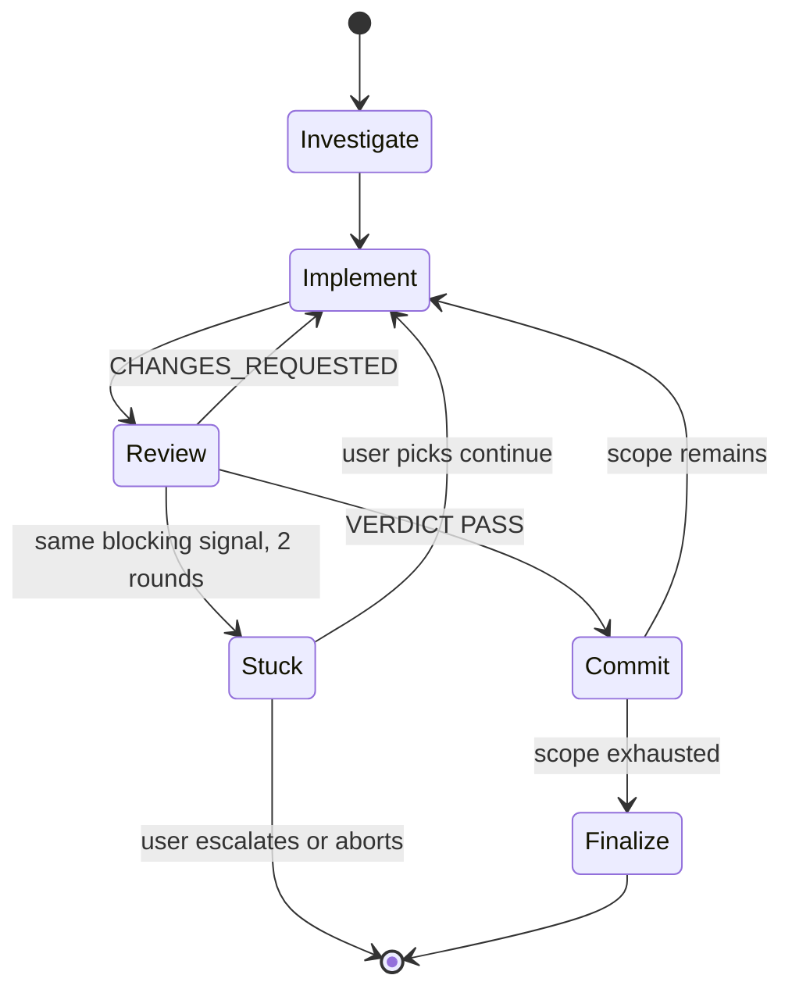
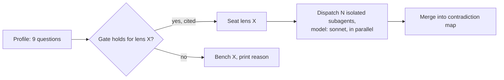

# workflow


## What it does


A long task run in one context degrades. The model accumulates its own reasoning, stops seeing earlier choices as choices, and reviews its own work against the rationalizations that produced it.

This domain is the lifecycle a change moves through and the machinery that keeps that from happening: each step runs in a fresh context, and a gate sits between them. Orchestrator commands never write code themselves. Each dispatches fresh-context subagents, parses their verdicts, and commits between rounds. No Go package implements any of it; the whole domain is prompt artifacts under [`context/commands/`](../../context/commands), [`context/agents/`](../../context/agents), [`context/skills/`](../../context/skills), and [`context/_partials/`](../../context/_partials).


## How it works


Every arrow crosses a context boundary, which is what makes the gate between two steps worth anything.



Which verb to reach for:

| Situation | Verb |
|---|---|
| A factual hunch the design would rest on | `/gather-evidence` |
| A decision you want challenged in dialogue | `/pressure-test` |
| Non-trivial work with no contract yet | `/atomic-plan` |
| A written design, spec, plan, or non-software proposal you want attacked from many angles at once | `/challenge-swarm` |
| An approved spec to build | `/subagent-implementation` |
| Known cause, one obvious fix, any file count | `/quick-fix` |
| Unknown cause: CI is red, or a bug reproduces | `/subagent-diagnose ci` / `/subagent-diagnose bug` |
| A branch you want reviewed once, no loop | `/review-branch` |
| Nothing to shipped, unattended | `/autopilot` |
| Ship it | `/commit [push \| pr \| merge \| squash \| squash merge]` |
| Lost | `/atomic-help` |

### The loop

The same engine drives `/subagent-implementation`, `/quick-fix`, `/subagent-diagnose`, and `/autopilot`. It cannot spin quietly: a blocking signal that survives two rounds routes to a human rather than to another iteration.



**The orchestrator never implements.** It writes the scratchpad bundle, updates state, commits per `PASS`, and runs final verification. Implementer and reviewer are always separate agents in separate fresh contexts, never combined.

**Nothing the reviewer finds is dropped silently.** Non-blocking 🟡 risk, 🔵 nit, and ❓ question findings are harvested into `FOLLOWUPS.md` even on a `PASS`, and every entry gets an explicit disposition at finalize: `fix-now`, `defer`, `issue`, or `drop`. `/autopilot` is the exception, and inverts it: every finding is fixed in-iteration, so its `FOLLOWUPS.md` ends empty.

### Caps and stop conditions

| Orchestrator | Cap | Early stop |
|---|---|---|
| `/subagent-implementation` | none | Same blocking signal across 2 consecutive `CHANGES_REQUESTED` rounds surfaces `/pressure-test` and `atomic-strategist` and waits for the user |
| `/quick-fix` | 3 iterations, then ask | Escape hatch on approach fork, fuzzy criteria, an unforeseen contract choice, a shifted root cause, or implementer `BLOCKED` / `NEEDS_CONTEXT` |
| `/subagent-diagnose` | `min(memory override, 5)` iterations | 3 consecutive iterations producing the same normalized top-level error |
| `/atomic-plan` spec loop | 5 iterations | none |
| `/autopilot` | Inherits the loop's 6 | Stuck auto-dispatches `atomic-strategist` instead of asking, because the strategist never writes |

**`/quick-fix` routes out on uncertainty, never on file count.** An unknown root cause goes to `/subagent-diagnose`; multiple viable approaches, fuzzy success criteria, or an architectural or contract choice goes to `/atomic-plan`; implementer `BLOCKED` or `NEEDS_CONTEXT` fires the hatch unconditionally. The surgical-versus-feature agent choice inside the loop is cohesion fit, not a scope cap.

### `/challenge-swarm`: profile before seating a lens

`/challenge-swarm` no longer picks from a fixed 7-lens checklist. It answers nine profile questions about the artifact (who can reach it, whose data flows through it, what does being wrong cost, is money moving, is a claim made from data), then seats 3 to 6 lenses from a roughly 30-lens catalog spanning six categories (engineering, data/ML, business, finance, communication/market, operations/delivery). Each seated lens carries a one-line citation to the design section or source path where its stake lives; a lens that fits the artifact's genre but fails its gate is benched with a printed line rather than silently dropped.



The workspace for the run is a scratchpad bundle at `$(atomic scratchpad new <slug> --purpose review)` — the same bundle a plan or implementation phase already opened for that slug, extended rather than duplicated. On the closing menu's `done` option the bundle is not deleted; it stays until reaped by `/git-cleanup` or archived explicitly.

### Finalize and ship

Finalize order is fixed, and each step depends on the one before it:

```
atomic-verify → FOLLOWUPS triage → implementation log → /documentation → atomic-auditor → signals refresh → report to user
```

Docs are written before the signals refresh so a new page exists when the scan runs. `doc-impact` runs before `signals-gate` inside `/commit` for the same reason. The scratchpad bundle is not deleted at this step — `/subagent-implementation`, `/subagent-diagnose`, and `/autopilot` all leave it in place; it is retired later, out of band, by `/git-cleanup` or an explicit `atomic scratchpad archive <slug>`. `/quick-fix` is the exception: its own finalize step 3 deletes `$SCRATCH` on the success path, once every `FOLLOWUPS.md` entry has a disposition. It still retains the bundle on the escape hatch and the iteration-cap stop, since both hand the run back to a human or to `/subagent-implementation` with context intact.


## Where it lives


### Commands

| Path | Role |
|---|---|
| [`context/commands/gather-evidence.md`](../../context/commands/gather-evidence.md) | Chases a hypothesis through primary sources; returns `SUPPORTED` / `UNSUPPORTED` / `MIXED` / `INCONCLUSIVE` with a cited trail. Tier rule: community-level-only evidence caps the verdict at `MIXED`. |
| [`context/commands/pressure-test.md`](../../context/commands/pressure-test.md) | Socratic challenger session. Questions only, no code, no agents, no artifacts. |
| [`context/commands/atomic-plan.md`](../../context/commands/atomic-plan.md) | Triviality gate (trivial / borderline / non-trivial), then design doc plus spec. Non-trivial runs a spec-authoring subagent loop capped at 5 iterations. Its scratchpad bundle is opened via `atomic scratchpad new <topic> --purpose plan`. |
| [`context/commands/challenge-swarm.md`](../../context/commands/challenge-swarm.md) | Profiles the target artifact against nine stake questions, seats 3-6 cited lenses from a ~30-lens catalog, dispatches them in isolation, merges findings into a contradiction map. Report-only, never edits the target. |
| [`context/commands/subagent-implementation.md`](../../context/commands/subagent-implementation.md) | The full loop: investigator, spec gate, worktree gate, implement to review to commit, then the finalize ceremony. |
| [`context/commands/quick-fix.md`](../../context/commands/quick-fix.md) | The same loop minus the spec gate, worktree gate, and finalize ceremony. Fit gate at entry, escape hatch mid-loop. |
| [`context/commands/subagent-diagnose.md`](../../context/commands/subagent-diagnose.md) | Failure-driven loop. `ci` mode seeds from a failed GitHub Actions run, `bug` mode from a freeform symptom. Topic slugs no longer carry a date prefix (`diagnose-ci-<run-id>`, `diagnose-bug-<slug>`) since `atomic scratchpad` owns bundle identity. |
| [`context/commands/autopilot.md`](../../context/commands/autopilot.md) | Runs plan to loop to ship unattended. The merge method is the only human decision. Phase 6 deletes `tmp/trash/` only; the task's scratchpad bundle is left for later retirement. |
| [`context/commands/review-branch.md`](../../context/commands/review-branch.md) | One `atomic-reviewer` pass over `<base>..HEAD`. Pre-flight before `/commit pr` or `/commit merge`. |
| [`context/commands/commit.md`](../../context/commands/commit.md) | The single ship verb. Escalation tokens `push`, `pr`, `merge`, `squash`, `squash merge`; no token commits then prompts. |
| [`context/commands/undo-commit.md`](../../context/commands/undo-commit.md) | Soft-resets the last commit. Refuses on merge commits, the initial commit, and an already-pushed HEAD. |
| [`context/commands/session-report.md`](../../context/commands/session-report.md) | Writes branch-scoped why-context to the `reports` path `atomic where --json` reports (`~/.atomic/<project-key>/reports/<branch>/`, outside the repository). Read by `/commit`, deleted after a successful commit. |
| [`context/commands/setup-wiki.md`](../../context/commands/setup-wiki.md) | Repo bootstrap. Audits [`.gitignore`](../../.gitignore), [`docs/`](..) layout, and [`CLAUDE.md`](../../CLAUDE.md) presence; proposes only what is absent. |
| [`context/commands/retrospective-learning.md`](../../context/commands/retrospective-learning.md) | Mines session history for friction and corrections, walks findings one at a time. Its working dir is `tmp/<date>-retro/`, not a scratchpad bundle. |
| [`context/commands/follow-up.md`](../../context/commands/follow-up.md), [`context/commands/remind-me.md`](../../context/commands/remind-me.md) | Reminder lifecycle. Reads/writes the `reminders` path `atomic where --json` reports when the binary is present; falls back to `.claude/.scratchpad/reminders/` when it is absent. |
| [`context/commands/report-issue.md`](../../context/commands/report-issue.md) | Opens a GitHub issue against the current repo via `gh`. |
| [`context/commands/report-issue-with-atomic.md`](../../context/commands/report-issue-with-atomic.md) | Same flow, target hardcoded to `damusix/atomic-claude`, never inferred from `gh repo view` or cwd. |
| [`context/commands/atomic-help.md`](../../context/commands/atomic-help.md) | Routes a lost user to one next action. Bare, topic keyword, freeform intent, or `tour`. |
| [`context/commands/git-cleanup.md`](../../context/commands/git-cleanup.md) | Scans and cleans stale worktrees, branches, and registrations. Now also archives a departing worktree's scratchpad bundle(s) before `git worktree remove`, and reaps session-report directories for branches already gone from `git branch -a`, with no grace window. |

### Agents

| Path | Role |
|---|---|
| [`context/agents/atomic-implementer.md`](../../context/agents/atomic-implementer.md) | Writes the code. `mode: feature` is cohesion-bounded, any file count; `mode: surgical` hard-caps at 2 non-test files and bounces anything larger. Both write TDD and report `## Did` / `## Tests` / `## Signals` / `## Failed`. |
| [`context/agents/atomic-reviewer.md`](../../context/agents/atomic-reviewer.md) | Gates each iteration. Code-mode diffs against the spec and verifies TDD signals actually ran; spec-mode reviews a draft spec against its design. Ends with `VERDICT: PASS` or `VERDICT: CHANGES_REQUESTED`, no third option. |
| [`context/agents/atomic-auditor.md`](../../context/agents/atomic-auditor.md) | Gates the whole task once, after the loop goes green. Four passes: cumulative spec compliance, cross-iteration coherence, commit soundness, documentation adherence. Read-only, fresh context. |
| [`context/agents/atomic-investigator.md`](../../context/agents/atomic-investigator.md) | Read-only locator. Returns a `file:line — what` table, no prose. Haiku-backed at `effort: low`, so it is cheap enough to dispatch by default. |
| [`context/agents/atomic-strategist.md`](../../context/agents/atomic-strategist.md) | Read-only "is this the right approach?" reasoning at `effort: xhigh`. Dispatched only when the loop is stuck. |

### Skills

| Path | Role |
|---|---|
| [`context/skills/atomic-tdd/`](../../context/skills/atomic-tdd) | Failing test before production code. Owns writing or changing code once the cause is known. |
| [`context/skills/atomic-verify/`](../../context/skills/atomic-verify) | No completion claim without a verification command run in this turn. Invoked explicitly at every finalize. |
| [`context/skills/atomic-git-discipline/`](../../context/skills/atomic-git-discipline) | Conventional Commits messages and PR bodies. Every ship path delegates message format here; session-report content passed in as why-context is resolved by the invoking ship verb via `atomic where --json`, not by this skill. |
| [`context/skills/atomic-review/`](../../context/skills/atomic-review) | One-line-per-finding review comments. Supplies PR title and body tone on the `/commit pr` path. |
| [`context/skills/atomic-debug/`](../../context/skills/atomic-debug) | Hypothesis-driven diagnosis of an unknown root cause. Complements `/subagent-diagnose`. |
| [`context/skills/atomic-visual-options/`](../../context/skills/atomic-visual-options) | Renders 2 to 4 variants per decision dimension as a throwaway HTML file at `$(atomic scratchpad path <topic>)/options.html`; the user picks by typing codes. Invoked by `/atomic-plan` when a design question is genuinely visual. |

### Shared partials

Expanded directly into the embedded bundle by `make bundle` (see Coupling below). The full pool and its inventory live in [`docs/wiki/bundle.md`](bundle.md); these are the ones that carry workflow behavior.

| Path | Role |
|---|---|
| [`context/_partials/worktree-setup.md`](../../context/_partials/worktree-setup.md) | The whole worktree gate: isolation detection, branch resolution, spec carry-forward, `git worktree add`, `EnterWorktree`, setup and baseline test detection. Composed into `subagent-implementation` and `autopilot`. |
| [`context/_partials/agent-where.md`](../../context/_partials/agent-where.md) | The `atomic where --json` orientation call: repo-scope wiki, realm position, code-index scope, plus the project-keyed `reports`, `reports_root`, `reminders`, and `archive` paths every workflow artifact resolves from rather than hand-building. |
| [`context/_partials/commit-flow.md`](../../context/_partials/commit-flow.md) | Stage, doc-impact, signals-gate, commit, session-report cleanup — the report dir is resolved via `agent-where`'s `reports` field, never constructed. |
| [`context/_partials/push-flow.md`](../../context/_partials/push-flow.md), `pr-flow.md`, `merge-flow.md`, `squash-flow.md` | The four escalation paths `/commit` routes into. |
| [`context/_partials/doc-impact.md`](../../context/_partials/doc-impact.md) | Matches the staged diff against the `## Documentation surfaces` table, walks each match with Yes / Later / Remind / Skip. |
| [`context/_partials/signals-gate.md`](../../context/_partials/signals-gate.md) | Docs-only guard, `atomic signals stale`, silent `atomic-wiki-inferrer` dispatch, `atomic wiki mark-dirty`. |
| [`context/_partials/worktree-cleanup-prompt.md`](../../context/_partials/worktree-cleanup-prompt.md) | Offers to remove a linked worktree after a merge. Archives the worktree's scratchpad bundle(s) via `atomic scratchpad list`/`archive` before `git worktree remove`, so a bundle isn't destroyed unarchived; falls back to removal without archiving, with a printed notice, when [`atomic`](../../atomic) is absent. Composed into `merge-flow` only. |
| [`context/_partials/git-safety.md`](../../context/_partials/git-safety.md) | Explicit staging, one git command per Bash call, never `--amend` after a hook failure, no force-push on base. |
| [`context/_partials/report-issue-privacy.md`](../../context/_partials/report-issue-privacy.md) | PII and secret redaction plus a preview-and-confirm gate, composed into both issue commands. |
| [`context/_partials/agent-yagni.md`](../../context/_partials/agent-yagni.md) | The 7-rung simplicity ladder, composed into `atomic-implementer`, `atomic-reviewer`, and `atomic-strategist`. |
| [`context/_partials/agent-implementer-workflow.md`](../../context/_partials/agent-implementer-workflow.md) | The entire `<workflow>` block for `atomic-implementer`; itself composes `agent-search-tooling`, `agent-tdd-signals`, `agent-code-intel`, `agent-where`. |

### Docs

| Path | Role |
|---|---|
| [`docs/reference/workflow.md`](../reference/workflow.md) | Human-facing lifecycle reference. |
| [`docs/reference/commands.md`](../reference/commands.md), `agents.md`, `skills.md` | Roster tables. |
| [`docs/spec/atomic-plan.md`](../spec/atomic-plan.md) | Contract for the triviality gate, design and spec split, and the spec-authoring loop. |
| [`docs/spec/spec-change-tree-flows.md`](../spec/spec-change-tree-flows.md) | Why every spec body carries `## Change tree`, `## Outline`, and `## Flows`. |
| [`docs/spec/subagent-diagnose.md`](../spec/subagent-diagnose.md), [`docs/design/diagnose-orchestrators.md`](../design/diagnose-orchestrators.md) | Contract and rationale for the two diagnose modes. |
| [`docs/spec/quick-fix.md`](../spec/quick-fix.md) | Fit-gate and escape-hatch signals, the no-file-threshold constraint, prompt-reuse contract, 3-iteration cap. |
| [`docs/spec/autopilot.md`](../spec/autopilot.md) | The five autonomous overrides. |
| [`docs/spec/atomic-auditor.md`](../spec/atomic-auditor.md) | The four audit passes and the once-per-task dispatch rule. |
| [`docs/spec/stuck-fix-escalation.md`](../spec/stuck-fix-escalation.md), [`docs/design/stuck-fix-escalation.md`](../design/stuck-fix-escalation.md) | Stuck-fix escalation and reviewer suppression-pattern awareness. |
| [`docs/spec/signals-refresh-timing.md`](../spec/signals-refresh-timing.md), [`docs/design/signals-refresh-timing.md`](../design/signals-refresh-timing.md) | When signals refresh fires in the loop, in autopilot, and in the ship verbs. |
| [`docs/spec/challenge-swarm.md`](../spec/challenge-swarm.md) | Lens roster, workspace layout, isolated dispatch, contradiction-map aggregation. |
| [`docs/spec/document-templates.md`](../spec/document-templates.md), [`docs/design/document-templates.md`](../design/document-templates.md) | The `atomic template <name>` verb these commands seed from. |
| [`docs/spec/session-report.md`](../spec/session-report.md), [`docs/spec/setup-wiki.md`](../spec/setup-wiki.md) | Contracts for those two commands. |
| [`docs/spec/comment-discipline.md`](../spec/comment-discipline.md) | Comment rules the implementer and reviewer both enforce. |
| [`docs/spec/visual-options.md`](../spec/visual-options.md), [`docs/design/visual-options.md`](../design/visual-options.md) | Contract and rationale for the visual-options skill. |


## Constraints


**The spec body is read verbatim by subagents.** `/subagent-implementation`'s currency gate exists because the `BRIEF.md` points fresh agents straight at `docs/spec/<topic>.md`. If a decision in the conversation superseded any part of that body, rewrite the body before dispatching. The test: could a fresh subagent reading only the spec body build something a later decision already cut? Papering over it in the brief does not work.

**Every spec body carries `## Change tree`, `## Outline`, and `## Flows`.** The change tree marks files `A` / `M` / `D`; the outline names the pieces per file as `name — responsibility`, one level of nesting, no signatures; flows are numbered actor-to-step sequences. `## Outline` is what `atomic-reviewer` walks the delivered diff against in its outline pass. An empty section is written `None — <reason>`, never omitted.

**The auditor is dispatched exactly once per task.** A `CHANGES_REQUESTED` verdict earns one more implementer and reviewer iteration, then the run continues regardless of what a second audit would say. Re-auditing turns finalize into an unbounded loop, which never terminates under `/autopilot`.

**Worktree cleanup fires on `merge` and `squash merge`, not on plain `squash`.** `worktree-cleanup-prompt` is composed into `merge-flow` only, so a branch squashed without merging leaves its worktree in place, and its scratchpad bundle un-archived.

**Scratchpad bundles are never deleted by the loop that created them.** `/subagent-implementation`, `/quick-fix`, `/subagent-diagnose`, `/autopilot`, and `/challenge-swarm` all leave `$SCRATCH` in place at close-out, whether the run succeeded or was bailed. A bundle is retired only by `atomic scratchpad archive <slug>` — driven by `/git-cleanup` when it reaps the bundle's worktree or branch, or by the `merge`/`squash merge` worktree-cleanup prompt, or by the user invoking the archive verb directly. This is a reversal from the prior behavior of deleting `$SCRATCH` on success: the worktree, not the scratchpad, is now the only thing that attributes an uncommitted bundle to its branch (`meta.toml` carries no branch field), so archiving has to happen before `git worktree remove`, never after.

**Session reports live outside the repository.** `/session-report` writes to `~/.atomic/<project-key>/reports/<branch>/`, resolved via `atomic where --json`'s `reports` field — never `.claude/.scratchpad/session-reports/<branch>/`, and there is nothing to stage or gitignore for it. `/git-cleanup` reaps a branch's reports as soon as that branch is gone from `git branch -a`, with no grace window, since a gone branch has no future commit left to consume them.

**The signals docs-only guard treats artifact markdown as source.** A commit touching only [`docs/`](..) or a top-level `README*` / `CHANGELOG*` / `CONTRIBUTING*` / `CODE_OF_CONDUCT*` / `SECURITY*` / `LICENSE*` skips the refresh. Anything under [`context/agents/`](../../context/agents), [`context/commands/`](../../context/commands), [`context/skills/`](../../context/skills), [`context/rules/`](../../context/rules), or [`context/output-styles/`](../../context/output-styles), plus [`context/CLAUDE.md`](../../context/CLAUDE.md) and the root [`CLAUDE.md`](../../CLAUDE.md), counts as source, because in a config repo those files are the product.

**Commands hard-stop rather than improvise a document skeleton.** When `atomic template <name>` is unavailable or errors, the command prints `document template unavailable (atomic template <name> failed) — install/update the atomic binary. cannot proceed.` and stops.

**Refusals to expect, quoted exactly:**

- No spec for non-trivial work: `Run /atomic-plan first. I need an approved spec at docs/spec/<topic>.md before launching the implementation loop.`
- Worktree branch collision: `branch <name> already exists. pick a different name or checkout existing.`
- Concurrent diagnose run: `scratchpad already exists for <topic>; atomic scratchpad archive it or pick a different topic suffix.`
- Sandbox blocks worktree creation: `sandbox blocked worktree creation. working in place.` The run then continues in place rather than failing.

**`/autopilot` avoids `rm` and shell chaining mid-run.** Both trigger permission prompts that stall an unattended session. Scratch experiments (not the task's scratchpad bundle) are quarantined into `tmp/trash/` and deleted once, at Phase 6.

**`/challenge-swarm` seats a minimum of 3 lenses and requires a citation per seat.** A lens without a one-line pointer to the design section or source path where its stake lives is benched, printed as `<lens>: benched — <reason>`, not silently dropped.


## Coupling


**bundle** owns the pipeline that turns [`context/`](../../context) into the installed artifact set: [`context/commands/`](../../context/commands), [`context/agents/`](../../context/agents), [`context/skills/`](../../context/skills), [`context/output-styles/`](../../context/output-styles), [`context/rules/`](../../context/rules), and [`context/CLAUDE.md`](../../context/CLAUDE.md) are the sources; a source may compose a `{{ template "<name>" . }}` directive resolved against [`context/_partials/`](../../context/_partials); `make bundle` expands everything directly into [`atomic/internal/embedded/`](../../atomic/internal/embedded) in one step. There is no separate render phase and no rendered `commands/`/`agents/` directory ever committed — editing this domain's prompt artifacts means editing the [`context/`](../../context) file directly, then running `make -C atomic bundle` before the change is visible to the embedded binary. Full inventory and per-artifact composition tables: [`docs/wiki/bundle.md`](bundle.md).

**config** owns state-path resolution and the verbs this domain calls to reach it, never constructing a path by hand:

| Verb | Called by | On failure |
|---|---|---|
| `atomic template <name>` | `/atomic-plan`, `/subagent-implementation`, `/subagent-diagnose`, `/quick-fix`, `/session-report` | Hard stop. Never improvise the skeleton from memory. |
| `atomic repo init` | Every command that creates a scratchpad bundle or worktree | Best-effort, silent skip. |
| `atomic scratchpad new \| path \| list \| archive` | Every orchestrator that opens or extends a bundle, `/git-cleanup`, `atomic-visual-options` | No fallback for `new`/`path`; the command cannot proceed without a resolved path. |
| `atomic where --json` | `agent-where` partial, session-report and reminder path resolution, `/git-cleanup`'s report-reaping step | Falls back to legacy heuristics (repo-scope walk, `.claude/.scratchpad/reminders/`) when the binary is absent. |
| `atomic followups add` | Finalize, on a `defer` disposition | Surface the error, retry once, then ask the user to run it manually. |
| `atomic code index` / `sync` | Orchestrators only, at task start and after each green commit | Silent skip; subagents fall back to `sg` and `grep`. |

Config also owns the paths this domain writes to: `.claude/.scratchpad/<slug>/` (repo-local, worktree-local bundle; retained, not deleted, until archived), `~/.atomic/<project-key>/reports/<branch>/` and `~/.atomic/<project-key>/reminders/` (project-keyed, outside the repository), `.claude/project/followups/<id>.md`, and `.claude/worktrees/<branch>/`. When a bundle's on-disk shape doesn't match what an artifact expects, `atomic migrate --show-log` is the change history to check, per the note repeated across `/atomic-plan`, `/quick-fix`, `/subagent-diagnose`, `/subagent-implementation`, `/autopilot`, `/follow-up`, `/remind-me`, `/session-report`, and `atomic-visual-options`.

**signals** owns refresh timing. The short version for a session working here: the implementation phase refreshes once at finalize over `<loop-base>..HEAD`, and the ship verbs are the ad-hoc fallback that skips when the loop already refreshed. Full contract in [`docs/spec/signals-refresh-timing.md`](../spec/signals-refresh-timing.md).

**docs-meta** owns `/documentation` and the `atomic-documentation` skill, which finalize invokes and which `doc-impact` calls per matched surface. Design docs and specs are written in the `atomic-writing` voice.

**doctor** owns `atomic validate spec` and `atomic validate config`, which finalize runs when the change touched `docs/spec/**`, `docs/design/**`, or a bundled artifact. It also owns `cliusage.go`, the source of truth for the [`atomic`](../../atomic) command surface, which is the reverse dependency worth knowing: every `atomic template <name>` variant a command cites must have a matching `cliusage.go` entry or `atomic validate artifacts` flags the citation as an unknown verb.

**code-intel** is queried, never driven, from inside the loop. The orchestrator owns index freshness; subagents never trigger indexing.

Contracts that change in lockstep:

- The YAGNI ladder in [`context/_partials/agent-yagni.md`](../../context/_partials/agent-yagni.md) is kept verbatim identical to the ladder in [`context/CLAUDE.md`](../../context/CLAUDE.md)'s Principles block. [`context/CLAUDE.md`](../../context/CLAUDE.md) is copied byte-for-byte (not expanded) into the bundle, so that duplication is manual.
- The ship verbs must agree on message format, worktree detection, and the signals gate. Changing one path's behavior on a shared concern means changing all of them.
- A new command, agent, or skill needs a row in the `/atomic-help` topic table before it is done.
- Every artifact citing a hand-built scratchpad, report, reminder, or archive path instead of resolving it through `atomic scratchpad` or `atomic where --json` is a regression against the same fix applied across eleven commands and two skills in this range.
